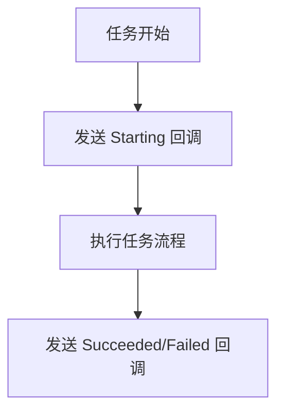
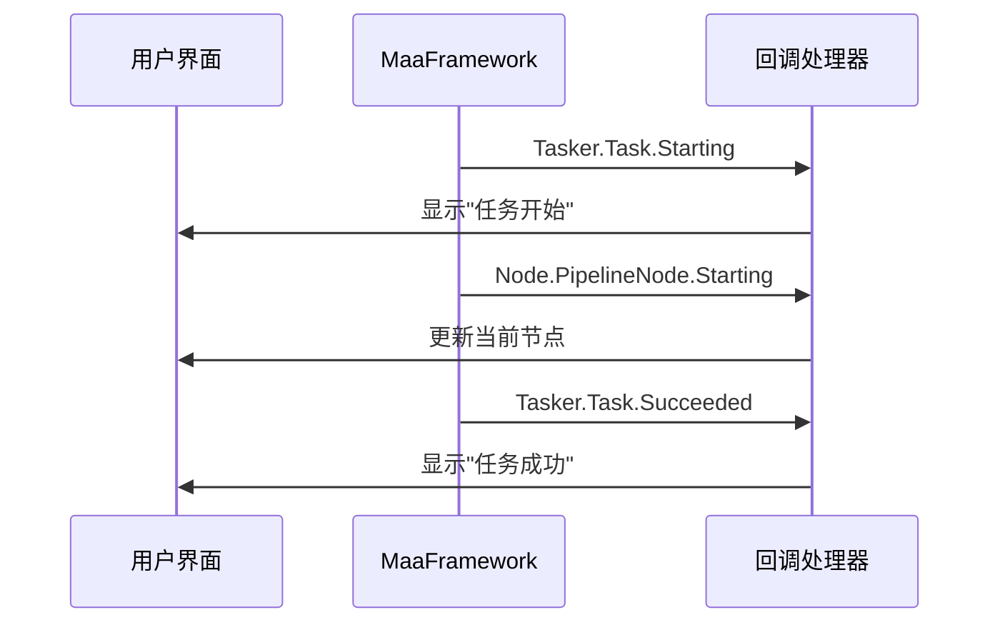
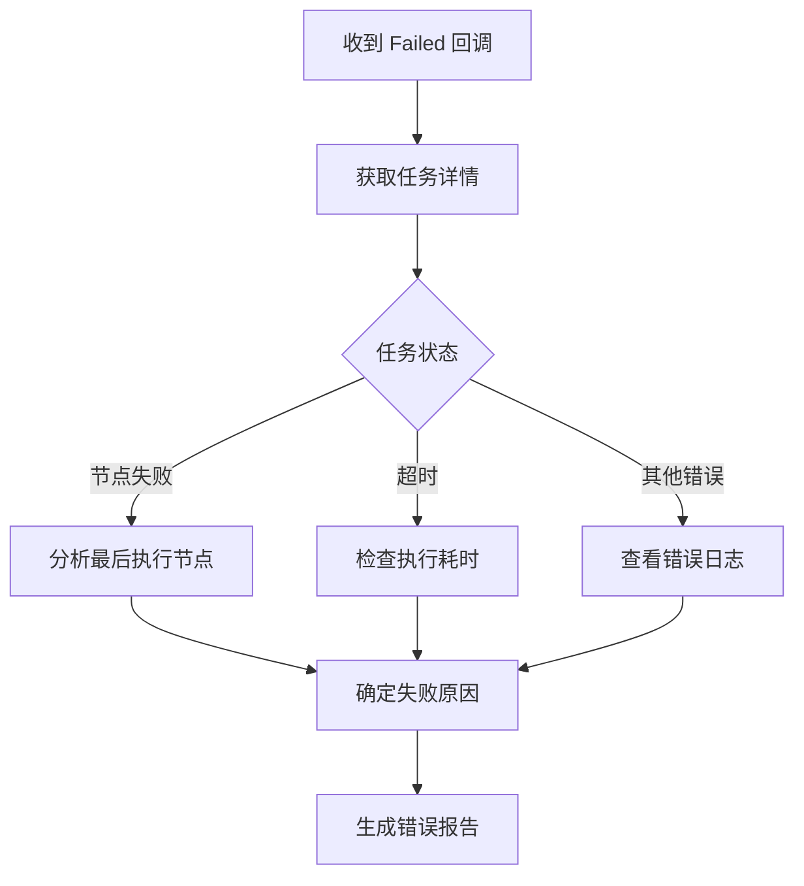
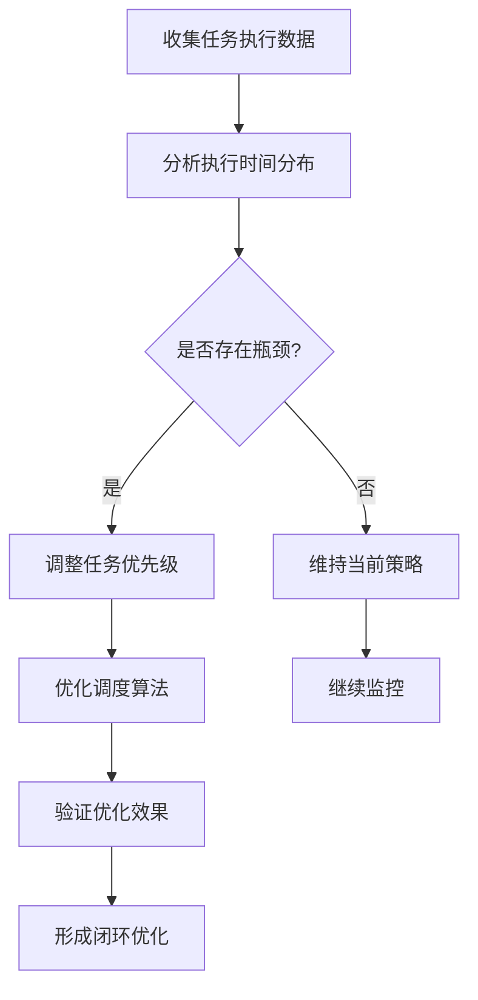

# 任务执行回调

<cite>
**本文档引用文件**  
- [tasker.py](file://agent/customs/maahelper/tasker.py)
- [2.3-回调协议.md](file://instructions/maafw-guide/2.3-回调协议.md)
- [process_guard.py](file://agent/customs/global_func/process_guard.py)
- [hooks.json](file://assets/resource/base/pipeline/其他/hooks.json)
- [领取奖励.json](file://assets/resource/base/pipeline/日常任务/领取奖励.json)
- [每日采购.json](file://assets/resource/base/pipeline/日常任务/每日采购.json)
- [periodic_check.py](file://agent/customs/global_func/periodic_check.py)
</cite>

## 目录
1. [任务生命周期回调概述](#任务生命周期回调概述)
2. [回调消息类型详解](#回调消息类型详解)
3. [句柄与核心字段解析](#句柄与核心字段解析)
4. [实际应用案例](#实际应用案例)
5. [调试与监控技巧](#调试与监控技巧)
6. [任务执行流程监控机制](#任务执行流程监控机制)

## 任务生命周期回调概述

MaaFramework 通过 `MaaEventCallback` 回调函数机制，向高层应用实时推送任务执行过程中的各种状态变更和事件通知。所有回调消息均采用统一的格式：消息类型（message）+ 详细数据（details_json），为开发者提供了完整的任务执行生命周期监控能力。

该回调系统是实现自动化任务监控、状态同步和错误处理的核心机制。通过监听特定的回调消息，开发者可以精确掌握任务的启动、执行和终止状态，从而实现复杂的业务逻辑控制和用户界面更新。

**Section sources**
- [2.3-回调协议.md](file://instructions/maafw-guide/2.3-回调协议.md#L3-L19)

## 回调消息类型详解

### 任务开始回调 (Tasker.Task.Starting)

当任务开始执行时，框架会发送 `Tasker.Task.Starting` 消息。这是任务生命周期的起点，标志着任务已进入执行阶段。



**回调数据结构：**
```json
{
    "task_id": 12345,
    "entry": "MyTask",
    "uuid": "550e8400-e29b-41d4-a716-446655440000",
    "hash": "abc123def456"
}
```

**字段说明：**
- `task_id`: 任务的唯一数字标识符
- `entry`: 任务的入口节点名称
- `uuid`: 任务的全局唯一标识符
- `hash`: 任务配置的哈希值

**Diagram sources**
- [2.3-回调协议.md](file://instructions/maafw-guide/2.3-回调协议.md#L97-L116)

### 任务成功回调 (Tasker.Task.Succeeded)

当任务成功完成所有执行步骤后，框架会发送 `Tasker.Task.Succeeded` 消息。该消息的数据结构与 `Starting` 消息完全相同，用于通知任务已成功结束。

**Section sources**
- [2.3-回调协议.md](file://instructions/maafw-guide/2.3-回调协议.md#L117-L120)

### 任务失败回调 (Tasker.Task.Failed)

当任务执行过程中发生错误并终止时，框架会发送 `Tasker.Task.Failed` 消息。该消息的数据结构同样与 `Starting` 消息一致，用于通知任务执行失败。

**Section sources**
- [2.3-回调协议.md](file://instructions/maafw-guide/2.3-回调协议.md#L121-L124)

## 句柄与核心字段解析

### MaaTasker* 句柄含义

在回调函数中，`handle` 参数代表与事件相关的对象句柄。对于任务相关的回调（如 `Tasker.Task.*`），该句柄为 `MaaTasker*` 类型，指向任务执行器实例。

```cpp
typedef void(MAA_CALL* MaaEventCallback)(void* handle, const char* message, const char* details_json, void* trans_arg);
```

- **handle**: 相关对象的句柄
  - `MaaTasker*` 用于任务事件
  - `MaaResource*` 用于资源事件
  - `MaaController*` 用于控制器事件
  - `MaaContext*` 用于上下文事件

此句柄可用于关联特定的任务执行器实例，实现多实例的精确监控和管理。

**Section sources**
- [2.3-回调协议.md](file://instructions/maafw-guide/2.3-回调协议.md#L11-L15)

### 核心字段在任务追踪中的作用

#### task_id 字段

`task_id` 是任务的唯一数字标识符，在整个任务生命周期中保持不变。它主要用于：

- 任务状态查询：通过 `MaaTaskerGetTaskDetail` 接口获取任务详情
- 任务执行监控：跟踪特定任务的执行进度
- 多任务管理：区分并发执行的多个任务实例

#### entry 字段

`entry` 字段表示任务的入口节点名称，即任务流程的起始点。它的作用包括：

- 任务类型识别：根据入口名称判断任务的业务类型
- 流程控制：确定任务的执行路径和逻辑分支
- 日志记录：在日志中标识任务的起始点

#### uuid 字段

`uuid` 是任务的全局唯一标识符，确保每个任务实例都有唯一的身份标识。其主要用途：

- 实例区分：即使相同类型的任务，也能通过 UUID 区分不同实例
- 跨系统追踪：在分布式系统中作为任务的唯一追踪标识
- 数据关联：将任务执行数据与特定实例关联

#### hash 字段

`hash` 字段表示任务配置的哈希值，用于：

- 配置版本控制：检测任务配置是否发生变化
- 缓存管理：基于配置哈希值进行结果缓存
- 一致性校验：验证任务执行环境的一致性

**Section sources**
- [2.3-回调协议.md](file://instructions/maafw-guide/2.3-回调协议.md#L112-L115)

## 实际应用案例

### 通过回调更新UI状态

利用任务回调可以实时更新用户界面状态，提供良好的用户体验。



**Diagram sources**
- [2.3-回调协议.md](file://instructions/maafw-guide/2.3-回调协议.md#L245-L258)

### 统计任务执行时间

通过记录 `Starting` 和 `Succeeded/Failed` 回调的时间戳，可以精确统计任务执行时间。

```python
class TaskTimer:
    def __init__(self):
        self.start_times = {}
    
    def on_task_start(self, task_id, entry):
        self.start_times[task_id] = time.time()
    
    def on_task_end(self, task_id):
        if task_id in self.start_times:
            duration = time.time() - self.start_times[task_id]
            print(f"任务 {task_id} 执行耗时: {duration:.2f}秒")
            del self.start_times[task_id]
```

**Section sources**
- [2.3-回调协议.md](file://instructions/maafw-guide/2.3-回调协议.md#L97-L124)

### 分析失败原因

结合任务失败回调和节点执行信息，可以深入分析任务失败的根本原因。



**Diagram sources**
- [2.3-回调协议.md](file://instructions/maafw-guide/2.3-回调协议.md#L121-L124)

## 调试与监控技巧

### 结合日志系统实现全流程监控

通过将回调信息与日志系统集成，可以实现任务执行的全流程监控。

```python
import logging

class TaskMonitor:
    def __init__(self):
        self.logger = logging.getLogger('TaskMonitor')
    
    def callback_handler(self, handle, message, details_json, trans_arg):
        try:
            details = json.loads(details_json)
            task_id = details.get('task_id', 'unknown')
            
            if message == "Tasker.Task.Starting":
                self.logger.info(f"任务 {task_id} 开始: {details.get('entry')}")
            elif message == "Tasker.Task.Succeeded":
                self.logger.info(f"任务 {task_id} 成功完成")
            elif message == "Tasker.Task.Failed":
                self.logger.error(f"任务 {task_id} 执行失败")
                
        except Exception as e:
            self.logger.error(f"处理回调时出错: {e}")
```

**Section sources**
- [2.3-回调协议.md](file://instructions/maafw-guide/2.3-回调协议.md#L338-L350)

### 利用回调数据优化任务调度策略

通过分析回调数据，可以动态调整任务调度策略，提高执行效率。



**Diagram sources**
- [2.3-回调协议.md](file://instructions/maafw-guide/2.3-回调协议.md#L338-L350)

## 任务执行流程监控机制

### 自动注入的监控节点

系统在执行任务时会自动为所有节点注入 `_run_task_monitor_inject` 监控节点，确保任务执行过程可被监控。

```json
{
    "_run_task_monitor_inject": {
        "recognition": "Custom",
        "custom_recognition": "check_stopping",
        "pre_delay": 0,
        "post_delay": 0
    }
}
```

该监控节点通过 `check_stopping` 自定义识别器实时检测任务是否处于停止状态。

**Section sources**
- [hooks.json](file://assets/resource/base/pipeline/其他/hooks.json#L1-L8)
- [process_guard.py](file://agent/customs/global_func/process_guard.py#L72-L87)

### 任务停止检测机制

`CheckStopping` 类实现了任务停止状态的实时检测，用于流程控制和资源清理。

```python
@AgentServer.custom_recognition("check_stopping")
class CheckStopping(CustomRecognition):
    def analyze(self, context: Context, argv: CustomRecognition.AnalyzeArg) -> CustomRecognition.AnalyzeResult:
        # 检测任务是否正在停止
        if context.tasker.stopping:
            return CustomRecognition.AnalyzeResult(success=True)
        return CustomRecognition.AnalyzeResult(success=False)
```

此机制确保了任务可以在任何执行点响应停止指令，提高了系统的响应性和可控性。

**Section sources**
- [process_guard.py](file://agent/customs/global_func/process_guard.py#L72-L87)
- [tasker.py](file://agent/customs/maahelper/tasker.py#L43-L49)