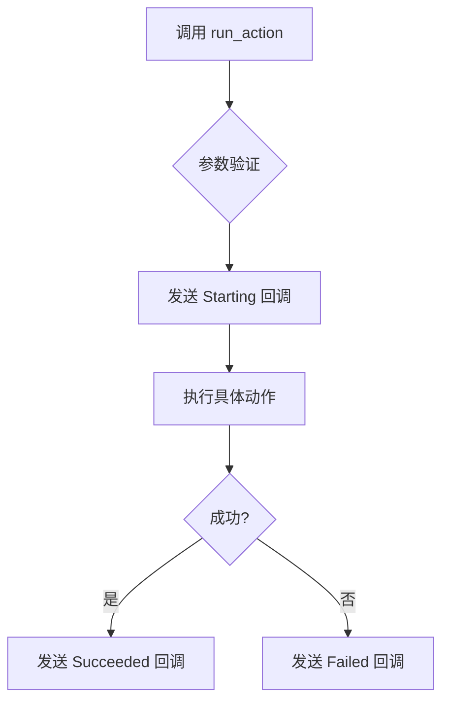

# 动作节点回调

<cite>
**本文档引用文件**  
- [2.3-回调协议.md](file://instructions/maafw-guide/2.3-回调协议.md)
- [tasker.py](file://agent/customs/maahelper/tasker.py)
- [pinch_face.py](file://agent/customs/global_func/pinch_face.py)
- [hooks.json](file://assets/resource/base/pipeline/其他/hooks.json)
</cite>

## 目录

1. [引言](#引言)
2. [动作节点回调概述](#动作节点回调概述)
3. [三种回调消息类型详解](#三种回调消息类型详解)
4. [回调字段语义解析](#回调字段语义解析)
5. [实际应用场景示例](#实际应用场景示例)
6. [最佳实践建议](#最佳实践建议)
7. [总结](#总结)

## 引言

在自动化任务执行框架中，精确的状态反馈机制是确保系统可靠性与可调试性的关键。`Node.ActionNode` 回调消息专用于通过 `run_action` 接口执行仅动作任务时的状态通知，为开发者提供了细粒度的执行过程监控能力。本文档将全面解析该回调机制的设计原理、语义定义及实际应用方法。

**Section sources**
- [2.3-回调协议.md](file://instructions/maafw-guide/2.3-回调协议.md)

## 动作节点回调概述

`Node.ActionNode` 回调消息系列专门用于通知仅动作任务的执行状态，其触发前提是使用 `MaaContextRunAction` 或等效接口（如 Python 中的 `context.run_action`）执行单一动作节点。与完整的流水线任务不同，此类调用不涉及识别流程，仅执行预定义的动作指令。

该回调机制的核心价值在于：
- 提供动作执行的精确生命周期追踪
- 支持性能基准测试与耗时分析
- 实现异常状态的及时捕获与恢复
- 保障动作序列的可验证性与可追溯性

回调消息通过统一的 `MaaEventCallback` 接口传递，遵循标准的消息格式规范，确保跨平台与语言的一致性处理。

**Section sources**
- [2.3-回调协议.md](file://instructions/maafw-guide/2.3-回调协议.md)
- [tasker.py](file://agent/customs/maahelper/tasker.py)

## 三种回调消息类型详解

### Starting（开始）

`Node.ActionNode.Starting` 消息在动作节点开始执行时立即发送，标志着动作执行流程的启动。

**触发时机：**
- 调用 `context.run_action(entry, ...)` 方法后
- 系统完成参数解析与前置检查
- 动作执行器即将向控制器发送指令前

此消息可用于：
- 记录动作执行的起始时间戳
- 更新用户界面状态为“执行中”
- 初始化性能监控计时器



**Diagram sources**
- [2.3-回调协议.md](file://instructions/maafw-guide/2.3-回调协议.md)

### Succeeded（成功）

`Node.ActionNode.Succeeded` 消息在动作节点成功完成时发送，表示该次动作已按预期执行完毕。

**触发条件：**
- 动作指令已成功发送至控制器
- 控制器确认动作执行完成（如点击、滑动等操作已落实）
- 无任何运行时异常发生

此消息可用于：
- 确认动作执行结果
- 触发后续业务逻辑
- 记录成功执行日志用于审计

### Failed（失败）

`Node.ActionNode.Failed` 消息在动作执行过程中发生错误时发送，用于通知调用方执行失败。

**常见失败场景：**
- 控制器连接异常或设备无响应
- 动作参数无效或超出合理范围
- 系统资源不足或线程阻塞
- 调用上下文已终止（如任务被主动停止）

此消息的及时处理对于构建健壮的自动化系统至关重要，可作为异常恢复机制的触发点。

**Section sources**
- [2.3-回调协议.md](file://instructions/maafw-guide/2.3-回调协议.md)

## 回调字段语义解析

在纯动作执行场景下，`details_json` 中的字段具有明确的语义：

### task_id（任务ID）

表示当前动作所属的任务上下文标识符。即使在单次动作调用中，系统也会为其分配一个临时任务ID，用于关联该动作的完整执行生命周期。

### node_id（节点ID）

动作节点的唯一内部标识符，由资源管理系统在加载流水线配置时生成。可用于精确追踪特定节点的执行情况。

### name（节点名称）

动作节点的逻辑名称，对应于流水线配置文件中的节点键名。此名称具有业务语义，便于开发者理解动作意图（如“捏脸_左捏”、“领取奖励”）。

### focus（焦点数据）

任意类型的附加数据字段，通常用于传递与当前执行上下文相关的元信息。在动作执行中，可能包含：
- 触发动作的识别结果（如目标坐标、置信度）
- 用户自定义的上下文标记
- 性能监控相关的元数据

这些字段共同构成了动作执行的完整上下文视图，为高级功能实现提供了数据基础。

**Section sources**
- [2.3-回调协议.md](file://instructions/maafw-guide/2.3-回调协议.md)

## 实际应用场景示例

### 动作序列验证

通过监听 `Starting` 和 `Succeeded/Failure` 回调，可构建动作执行验证器，确保关键动作按预期完成。

```python
class ActionValidator:
    def __init__(self):
        self.pending_actions = set()
    
    def on_callback(self, message, details):
        if message == "Node.ActionNode.Starting":
            self.pending_actions.add(details["name"])
        elif message in ["Node.ActionNode.Succeeded", "Node.ActionNode.Failed"]:
            self.pending_actions.discard(details["name"])
```

### 性能基准测试

利用回调时间差实现毫秒级动作性能测量：

```python
import time
action_timings = {}

def on_start(details):
    action_timings[details["name"]] = time.time()

def on_end(details):
    duration = time.time() - action_timings.pop(details["name"], 0)
    print(f"动作 {details['name']} 耗时: {duration:.3f}秒")
```

### 异常恢复机制

结合 `Failed` 回调实现自动重试逻辑：

```python
def on_action_failed(details):
    if details["name"] in CRITICAL_ACTIONS:
        retry_action(details["name"], max_retries=3)
```

**Section sources**
- [pinch_face.py](file://agent/customs/global_func/pinch_face.py)
- [tasker.py](file://agent/customs/maahelper/tasker.py)

## 最佳实践建议

### 设计轻量级回调逻辑

为避免阻塞主执行流程，回调处理应遵循以下原则：
- **快速返回**：避免在回调中执行耗时计算或I/O操作
- **异步处理**：将复杂逻辑放入消息队列或工作线程
- **异常防护**：使用try-catch包裹回调代码，防止崩溃影响主流程

### 确保执行流畅性

- **最小化依赖**：回调逻辑不应依赖外部不稳定服务
- **资源复用**：缓存常用对象，避免频繁创建销毁
- **状态隔离**：保持回调处理的幂等性与无状态性

### 提升可靠性

- **完整性校验**：验证回调数据的完整性与合理性
- **超时监控**：对长时间未完成的动作设置超时机制
- **日志记录**：关键回调应记录详细日志用于事后分析

通过遵循上述实践，可确保动作执行系统在高并发、复杂环境下依然保持稳定可靠。

**Section sources**
- [hooks.json](file://assets/resource/base/pipeline/其他/hooks.json)
- [tasker.py](file://agent/customs/maahelper/tasker.py)

## 总结

`Node.ActionNode` 回调机制为仅动作任务提供了精确的状态反馈能力，是构建可靠自动化系统的重要基石。通过深入理解 `Starting`、`Succeeded` 和 `Failed` 三种消息类型的语义与触发时机，并合理利用 `task_id`、`node_id`、`name` 和 `focus` 等字段信息，开发者能够实现动作序列验证、性能监控与异常恢复等高级功能。结合轻量级、非阻塞的回调设计最佳实践，可确保动作执行的流畅性与系统整体的稳定性。