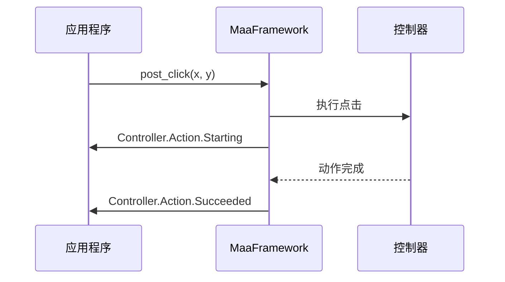
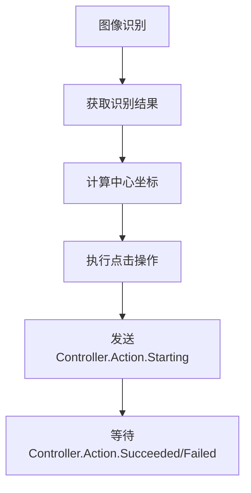

# 控制器动作回调

<cite>
**本文档引用的文件**  
- [main.py](file://agent/main.py)
- [tasker.py](file://agent/customs/maahelper/tasker.py)
- [reco_helper.py](file://agent/customs/maahelper/reco_helper.py)
- [2.3-回调协议.md](file://instructions/maafw-guide/2.3-回调协议.md)
- [2.2-集成接口一览.md](file://instructions/maafw-guide/2.2-集成接口一览.md)
- [2.4-控制方式说明.md](file://instructions/maafw-guide/2.4-控制方式说明.md)
- [hooks.json](file://assets/resource/base/pipeline/其他/hooks.json)
- [setup.py](file://agent/preprocess/setup.py)
</cite>

## 目录
1. [引言](#引言)
2. [控制器动作回调机制](#控制器动作回调机制)
3. [回调消息结构解析](#回调消息结构解析)
4. [控制器句柄技术背景](#控制器句柄技术背景)
5. [动作参数与坐标数据格式](#动作参数与坐标数据格式)
6. [设备控制流程监听与日志记录](#设备控制流程监听与日志记录)
7. [动作失败处理与重试机制](#动作失败处理与重试机制)
8. [线程安全与性能优化](#线程安全与性能优化)
9. [结论](#结论)

## 引言

控制器动作回调是MaaFramework自动化框架中的核心机制之一，用于实时监控和响应设备控制操作的执行状态。通过`Controller.Action.Starting`、`Controller.Action.Succeeded`和`Controller.Action.Failed`等消息类型，开发者可以精确掌握每个控制动作的生命周期，从开始执行到成功完成或失败的全过程。这些回调不仅为操作日志记录提供了基础，也为异常处理和流程控制提供了关键信息。本文档将深入解析这一机制的技术细节，包括消息结构、句柄机制、参数格式以及最佳实践。

**Section sources**
- [2.3-回调协议.md](file://instructions/maafw-guide/2.3-回调协议.md)

## 控制器动作回调机制

控制器动作回调机制是MaaFramework事件通知系统的重要组成部分。当控制器执行任何动作（如点击、滑动、输入文本等）时，框架会通过预注册的回调函数发送状态通知。这一机制基于`MaaEventCallback`接口实现，其核心是异步事件驱动模型。

回调的触发遵循严格的生命周期：当一个动作被提交（例如调用`post_click`）后，框架会立即发送`Controller.Action.Starting`消息，表示动作已进入执行队列。随后，根据动作的执行结果，框架会发送`Controller.Action.Succeeded`（成功）或`Controller.Action.Failed`（失败）消息。这种三段式状态通知（开始-结果）为上层应用提供了完整的动作执行视图。

在MaaDuDuL项目中，这一机制被用于构建健壮的自动化流程。例如，在`agent/main.py`中，通过`AgentServer`启动服务，该服务底层依赖于MaaFramework的回调系统来监控所有设备交互。当自动化脚本执行点击操作时，开发者可以通过监听这些回调来实时更新UI状态或记录操作日志。

**Diagram sources**
- [main.py](file://agent/main.py#L1-L48)
- [2.3-回调协议.md](file://instructions/maafw-guide/2.3-回调协议.md#L62-L91)

## 回调消息结构解析

控制器动作回调的消息结构在`details_json`参数中定义，包含四个核心字段：`ctrl_id`、`uuid`、`action`和`param`。这些字段共同构成了一个完整的动作描述。

`ctrl_id`是控制器的唯一数字标识符，用于区分不同的控制器实例。在一个多设备管理场景中，该ID帮助应用程序识别是哪个设备触发了回调。`uuid`是一个全局唯一字符串，用于追踪单个动作实例的完整生命周期，确保即使在高并发环境下，每个动作的开始和结束消息也能被正确匹配。

`action`字段指明了动作的类型，如`Click`、`Swipe`、`InputText`等。该字段的值直接对应于MaaFramework的控制接口，为上层应用提供了动作语义。`param`字段是一个JSON对象，其内容根据`action`类型而变化。例如，对于`Click`动作，`param`包含`x`和`y`坐标；对于`Swipe`动作，则包含起点、终点和持续时间。

在`2.3-回调协议.md`文档中，`Click`动作的`param`结构被明确定义为包含`x`和`y`的坐标对象。这种结构化的数据设计使得解析和处理回调变得简单而可靠。

**Section sources**
- [2.3-回调协议.md](file://instructions/maafw-guide/2.3-回调协议.md#L67-L77)

## 控制器句柄技术背景

`handle`参数是MaaFramework回调函数中的第一个参数，其类型为`MaaController*`，代表了与回调相关的控制器实例的句柄。在C/C++编程中，句柄是一种不透明的指针，用于引用系统资源。在这里，`MaaController*`句柄指向一个内部的控制器对象，该对象封装了与特定设备（如ADB连接的Android设备或Win32窗口）的所有交互逻辑。

从技术背景来看，这种设计遵循了面向对象和资源管理的原则。通过句柄，框架可以将底层复杂的设备通信细节（如ADB命令、Win32 API调用）抽象化，向上层应用提供一个统一的接口。当回调被触发时，`handle`允许开发者查询该控制器的当前状态或执行其他操作，而无需关心底层实现。

在Python绑定中，如`tasker.py`所示，`handle`被封装在`Controller`对象中。`Tasker`类通过`self.context.tasker.controller`属性访问控制器实例，这实际上是对底层`MaaController*`句柄的高级封装。这种封装不仅提高了代码的可读性，也增强了类型安全。

**Section sources**
- [2.3-回调协议.md](file://instructions/maafw-guide/2.3-回调协议.md#L11-L14)
- [tasker.py](file://agent/customs/maahelper/tasker.py#L33-L40)

## 动作参数与坐标数据格式

动作参数，特别是`Click`等操作的坐标数据格式，是控制器回调中的关键信息。在`param`字段中，坐标以`{"x": 100, "y": 200}`的形式表示，其中`x`和`y`是屏幕上的像素坐标。

这些坐标是相对于设备屏幕的左上角（0,0）的绝对位置。在MaaFramework中，坐标系统是标准化的，无论底层使用何种截图方式（如ADB screencap或Win32 GDI），框架都会将坐标映射到一致的屏幕空间中。这意味着开发者无需为不同设备或不同控制方式编写不同的坐标处理逻辑。

在`reco_helper.py`中，`RecoHelper`类的`click`方法展示了如何利用这些坐标。`get_res_center`静态方法计算识别结果的中心点，然后将其作为`click`操作的参数。这体现了从图像识别到设备控制的完整闭环：识别模块提供坐标，控制模块执行点击。

**Diagram sources**
- [reco_helper.py](file://agent/customs/maahelper/reco_helper.py#L194-L205)
- [2.3-回调协议.md](file://instructions/maafw-guide/2.3-回调协议.md#L73-L76)

## 设备控制流程监听与日志记录

监听设备控制流程并记录操作日志是控制器回调的典型应用场景。通过注册回调函数，应用程序可以捕获每一个`Controller.Action.Starting`、`Succeeded`和`Failed`事件，并将其写入日志文件或显示在UI上。

在MaaDuDuL的实现中，虽然具体的日志记录代码未直接展示，但其架构支持这种功能。例如，`tasker.py`中的`run`方法在执行任务前会注入一个名为`_run_task_monitor_inject`的监控节点（见`hooks.json`）。这个节点很可能就是用来监听和记录任务流程的。

一个典型的日志记录实现会解析`details_json`，提取`action`和`param`信息，并格式化输出。例如，当收到`Controller.Action.Starting`且`action`为`Click`时，日志可记录为`"开始执行点击操作，坐标: (100, 200)"`。这为调试和审计提供了宝贵的运行时信息。

**Section sources**
- [tasker.py](file://agent/customs/maahelper/tasker.py#L51-L113)
- [hooks.json](file://assets/resource/base/pipeline/其他/hooks.json#L1-L8)

## 动作失败处理与重试机制

当收到`Controller.Action.Failed`回调时，表明设备控制动作未能成功执行。这可能是由于设备未响应、网络延迟、坐标超出屏幕范围等多种原因造成的。一个健壮的自动化系统必须具备处理此类失败的能力。

常见的处理策略包括重试机制和异常处理。重试机制可以在失败后立即或延迟一段时间后重新提交相同的动作。例如，如果一次点击失败，系统可以等待500毫秒后再次尝试，最多重试3次。这在处理网络不稳定或设备短暂卡顿的场景中非常有效。

在代码实现上，这通常通过一个状态机或重试计数器来管理。当`Controller.Action.Failed`被触发时，系统检查重试次数，如果未达到上限，则递增计数并重新调用`post_click`等方法。如果达到上限，则可能触发更高级别的错误处理，如停止任务或发送警报。

**Section sources**
- [2.3-回调协议.md](file://instructions/maafw-guide/2.3-回调协议.md#L89-L91)

## 线程安全与性能优化

回调函数的线程安全和性能优化是实现高效自动化系统的关键。根据`2.3-回调协议.md`中的注意事项，回调函数可能在不同线程中被调用，因此必须注意线程安全。

**线程安全**：任何在回调中访问的共享资源（如日志文件、全局状态变量）都必须使用适当的同步机制（如互斥锁）进行保护，以防止数据竞争。在Python中，可以使用`threading.Lock`来确保对共享资源的原子访问。

**性能优化**：回调函数应尽快返回，避免阻塞框架的执行流程。长时间运行的操作（如复杂的日志写入或网络请求）应放入独立的线程或异步队列中处理。例如，可以将回调接收到的消息放入一个线程安全的队列，由另一个工作线程负责处理和记录，从而保证主线程的流畅性。

此外，错误处理也至关重要。建议在回调函数中添加异常捕获，防止回调内部的错误导致整个框架崩溃。

**Section sources**
- [2.3-回调协议.md](file://instructions/maafw-guide/2.3-回调协议.md#L359-L364)

## 结论

控制器动作回调机制是MaaFramework实现高效、可靠自动化的核心。通过`Controller.Action.Starting`、`Succeeded`和`Failed`消息，开发者能够全面监控设备控制流程，实现精细化的操作日志记录和异常处理。`MaaController*`句柄提供了对控制器实例的安全访问，而`ctrl_id`、`uuid`、`action`和`param`等字段则构成了清晰、结构化的动作描述。特别是`Click`等操作的坐标数据格式，为从识别到控制的转换提供了精确的定位。在实际应用中，结合线程安全的实现和性能优化策略，可以构建出既健壮又高效的自动化系统。