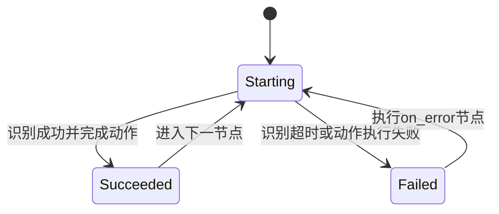
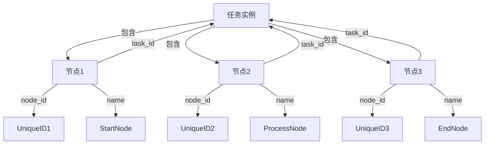
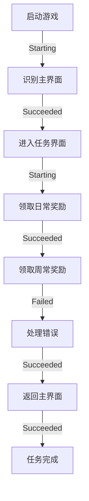
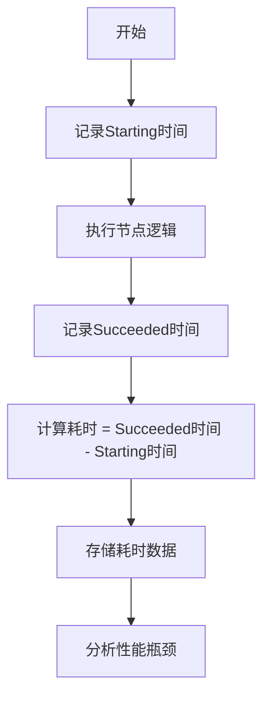
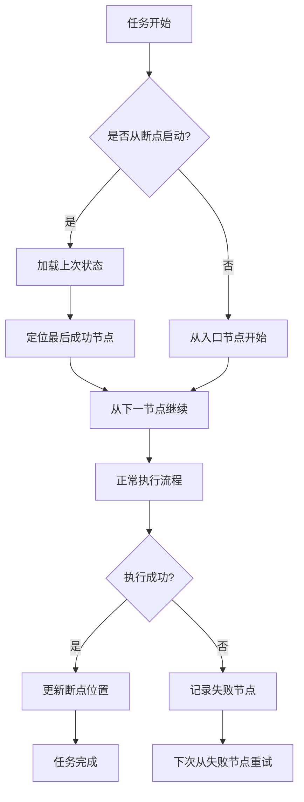
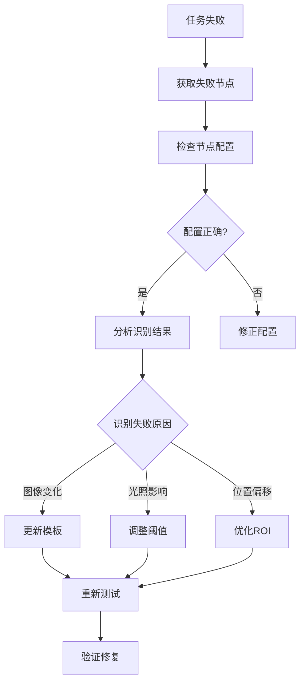

# 流水线节点回调

<cite>
**本文档引用文件**  
- [2.3-回调协议.md](file://instructions/maafw-guide/2.3-回调协议.md)
- [3.1-任务流水线协议.md](file://instructions/maafw-guide/3.1-任务流水线协议.md)
- [tasker.py](file://agent/customs/maahelper/tasker.py)
- [hooks.json](file://assets/resource/base/pipeline/其他/hooks.json)
- [process_guard.py](file://agent/customs/global_func/process_guard.py)
- [default_pipeline.json](file://assets/resource/base/default_pipeline.json)
- [领取奖励.json](file://assets/resource/base/pipeline/日常任务/领取奖励.json)
- [启动游戏.json](file://assets/resource/base/pipeline/日常任务/启动游戏.json)
</cite>

## 目录
1. [简介](#简介)
2. [Node.PipelineNode系列回调消息](#nodepipelinenode系列回调消息)
3. [核心字段解析](#核心字段解析)
4. [实际应用示例](#实际应用示例)
5. [性能监控与异常诊断](#性能监控与异常诊断)
6. [最佳实践](#最佳实践)

## 简介
本文档深入解析MaaFramework中Node.PipelineNode系列回调消息，专用于`post_task`或`run_task`执行完整流水线任务时的状态通知。通过分析回调机制、字段含义和实际应用场景，帮助开发者构建可视化执行流程、实现断点续执行等高级功能，并提供性能监控和异常诊断的最佳实践。

## Node.PipelineNode系列回调消息
Node.PipelineNode系列回调消息是MaaFramework在执行完整流水线任务时发送的核心状态通知，用于跟踪流水线节点的执行状态。这些消息通过`MaaEventCallback`回调函数向上层应用发送，采用统一的消息格式：消息类型（message）+ 详细数据（details_json）。

### 触发时机与状态流转
Node.PipelineNode系列消息包含三种状态：Starting、Succeeded和Failed，分别对应流水线节点的开始执行、成功执行和执行失败。



**Diagram sources**
- [2.3-回调协议.md](file://instructions/maafw-guide/2.3-回调协议.md#%E6%B5%81%E6%B0%B4%E7%BA%BF%E8%8A%82%E7%82%B9%E6%B6%88%E6%81%AF)

#### Starting状态
`Node.PipelineNode.Starting`消息在流水线节点开始执行时发送。这是节点执行流程的起点，表示系统已开始处理该节点的识别和动作逻辑。

**触发条件**：
- 任务流程进入新的节点
- 节点被`next`列表选中并开始识别
- 从`on_error`列表进入错误处理节点

#### Succeeded状态
`Node.PipelineNode.Succeeded`消息在流水线节点执行成功时发送。这表示节点的识别和动作都已成功完成，系统将根据`next`列表继续执行后续节点。

**成功条件**：
- 节点识别成功（识别算法返回匹配结果）
- 动作执行成功（控制器成功执行点击、滑动等操作）
- 完成所有预设的延迟和等待时间

#### Failed状态
`Node.PipelineNode.Failed`消息在流水线节点执行失败时发送。这表示节点未能成功完成其执行流程，系统将根据`on_error`列表执行错误处理逻辑。

**失败条件**：
- 识别超时（在`timeout`时间内未能识别到目标）
- 动作执行失败（控制器操作失败）
- 系统任务被停止

**Section sources**
- [2.3-回调协议.md](file://instructions/maafw-guide/2.3-回调协议.md#%E6%B5%81%E6%B0%B4%E7%BA%BF%E8%8A%82%E7%82%B9%E6%B6%88%E6%81%AF)

## 核心字段解析
Node.PipelineNode回调消息的`details_json`结构包含多个关键字段，这些字段在流水线执行上下文中具有特定含义。

### 基本字段结构
```jsonc
{
    "task_id": 12345,
    "node_id": 67890,
    "name": "NodeA",
    "focus": any,
}
```

### 字段详细说明
**task_id**: 任务ID（数字），用于标识当前执行的任务实例。同一个任务流程中的所有节点共享相同的task_id，可用于追踪整个任务的执行过程。

**node_id**: 节点ID（数字），用于唯一标识流水线中的节点。在任务执行过程中，每个节点都会被分配一个唯一的node_id，可用于精确追踪特定节点的执行状态。

**name**: 节点名称（字符串），表示节点的逻辑名称。这是开发者在流水线配置文件中定义的节点标识符，用于在日志和监控中识别具体节点。

**focus**: 焦点相关数据（任意类型），当节点配置了`focus`字段时，会额外产生回调消息。该字段可用于自定义回调行为，如添加日志信息或触发特定监控逻辑。

### 上下文关联分析
在流水线执行上下文中，这些字段共同构成了完整的执行追踪信息。`task_id`和`node_id`提供了技术层面的唯一标识，而`name`字段则提供了业务层面的语义信息。通过组合这些字段，开发者可以实现：

- **任务级追踪**：通过`task_id`追踪整个任务的执行流程
- **节点级监控**：通过`node_id`和`name`监控特定节点的执行状态
- **性能分析**：结合时间戳计算各节点的执行耗时
- **错误诊断**：通过失败节点的`name`快速定位问题所在



**Diagram sources**
- [2.3-回调协议.md](file://instructions/maafw-guide/2.3-回调协议.md#details_json-%E7%BB%93%E6%9E%84)
- [3.1-任务流水线协议.md](file://instructions/maafw-guide/3.1-任务流水线协议.md#%E5%B1%9E%E6%80%A7%E5%AD%97%E6%AE%B5)

**Section sources**
- [2.3-回调协议.md](file://instructions/maafw-guide/2.3-回调协议.md#details_json-%E7%BB%93%E6%9E%84)
- [3.1-任务流水线协议.md](file://instructions/maafw-guide/3.1-任务流水线协议.md#%E5%B1%9E%E6%80%A7%E5%AD%97%E6%AE%B5)

## 实际应用示例
基于Node.PipelineNode回调消息，开发者可以实现多种高级功能，提升自动化任务的可视化、可监控性和可靠性。

### 构建可视化执行流程图
通过监听Node.PipelineNode系列回调消息，可以实时构建任务执行的可视化流程图。



**实现方法**：
1. 监听所有Node.PipelineNode回调消息
2. 根据`task_id`分组消息
3. 按时间顺序排列节点执行状态
4. 使用图形库渲染执行流程

**Section sources**
- [2.3-回调协议.md](file://instructions/maafw-guide/2.3-回调协议.md#%E6%B5%81%E6%B0%B4%E7%BA%BF%E8%8A%82%E7%82%B9%E6%B6%88%E6%81%AF)
- [启动游戏.json](file://assets/resource/base/pipeline/日常任务/启动游戏.json)

### 统计各节点耗时
通过分析回调消息的时间戳，可以精确统计各节点的执行耗时，为性能优化提供数据支持。



**关键指标**：
- 节点平均执行时间
- 识别耗时分布
- 动作执行耗时
- 超时率统计

**Section sources**
- [2.3-回调协议.md](file://instructions/maafw-guide/2.3-回调协议.md#%E6%B5%81%E6%B0%B4%E7%BA%BF%E8%8A%82%E7%82%B9%E6%B6%88%E6%81%AF)
- [领取奖励.json](file://assets/resource/base/pipeline/日常任务/领取奖励.json)

### 实现断点续执行
利用回调消息的状态信息，可以实现任务的断点续执行功能，提高任务的容错性和可靠性。



**实现要点**：
1. 持久化存储每个节点的执行状态
2. 在任务启动时检查断点状态
3. 根据最后成功节点调整执行起点
4. 处理失败节点的重试逻辑

**Section sources**
- [tasker.py](file://agent/customs/maahelper/tasker.py)
- [2.3-回调协议.md](file://instructions/maafw-guide/2.3-回调协议.md#%E6%B5%81%E6%B0%B4%E7%BA%BF%E8%8A%82%E7%82%B9%E6%B6%88%E6%81%AF)

## 性能监控与异常诊断
Node.PipelineNode回调消息为性能监控和异常诊断提供了丰富的数据源，帮助开发者优化流水线设计。

### 性能监控指标
通过分析回调消息，可以监控以下关键性能指标：

| 指标 | 说明 | 监控方法 |
|------|------|---------|
| 节点执行时间 | 从Starting到Succeeded的时间 | 计算时间戳差值 |
| 识别成功率 | 成功识别次数/总识别次数 | 统计Succeeded与Failed比例 |
| 平均超时次数 | 每任务平均超时节点数 | 统计Failed状态次数 |
| 任务完成率 | 成功完成任务数/总任务数 | 统计Task.Succeeded比例 |

### 异常诊断流程
当任务执行失败时，可以通过以下流程进行诊断：



**常见异常及解决方案**：
- **识别不稳定**：增加`pre_wait_freezes`等待画面静止
- **误识别**：调整识别阈值或优化模板
- **动作失败**：检查设备连接状态
- **超时频繁**：增加`timeout`值或优化识别逻辑

**Section sources**
- [2.3-回调协议.md](file://instructions/maafw-guide/2.3-回调协议.md#%E6%B5%81%E6%B0%B4%E7%BA%BF%E8%8A%82%E7%82%B9%E6%B6%88%E6%81%AF)
- [3.1-任务流水线协议.md](file://instructions/maafw-guide/3.1-任务流水线协议.md#%E5%B1%9E%E6%80%A7%E5%AD%97%E6%AE%B5)

## 最佳实践
基于对Node.PipelineNode回调消息的深入理解，以下是优化流水线设计的最佳实践。

### 回调注入机制
系统自动为所有节点注入运行监测器，确保任务执行过程可被监控。

```python
# 在tasker.py中实现的注入逻辑
if current_next and current_next[0] != "_run_task_monitor_inject":
    new_next = ["_run_task_monitor_inject"] + current_next
```

**优点**：
- 无需手动配置监控节点
- 确保所有节点都被监控
- 统一的监控标准

### 自定义识别处理
通过`focus`字段和自定义识别器，可以实现精细化的监控和控制。

```json
{
    "领取奖励_进入任务界面": {
        "focus": {
            "Node.Recognition.Succeeded": " > 进入任务界面"
        },
        "recognition": {
            "type": "TemplateMatch",
            "param": {
                "template": ["main/task.png"]
            }
        }
    }
}
```

### 任务停止检测
系统内置任务停止检测机制，确保任务可以被安全中断。

```python
# process_guard.py中的停止检测
return RecoHelper.rt() if context.tasker.stopping else RecoHelper.NoResult
```

### 配置优化建议
1. **合理设置超时时间**：根据节点复杂度设置适当的`timeout`值
2. **优化识别参数**：调整`threshold`、`roi`等参数提高识别稳定性
3. **使用锚点机制**：通过`anchor`字段简化复杂流程控制
4. **启用跳回机制**：使用`[JumpBack]`处理异常情况

**Section sources**
- [tasker.py](file://agent/customs/maahelper/tasker.py)
- [process_guard.py](file://agent/customs/global_func/process_guard.py)
- [hooks.json](file://assets/resource/base/pipeline/其他/hooks.json)
- [default_pipeline.json](file://assets/resource/base/default_pipeline.json)