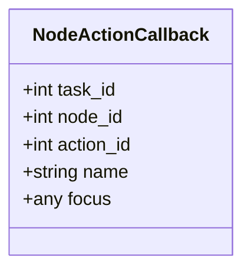
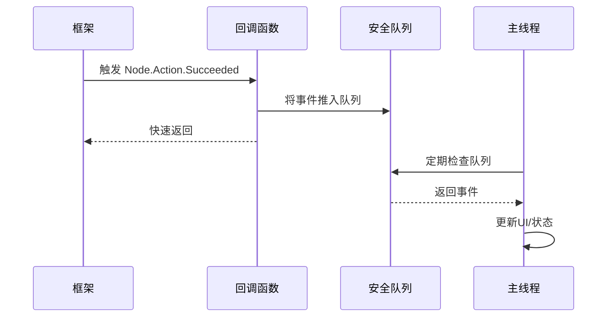

# 节点动作回调

<cite>
**本文档引用文件**  
- [2.3-回调协议.md](file://instructions\maafw-guide\2.3-回调协议.md)
- [tasker.py](file://agent\customs\maahelper\tasker.py)
- [reco_helper.py](file://agent\customs\maahelper\reco_helper.py)
- [process_guard.py](file://agent\customs\global_func\process_guard.py)
- [hooks.json](file://assets\resource\base\pipeline\其他\hooks.json)
</cite>

## 目录
1. [引言](#引言)
2. [节点动作回调机制](#节点动作回调机制)
3. [核心字段解析](#核心字段解析)
4. [回调应用场景](#回调应用场景)
5. [回调执行最佳实践](#回调执行最佳实践)
6. [任务监控实现原理](#任务监控实现原理)
7. [总结](#总结)

## 引言
节点动作回调是MaaFramework自动化系统中的核心事件通知机制，用于实时追踪节点动作的执行状态。通过`Node.Action.Starting`、`Node.Action.Succeeded`和`Node.Action.Failed`三种消息类型，开发者能够精确掌握每个动作的生命周期，实现精细化的任务控制、错误处理和用户反馈。本文档系统化说明该回调机制的技术细节、字段含义及实际应用。

## 节点动作回调机制
节点动作回调是MaaFramework事件系统的一部分，当一个节点执行其预定义的动作（如点击、滑动）时，框架会通过`MaaEventCallback`函数发送相应的状态通知。这些回调是异步的，确保了主执行流程的流畅性。

回调机制遵循统一的消息格式，包含消息类型（message）和详细数据（details_json）。对于节点动作，存在三种关键状态：
- **`Node.Action.Starting`**：在节点即将执行动作时触发，标志着动作执行的开始。
- **`Node.Action.Succeeded`**：在节点动作成功完成后触发，表示该动作已按预期完成。
- **`Node.Action.Failed`**：在节点动作执行失败时触发，用于通知异常情况。

这些回调为上层应用提供了实时的执行视图，是构建健壮自动化流程的基础。

**Section sources**
- [2.3-回调协议.md](file://instructions\maafw-guide\2.3-回调协议.md#L209-L239)

## 核心字段解析
节点动作回调的`details_json`中包含多个关键字段，它们共同构成了动作执行的上下文信息。



**Diagram sources**
- [2.3-回调协议.md](file://instructions\maafw-guide\2.3-回调协议.md#L216-L225)

### task_id
- **含义**：任务ID，一个全局唯一的数字标识符，用于标记当前正在执行的整个任务流程。
- **作用**：在复杂的多任务环境中，`task_id`是区分不同任务实例的关键。所有属于同一任务的节点、识别和动作回调都共享同一个`task_id`，便于进行跨节点的关联分析和日志追踪。

### node_id
- **含义**：节点ID，一个数字标识符，代表流水线（Pipeline）中的特定节点。
- **作用**：`node_id`与`name`字段共同精确定位到执行动作的具体节点。它在内部用于资源管理和状态跟踪，是框架内部处理的核心索引。

### action_id
- **含义**：操作ID，一个数字标识符，代表节点所执行的具体动作实例。
- **作用**：一个节点可能包含多个动作（如连续点击），`action_id`用于区分这些不同的动作实例。它对于需要精确到单个动作级别的监控和重试逻辑至关重要。

### name
- **含义**：节点名称，一个字符串，表示节点在流水线配置文件中的名称。
- **作用**：`name`是开发者最直观的标识，用于在日志、UI反馈和业务逻辑中快速识别当前执行的节点。例如，"领取奖励"或"进入活动界面"等名称直接反映了节点的业务意图。

### focus
- **含义**：焦点数据，一个任意类型的字段，用于传递与当前执行上下文相关的附加信息。
- **作用**：`focus`字段提供了极大的灵活性。它可以携带识别结果、用户输入或其他动态数据，使得回调处理逻辑能够根据具体的执行环境做出响应。例如，在识别到特定UI元素后，`focus`可以包含该元素的坐标，供后续动作使用。

**Section sources**
- [2.3-回调协议.md](file://instructions\maafw-guide\2.3-回调协议.md#L216-L232)

## 回调应用场景
节点动作回调在实际开发中具有广泛的应用价值。

### 动作执行监控
通过监听`Node.Action.Starting`和`Node.Action.Succeeded`/`Node.Action.Failed`，可以构建一个实时的任务执行监控器。例如，在UI界面上动态显示当前正在执行的节点名称（`name`）和状态，让用户清晰地了解自动化流程的进展。

### 失败重试机制
当收到`Node.Action.Failed`回调时，可以根据`task_id`和`node_id`记录失败信息，并触发预设的重试逻辑。例如，对于网络请求类动作，可以实现指数退避重试策略，提高任务的整体成功率。

### 用户反馈提示
利用`name`字段，可以向用户推送人性化的反馈信息。例如，当`name`为"领取奖励"且状态为`Succeeded`时，弹出提示"每日奖励已成功领取！"，极大地提升了用户体验。

**Section sources**
- [2.3-回调协议.md](file://instructions\maafw-guide\2.3-回调协议.md#L212-L239)

## 回调执行最佳实践
为了确保系统的稳定性和性能，处理回调时应遵循以下原则。

### 高效执行
回调函数必须尽快返回。长时间的运算（如复杂的图像处理或网络请求）会阻塞框架的执行线程，导致整个自动化流程卡顿甚至超时。应将耗时操作移出回调函数，通过事件队列或异步任务来处理。

### 线程同步
由于回调可能在任意线程中被调用，直接操作UI或共享资源时必须注意线程安全。最佳实践是使用线程安全的队列将回调数据传递到主线程，再进行UI更新或状态修改。



**Diagram sources**
- [2.3-回调协议.md](file://instructions\maafw-guide\2.3-回调协议.md#L360-L364)

**Section sources**
- [2.3-回调协议.md](file://instructions\maafw-guide\2.3-回调协议.md#L360-L364)

## 任务监控实现原理
系统通过巧妙的机制实现了无侵入式的任务监控。在`tasker.py`的`run`方法中，框架会自动遍历所有节点的`next`和`on_error`字段，并在列表的开头注入一个名为`_run_task_monitor_inject`的特殊节点。

```mermaid
flowchart TD
A[用户调用 run(entry)] --> B[框架检查每个节点]
B --> C{节点有 next 或 on_error?}
C --> |是| D[检查是否已注入监控]
D --> E{第一个节点是 _run_task_monitor_inject?}
E --> |否| F[在 next/on_error 前插入 _run_task_monitor_inject]
E --> |是| G[保持不变]
C --> |否| G
F --> H[执行任务]
G --> H
```

**Diagram sources**
- [tasker.py](file://agent\customs\maahelper\tasker.py#L84-L111)
- [hooks.json](file://assets\resource\base\pipeline\其他\hooks.json)

这个`_run_task_monitor_inject`节点关联了一个自定义识别器`check_stopping`（定义在`process_guard.py`中），它会持续检查`context.tasker.stopping`标志。一旦任务被请求停止，该识别器会立即返回成功，从而中断当前节点的执行并跳转到下一个节点，实现快速响应的停止机制。这确保了即使在长时间动作中，也能及时响应用户的停止指令。

**Section sources**
- [tasker.py](file://agent\customs\maahelper\tasker.py#L51-L113)
- [process_guard.py](file://agent\customs\global_func\process_guard.py#L72-L97)
- [hooks.json](file://assets\resource\base\pipeline\其他\hooks.json)

## 总结
节点动作回调是MaaFramework实现精细化控制的核心。通过`task_id`、`node_id`、`action_id`、`name`和`focus`等字段，开发者能够构建出功能强大、响应及时的自动化应用。在使用时，务必牢记回调的高效执行和线程安全原则，避免阻塞框架。结合系统内置的监控注入机制，可以轻松实现任务的实时监控、优雅停止和用户友好反馈，为自动化流程的稳定运行保驾护航。