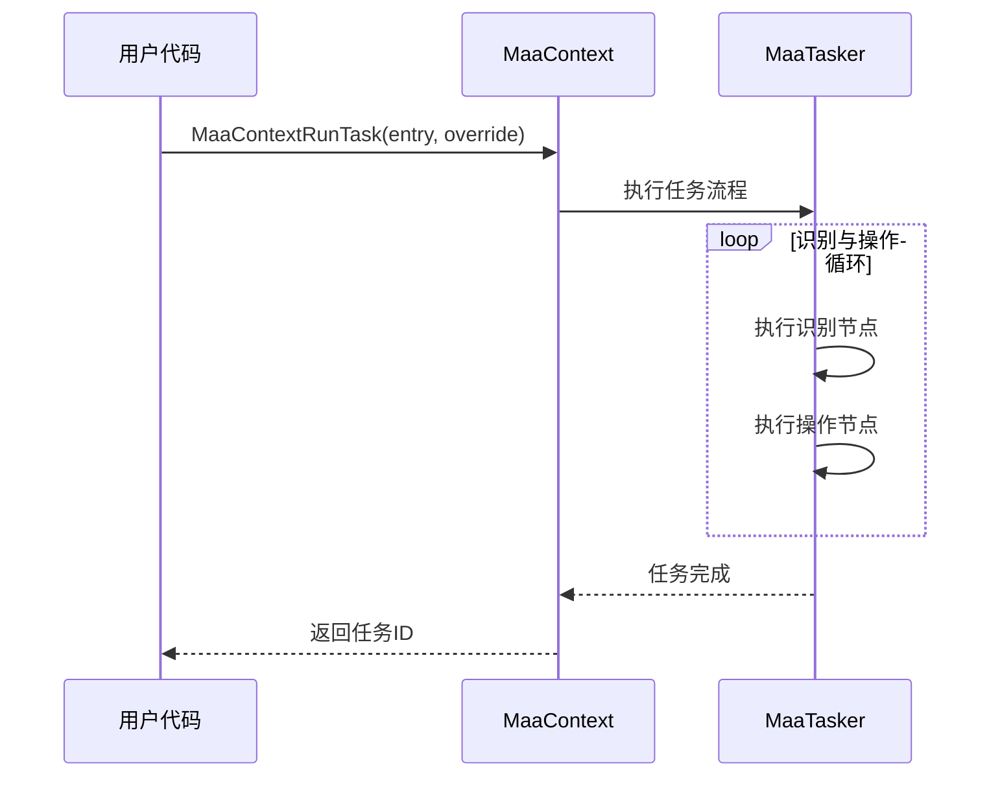
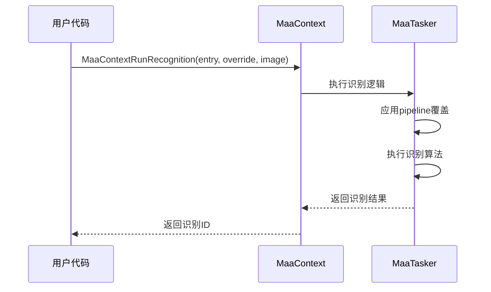
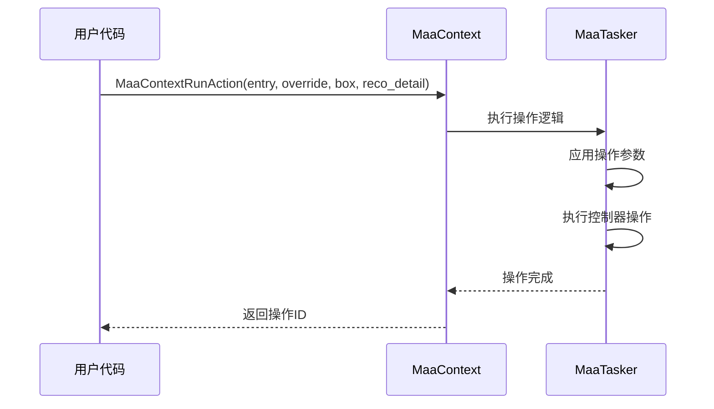
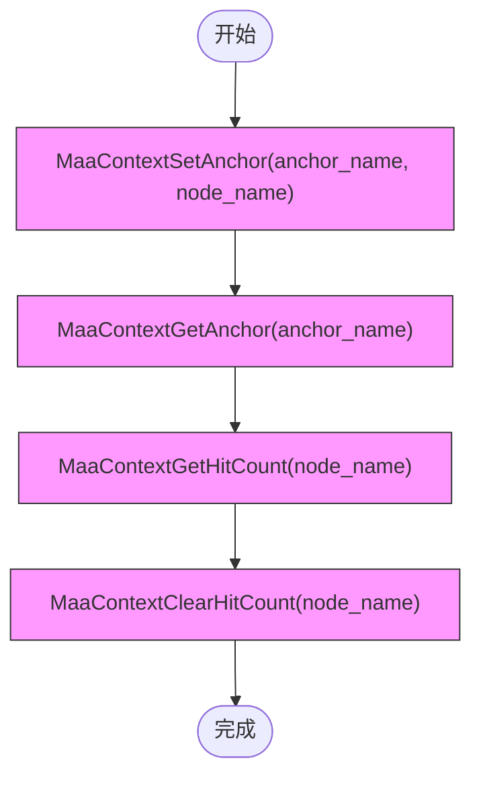
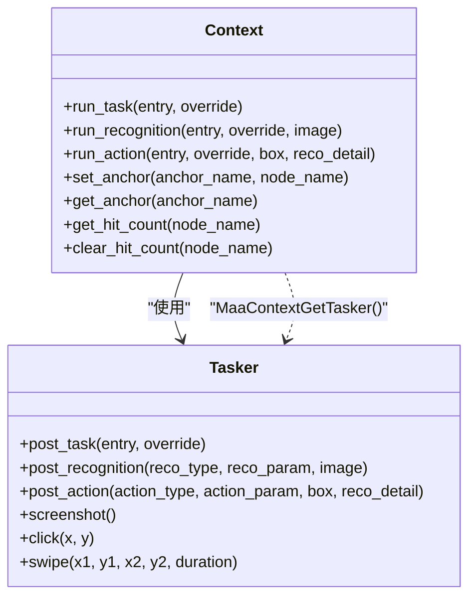

# 上下文接口

<cite>
**本文档引用文件**  
- [MaaContext.h](file://deps/include/MaaFramework/Instance/MaaContext.h)
- [2.2-集成接口一览.md](file://instructions/maafw-guide/2.2-集成接口一览.md)
- [tasker.py](file://agent/customs/maahelper/tasker.py)
- [reco_helper.py](file://agent/customs/maahelper/reco_helper.py)
- [argv_analyzer.py](file://agent/customs/maahelper/argv_analyzer.py)
</cite>

## 目录
1. [简介](#简介)
2. [同步操作接口](#同步操作接口)
3. [上下文状态管理](#上下文状态管理)
4. [锚点与命中计数](#锚点与命中计数)
5. [辅助功能](#辅助功能)
6. [Python调用示例](#python调用示例)
7. [上下文与Tasker协作](#上下文与tasker协作)
8. [使用建议](#使用建议)

## 简介
上下文（Context）是MaaFramework中用于执行任务、识别、操作等同步操作的核心对象。它封装了任务执行所需的环境信息，允许开发者以阻塞方式精确控制自动化流程。本接口文档详细说明了MaaContext模块的同步执行功能，包括任务运行、识别执行、操作执行等关键接口，以及上下文状态管理、锚点设置和命中计数等高级特性。

**Section sources**
- [MaaContext.h](file://deps/include/MaaFramework/Instance/MaaContext.h#L1-L56)
- [2.2-集成接口一览.md](file://instructions/maafw-guide/2.2-集成接口一览.md#L646-L741)

## 同步操作接口

### MaaContextRunTask
同步执行指定入口的任务。该接口会阻塞直到任务完成，执行失败返回`MaaInvalidId`，成功则返回任务ID，可通过`MaaTaskerGetTaskDetail`获取任务详情。



**Diagram sources**
- [MaaContext.h](file://deps/include/MaaFramework/Instance/MaaContext.h#L22)
- [2.2-集成接口一览.md](file://instructions/maafw-guide/2.2-集成接口一览.md#L648-L653)

### MaaContextRunRecognition
同步执行指定入口的识别逻辑，返回识别ID。该接口不会执行后续操作或next节点，仅完成识别过程。执行失败返回`MaaInvalidId`，成功则返回识别ID，可通过`MaaTaskerGetRecognitionDetail`获取识别详情。



**Diagram sources**
- [MaaContext.h](file://deps/include/MaaFramework/Instance/MaaContext.h#L24-L25)
- [2.2-集成接口一览.md](file://instructions/maafw-guide/2.2-集成接口一览.md#L655-L663)

### MaaContextRunAction
同步执行指定入口的操作逻辑，返回操作ID。该接口不会执行后续next节点，仅完成操作过程。执行失败返回`MaaInvalidId`，成功则返回操作ID，可通过`MaaTaskerGetActionDetail`获取操作详情。



**Diagram sources**
- [MaaContext.h](file://deps/include/MaaFramework/Instance/MaaContext.h#L27-L32)
- [2.2-集成接口一览.md](file://instructions/maafw-guide/2.2-集成接口一览.md#L665-L674)

## 上下文状态管理

### MaaContextOverridePipeline
覆盖当前上下文的流水线配置。通过提供JSON格式的`pipeline_override`参数，可以动态修改任务执行流程，实现运行时配置调整。

### MaaContextOverrideNext
覆盖指定节点的next列表。此方法允许在运行时改变任务流程的走向，实现条件分支和动态路径选择。如果指定节点不存在，该方法将失败并返回`false`。

### MaaContextOverrideImage
覆盖指定名称的图片资源。此方法总是成功，可用于在运行时注入自定义图像数据，支持动态内容识别场景。

### MaaContextGetNodeData
获取指定节点的当前定义数据。通过此接口可以查询节点的配置详情，包括识别参数、操作类型、next列表等，用于运行时状态检查和调试。

**Section sources**
- [MaaContext.h](file://deps/include/MaaFramework/Instance/MaaContext.h#L34-L40)
- [2.2-集成接口一览.md](file://instructions/maafw-guide/2.2-集成接口一览.md#L676-L702)

## 锚点与命中计数

### MaaContextSetAnchor 和 MaaContextGetAnchor
锚点机制允许将逻辑名称与具体节点关联，实现间接引用。`SetAnchor`设置锚点对应的节点名称，`GetAnchor`获取锚点指向的节点名称。这在需要动态改变目标节点的场景中非常有用，如根据游戏状态切换操作目标。

### MaaContextGetHitCount 和 MaaContextClearHitCount
命中计数功能用于跟踪特定节点的识别成功次数。`GetHitCount`获取节点的命中计数，`ClearHitCount`清除计数。这在需要基于识别频率做出决策的场景中非常有用，如统计广告弹窗出现次数或检测连续识别失败。



**Diagram sources**
- [MaaContext.h](file://deps/include/MaaFramework/Instance/MaaContext.h#L47-L51)
- [2.2-集成接口一览.md](file://instructions/maafw-guide/2.2-集成接口一览.md#L714-L735)

## 辅助功能

### MaaContextGetTaskId
获取当前上下文关联的任务ID。此接口用于查询正在执行的任务标识，便于任务状态跟踪和日志关联。

### MaaContextGetTasker
获取当前上下文关联的Tasker实例。通过此接口可以访问底层任务执行器，实现更精细的控制和状态查询。

### MaaContextClone
复制当前上下文对象。此功能允许创建上下文的副本，用于并行执行相似任务或保存执行状态快照。

**Section sources**
- [MaaContext.h](file://deps/include/MaaFramework/Instance/MaaContext.h#L42-L46)
- [2.2-集成接口一览.md](file://instructions/maafw-guide/2.2-集成接口一览.md#L703-L713)

## Python调用示例

### 同步任务执行
```python
# 使用Tasker类封装的run方法执行任务
tasker = Tasker(context)
result = tasker.run("返回主界面", {"返回主界面": {"next": ["启动游戏"]}})
```

### 识别结果获取
```python
# 使用RecoHelper类执行识别并获取结果
reco = RecoHelper(context)
reco.recognize("启动游戏_识别主界面", {}, True)
if reco.hit:
    print(f"识别成功，中心坐标: {reco.target}")
```

### 操作执行
```python
# 结合识别结果执行点击操作
reco.click(offset=(10, 10))  # 在识别结果中心偏移点击
reco.click_all(interval=0.5, max_num=3)  # 点击所有识别结果
```

### 流水线动态修改
```python
# 动态修改节点的next列表
context.override_next("当前节点", ["目标节点A", "目标节点B"])
# 覆盖流水线配置
context.override_pipeline({"节点A": {"action": {"type": "Click"}}})
```

**Section sources**
- [tasker.py](file://agent/customs/maahelper/tasker.py#L51-L113)
- [reco_helper.py](file://agent/customs/maahelper/reco_helper.py#L62-L140)

## 上下文与Tasker协作
上下文对象与Tasker实例紧密协作，形成完整的任务执行环境。Tasker提供异步操作能力，而上下文提供同步阻塞接口。通过`MaaContextGetTasker`可以获取关联的Tasker实例，实现同步与异步操作的混合使用。在实际应用中，通常使用上下文执行主要任务流程，同时利用Tasker进行辅助操作如截图、点击等。



**Diagram sources**
- [tasker.py](file://agent/customs/maahelper/tasker.py#L16-L50)
- [MaaContext.h](file://deps/include/MaaFramework/Instance/MaaContext.h)

## 使用建议
在调试场景中，建议优先使用同步接口进行精确控制。同步接口的阻塞特性使得调试过程更加直观，可以逐行跟踪执行流程。对于需要高性能的生产环境，可考虑结合使用同步和异步接口，利用同步接口控制主流程，异步接口处理并行任务。锚点机制特别适用于需要动态调整目标的场景，而命中计数功能可用于实现基于频率的决策逻辑。

**Section sources**
- [2.2-集成接口一览.md](file://instructions/maafw-guide/2.2-集成接口一览.md)
- [tasker.py](file://agent/customs/maahelper/tasker.py)
- [reco_helper.py](file://agent/customs/maahelper/reco_helper.py)