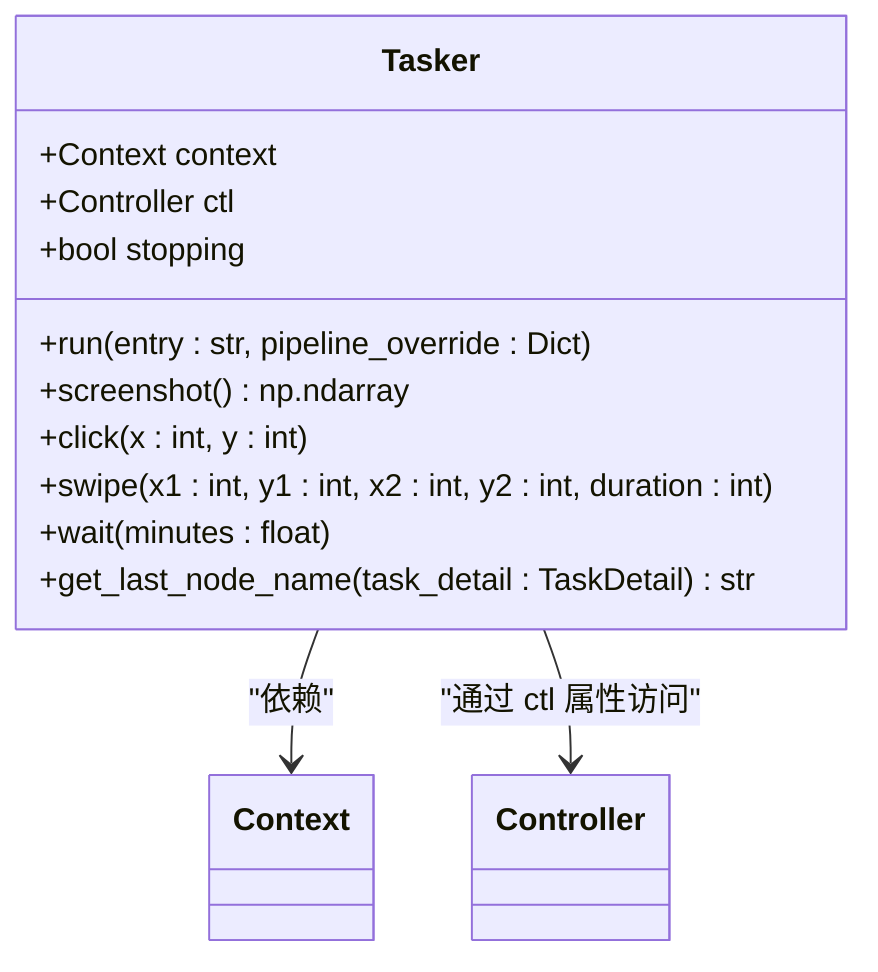
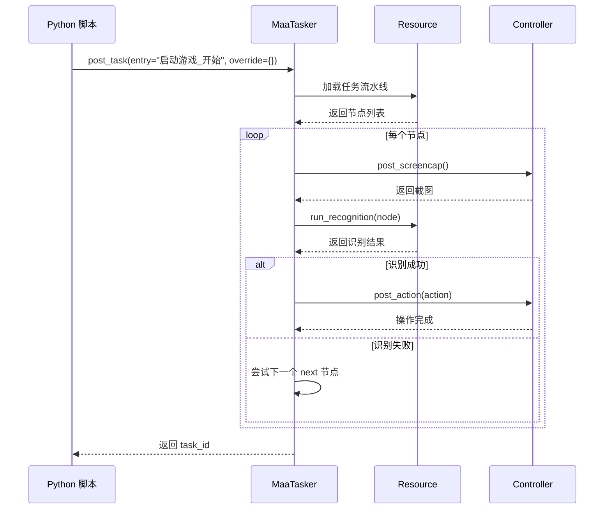
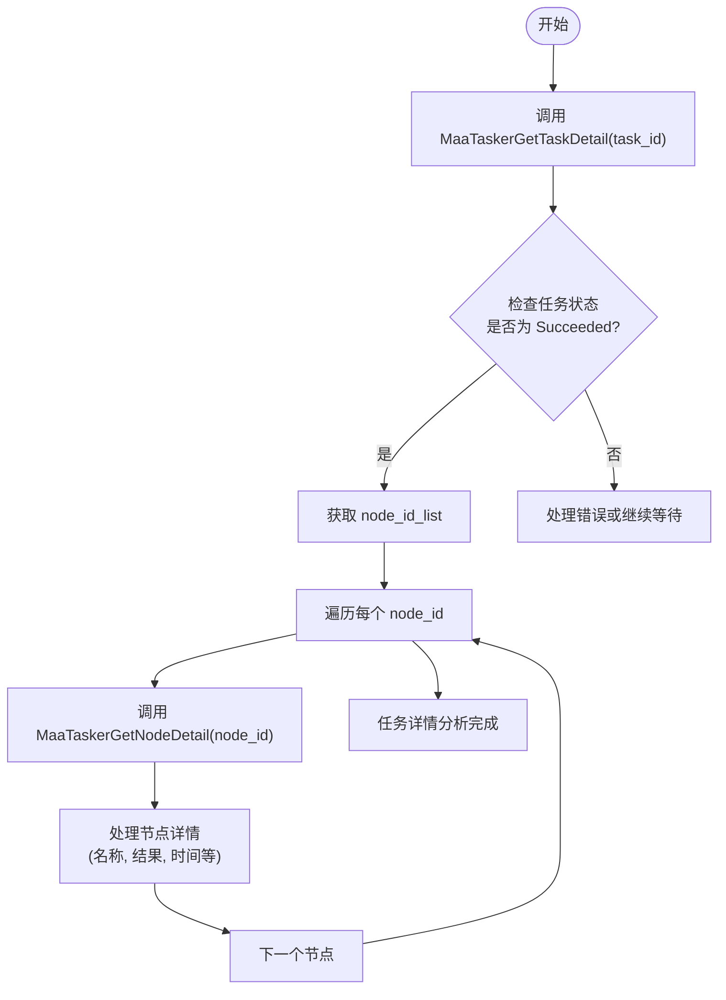

# 任务处理接口

<cite>
**本文档引用的文件**  
- [tasker.py](file://agent/customs/maahelper/tasker.py)
- [reco_helper.py](file://agent/customs/maahelper/reco_helper.py)
- [argv_analyzer.py](file://agent/customs/maahelper/argv_analyzer.py)
- [interface.json](file://assets/interface.json)
- [default_pipeline.json](file://assets/resource/base/default_pipeline.json)
- [hooks.json](file://assets/resource/base/pipeline/其他/hooks.json)
- [main.py](file://agent/main.py)
- [2.2-集成接口一览.md](file://instructions/maafw-guide/2.2-集成接口一览.md)
- [3.1-任务流水线协议.md](file://instructions/maafw-guide/3.1-任务流水线协议.md)
- [2.3-回调协议.md](file://instructions/maafw-guide/2.3-回调协议.md)
- [4.2-标准化接口设计.md](file://instructions/maafw-guide/4.2-标准化接口设计.md)
</cite>

## 目录
1. [简介](#简介)
2. [MaaTasker 实例化与绑定](#maatasker-实例化与绑定)
3. [异步任务执行流程](#异步任务执行流程)
4. [任务详情与节点信息获取](#任务详情与节点信息获取)
5. [任务流水线与自定义节点覆盖](#任务流水线与自定义节点覆盖)
6. [任务中断与状态管理](#任务中断与状态管理)
7. [Python 调用示例](#python-调用示例)
8. [性能优化建议](#性能优化建议)

## 简介

MaaTasker 模块是 MaaDuDuL 项目中负责任务调度与执行的核心组件。它基于 MaaFramework 构建，提供了一套完整的任务处理接口，支持异步任务执行、识别、操作等功能。本接口文档详细说明了 MaaTasker 的各项功能，包括实例化、资源绑定、任务执行、状态查询、结果获取等，为开发者提供全面的集成指导。

该模块通过 `Tasker` 类封装了 MaaFramework 的上下文对象，提供了便捷的任务执行接口，如运行任务节点、截图、点击、滑动等操作。同时，结合 `RecoHelper` 类实现了识别结果的处理与点击操作，以及 `ParamAnalyzer` 类用于解析自定义识别参数，形成了一个完整的任务处理生态系统。

**Section sources**
- [tasker.py](file://agent/customs/maahelper/tasker.py#L1-L177)
- [reco_helper.py](file://agent/customs/maahelper/reco_helper.py#L1-L256)
- [argv_analyzer.py](file://agent/customs/maahelper/argv_analyzer.py#L1-L159)

## MaaTasker 实例化与绑定

MaaTasker 的使用始于实例化和资源绑定。根据 MaaFramework 的设计原则，需要先创建 Tasker 实例，然后将其与 Resource（资源）和 Controller（控制器）进行绑定，才能执行后续的任务。

### 实例化

在 Python 中，MaaTasker 的实例化通过 `Tasker()` 构造函数完成。该构造函数接收一个 `Context` 对象作为参数，该对象包含了任务执行器和控制器的上下文信息。



**Diagram sources**
- [tasker.py](file://agent/customs/maahelper/tasker.py#L16-L177)

### 资源与控制器绑定

实例化后，必须通过 `MaaTaskerBindResource` 和 `MaaTaskerBindController` 接口将 Tasker 与相应的资源和控制器进行绑定。这一步骤在 MaaFramework 的 C API 中是必需的，但在高级语言绑定（如 Python）中通常由框架自动处理或在初始化时完成。

在 `instructions/maafw-guide/2.2-集成接口一览.md` 文件中，明确列出了这些接口的对应关系：
- `MaaTaskerBindResource(res_handle)` 对应于 Python 中的 `tasker.bind_resource(resource)`
- `MaaTaskerBindController(ctrl_handle)` 对应于 Python 中的 `tasker.bind_controller(controller)`

绑定操作确保了 Tasker 能够访问到任务所需的资源文件（如图像识别模板）和控制设备（如模拟器或真机）。

**Section sources**
- [2.2-集成接口一览.md](file://instructions/maafw-guide/2.2-集成接口一览.md#L519-L529)
- [tasker.py](file://agent/customs/maahelper/tasker.py#L25-L31)

## 异步任务执行流程

MaaTasker 的核心功能是异步执行任务、识别和操作。这些操作通过 `PostTask`、`PostRecognition` 和 `PostAction` 等接口发起，它们立即返回一个任务 ID，允许调用者在不阻塞主线程的情况下继续执行其他操作。

### PostTask (任务执行)

`MaaTaskerPostTask` 是启动一个完整任务流水线的主要接口。它接收任务入口节点名称和一个可选的 `pipeline_override` 参数，用于动态修改任务流程。



**Diagram sources**
- [2.2-集成接口一览.md](file://instructions/maafw-guide/2.2-集成接口一览.md#L535-L540)
- [3.1-任务流水线协议.md](file://instructions/maafw-guide/3.1-任务流水线协议.md#L1-L56)

### PostRecognition (识别执行)

`MaaTaskerPostRecognition` 用于执行一次独立的识别操作。它接收识别类型、参数和前序截图，返回一个识别任务 ID。

### PostAction (操作执行)

`MaaTaskerPostAction` 用于执行一次独立的操作，如点击、滑动等。它接收操作类型、参数、前序识别位置和详情。

所有异步操作都遵循相同的模式：发起 -> 返回 ID -> 通过 `Status` 和 `Wait` 查询状态 -> 通过 `GetTaskDetail` 获取结果。

**Section sources**
- [2.2-集成接口一览.md](file://instructions/maafw-guide/2.2-集成接口一览.md#L535-L548)
- [2.3-回调协议.md](file://instructions/maafw-guide/2.3-回调协议.md#L97-L124)

## 任务详情与节点信息获取

为了监控和调试任务执行过程，MaaTasker 提供了 `GetTaskDetail` 和 `GetNodeDetail` 接口来获取任务和节点的详细信息。

### GetTaskDetail

`MaaTaskerGetTaskDetail` 接口用于获取指定任务 ID 的完整信息，包括任务入口、执行状态、所有已执行节点的 ID 列表等。

### GetNodeDetail

`MaaTaskerGetNodeDetail` 接口用于获取指定节点 ID 的详细信息，包括节点名称、对应的识别和操作 ID、执行结果等。

这些接口返回的数据结构在 `2.3-回调协议.md` 中有详细定义。例如，`Tasker.Task.Succeeded` 回调会携带 `task_id`、`entry`、`uuid` 和 `hash` 等信息，这些信息对于构建任务监控系统至关重要。

此外，`Tasker` 类中的 `get_last_node_name` 静态方法提供了一种便捷的方式来获取任务执行的最后一个节点名称，这对于判断任务是否按预期路径执行非常有用。



**Diagram sources**
- [2.2-集成接口一览.md](file://instructions/maafw-guide/2.2-集成接口一览.md#L629-L637)
- [2.3-回调协议.md](file://instructions/maafw-guide/2.3-回调协议.md#L103-L115)
- [tasker.py](file://agent/customs/maahelper/tasker.py#L172-L177)

## 任务流水线与自定义节点覆盖

MaaTasker 的任务执行基于 JSON 格式的任务流水线（Pipeline）协议。每个任务由一系列节点（Node）构成，每个节点定义了识别方式、执行动作和后继节点列表。

### 任务流水线协议

任务流水线的核心属性包括：
- `recognition`: 识别算法（如 OCR、TemplateMatch）
- `action`: 执行动作（如 Click、Swipe）
- `next`: 后继节点列表，决定流程走向

执行逻辑是：从入口节点开始，对 `next` 列表中的节点进行顺序检测，一旦某个节点识别成功，就执行其 `action`，然后将该节点作为新的激活节点，重复此过程，直到 `next` 为空或超时。

### 自定义节点覆盖

`pipeline_override` 参数允许在运行时动态修改任务流水线。例如，可以覆盖某个节点的 `next` 列表或 `action` 类型，实现灵活的任务流程控制。

在 `interface.json` 文件中，可以看到大量使用 `pipeline_override` 的示例，如 `"领取邮件-周期检查"` 选项通过覆盖 `"领取邮件_周期检查"` 节点的 `action` 为 `DoNothing` 来实现功能开关。

```json
"领取邮件-周期检查": {
    "type": "switch",
    "cases": [
        {
            "name": "No",
            "pipeline_override": {
                "领取邮件_周期检查": {
                    "action": "DoNothing"
                }
            }
        }
    ]
}
```

**Section sources**
- [3.1-任务流水线协议.md](file://instructions/maafw-guide/3.1-任务流水线协议.md#L1-L56)
- [interface.json](file://assets/interface.json#L166-L334)

## 任务中断与状态管理

MaaTasker 提供了 `PostStop` 接口来异步中断当前正在运行的任务。这是一个重要的安全机制，允许用户在任何时候停止任务执行。

### PostStop (任务中断)

`MaaTaskerPostStop` 接口会立即返回一个任务 ID，并开始中断流程。它会停止当前运行的任务，中断资源加载和控制器操作。

### 状态管理

`MaaTaskerStopping` 接口用于查询实例是否正在停止中。在 `tasker.py` 中，`stopping` 属性直接封装了此功能，允许在任务逻辑中检查停止状态，实现优雅的退出。

```python
if self.stopping:
    return False  # 如果正在停止，则提前退出
```

此外，`MaaTaskerRunning` 接口用于判断实例是否还在运行，这对于监控任务生命周期非常有用。

**Section sources**
- [2.2-集成接口一览.md](file://instructions/maafw-guide/2.2-集成接口一览.md#L575-L581)
- [tasker.py](file://agent/customs/maahelper/tasker.py#L42-L49)

## Python 调用示例

以下是一些典型的 Python 调用示例，展示了如何使用 MaaTasker 模块。

### 任务启动与结果获取

```python
# 假设已有一个 context 对象
tasker = Tasker(context)
# 启动一个任务
task_detail = tasker.run("启动游戏_开始")
# 获取最后执行的节点名称
last_node = Tasker.get_last_node_name(task_detail)
if last_node == "启动游戏_成功":
    print("游戏启动成功")
else:
    print("游戏启动失败")
```

### 识别与点击操作

```python
reco_helper = RecoHelper(context)
# 执行识别
reco_helper.recognize("领取糖果_识别", refresh_image=True)
# 如果识别成功，则点击
if reco_helper.hit:
    reco_helper.click(offset=(10, 10))
```

### 任务中断

```python
# 检查是否正在停止
if tasker.stopping:
    print("任务正在停止...")
    # 执行清理操作
```

**Section sources**
- [tasker.py](file://agent/customs/maahelper/tasker.py#L51-L113)
- [reco_helper.py](file://agent/customs/maahelper/reco_helper.py#L62-L139)

## 性能优化建议

### 任务队列管理

合理设计任务流水线，避免不必要的节点检测。利用 `pipeline_override` 动态关闭不需要的功能，减少执行时间。

### 资源复用策略

- **截图复用**：在短时间内多次识别时，使用缓存的截图而非每次都重新截图。
- **资源预加载**：在任务开始前，确保所有必要的资源文件已加载到内存中。
- **控制器复用**：避免频繁创建和销毁控制器实例，保持一个长连接。

通过以上优化策略，可以显著提升任务执行的效率和稳定性。

**Section sources**
- [tasker.py](file://agent/customs/maahelper/tasker.py#L115-L123)
- [reco_helper.py](file://agent/customs/maahelper/reco_helper.py#L111-L118)