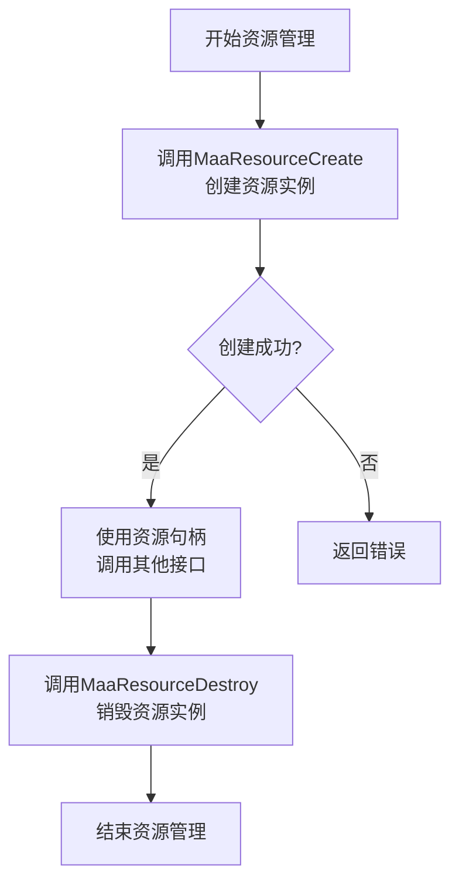
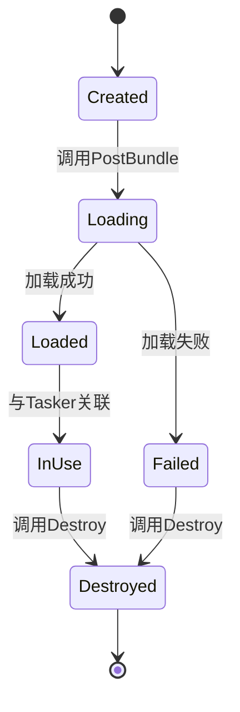
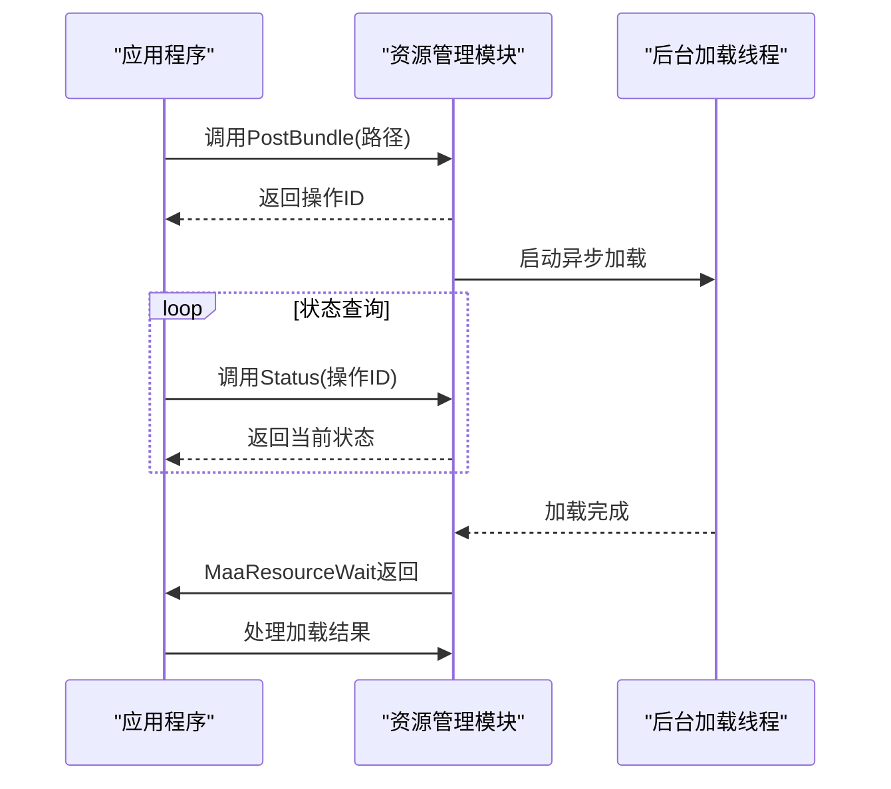
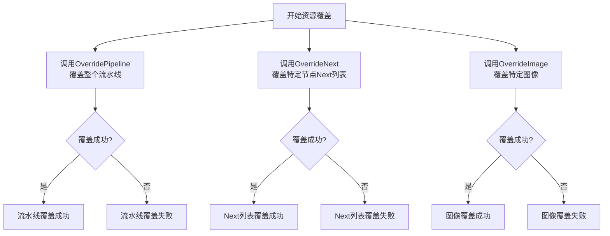
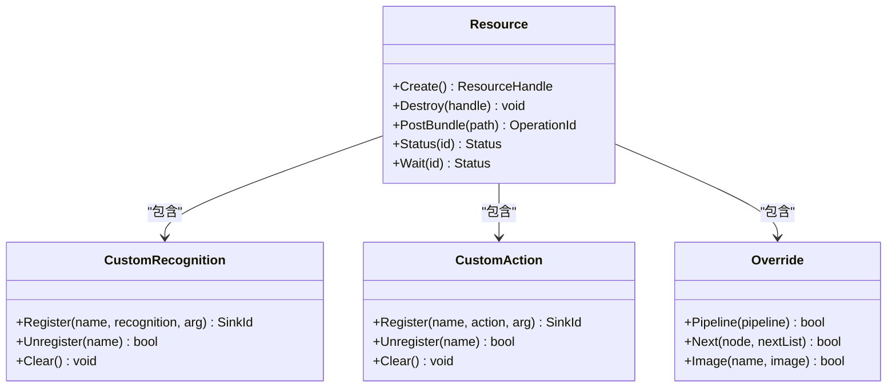
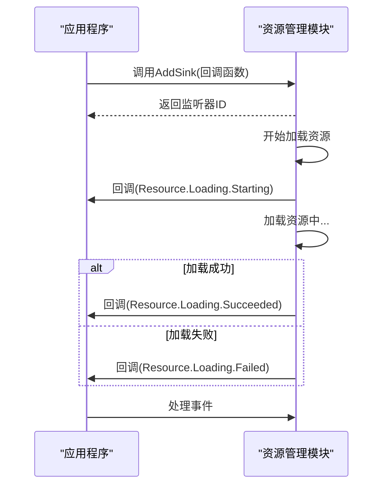

# 资源管理接口

<cite>
**本文档引用的文件**
- [2.2-集成接口一览.md](file://instructions\maafw-guide\2.2-集成接口一览.md)
- [2.3-回调协议.md](file://instructions\maafw-guide\2.3-回调协议.md)
- [3.1-任务流水线协议.md](file://instructions\maafw-guide\3.1-任务流水线协议.md)
- [3.3-ProjectInterfaceV2协议.md](file://instructions\maafw-guide\3.3-ProjectInterfaceV2协议.md)
- [check_resource.py](file://check_resource.py)
- [default_pipeline.json](file://assets\resource\base\default_pipeline.json)
- [maa_pi_config.json](file://assets\config\maa_pi_config.json)
- [interface.json](file://assets\interface.json)
</cite>

## 目录
1. [简介](#简介)
2. [核心接口](#核心接口)
3. [资源生命周期管理](#资源生命周期管理)
4. [异步加载与状态查询](#异步加载与状态查询)
5. [资源覆盖功能](#资源覆盖功能)
6. [自定义识别与操作](#自定义识别与操作)
7. [事件监听机制](#事件监听机制)
8. [Python调用示例](#python调用示例)
9. [性能优化建议](#性能优化建议)
10. [错误处理策略](#错误处理策略)

## 简介

资源管理接口是MaaFramework的核心组件之一，负责管理自动化任务所需的所有资源，包括任务流水线、图像识别模板、OCR模型等。本接口提供了创建、销毁、加载和查询资源的完整功能，支持异步加载机制和动态资源覆盖，为自动化任务的执行提供了坚实的基础。

资源管理模块通过MaaResourceCreate创建资源实例，通过MaaResourcePostBundle异步加载资源包，并通过MaaResourceStatus和MaaResourceWait查询加载状态。资源加载完成后，可以与控制器和任务器关联，开始执行自动化任务。

**本节来源**
- [2.2-集成接口一览.md](file://instructions\maafw-guide\2.2-集成接口一览.md#L61-L65)

## 核心接口

资源管理模块提供了一系列核心接口，用于管理资源的整个生命周期。这些接口包括资源的创建与销毁、资源加载、状态查询等基本操作。

### 资源创建与销毁

MaaResourceCreate用于创建资源实例，返回资源句柄。这是使用资源管理功能的第一步。创建成功后，可以通过该句柄调用其他资源管理接口。

MaaResourceDestroy用于销毁资源实例，释放相关资源。在应用程序退出或不再需要资源管理功能时，应调用此接口以避免内存泄漏。



**图示来源**
- [2.2-集成接口一览.md](file://instructions\maafw-guide\2.2-集成接口一览.md#L63-L69)

**本节来源**
- [2.2-集成接口一览.md](file://instructions\maafw-guide\2.2-集成接口一览.md#L63-L69)

## 资源生命周期管理

资源的生命周期从创建开始，经过加载、使用，最终被销毁。正确管理资源生命周期对于应用程序的稳定性和性能至关重要。

### 生命周期流程

资源生命周期包括四个主要阶段：创建、加载、使用和销毁。在创建阶段，调用MaaResourceCreate获取资源句柄。在加载阶段，通过MaaResourcePostBundle异步加载资源包。在使用阶段，资源可以与任务器关联并执行任务。最后，在销毁阶段，调用MaaResourceDestroy释放资源。

资源加载是异步过程，需要通过MaaResourceStatus和MaaResourceWait查询加载状态。只有当资源加载成功后，才能安全地使用资源执行任务。



**图示来源**
- [2.2-集成接口一览.md](file://instructions\maafw-guide\2.2-集成接口一览.md#L128-L132)

**本节来源**
- [2.2-集成接口一览.md](file://instructions\maafw-guide\2.2-集成接口一览.md#L63-L69)
- [2.2-集成接口一览.md](file://instructions\maafw-guide\2.2-集成接口一览.md#L128-L132)

## 异步加载与状态查询

资源加载采用异步机制，以提高应用程序的响应性和性能。MaaResourcePostBundle接口立即返回操作ID，而不阻塞调用线程。应用程序可以通过MaaResourceStatus查询操作状态，或通过MaaResourceWait等待操作完成。

### 异步加载机制

异步加载机制允许应用程序在加载资源的同时继续执行其他任务，提高了整体效率。当调用MaaResourcePostBundle时，框架会启动后台线程加载指定路径的资源，并立即返回操作ID。应用程序可以使用此ID查询加载状态或等待加载完成。

状态查询提供了两种方式：轮询和等待。MaaResourceStatus用于轮询查询操作状态，返回操作的当前状态码。MaaResourceWait用于阻塞等待操作完成，直到操作结束才返回。



**图示来源**
- [2.2-集成接口一览.md](file://instructions\maafw-guide\2.2-集成接口一览.md#L128-L132)
- [2.3-回调协议.md](file://instructions\maafw-guide\2.3-回调协议.md#L26-L56)

**本节来源**
- [2.2-集成接口一览.md](file://instructions\maafw-guide\2.2-集成接口一览.md#L128-L132)
- [2.3-回调协议.md](file://instructions\maafw-guide\2.3-回调协议.md#L26-L56)

## 资源覆盖功能

资源覆盖功能允许在运行时动态修改已加载的资源，提供了极大的灵活性。主要覆盖功能包括MaaResourceOverridePipeline、MaaResourceOverrideNext和MaaResourceOverrideImage。

### 覆盖流水线

MaaResourceOverridePipeline允许用新的JSON数据覆盖整个流水线配置。这在需要根据运行时条件动态调整任务流程时非常有用。例如，可以根据用户选择的不同模式加载不同的任务配置。

### 覆盖Next列表

MaaResourceOverrideNext用于修改特定节点的Next列表，即该节点执行成功后要执行的下一个节点。此方法会直接设置Next列表，即使节点不存在也会创建。这为动态调整任务流程提供了精细的控制能力。

### 覆盖图像

MaaResourceOverrideImage用于替换资源中的特定图像。此方法总是成功，可用于动态更新识别模板或界面元素图像。



**图示来源**
- [2.2-集成接口一览.md](file://instructions\maafw-guide\2.2-集成接口一览.md#L134-L152)

**本节来源**
- [2.2-集成接口一览.md](file://instructions\maafw-guide\2.2-集成接口一览.md#L134-L152)

## 自定义识别与操作

资源管理模块支持注册自定义识别器和操作，扩展了框架的功能。通过MaaResourceRegisterCustomRecognition和MaaResourceRegisterCustomAction，可以添加用户定义的识别和操作逻辑。

### 自定义识别器

自定义识别器允许实现特定的图像识别算法，用于识别标准算法无法处理的界面元素。注册时需要提供识别器名称、识别函数和传递给回调的参数。

### 自定义操作

自定义操作允许实现特定的用户交互逻辑，如复杂的多点触控手势或特殊的游戏内操作。注册时需要提供操作名称、操作函数和传递给回调的参数。



**图示来源**
- [2.2-集成接口一览.md](file://instructions\maafw-guide\2.2-集成接口一览.md#L92-L126)

**本节来源**
- [2.2-集成接口一览.md](file://instructions\maafw-guide\2.2-集成接口一览.md#L92-L126)

## 事件监听机制

资源管理模块通过事件回调机制通知应用程序资源加载的状态变化。通过MaaResourceAddSink可以添加事件监听器，接收各种资源相关的事件消息。

### 回调协议

事件回调函数采用统一的格式：消息类型（message）+ 详细数据（details_json）。消息类型标识事件类型，详细数据为JSON格式，包含具体的事件信息。

主要的资源加载消息包括：
- Resource.Loading.Starting：资源开始加载
- Resource.Loading.Succeeded：资源加载成功
- Resource.Loading.Failed：资源加载失败



**图示来源**
- [2.3-回调协议.md](file://instructions\maafw-guide\2.3-回调协议.md#L22-L56)

**本节来源**
- [2.3-回调协议.md](file://instructions\maafw-guide\2.3-回调协议.md#L22-L56)

## Python调用示例

以下Python代码示例展示了如何使用资源管理接口完成完整的资源管理流程，包括资源创建、捆绑包加载、自定义识别器注册、事件监听器添加等。

```python
import sys
from typing import List
from pathlib import Path
from maa.resource import Resource
from maa.tasker import Tasker, LoggingLevelEnum

def check(dirs: List[Path]) -> bool:
    resource = Resource()
    print(f"Checking {len(dirs)} directories...")
    for dir in dirs:
        print(f"Checking {dir}...")
        status = resource.post_bundle(dir).wait().status
        if not status.succeeded:
            print(f"Failed to check {dir}.")
            return False
    print("All directories checked.")
    return True

def main():
    if len(sys.argv) < 2:
        print("Usage: python check_resource.py <directories...>")
        sys.exit(1)
    Tasker.set_stdout_level(LoggingLevelEnum.All)
    dirs = [Path(arg) for arg in sys.argv[1:]]
    if not check(dirs):
        sys.exit(1)

if __name__ == "__main__":
    main()
```

**本节来源**
- [check_resource.py](file://check_resource.py#L1-L39)

## 性能优化建议

为了提高资源管理的性能和效率，建议采取以下优化措施：

### 资源预加载

在应用程序启动时预加载常用资源，避免在任务执行过程中因加载资源而导致的延迟。可以将资源加载操作放在后台线程中执行，不影响用户界面的响应性。

### 缓存限制配置

通过MaaGlobalSetOption配置识别图像缓存数量限制（RecoImageCacheLimit），平衡内存使用和性能。默认值为4096，可以根据实际内存情况调整。

### 分离特殊配置

将特殊配置的节点组织到独立的资源包中，配置专用的default_pipeline.json，实现配置隔离。这样可以避免配置冲突，提高资源管理的灵活性。

```json
{
    "Default": {
        "timeout": 30000,
        "pre_delay": 600
    }
}
```

**本节来源**
- [2.2-集成接口一览.md](file://instructions\maafw-guide\2.2-集成接口一览.md#L51-L53)
- [default_pipeline.json](file://assets\resource\base\default_pipeline.json#L1-L6)

## 错误处理策略

有效的错误处理是确保应用程序稳定性的关键。资源管理接口提供了多种错误处理机制，包括状态码检查、异常捕获和重试机制。

### 状态码检查

每次调用资源管理接口后，应检查返回的状态码，及时发现和处理错误。特别是异步操作，需要通过MaaResourceStatus或MaaResourceWait获取最终结果。

### 异常捕获

在事件回调函数中添加异常处理，防止回调函数异常影响框架运行。回调函数可能在不同线程中被调用，需要注意线程安全。

### 重试机制

对于临时性错误，如网络问题导致的资源加载失败，可以实现重试机制。设置最大重试次数和重试间隔，避免无限重试导致的问题。

**本节来源**
- [2.3-回调协议.md](file://instructions\maafw-guide\2.3-回调协议.md#L359-L365)