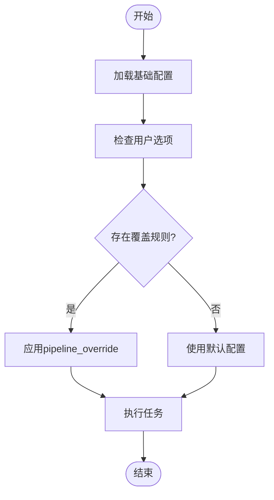
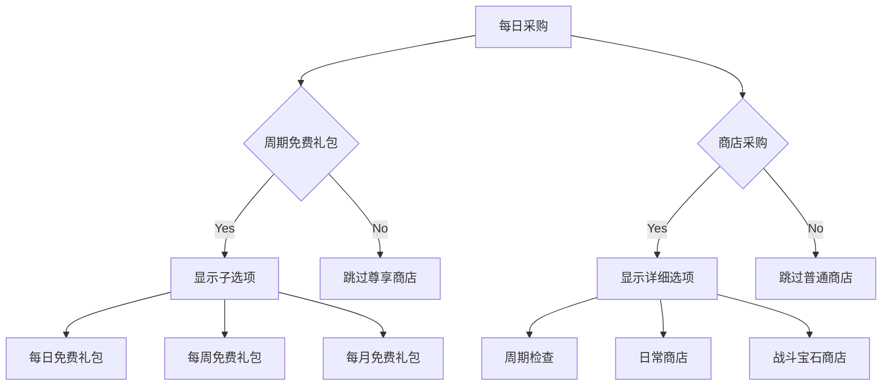

# 任务参数覆盖机制

<cite>
**本文档引用文件**   
- [interface.json](file://assets/interface.json)
- [tasker.py](file://agent/customs/maahelper/tasker.py)
- [3.3-ProjectInterfaceV2协议.md](file://instructions/maafw-guide/3.3-ProjectInterfaceV2协议.md)
- [merge_pipeline.py](file://ci/merge_pipeline.py)
- [pipeline_helper.py](file://agent/customs/global_func/pipeline_helper.py)
</cite>

## 目录
1. [引言](#引言)
2. [核心机制解析](#核心机制解析)
3. [实际配置分析](#实际配置分析)
4. [层级覆盖应用](#层级覆盖应用)
5. [协同工作原理](#协同工作原理)
6. [配置最佳实践](#配置最佳实践)
7. [结论](#结论)

## 引言

ProjectInterface V2协议中的`pipeline_override`机制是一种强大的动态配置功能，允许用户通过JSON结构在运行时修改已加载的任务流程。该机制通过在`interface.json`文件中定义特定的覆盖规则，实现对任务节点的条件性执行控制。通过设置`action: 'DoNothing'`，可以有效地跳过特定任务节点，从而实现灵活的功能开关和条件逻辑。本文档将深入解析这一机制的工作原理，并结合实际配置示例展示其在"每日采购"等任务中的应用。

**Section sources**
- [interface.json](file://assets/interface.json#L1-L1196)
- [3.3-ProjectInterfaceV2协议.md](file://instructions/maafw-guide/3.3-ProjectInterfaceV2协议.md#L1-L499)

## 核心机制解析

`pipeline_override`机制是ProjectInterface V2协议的核心功能之一，它允许在任务执行时动态修改已加载的资源。该机制通过在`option`配置项中定义覆盖规则，当用户选择特定选项时，系统会将这些规则应用到任务流程中，从而改变节点的行为。

该机制的工作原理基于MaaFramework的任务执行流程。当任务启动时，系统会加载预定义的pipeline配置，然后根据用户的选择应用`pipeline_override`规则。这些规则可以修改节点的`action`、`next`、`on_error`等属性，从而改变任务的执行路径。

在技术实现上，`pipeline_override`通过`Tasker`类的`run`方法实现。该方法接收`pipeline_override`参数，并在执行任务前将其与原始配置合并。系统会遍历所有节点，检查是否存在覆盖规则，并根据规则修改节点行为。这种设计使得配置修改既灵活又安全，不会影响原始的pipeline文件。



**Diagram sources**
- [tasker.py](file://agent/customs/maahelper/tasker.py#L50-L113)
- [3.3-ProjectInterfaceV2协议.md](file://instructions/maafw-guide/3.3-ProjectInterfaceV2协议.md#L305-L315)

**Section sources**
- [tasker.py](file://agent/customs/maahelper/tasker.py#L50-L113)
- [3.3-ProjectInterfaceV2协议.md](file://instructions/maafw-guide/3.3-ProjectInterfaceV2协议.md#L305-L315)

## 实际配置分析

在`assets/interface.json`文件中，`pipeline_override`机制被广泛应用于各种任务的配置中。以"领取邮件"任务为例，通过`领取邮件-周期检查`选项实现了条件性执行：

```json
"领取邮件-周期检查": {
    "type": "switch",
    "label": "每日仅检查一次邮箱",
    "cases": [
        {
            "name": "No",
            "pipeline_override": {
                "领取邮件_周期检查": {
                    "action": "DoNothing"
                }
            }
        },
        {
            "name": "Yes"
        }
    ]
}
```

当用户选择"No"时，系统会将`领取邮件_周期检查`节点的`action`属性设置为`DoNothing`，从而跳过该节点的执行。这种设计允许用户根据需要控制任务的执行频率，避免重复操作。

类似地，在"领取糖果"任务中也应用了相同的机制：

```json
"领取糖果-周期检查": {
    "type": "switch",
    "label": "每日仅检查一次糖果",
    "cases": [
        {
            "name": "No",
            "pipeline_override": {
                "领取糖果_周期检查": {
                    "action": "DoNothing"
                }
            }
        },
        {
            "name": "Yes"
        }
    ]
}
```

这种模式在多个任务中重复使用，体现了配置的一致性和可维护性。通过简单的JSON结构，实现了复杂的功能控制。

**Section sources**
- [interface.json](file://assets/interface.json#L166-L201)
- [interface.json](file://assets/interface.json#L185-L201)

## 层级覆盖应用

`pipeline_override`机制在"每日采购"任务中展现了强大的层级覆盖能力。该任务通过多层嵌套的选项配置，实现了复杂的条件逻辑控制。

以`每日采购-周期免费礼包`为例，该选项不仅控制自身的执行，还影响子级任务的显示和行为：

```json
"每日采购-周期免费礼包": {
    "type": "switch",
    "label": "周期免费礼包",
    "cases": [
        {
            "name": "Yes",
            "option": ["每日采购-每日免费礼包", "每日采购-每周免费礼包", "每日采购-每月免费礼包"]
        },
        {
            "name": "No",
            "pipeline_override": {
                "每日采购_尊享商店开始": {
                    "next": "每日采购_至尊商店结束"
                }
            }
        }
    ]
}
```

当用户选择"No"时，系统会修改`每日采购_尊享商店开始`节点的`next`属性，直接跳转到结束节点，从而跳过整个尊享商店的采购流程。这种设计实现了父级开关对子级任务的控制。

更复杂的层级覆盖体现在`每日采购-商店采购`选项中：

```json
"每日采购-商店采购": {
    "type": "switch",
    "label": "采购普通商店",
    "cases": [
        {
            "name": "No",
            "pipeline_override": {
                "每日采购_普通商店开始": {
                    "next": "每日采购_普通商店结束"
                }
            }
        },
        {
            "name": "Yes",
            "option": ["每日采购-商店采购-周期检查", "每日采购-日常商店", "每日采购-战斗宝石商店"]
        }
    ]
}
```

这个配置展示了`pipeline_override`与`option`的协同工作。当选择"No"时，通过覆盖`next`属性跳过普通商店采购；当选择"Yes"时，则显示更详细的子选项，允许用户进一步配置采购细节。



**Diagram sources**
- [interface.json](file://assets/interface.json#L204-L353)
- [interface.json](file://assets/interface.json#L336-L353)

**Section sources**
- [interface.json](file://assets/interface.json#L204-L353)

## 协同工作原理

`pipeline_override`与`option`配置项的协同工作是ProjectInterface V2协议的核心设计理念。这种协同关系通过层级化的配置结构实现，允许用户在不同粒度上控制任务行为。

当用户选择一个选项时，系统会按照以下流程处理：

1. 首先检查该选项是否有`pipeline_override`规则
2. 如果有，则应用覆盖规则修改任务流程
3. 然后检查是否有子`option`配置
4. 如果有，则显示子选项供用户进一步选择

这种设计实现了配置的模块化和可组合性。以`每日采购-日常商店`为例：

```json
"每日采购-日常商店": {
    "type": "switch",
    "label": "日常商店",
    "cases": [
        {
            "name": "No",
            "pipeline_override": {
                "每日采购_日常商店开始": {
                    "next": "每日采购_日常商店结束"
                }
            }
        },
        {
            "name": "Yes",
            "option": [
                "每日采购-日常商店-朱珠糖",
                "每日采购-日常商店-星星糖",
                "每日采购-日常商店-锻造书"
            ]
        }
    ]
}
```

当用户选择"Yes"时，不仅激活了日常商店采购，还显示了具体的商品选项。每个商品选项又可以有自己的`pipeline_override`规则：

```json
"每日采购-日常商店-朱珠糖": {
    "type": "switch",
    "label": "朱珠糖",
    "cases": [
        {
            "name": "No",
            "pipeline_override": {
                "每日采购_购买日常朱珠糖": {
                    "action": "DoNothing"
                }
            }
        },
        {
            "name": "Yes"
        }
    ]
}
```

这种层级化的配置结构使得系统能够生成复杂的最终任务执行流程，同时保持配置的清晰和可维护性。

**Section sources**
- [interface.json](file://assets/interface.json#L371-L415)
- [interface.json](file://assets/interface.json#L399-L415)

## 配置最佳实践

为了有效利用`pipeline_override`机制并确保任务流程的健壮性，建议遵循以下最佳实践：

### 避免覆盖冲突

在设计`pipeline_override`规则时，应确保不同选项之间的覆盖规则不会产生冲突。例如，避免在两个互斥选项中修改同一个节点的`next`属性。可以通过清晰的命名约定和文档注释来管理复杂的覆盖规则。

### 确保任务流程健壮性

在应用`pipeline_override`时，应确保修改后的任务流程仍然完整和可执行。特别是当使用`next`属性跳过节点时，需要确保跳转目标是有效的，避免造成流程中断。

### 利用条件逻辑

`pipeline_override`机制非常适合实现复杂的条件逻辑。通过组合使用`action: 'DoNothing'`和修改`next`属性，可以创建灵活的任务控制策略。例如，在"巅峰对决"任务中：

```json
"巅峰对决-竞技场对战-对手选择策略": {
    "type": "switch",
    "label": "对手选择策略",
    "cases": [
        {
            "name": "最低战力"
        },
        {
            "name": "最高排名",
            "pipeline_override": {
                "巅峰对决_选择对手": {
                    "custom_recognition_param": "s=max_rank"
                }
            }
        }
    ]
}
```

这种配置允许用户根据策略选择不同的对手，体现了条件逻辑的强大能力。

### 使用DoNothing的最佳实践

`action: 'DoNothing'`是一种优雅的节点跳过方式。它不仅简单有效，而且语义清晰。在配置时，应优先考虑使用`DoNothing`而不是复杂的`next`跳转，除非需要精确控制执行路径。

**Section sources**
- [interface.json](file://assets/interface.json#L1037-L1052)
- [interface.json](file://assets/interface.json#L167-L201)

## 结论

`pipeline_override`机制是ProjectInterface V2协议中一个强大而灵活的功能，它通过JSON结构实现了对任务流程的动态修改。通过`action: 'DoNothing'`和`next`属性的修改，用户可以精确控制任务的执行路径，实现复杂的条件逻辑。

该机制在"每日采购"等任务中的应用展示了其在层级覆盖和条件控制方面的优势。通过与`option`配置项的协同工作，系统能够生成适应不同用户需求的最终任务执行流程。

遵循最佳实践，如避免覆盖冲突、确保流程健壮性和合理利用条件逻辑，可以帮助开发者创建更加可靠和用户友好的自动化任务。`pipeline_override`机制不仅提高了配置的灵活性，也为复杂任务的管理提供了优雅的解决方案。