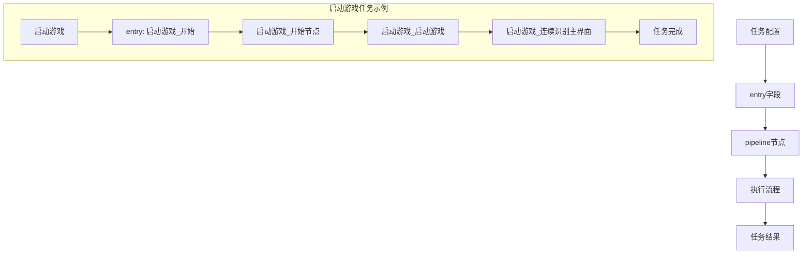
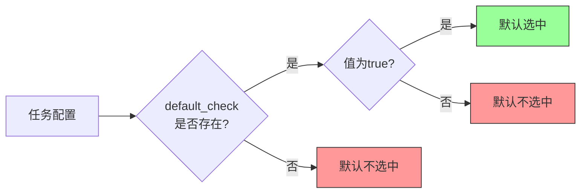
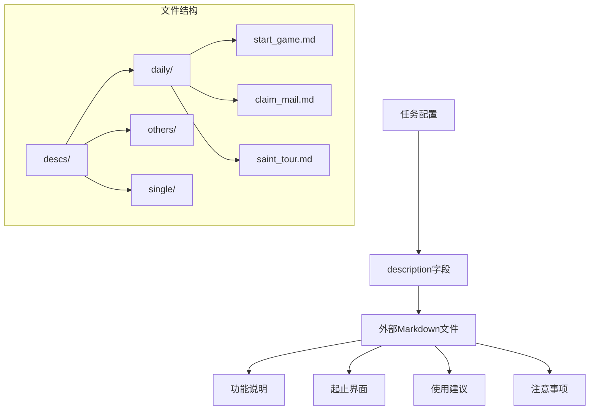
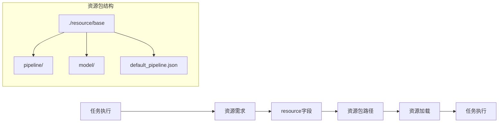
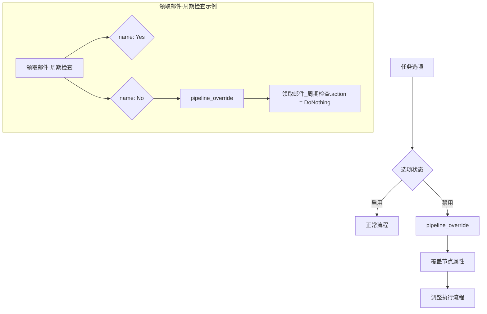
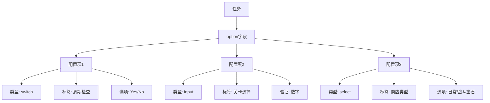
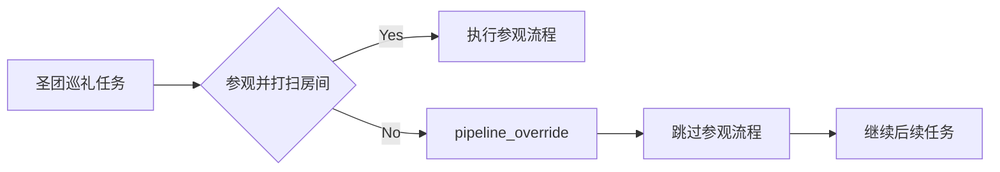

# 任务配置详解

<cite>
**本文档引用文件**   
- [interface.json](file://assets/interface.json)
- [启动游戏.json](file://assets/resource/base/pipeline/日常任务/启动游戏.json)
- [领取邮件.json](file://assets/resource/base/pipeline/日常任务/领取邮件.json)
- [圣团巡礼.json](file://assets/resource/base/pipeline/日常任务/圣团巡礼.json)
- [每日采购.json](file://assets/resource/base/pipeline/日常任务/每日采购.json)
- [清紫糖.json](file://assets/resource/base/pipeline/日常任务/清紫糖.json)
- [start_game.md](file://descs/daily/start_game.md)
- [claim_mail.md](file://descs/daily/claim_mail.md)
- [saint_tour.md](file://descs/daily/saint_tour.md)
- [claim_reward.md](file://descs/daily/claim_reward.md)
- [peak_battle.md](file://descs/daily/peak_battle.md)
- [leaf_change.md](file://descs/daily/leaf_change.md)
- [claim_candy.md](file://descs/daily/claim_candy.md)
</cite>

## 目录
1. [任务配置系统概述](#任务配置系统概述)
2. [核心字段详解](#核心字段详解)
3. [entry字段与任务流程映射](#entry字段与任务流程映射)
4. [default_check字段与默认选中状态](#default_check字段与默认选中状态)
5. [description字段与外部文档引用](#description字段与外部文档引用)
6. [resource字段与资源包关联](#resource字段与资源包关联)
7. [pipeline_override机制详解](#pipeline_override机制详解)
8. [option字段与任务选项配置](#option字段与任务选项配置)
9. [综合案例分析](#综合案例分析)

## 任务配置系统概述

ProjectInterface V2协议中的任务配置系统通过`interface.json`文件中的`task`数组定义了自动化任务的完整配置。该系统采用JSON格式，通过一系列标准化字段实现任务的灵活配置和动态调整。每个任务配置项都包含`name`、`label`、`entry`、`default_check`、`description`、`resource`、`pipeline_override`和`option`等核心字段，这些字段共同构成了任务的完整行为定义。

任务配置系统的设计遵循模块化和可扩展原则，通过`entry`字段将任务与具体的执行流程（pipeline）关联，通过`pipeline_override`机制实现任务流程的动态覆盖，通过`option`字段支持任务的可选配置。这种设计使得任务配置既保持了结构的统一性，又具备了高度的灵活性。

**Section sources**
- [interface.json](file://assets/interface.json#L39-L163)

## 核心字段详解

### name字段
`name`字段定义了任务的唯一标识符，用于在系统内部引用和识别任务。该字段值必须是唯一的，通常采用中文命名以提高可读性。例如，"启动游戏"、"领取邮件"等。

### label字段
`label`字段定义了任务在用户界面中显示的名称。与`name`字段不同，`label`字段主要用于用户交互界面，可以包含特殊字符和格式化文本。

### entry字段
`entry`字段指定了任务执行流程的入口节点，即在`pipeline`文件中定义的起始任务节点名称。该字段建立了任务配置与具体执行逻辑之间的映射关系。

### default_check字段
`default_check`字段控制任务在用户界面中的默认选中状态。当该字段值为`true`时，任务在初始化时默认被选中；当值为`false`或未定义时，任务默认不被选中。

### description字段
`description`字段用于引用外部Markdown文档，提供任务的详细说明。该字段值为相对路径，指向`descs`目录下的具体Markdown文件。

### resource字段
`resource`字段定义了任务所需的资源包，确保任务执行时能够加载必要的资源文件。该字段支持资源包的按需加载和管理。

### pipeline_override字段
`pipeline_override`字段是任务配置系统的核心机制之一，允许通过JSON结构覆盖现有任务流程的特定节点，实现任务流程的动态调整。

### option字段
`option`字段定义了任务的可选配置项，通常与`option`对象中的配置项关联，为用户提供任务执行的个性化选择。

**Section sources**
- [interface.json](file://assets/interface.json#L41-L163)

## entry字段与任务流程映射

`entry`字段在任务配置系统中扮演着关键角色，它建立了任务配置与具体执行流程之间的桥梁。每个任务通过`entry`字段指向`pipeline`文件中的特定节点，从而确定任务的执行起点。

以"启动游戏"任务为例，其`entry`字段值为"启动游戏_开始"，这表示该任务的执行流程从`启动游戏.json`文件中的"启动游戏_开始"节点开始。该节点通常是一个自定义动作节点，用于初始化任务执行环境。



**Diagram sources**
- [interface.json](file://assets/interface.json#L58-L64)
- [启动游戏.json](file://assets/resource/base/pipeline/日常任务/启动游戏.json#L108-L127)

## default_check字段与默认选中状态

`default_check`字段用于控制任务在用户界面中的默认选中状态，是提升用户体验的重要配置。该字段的使用遵循以下原则：

1. **高频任务默认选中**：对于日常高频执行的任务，如"启动游戏"、"领取邮件"等，通常设置`default_check`为`true`，确保用户无需手动选择即可执行。

2. **低频任务默认不选中**：对于低频或特殊场景使用的任务，如"连续作战"等，通常不设置`default_check`字段或设置为`false`，避免不必要的任务执行。

3. **任务组协调**：在同一任务组中，相关联的任务通常采用一致的默认选中策略。例如，"领取邮件"、"领取糖果"、"每日采购"等日常任务均设置为默认选中。



**Diagram sources**
- [interface.json](file://assets/interface.json#L58-L64)
- [interface.json](file://assets/interface.json#L65-L72)

## description字段与外部文档引用

`description`字段通过引用外部Markdown文档的方式，实现了任务说明与配置的分离，提高了文档的可维护性和可读性。该字段的值为相对路径，指向`descs`目录下的具体Markdown文件。

系统采用分层的文档组织结构：
- `descs/daily/`：存放日常任务的说明文档
- `descs/others/`：存放其他类型任务的说明文档
- `descs/single/`：存放独立任务的说明文档

每个Markdown文档通常包含以下内容：
- 功能说明
- 起止界面
- 使用建议
- 注意事项



**Diagram sources**
- [interface.json](file://assets/interface.json#L63)
- [interface.json](file://assets/interface.json#L70)
- [interface.json](file://assets/interface.json#L101)
- [start_game.md](file://descs/daily/start_game.md)
- [claim_mail.md](file://descs/daily/claim_mail.md)
- [saint_tour.md](file://descs/daily/saint_tour.md)

## resource字段与资源包关联

`resource`字段实现了任务与特定资源包的关联，确保功能的按需加载。在`interface.json`文件中，`resource`字段定义了可用的资源包及其路径。

系统通过`resource`字段实现以下功能：
1. **资源隔离**：不同资源包中的资源相互隔离，避免冲突
2. **按需加载**：仅加载当前任务所需的资源包，提高系统性能
3. **版本管理**：通过不同的资源包实现资源的版本控制



**Diagram sources**
- [interface.json](file://assets/interface.json#L29-L34)
- [default_pipeline.json](file://assets/resource/base/default_pipeline.json)

## pipeline_override机制详解

`pipeline_override`机制是任务配置系统中最强大的功能之一，它允许通过JSON结构覆盖现有任务流程的特定节点，实现任务流程的动态调整。该机制主要应用于`option`配置中，通过条件判断实现流程的分支控制。

### 基本结构
`pipeline_override`字段包含一个JSON对象，其键为`pipeline`文件中的节点名称，值为需要覆盖的节点属性。常见的覆盖属性包括：
- `action`：覆盖节点的动作类型
- `next`：覆盖节点的下一个执行节点
- `custom_action_param`：覆盖自定义动作的参数

### 应用场景
1. **条件跳过**：当某个选项被禁用时，通过将节点动作设置为`DoNothing`来跳过该节点的执行。
2. **流程跳转**：通过修改`next`属性，实现执行流程的跳转。
3. **参数动态调整**：通过修改`custom_action_param`属性，实现自定义动作参数的动态调整。



**Diagram sources**
- [interface.json](file://assets/interface.json#L166-L181)
- [领取邮件.json](file://assets/resource/base/pipeline/日常任务/领取邮件.json#L45-L67)

## option字段与任务选项配置

`option`字段定义了任务的可选配置项，为用户提供任务执行的个性化选择。该字段与`option`对象中的配置项关联，通过开关、输入框等形式呈现给用户。

### 配置类型
1. **开关类型（switch）**：提供二元选择，如"是/否"、"启用/禁用"等。
2. **输入类型（input）**：允许用户输入自定义值，通常包含验证规则。
3. **选择类型（select）**：提供多个选项供用户选择。

### 配置层级
`option`字段支持嵌套配置，形成多层次的配置结构。例如，"每日采购"任务的配置中，"每日采购-商店采购"选项下包含"日常商店"和"战斗宝石商店"两个子选项。



**Diagram sources**
- [interface.json](file://assets/interface.json#L71)
- [interface.json](file://assets/interface.json#L86)
- [interface.json](file://assets/interface.json#L94)

## 综合案例分析

### 圣团巡礼任务配置分析
"圣团巡礼"任务是一个典型的复杂任务配置示例，它综合运用了多个配置字段和机制。

```json
{
    "name": "圣团巡礼",
    "label": "圣团巡礼",
    "entry": "圣团巡礼_开始",
    "default_check": true,
    "description": "Resource/descs/daily/saint_tour.md",
    "option": [
        "圣团巡礼-收获世界树",
        "圣团巡礼-参观并打扫房间",
        "圣团巡礼-领取宠物礼物"
    ]
}
```

该任务配置的特点：
1. **默认选中**：`default_check`设置为`true`，作为日常高频任务
2. **详细说明**：通过`description`字段引用外部Markdown文档
3. **多选项支持**：通过`option`字段提供多个可选子任务
4. **流程入口**：`entry`字段指向"圣团巡礼_开始"节点

### pipeline_override实际应用
以"圣团巡礼-参观并打扫房间"选项为例，其`pipeline_override`配置如下：

```json
"圣团巡礼-参观并打扫房间": {
    "type": "switch",
    "label": "每日参观与打扫房间",
    "cases": [
        {
            "name": "Yes",
            "option": ["圣团巡礼-参观并打扫房间-每日仅检查一次"]
        },
        {
            "name": "No",
            "pipeline_override": {
                "圣团巡礼_参观开始": {
                    "next": "圣团巡礼_参观结束"
                }
            }
        }
    ]
}
```

当用户选择"No"时，系统通过`pipeline_override`机制将"圣团巡礼_参观开始"节点的下一个执行节点直接指向"圣团巡礼_参观结束"，从而跳过参观和打扫房间的整个流程。



**Diagram sources**
- [interface.json](file://assets/interface.json#L96-L107)
- [圣团巡礼.json](file://assets/resource/base/pipeline/日常任务/圣团巡礼.json)

**Section sources**
- [interface.json](file://assets/interface.json#L96-L107)
- [圣团巡礼.json](file://assets/resource/base/pipeline/日常任务/圣团巡礼.json)
- [saint_tour.md](file://descs/daily/saint_tour.md)