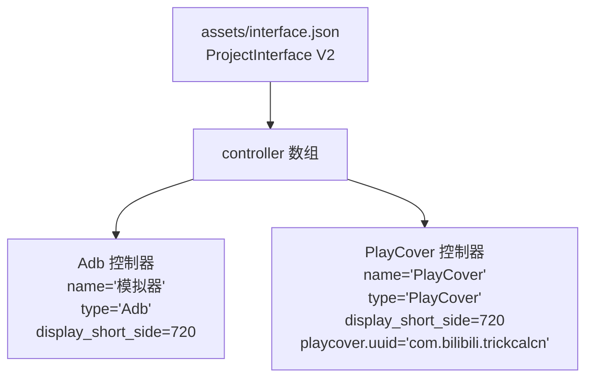
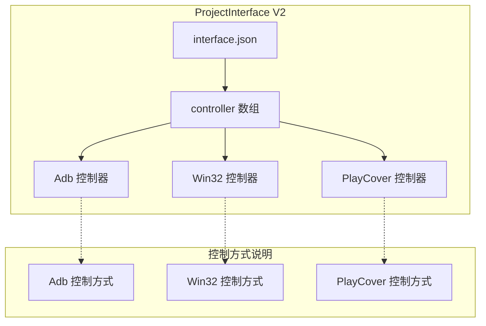
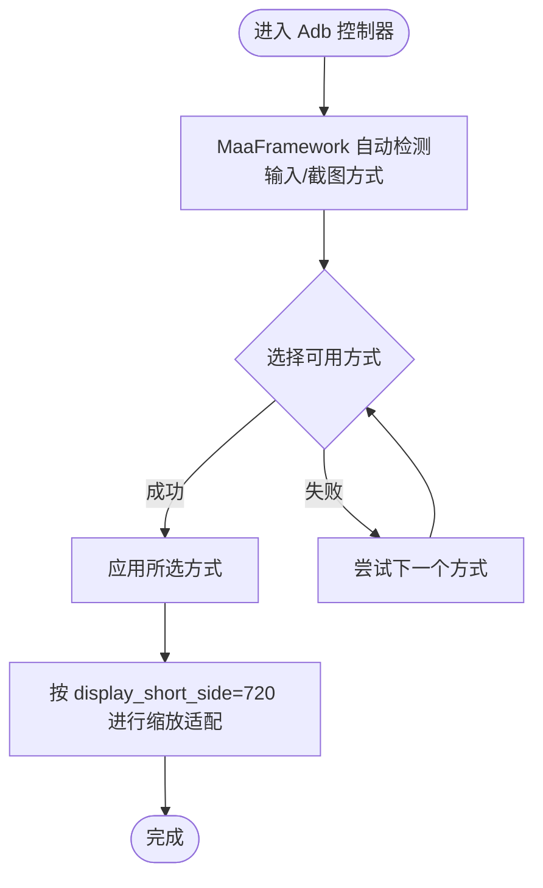
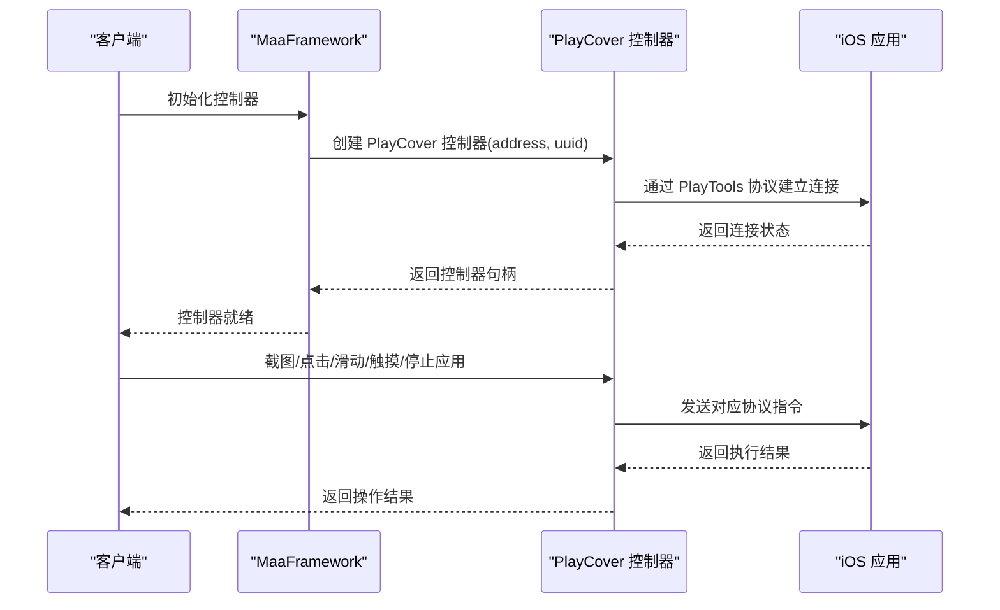
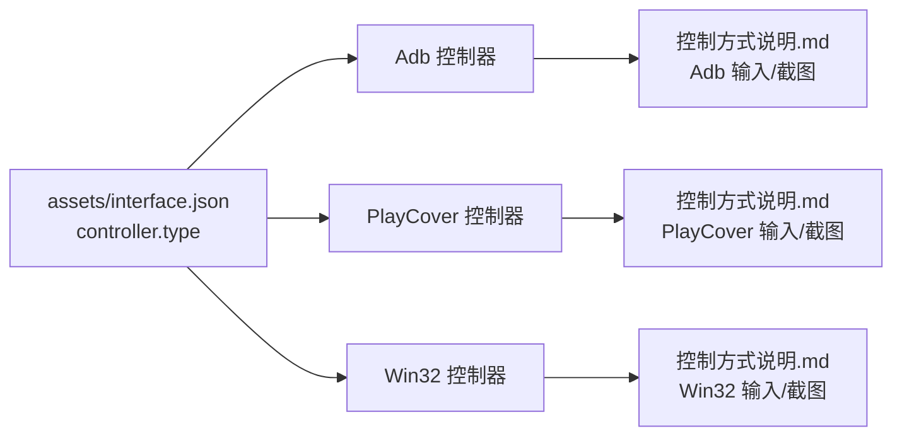

# 控制器配置

<cite>
**本文引用的文件**
- [assets/interface.json](file://assets/interface.json)
- [ProjectInterfaceV2协议.md](file://instructions/maafw-guide/3.3-ProjectInterfaceV2协议.md)
- [控制方式说明.md](file://instructions/maafw-guide/2.4-控制方式说明.md)
- [集成接口一览.md](file://instructions/maafw-guide/2.2-集成接口一览.md)
</cite>

## 目录
1. [简介](#简介)
2. [项目结构](#项目结构)
3. [核心组件](#核心组件)
4. [架构总览](#架构总览)
5. [详细组件分析](#详细组件分析)
6. [依赖关系分析](#依赖关系分析)
7. [性能考量](#性能考量)
8. [故障排查指南](#故障排查指南)
9. [结论](#结论)
10. [附录](#附录)

## 简介
本节聚焦 ProjectInterface V2 协议中的控制器配置部分，围绕 assets/interface.json 中的 controller 数组，系统解释 name、type、display_short_side 等字段的含义与配置规则，并结合 MaaDuDuL 项目的实际配置，分析 Adb 类型与 PlayCover 两种控制器的定义、显示分辨率设置及 PlayCover 特有的 uuid 配置。同时对比不同控制器类型（Adb、Win32、PlayCover）的适用场景与技术实现差异，说明 display_short_side 在屏幕适配中的作用，并给出配置最佳实践与常见问题解决方案。

## 项目结构
MaaDuDuL 项目通过 assets/interface.json 定义 ProjectInterface V2 协议，其中 controller 数组包含多种控制器预设。本项目提供了两类控制器：
- Adb 类型：面向 Android 模拟器或真机，通过 ADB 连接。
- PlayCover 类型：面向 macOS 平台，通过 PlayCover 控制 iOS 应用。

图表来源
- [assets/interface.json](file://assets/interface.json#L14-L28)

章节来源
- [assets/interface.json](file://assets/interface.json#L14-L28)

## 核心组件
本节梳理 ProjectInterface V2 协议中控制器配置的核心字段及其语义，便于理解 MaaDuDuL 的实际配置。

- name：控制器唯一名称标识符，用作控制器 ID。
- label：显示名称，用于 UI 展示，支持国际化。
- description：控制器详细描述，支持文件路径、URL 或直接文本，支持国际化。
- icon：控制器图标文件路径，支持国际化。
- type：控制器类型，取值为 Adb、Win32、PlayCover（仅 macOS）。
- display_short_side：默认缩放分辨率的短边长度，用于屏幕适配，可选，默认 720；与 display_long_side、display_raw 互斥。
- display_long_side：默认缩放分辨率的长边长度，用于屏幕适配，可选；与 display_short_side、display_raw 互斥。
- display_raw：是否使用原始分辨率进行截图，不进行缩放，可选，默认 false；与缩放分辨率设置互斥。
- adb：Adb 控制器的具体配置。注意：V2 协议中，Adb 控制器的 input/screencap 由 MaaFramework 自动检测和选择最优方式，无需手动配置。
- win32：Win32 控制器的具体配置，包含 class_regex、window_regex、mouse、keyboard、screencap 等可选字段。
- playcover：PlayCover 控制器的具体配置（仅 macOS），包含 uuid 字段，用于标识目标应用的 Bundle Identifier（仅作为控制器标识符，与被操控应用无关）。

章节来源
- [ProjectInterfaceV2协议.md](file://instructions/maafw-guide/3.3-ProjectInterfaceV2协议.md#L99-L172)

## 架构总览
下图展示了 MaaDuDuL 项目中控制器配置在 ProjectInterface V2 协议中的位置与作用，以及与控制方式说明文档的关系。

图表来源
- [assets/interface.json](file://assets/interface.json#L14-L28)
- [ProjectInterfaceV2协议.md](file://instructions/maafw-guide/3.3-ProjectInterfaceV2协议.md#L99-L172)
- [控制方式说明.md](file://instructions/maafw-guide/2.4-控制方式说明.md#L1-L150)

## 详细组件分析

### Adb 类型控制器（模拟器）
- 配置要点
  - name：模拟器
  - type：Adb
  - display_short_side：720
  - adb：未显式配置，表示使用 MaaFramework 自动检测与选择最优方式
- 适用场景
  - 适用于 Android 模拟器或真机，通过 ADB 连接进行控制与截图。
- 技术实现差异
  - V2 协议中，Adb 控制器的 input/screencap 由 MaaFramework 自动检测和选择最优方式，无需手动配置。
  - Adb 的输入与截图方式具有优先级与兼容性差异，框架会按固定优先级尝试并选择首个可用方式。
- 屏幕适配
  - 通过 display_short_side=720 设置默认缩放分辨率的短边长度，用于屏幕适配。

图表来源
- [ProjectInterfaceV2协议.md](file://instructions/maafw-guide/3.3-ProjectInterfaceV2协议.md#L135-L139)
- [控制方式说明.md](file://instructions/maafw-guide/2.4-控制方式说明.md#L10-L48)

章节来源
- [assets/interface.json](file://assets/interface.json#L14-L28)
- [ProjectInterfaceV2协议.md](file://instructions/maafw-guide/3.3-ProjectInterfaceV2协议.md#L119-L139)
- [控制方式说明.md](file://instructions/maafw-guide/2.4-控制方式说明.md#L10-L48)

### PlayCover 类型控制器（macOS）
- 配置要点
  - name：PlayCover
  - type：PlayCover
  - display_short_side：720
  - playcover.uuid：com.bilibili.trickcalcn（仅作为控制器标识符，与被操控应用无关）
- 适用场景
  - 适用于 macOS 平台，通过 fork 版 PlayCover 控制 iOS 应用。
- 技术实现差异
  - 支持截图、点击、滑动、触摸（单点）、停止应用等操作。
  - 不支持启动应用、按键、文本输入、滚动等操作。
  - 特性标志为使用 touch_down + touch_up 替代 click 操作。
- 屏幕适配
  - 通过 display_short_side=720 设置默认缩放分辨率的短边长度，用于屏幕适配。

图表来源
- [控制方式说明.md](file://instructions/maafw-guide/2.4-控制方式说明.md#L99-L149)
- [集成接口一览.md](file://instructions/maafw-guide/2.2-集成接口一览.md#L257-L268)

章节来源
- [assets/interface.json](file://assets/interface.json#L20-L27)
- [ProjectInterfaceV2协议.md](file://instructions/maafw-guide/3.3-ProjectInterfaceV2协议.md#L165-L172)
- [控制方式说明.md](file://instructions/maafw-guide/2.4-控制方式说明.md#L99-L149)
- [集成接口一览.md](file://instructions/maafw-guide/2.2-集成接口一览.md#L257-L268)

### Win32 类型控制器（补充说明）
- 配置要点
  - 支持通过 class_regex、window_regex、mouse、keyboard、screencap 等字段进行精细配置。
- 适用场景
  - 适用于 Windows 平台的桌面应用控制。
- 技术实现差异
  - Win32 下不同程序处理输入/截图的方式差异较大，不存在通用方式，需根据目标程序选择合适的方式。
- 屏幕适配
  - 通过 display_short_side/display_long_side/display_raw 进行缩放或原始分辨率设置。

章节来源
- [ProjectInterfaceV2协议.md](file://instructions/maafw-guide/3.3-ProjectInterfaceV2协议.md#L141-L163)
- [控制方式说明.md](file://instructions/maafw-guide/2.4-控制方式说明.md#L49-L98)

## 依赖关系分析
控制器配置与控制方式说明文档之间存在强耦合关系，控制器类型决定了可选的输入/截图方式与能力边界。

图表来源
- [assets/interface.json](file://assets/interface.json#L14-L28)
- [控制方式说明.md](file://instructions/maafw-guide/2.4-控制方式说明.md#L1-L150)

章节来源
- [assets/interface.json](file://assets/interface.json#L14-L28)
- [控制方式说明.md](file://instructions/maafw-guide/2.4-控制方式说明.md#L1-L150)

## 性能考量
- Adb 控制器
  - 自动检测与选择最优方式，减少人工配置成本，提升兼容性与稳定性。
  - 截图方式优先选择速度快且兼容性高的方案，避免使用有损编码的方案以保持模板匹配效果。
- PlayCover 控制器
  - 仅支持单点触摸，不支持滚动、按键、文本输入等操作，需在任务设计中规避相关动作。
  - 特性标志表明框架会使用 touch_down + touch_up 替代 click 操作，确保与 iOS 应用交互的一致性。
- Win32 控制器
  - 不同程序的输入/截图方式差异较大，需根据目标程序选择合适的方式，避免窗口最小化导致截图无效。

章节来源
- [控制方式说明.md](file://instructions/maafw-guide/2.4-控制方式说明.md#L10-L48)
- [控制方式说明.md](file://instructions/maafw-guide/2.4-控制方式说明.md#L99-L149)
- [控制方式说明.md](file://instructions/maafw-guide/2.4-控制方式说明.md#L49-L98)

## 故障排查指南
- Adb 控制器
  - 若输入/截图不稳定，确认模拟器或设备的 ADB 驱动与权限设置正确。
  - 避免使用有损编码的截图方式，以免影响模板匹配精度。
- PlayCover 控制器
  - 确认 macOS 上已安装 fork 版 PlayCover，并为目标 iOS 应用启用 MaaTools 功能。
  - 不要期望 PlayCover 支持启动应用、按键、文本输入、滚动等操作，相关动作需在任务设计中规避。
  - 若点击无效，检查是否使用了 touch_down + touch_up 的替代方式。
- Win32 控制器
  - 避免窗口最小化，Windows 在窗口最小化后会停止绘制，导致截图无效。
  - 根据目标程序选择合适的输入/截图方式，必要时调整 mouse/keyboard/screencap 配置。

章节来源
- [控制方式说明.md](file://instructions/maafw-guide/2.4-控制方式说明.md#L95-L98)
- [控制方式说明.md](file://instructions/maafw-guide/2.4-控制方式说明.md#L143-L149)

## 结论
MaaDuDuL 项目通过 ProjectInterface V2 协议清晰地定义了控制器配置，Adb 与 PlayCover 两类控制器分别面向 Android 模拟器与 macOS 平台的 iOS 应用。通过 display_short_side 实现统一的屏幕适配策略，配合各控制器的技术能力边界，能够满足多样化的自动化需求。在实际使用中，应依据目标平台与应用特性选择合适的控制器类型，并遵循各控制器的能力限制与最佳实践。

## 附录
- 配置字段速查
  - name：控制器唯一名称标识符
  - type：控制器类型（Adb、Win32、PlayCover）
  - display_short_side：默认缩放分辨率短边长度（与 display_long_side、display_raw 互斥）
  - display_long_side：默认缩放分辨率长边长度（与 display_short_side、display_raw 互斥）
  - display_raw：是否使用原始分辨率截图（与缩放分辨率设置互斥）
  - adb：Adb 控制器配置（V2 协议中 input/screencap 由框架自动检测）
  - win32：Win32 控制器配置（包含 class_regex、window_regex、mouse、keyboard、screencap）
  - playcover：PlayCover 控制器配置（包含 uuid）

章节来源
- [ProjectInterfaceV2协议.md](file://instructions/maafw-guide/3.3-ProjectInterfaceV2协议.md#L99-L172)