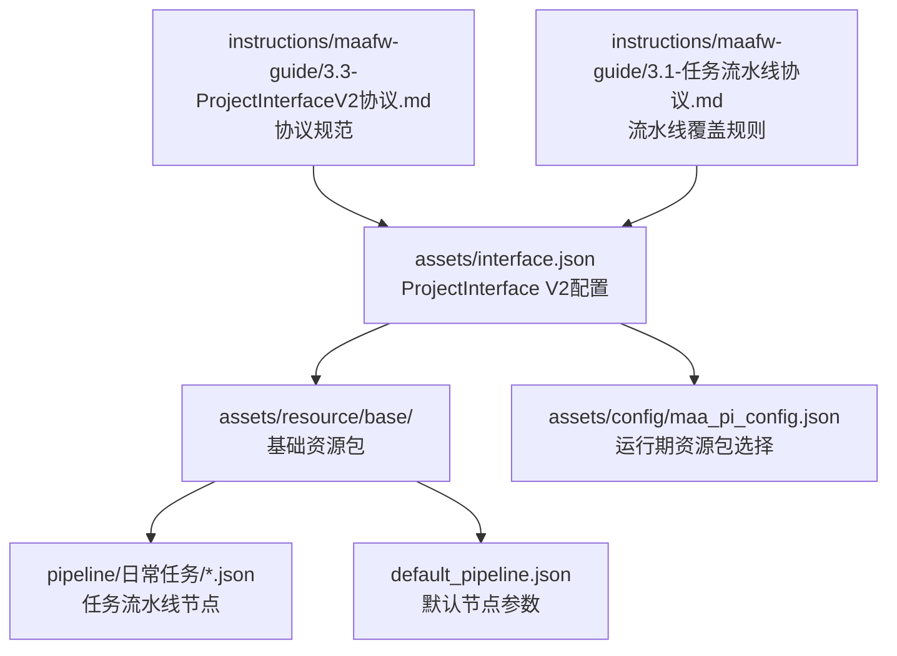
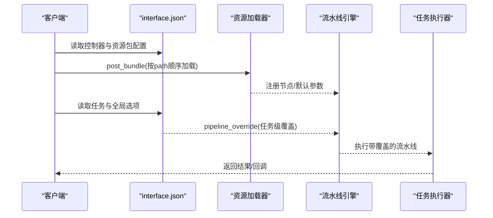
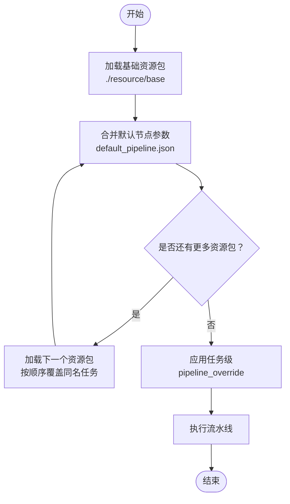
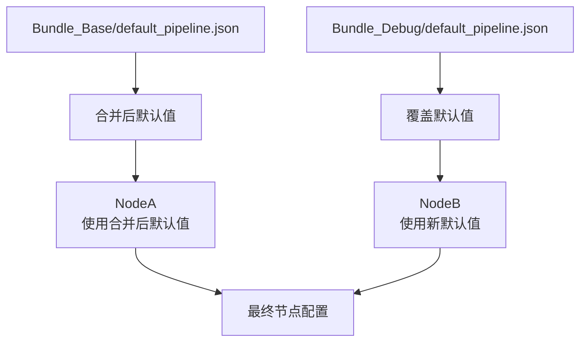
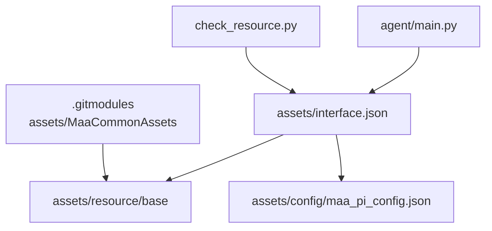

# 资源管理配置

<cite>
**本文档引用的文件**
- [assets/interface.json](file://assets/interface.json)
- [assets/resource/base/default_pipeline.json](file://assets/resource/base/default_pipeline.json)
- [assets/resource/base/pipeline/日常任务/领取邮件.json](file://assets/resource/base/pipeline/日常任务/领取邮件.json)
- [assets/resource/base/pipeline/日常任务/领取糖果.json](file://assets/resource/base/pipeline/日常任务/领取糖果.json)
- [assets/config/maa_pi_config.json](file://assets/config/maa_pi_config.json)
- [instructions/maafw-guide/3.3-ProjectInterfaceV2协议.md](file://instructions/maafw-guide/3.3-ProjectInterfaceV2协议.md)
- [instructions/maafw-guide/3.1-任务流水线协议.md](file://instructions/maafw-guide/3.1-任务流水线协议.md)
- [check_resource.py](file://check_resource.py)
- [agent/main.py](file://agent/main.py)
- [tools/install.py](file://tools/install.py)
- [.gitmodules](file://.gitmodules)
</cite>

## 目录
1. [简介](#简介)
2. [项目结构](#项目结构)
3. [核心组件](#核心组件)
4. [架构总览](#架构总览)
5. [详细组件分析](#详细组件分析)
6. [依赖关系分析](#依赖关系分析)
7. [性能考量](#性能考量)
8. [故障排查指南](#故障排查指南)
9. [结论](#结论)

## 简介
本文件面向MaaDuDuL项目，深入解析ProjectInterface V2协议中的资源管理机制，重点围绕interface.json中的resource数组，系统阐述name、path、controller、option等关键字段的配置方法与作用，结合assets/interface.json中的实例说明MaaDuDuL如何通过path字段指定./resource/base路径加载基础资源包；解释资源覆盖机制（后加载资源覆盖先加载资源中的同名任务）的工作原理；说明controller字段如何实现资源包与特定控制器类型的绑定；解释option字段如何实现全局选项配置；最后给出资源路径组织的最佳实践与性能优化建议。

## 项目结构
MaaDuDuL的资源与配置主要位于assets目录，其中：
- assets/interface.json：ProjectInterface V2协议的主配置文件，定义了项目元信息、控制器、资源包、任务、全局选项等。
- assets/resource：资源包目录，包含基础资源（./resource/base）及说明文档等。
- assets/config：运行期配置，如maa_pi_config.json用于指定当前资源包名称。
- instructions/maafw-guide：官方协议与集成指南文档，明确V2协议规范与资源覆盖行为。

图表来源
- [assets/interface.json](file://assets/interface.json#L1-L163)
- [assets/resource/base/default_pipeline.json](file://assets/resource/base/default_pipeline.json#L1-L7)
- [assets/config/maa_pi_config.json](file://assets/config/maa_pi_config.json#L1-L3)
- [instructions/maafw-guide/3.3-ProjectInterfaceV2协议.md](file://instructions/maafw-guide/3.3-ProjectInterfaceV2协议.md#L173-L225)
- [instructions/maafw-guide/3.1-任务流水线协议.md](file://instructions/maafw-guide/3.1-任务流水线协议.md#L383-L406)

章节来源
- [assets/interface.json](file://assets/interface.json#L1-L163)
- [assets/config/maa_pi_config.json](file://assets/config/maa_pi_config.json#L1-L3)
- [instructions/maafw-guide/3.3-ProjectInterfaceV2协议.md](file://instructions/maafw-guide/3.3-ProjectInterfaceV2协议.md#L173-L225)

## 核心组件
- 资源包数组（resource[]）
  - name：资源包唯一标识符，用作资源包ID。
  - path：资源包路径数组，按顺序加载；后加载的资源会覆盖先加载的同名任务。
  - controller：可选，限定该资源包支持的控制器类型列表。
  - option：可选，资源包的全局选项配置，参与所有任务的pipeline override。
- 任务（task[]）
  - entry：任务入口，对应pipeline中的Task名称。
  - resource：可选，限定该任务支持的资源包列表。
  - pipeline_override：可选，任务级覆盖，执行时叠加于已加载资源。
- 全局选项（option）
  - 通过option键定义，支持select、input、switch等类型，配合pipeline_override实现参数注入与条件分支。

章节来源
- [assets/interface.json](file://assets/interface.json#L29-L34)
- [assets/interface.json](file://assets/interface.json#L39-L163)
- [assets/interface.json](file://assets/interface.json#L164-L1195)
- [instructions/maafw-guide/3.3-ProjectInterfaceV2协议.md](file://instructions/maafw-guide/3.3-ProjectInterfaceV2协议.md#L173-L225)
- [instructions/maafw-guide/3.3-ProjectInterfaceV2协议.md](file://instructions/maafw-guide/3.3-ProjectInterfaceV2协议.md#L254-L322)

## 架构总览
MaaDuDuL通过ProjectInterface V2协议在运行时加载资源包，结合控制器类型与全局选项，动态拼装任务流水线。资源覆盖机制确保后加载的资源包能精确覆盖先前资源包中的同名任务，从而实现按平台/控制器/版本的差异化配置。

图表来源
- [assets/interface.json](file://assets/interface.json#L1-L163)
- [instructions/maafw-guide/3.1-任务流水线协议.md](file://instructions/maafw-guide/3.1-任务流水线协议.md#L383-L406)

## 详细组件分析

### 资源包数组（resource[]）详解
- name与path
  - name用于UI展示与资源包选择；path为资源包路径数组，按顺序加载。
  - 示例中通过"./resource/base"指定基础资源包路径，确保基础任务与默认参数被优先加载。
- controller
  - 通过controller字段限定资源包支持的控制器类型列表，仅在匹配控制器时显示该资源包。
  - 未指定时默认支持所有控制器类型。
- option
  - 通过option字段引用外层option定义，形成全局参数注入，参与所有任务的pipeline override。

图表来源
- [assets/interface.json](file://assets/interface.json#L29-L34)
- [assets/resource/base/default_pipeline.json](file://assets/resource/base/default_pipeline.json#L1-L7)
- [instructions/maafw-guide/3.1-任务流水线协议.md](file://instructions/maafw-guide/3.1-任务流水线协议.md#L383-L406)

章节来源
- [assets/interface.json](file://assets/interface.json#L29-L34)
- [instructions/maafw-guide/3.3-ProjectInterfaceV2协议.md](file://instructions/maafw-guide/3.3-ProjectInterfaceV2协议.md#L173-L225)

### 资源覆盖机制工作原理
- 规则要点
  - 多个资源包按path顺序加载，后加载的资源会覆盖先加载资源中的同名任务。
  - 已加载的节点不会被后续资源包的default_pipeline.json影响；每个节点在首次加载时使用当时合并后的默认值，之后不再变化。
- 实践建议
  - 将通用默认参数放入基础资源包的default_pipeline.json；
  - 将特殊场景（如调试、特定平台）的配置放入独立资源包，置于基础资源包之后加载，以实现精准覆盖。

图表来源
- [instructions/maafw-guide/3.1-任务流水线协议.md](file://instructions/maafw-guide/3.1-任务流水线协议.md#L383-L406)

章节来源
- [instructions/maafw-guide/3.1-任务流水线协议.md](file://instructions/maafw-guide/3.1-任务流水线协议.md#L383-L406)

### controller字段：资源包与控制器类型绑定
- 作用
  - 通过controller字段限定资源包支持的控制器类型列表，仅在匹配控制器时显示该资源包。
  - 未指定时默认支持所有控制器类型。
- 实践
  - 为不同控制器类型（如Adb、Win32、PlayCover）提供专门优化的资源包，提升识别与交互效果。

章节来源
- [assets/interface.json](file://assets/interface.json#L14-L28)
- [assets/interface.json](file://assets/interface.json#L199-L203)
- [instructions/maafw-guide/3.3-ProjectInterfaceV2协议.md](file://instructions/maafw-guide/3.3-ProjectInterfaceV2协议.md#L199-L203)

### option字段：全局选项配置
- 作用
  - 通过option字段引用外层option定义，形成全局参数注入，参与所有任务的pipeline override。
  - 支持switch、select、input等类型，配合pipeline_override实现参数替换与条件分支。
- 实例
  - 在领取邮件/领取糖果等任务中，通过option定义周期检查、开关等参数，实现可配置的流水线行为。

章节来源
- [assets/interface.json](file://assets/interface.json#L164-L1195)
- [assets/resource/base/pipeline/日常任务/领取邮件.json](file://assets/resource/base/pipeline/日常任务/领取邮件.json#L1-L240)
- [assets/resource/base/pipeline/日常任务/领取糖果.json](file://assets/resource/base/pipeline/日常任务/领取糖果.json#L1-L318)

### 任务与资源包的关联
- 任务级资源包限定
  - 通过task[].resource字段限定任务支持的资源包列表，仅在匹配资源包时显示该任务。
- 任务级覆盖
  - 通过task[].pipeline_override在执行时叠加于已加载资源，实现任务级别的参数调整。

章节来源
- [assets/interface.json](file://assets/interface.json#L282-L303)
- [assets/interface.json](file://assets/interface.json#L305-L315)

### 运行期资源包选择
- maa_pi_config.json
  - 通过"resource":"B服"指定当前使用的资源包名称，与interface.json中resource[].name对应。
- 安装脚本
  - tools/install.py在安装时复制资源与interface.json，并根据目标平台修正agent.child_exec路径。

章节来源
- [assets/config/maa_pi_config.json](file://assets/config/maa_pi_config.json#L1-L3)
- [tools/install.py](file://tools/install.py#L51-L80)

## 依赖关系分析
- 外部依赖
  - assets/MaaCommonAssets为Git submodule，提供通用OCR模型等资源，可作为公共资源包被项目引用。
- 内部依赖
  - agent/main.py负责初始化Toolkit与AgentServer，间接依赖interface.json中的agent配置。
  - check_resource.py提供资源包加载验证工具，便于开发调试。

图表来源
- [agent/main.py](file://agent/main.py#L17-L42)
- [check_resource.py](file://check_resource.py#L10-L23)
- [.gitmodules](file://.gitmodules#L1-L3)

章节来源
- [.gitmodules](file://.gitmodules#L1-L3)
- [agent/main.py](file://agent/main.py#L17-L42)
- [check_resource.py](file://check_resource.py#L10-L23)

## 性能考量
- 资源包加载顺序
  - 将通用默认参数放入基础资源包，特殊场景配置放入后续资源包，避免重复覆盖与无效计算。
- 节点默认值稳定性
  - 已加载节点的默认值在首次加载后不再变化，避免后续资源包的default_pipeline.json影响已加载节点，减少运行时开销。
- 资源路径组织
  - 将pipeline、image、model等资源按功能模块划分，避免一次性加载过多无关资源，降低内存占用与初始化时间。
- OCR模型与识别缓存
  - 合理配置OCR模型与识别缓存大小，平衡准确率与性能。

章节来源
- [instructions/maafw-guide/3.1-任务流水线协议.md](file://instructions/maafw-guide/3.1-任务流水线协议.md#L383-L406)

## 故障排查指南
- 资源包加载失败
  - 使用check_resource.py逐个检查资源包路径，确认post_bundle返回状态。
- 覆盖不生效
  - 检查资源包加载顺序与同名任务是否存在；确认pipeline_override语法正确且与任务名匹配。
- 控制器不匹配
  - 确认controller字段与实际控制器类型一致；未指定controller时默认支持所有类型。
- 全局选项未生效
  - 确认option字段引用的键名与外层option定义一致；检查pipeline_override中参数替换占位符是否正确。

章节来源
- [check_resource.py](file://check_resource.py#L10-L23)
- [assets/interface.json](file://assets/interface.json#L164-L1195)

## 结论
MaaDuDuL通过ProjectInterface V2协议实现了灵活的资源管理机制：以resource数组为核心，结合path的顺序加载与controller、option字段的精细化控制，实现了按控制器类型与全局选项定制化的资源包加载；借助资源覆盖机制，后加载资源能够精准覆盖先加载资源中的同名任务，满足多平台、多版本的差异化需求。遵循本文档提供的最佳实践与性能优化建议，可进一步提升资源组织效率与运行性能。