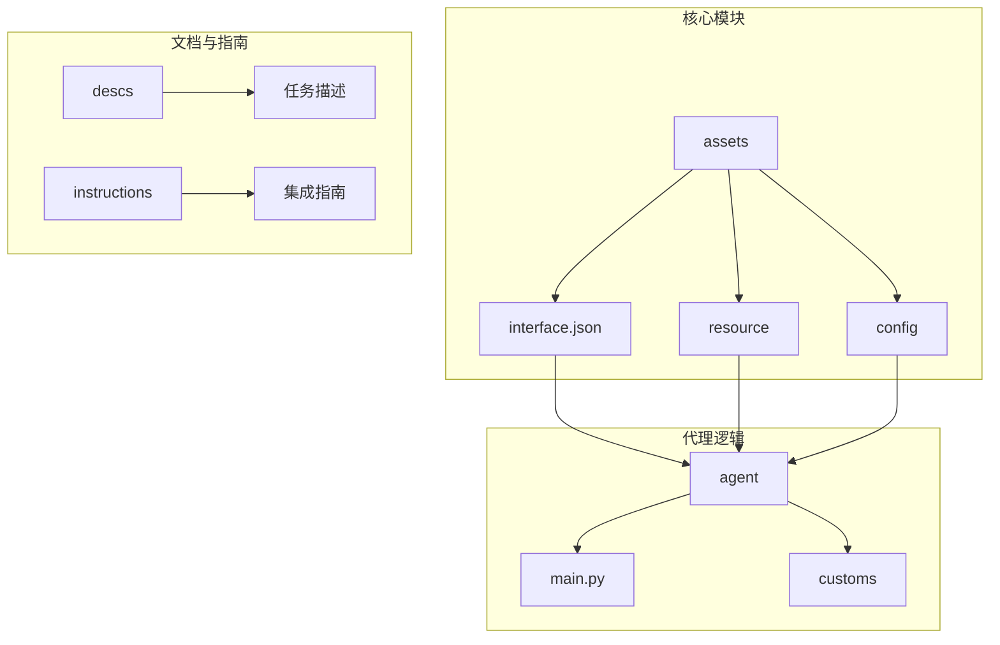
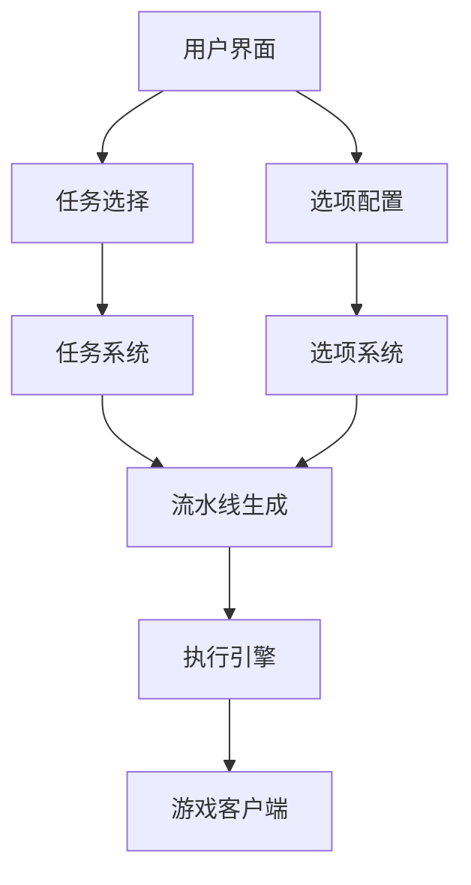
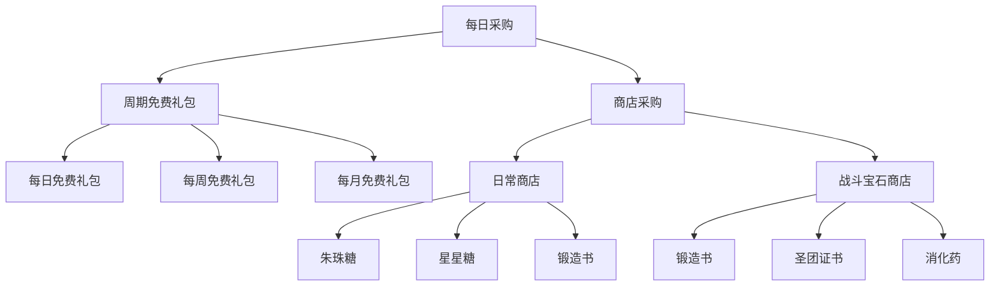
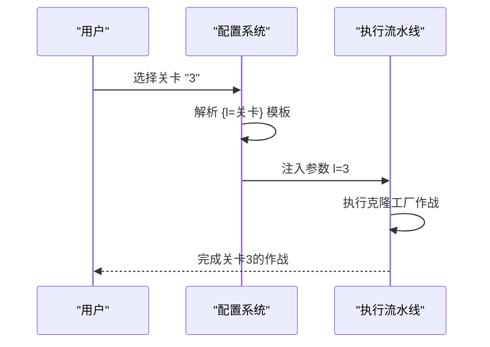
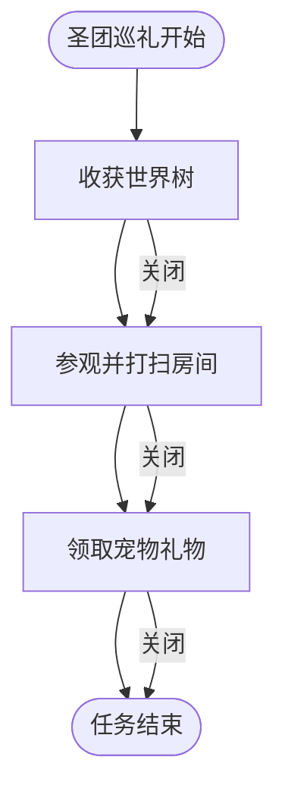
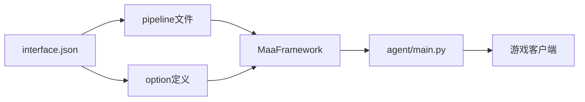

# 选项与任务集成机制

<cite>
**本文档引用的文件**   
- [interface.json](file://assets/interface.json)
- [maa_option.json](file://ci/config/maa_option.json)
- [每日采购.json](file://assets/resource/base/pipeline/日常任务/每日采购.json)
- [清紫糖.json](file://assets/resource/base/pipeline/日常任务/清紫糖.json)
- [圣团巡礼.json](file://assets/resource/base/pipeline/日常任务/圣团巡礼.json)
- [purchase.md](file://descs/daily/purchase.md)
- [default_pipeline.json](file://assets/resource/base/default_pipeline.json)
- [main.py](file://agent/main.py)
- [3.3-ProjectInterfaceV2协议.md](file://instructions/maafw-guide/3.3-ProjectInterfaceV2协议.md)
</cite>

## 目录
1. [简介](#简介)
2. [项目结构](#项目结构)
3. [核心组件](#核心组件)
4. [架构概述](#架构概述)
5. [详细组件分析](#详细组件分析)
6. [依赖分析](#依赖分析)
7. [性能考虑](#性能考虑)
8. [故障排除指南](#故障排除指南)
9. [结论](#结论)
10. [附录](#附录)（如有必要）

## 简介
本文档深入解析MaaDuDuL自动化系统中option系统与task任务的集成机制。该系统通过灵活的配置体系，实现了用户可定制化的任务参数控制，支持从简单开关到复杂树状结构的多层次配置。核心机制包括任务配置中的option字段引用全局option定义、子选项嵌套机制、动态参数传递以及复杂任务的精细化控制。通过分析'每日采购'、'清紫糖'和'圣团巡礼'等具体任务，展示如何构建层级化配置界面和实现动态行为控制。

## 项目结构
项目采用模块化设计，主要分为agent（代理逻辑）、assets（资源与配置）、ci（持续集成）、descs（文档描述）、dev（开发工具）、docsite（文档站点）、instructions（集成指南）、launcher（启动器）和tools（工具脚本）等目录。核心配置文件位于assets目录下，包括interface.json（主接口定义）、resource（任务流水线）和config（选项配置）等子目录。

**图源**
- [interface.json](file://assets/interface.json#L1-L164)
- [main.py](file://agent/main.py#L1-L48)

**本节来源**
- [interface.json](file://assets/interface.json#L1-L164)
- [main.py](file://agent/main.py#L1-L48)

## 核心组件
系统的核心组件包括option配置系统、task任务系统和pipeline流水线执行引擎。option系统定义了用户可配置的参数选项，task系统定义了可执行的任务及其与option的关联关系，pipeline系统则定义了具体的执行流程和动作。三者通过interface.json文件中的option、task和resource字段紧密集成，形成完整的自动化配置体系。

**本节来源**
- [interface.json](file://assets/interface.json#L164-L1196)
- [3.3-ProjectInterfaceV2协议.md](file://instructions/maafw-guide/3.3-ProjectInterfaceV2协议.md#L25-L425)

## 架构概述
系统采用分层架构设计，上层为用户配置界面，中层为任务与选项定义，底层为执行流水线。用户通过界面选择任务和配置选项，系统根据选择的选项动态生成或修改执行流水线，最终由MaaFramework执行引擎按流水线定义执行具体操作。这种设计实现了配置与执行的分离，提高了系统的灵活性和可维护性。

**图源**
- [interface.json](file://assets/interface.json#L164-L1196)
- [3.3-ProjectInterfaceV2协议.md](file://instructions/maafw-guide/3.3-ProjectInterfaceV2协议.md#L25-L425)

## 详细组件分析

### 每日采购任务分析
'每日采购'任务是option系统与task任务集成的典型示例。该任务通过option数组关联'每日采购-周期免费礼包'和'每日采购-商店采购'等子选项，构建了层级化的配置界面。当用户选择'每日采购-商店采购'时，会动态展开'日常商店'、'战斗宝石商店'等二级选项，形成树状配置结构。

**图源**
- [interface.json](file://assets/interface.json#L94-L95)
- [interface.json](file://assets/interface.json#L336-L352)

**本节来源**
- [interface.json](file://assets/interface.json#L94-L95)
- [interface.json](file://assets/interface.json#L336-L352)
- [purchase.md](file://descs/daily/purchase.md#L1-L13)

### 清紫糖任务分析
'清紫糖'任务展示了动态参数传递机制。当用户选择'清紫糖-克隆工厂-选择关卡'选项时，其输入值通过{l=关卡}模板注入到pipeline的custom_action_param中，实现动态参数传递。这种机制支持用户指定具体的关卡编号，使自动化脚本能够灵活适应不同的游戏需求。

**图源**
- [interface.json](file://assets/interface.json#L768-L784)
- [清紫糖.json](file://assets/resource/base/pipeline/日常任务/清紫糖.json#L1-L200)

**本节来源**
- [interface.json](file://assets/interface.json#L768-L784)
- [清紫糖.json](file://assets/resource/base/pipeline/日常任务/清紫糖.json#L1-L200)

### 圣团巡礼任务分析
'圣团巡礼'任务体现了复杂任务的精细化控制能力。该任务包含多个可选子任务，如'收获世界树'、'参观并打扫房间'和'领取宠物礼物'等。每个子任务都可以独立开启或关闭，系统根据用户的选择动态调整执行流程。这种设计使得用户可以根据实际需求灵活配置任务行为，避免不必要的操作。

**图源**
- [interface.json](file://assets/interface.json#L102-L107)
- [圣团巡礼.json](file://assets/resource/base/pipeline/日常任务/圣团巡礼.json#L1-L200)

**本节来源**
- [interface.json](file://assets/interface.json#L102-L107)
- [圣团巡礼.json](file://assets/resource/base/pipeline/日常任务/圣团巡礼.json#L1-L200)

## 依赖分析
系统各组件之间存在明确的依赖关系。interface.json文件是整个系统的配置中心，依赖于具体的pipeline文件定义执行流程，同时依赖于option定义提供用户配置能力。agent/main.py作为主入口，依赖于MaaFramework提供的执行能力，并加载interface.json中的配置来启动服务。

**图源**
- [interface.json](file://assets/interface.json#L1-L1196)
- [main.py](file://agent/main.py#L1-L48)

**本节来源**
- [interface.json](file://assets/interface.json#L1-L1196)
- [main.py](file://agent/main.py#L1-L48)

## 性能考虑
系统在设计时考虑了性能优化。通过default_pipeline.json文件设置默认参数，减少了重复配置，提高了加载效率。同时，采用模块化的pipeline设计，使得不同任务可以复用相同的执行节点，减少了代码冗余。在执行层面，MaaFramework的优化确保了操作的高效性和稳定性。

## 故障排除指南
当遇到配置问题时，首先检查interface.json文件中的option和task定义是否正确关联。确保option的键名与task中引用的名称完全一致。对于动态参数传递失败的情况，检查模板语法是否正确，输入值是否符合验证规则。避免配置循环依赖，确保option的嵌套层级合理，不会导致无限递归。

**本节来源**
- [interface.json](file://assets/interface.json#L164-L1196)
- [3.3-ProjectInterfaceV2协议.md](file://instructions/maafw-guide/3.3-ProjectInterfaceV2协议.md#L25-L425)

## 结论
MaaDuDuL的option系统与task任务集成机制设计精巧，通过灵活的配置体系实现了高度可定制化的自动化功能。该机制不仅支持简单的开关控制，还能构建复杂的树状配置结构，满足不同用户的需求。动态参数传递和精细化控制能力使得系统能够适应各种复杂场景，为用户提供强大的自动化支持。

## 附录
### 配置循环依赖避免原则
1. 避免option的嵌套层级过深，建议不超过3层
2. 确保每个option的cases中引用的子option不会形成闭环
3. 使用清晰的命名规范，便于识别和管理option之间的关系
4. 定期审查配置文件，检查潜在的循环依赖问题