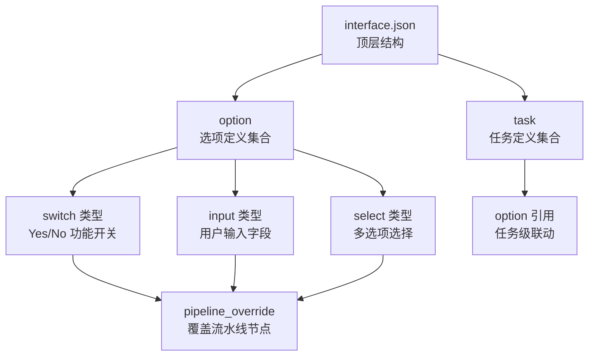
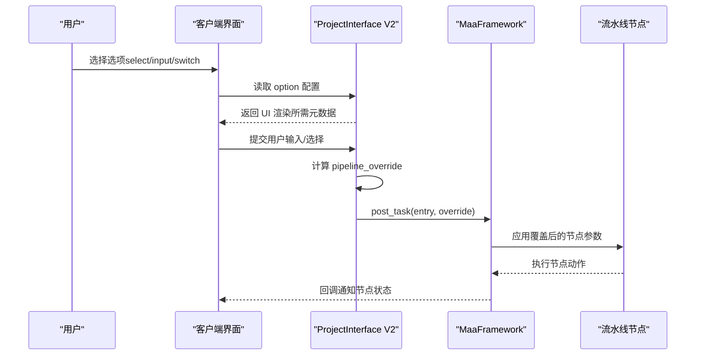
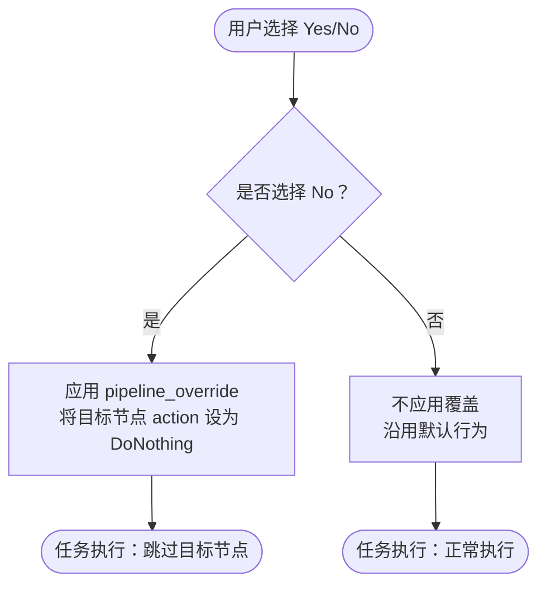
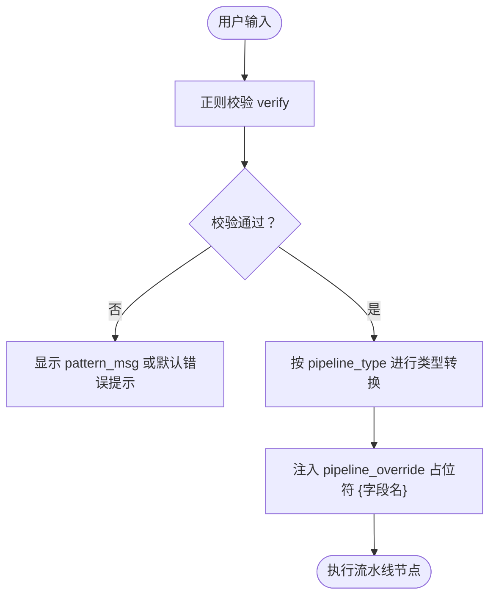
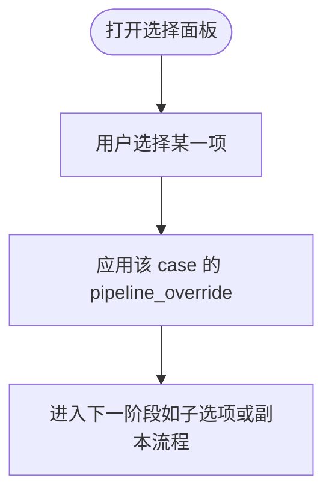
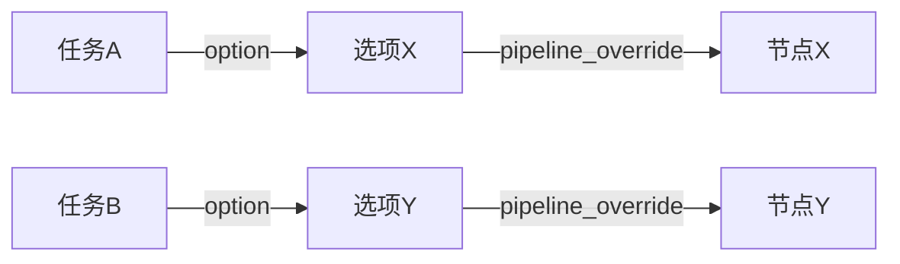

# 选项类型详解

<cite>
**本文档引用的文件**
- [assets/interface.json](file://assets/interface.json)
- [instructions/maafw-guide/3.3-ProjectInterfaceV2协议.md](file://instructions/maafw-guide/3.3-ProjectInterfaceV2协议.md)
- [instructions/maafw-guide/3.1-任务流水线协议.md](file://instructions/maafw-guide/3.1-任务流水线协议.md)
</cite>

## 目录
1. [简介](#简介)
2. [项目结构](#项目结构)
3. [核心组件](#核心组件)
4. [架构总览](#架构总览)
5. [详细组件分析](#详细组件分析)
6. [依赖关系分析](#依赖关系分析)
7. [性能考量](#性能考量)
8. [故障排查指南](#故障排查指南)
9. [结论](#结论)
10. [附录](#附录)

## 简介
本文件系统性地文档化 ProjectInterface V2 协议中支持的三种核心选项类型：select、input、switch。重点围绕以下目标展开：
- 解释每种类型的技术实现机制与用户交互模式
- 结合 assets/interface.json 中的真实配置，深入剖析 switch 类型作为功能开关的工作原理（以“领取邮件-周期检查”为例）
- 以“清紫糖-克隆工厂-选择关卡”为例，详解 input 类型的 inputs 数组字段配置、正则校验与 pipeline_type 的类型转换影响
- 说明 select 类型的多选项选择机制与 default_case 的使用
- 阐述 UI 表现、数据绑定与错误处理策略，并给出配置最佳实践

## 项目结构
本项目通过 interface.json 声明 ProjectInterface V2 协议，option 节点下集中定义了各类选项类型及其行为。关键位置如下：
- 顶层 option 节点：集中定义所有选项
- 任务 task 节点：通过 option 引用 option 键，形成任务级联动
- pipeline_override：在选项激活时动态覆盖流水线节点参数

图表来源
- [assets/interface.json](file://assets/interface.json#L164-L363)
- [assets/interface.json](file://assets/interface.json#L767-L785)
- [assets/interface.json](file://assets/interface.json#L804-L835)

章节来源
- [assets/interface.json](file://assets/interface.json#L164-L363)
- [assets/interface.json](file://assets/interface.json#L767-L785)
- [assets/interface.json](file://assets/interface.json#L804-L835)

## 核心组件
- 选项类型定义
  - type: "select" | "input" | "switch"
  - label/description/icon: UI 展示与说明
  - cases/inputs/default_case: 选项行为与默认值
  - pipeline_override: 选项激活时对流水线的覆盖
- 任务与选项联动
  - task.option: 任务引用的选项键列表
  - 通过选项的 pipeline_override 影响流水线节点的 enabled/next/action 等

章节来源
- [instructions/maafw-guide/3.3-ProjectInterfaceV2协议.md](file://instructions/maafw-guide/3.3-ProjectInterfaceV2协议.md#L331-L426)

## 架构总览
选项类型通过 pipeline_override 与流水线节点建立数据绑定关系，实现“用户选择 -> 流水线覆盖 -> 任务执行”的闭环。

图表来源
- [instructions/maafw-guide/3.3-ProjectInterfaceV2协议.md](file://instructions/maafw-guide/3.3-ProjectInterfaceV2协议.md#L305-L321)
- [instructions/maafw-guide/3.1-任务流水线协议.md](file://instructions/maafw-guide/3.1-任务流水线协议.md#L22-L51)

章节来源
- [instructions/maafw-guide/3.3-ProjectInterfaceV2协议.md](file://instructions/maafw-guide/3.3-ProjectInterfaceV2协议.md#L305-L321)
- [instructions/maafw-guide/3.1-任务流水线协议.md](file://instructions/maafw-guide/3.1-任务流水线协议.md#L22-L51)

## 详细组件分析

### Switch 类型：功能开关与 pipeline_override
- 作用机制
  - 仅支持两个 case：Yes/No
  - 通过 pipeline_override 在“No”分支中将目标节点的 action 设为 DoNothing，从而跳过该节点；在“Yes”分支中保持默认行为
- 实例解析：“领取邮件-周期检查”
  - “No”分支：将“领取邮件_周期检查”节点的 action 设为 DoNothing，实现“跳过执行”
  - “Yes”分支：不覆盖，沿用默认流水线行为
- 数据绑定与覆盖
  - 选项键名与流水线节点名一一对应，通过 pipeline_override 的键名定位节点
  - 可叠加多节点覆盖，实现复杂分支控制

图表来源
- [assets/interface.json](file://assets/interface.json#L166-L182)

章节来源
- [assets/interface.json](file://assets/interface.json#L166-L182)
- [instructions/maafw-guide/3.3-ProjectInterfaceV2协议.md](file://instructions/maafw-guide/3.3-ProjectInterfaceV2协议.md#L354-L361)

### Input 类型：输入字段与类型转换
- 字段说明
  - name：输入字段唯一标识符
  - label/description：UI 展示与说明
  - default：默认值
  - pipeline_type：在 pipeline_override 中的类型（string/int/bool）
  - verify：正则表达式，用于校验输入合法性
  - pattern_msg：校验失败时的提示（可选）
- 实例解析：“清紫糖-克隆工厂-选择关卡”
  - inputs 数组包含一个名为“关卡”的输入字段
  - default 为 "1"
  - pipeline_type 为 "string"
  - verify 使用正则 ^\d+$ 确保输入为有效数字
  - pipeline_override 中通过 {关卡} 占位符将输入注入到自定义动作参数 custom_action_param
- 类型转换影响
  - pipeline_type 决定在流水线中如何处理该占位符
  - 若 pipeline_type 为 int，占位符会被转换为整数；为 string 则保持字符串
  - 若 pipeline_type 为 bool，占位符会被转换为布尔值
- UI 表现与错误处理
  - UI 以输入框呈现，支持默认值与正则校验
  - 校验失败时，pattern_msg（若配置）用于提示；否则由客户端统一错误提示

图表来源
- [assets/interface.json](file://assets/interface.json#L767-L785)
- [instructions/maafw-guide/3.3-ProjectInterfaceV2协议.md](file://instructions/maafw-guide/3.3-ProjectInterfaceV2协议.md#L407-L417)

章节来源
- [assets/interface.json](file://assets/interface.json#L767-L785)
- [instructions/maafw-guide/3.3-ProjectInterfaceV2协议.md](file://instructions/maafw-guide/3.3-ProjectInterfaceV2协议.md#L387-L421)

### Select 类型：多选项与默认值
- 作用机制
  - 支持多个 case，每个 case 可配置 label/description/icon/option/pipeline_override
  - default_case 指定初始选中项（仅 select 类型）
- 实例解析：“清紫糖-副本-选择副本”
  - 三个 case 分别代表不同副本类型
  - 每个 case 可进一步引用子选项（如“到手蜡关卡”、“糖果类型”等）
  - 通过 pipeline_override 设置 next 节点，引导进入不同副本流程
- UI 表现
  - 通常以下拉框或单选按钮呈现
  - 支持图标与描述，增强可读性

图表来源
- [assets/interface.json](file://assets/interface.json#L804-L835)
- [instructions/maafw-guide/3.3-ProjectInterfaceV2协议.md](file://instructions/maafw-guide/3.3-ProjectInterfaceV2协议.md#L423-L425)

章节来源
- [assets/interface.json](file://assets/interface.json#L804-L835)
- [instructions/maafw-guide/3.3-ProjectInterfaceV2协议.md](file://instructions/maafw-guide/3.3-ProjectInterfaceV2协议.md#L323-L336)
- [instructions/maafw-guide/3.3-ProjectInterfaceV2协议.md](file://instructions/maafw-guide/3.3-ProjectInterfaceV2协议.md#L423-L425)

## 依赖关系分析
- 选项与任务的耦合
  - 任务通过 option 引用选项键，形成任务级联动
  - 选项的 pipeline_override 会直接影响任务执行路径
- 选项与流水线的耦合
  - 选项键名与流水线节点名需一致，才能正确覆盖
  - 多个选项可共同影响同一节点，形成复杂的执行图

图表来源
- [assets/interface.json](file://assets/interface.json#L59-L72)
- [assets/interface.json](file://assets/interface.json#L317-L321)

章节来源
- [assets/interface.json](file://assets/interface.json#L59-L72)
- [assets/interface.json](file://assets/interface.json#L317-L321)

## 性能考量
- 选项数量与渲染成本
  - 多层级嵌套选项（option 嵌套）会增加 UI 渲染与内存占用
  - 建议控制嵌套深度，优先扁平化配置
- 正则校验与输入验证
  - verify 正则过于复杂可能导致输入时的性能损耗
  - 建议使用简单高效的正则，必要时在客户端做前端即时校验
- pipeline_override 的覆盖范围
  - 覆盖节点过多会增加流水线执行的判断成本
  - 建议按需覆盖，避免不必要的节点变更

## 故障排查指南
- switch 类型无效
  - 检查 Yes/No 的大小写是否符合协议规范（大小写不敏感，但建议统一使用 Yes/No）
  - 确认 pipeline_override 的节点名与流水线节点名一致
- input 类型校验失败
  - 检查 verify 正则是否正确
  - 确认 pipeline_type 与流水线节点期望类型一致
  - 若 pattern_msg 未配置，确认客户端错误提示是否清晰
- select 类型默认值未生效
  - 确认 default_case 的值与某一个 case 的 name 一致
  - 检查是否被上层选项覆盖

章节来源
- [instructions/maafw-guide/3.3-ProjectInterfaceV2协议.md](file://instructions/maafw-guide/3.3-ProjectInterfaceV2协议.md#L354-L361)
- [instructions/maafw-guide/3.3-ProjectInterfaceV2协议.md](file://instructions/maafw-guide/3.3-ProjectInterfaceV2协议.md#L411-L417)
- [instructions/maafw-guide/3.3-ProjectInterfaceV2协议.md](file://instructions/maafw-guide/3.3-ProjectInterfaceV2协议.md#L423-L425)

## 结论
- switch 类型通过 pipeline_override 的 DoNothing 动作实现“启用/跳过”，适合实现功能开关
- input 类型通过 verify 与 pipeline_type 实现输入校验与类型转换，适合参数化配置
- select 类型通过 default_case 与多级 option 实现复杂流程编排
- 三者通过 pipeline_override 与流水线节点建立强绑定，建议在配置时明确节点名、覆盖范围与类型约束，确保执行稳定与可维护

## 附录
- 最佳实践清单
  - switch
    - 使用 Yes/No 作为 case.name，保持跨客户端一致性
    - 仅在必要时覆盖节点，避免过度耦合
  - input
    - 为 verify 提供清晰的 pattern_msg
    - 严格匹配 pipeline_type 与流水线节点期望类型
    - 为关键输入提供合理 default
  - select
    - 使用 default_case 指定合理初始值
    - 控制嵌套层级，避免 UI 复杂度过高
  - 通用
    - 选项键名与流水线节点名保持一致
    - 在任务层面通过 option 明确依赖关系，便于维护