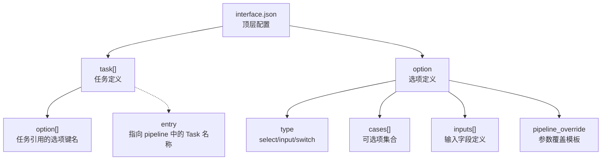
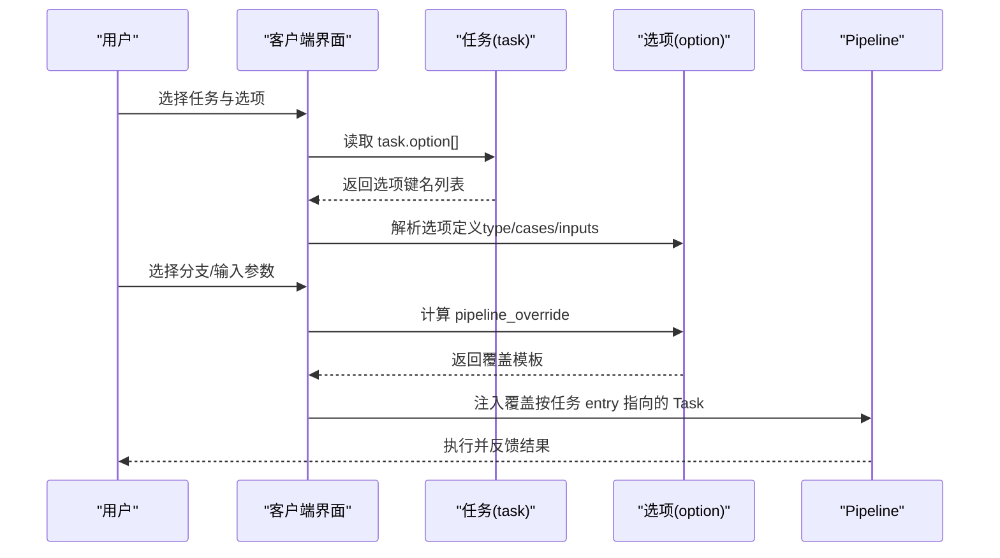
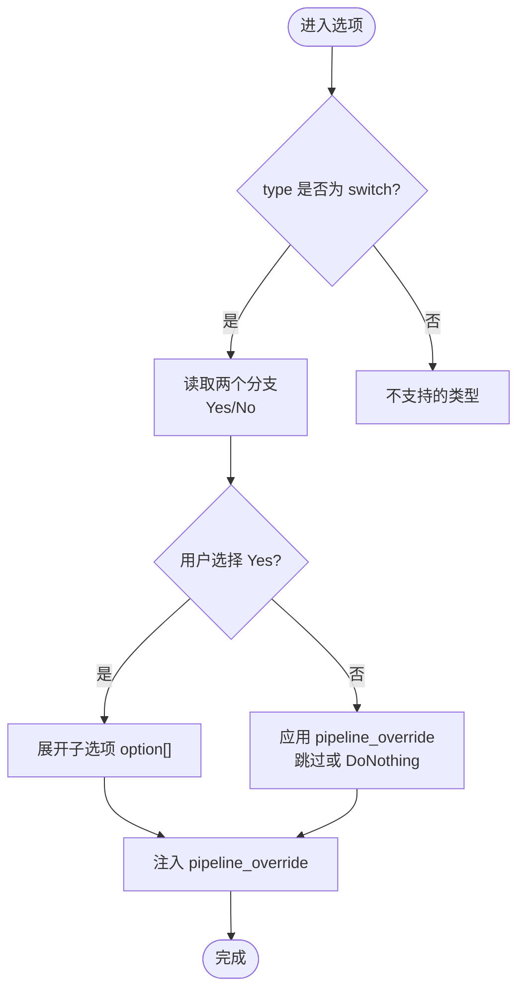
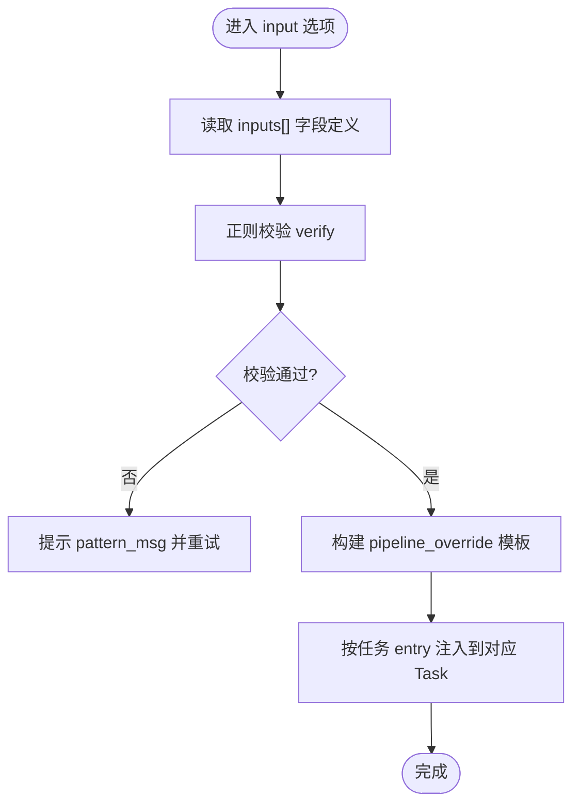
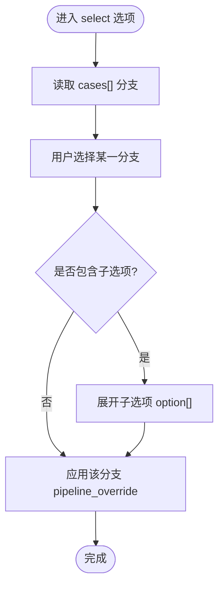
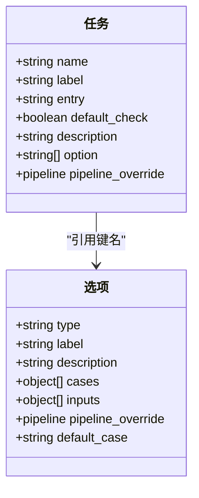
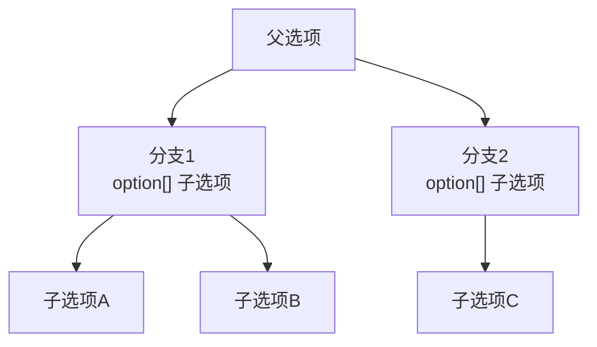

# 选项系统与参数控制

<cite>
**本文引用的文件**
- [assets/interface.json](file://assets/interface.json)
- [instructions/maafw-guide/3.3-ProjectInterfaceV2协议.md](file://instructions/maafw-guide/3.3-ProjectInterfaceV2协议.md)
- [descs/daily/claim_mail.md](file://descs/daily/claim_mail.md)
- [descs/daily/clear_purple_candy.md](file://descs/daily/clear_purple_candy.md)
</cite>

## 目录
1. [简介](#简介)
2. [项目结构](#项目结构)
3. [核心组件](#核心组件)
4. [架构总览](#架构总览)
5. [详细组件分析](#详细组件分析)
6. [依赖关系分析](#依赖关系分析)
7. [性能考量](#性能考量)
8. [故障排查指南](#故障排查指南)
9. [结论](#结论)
10. [附录](#附录)

## 简介
本文件系统化梳理 MaaDuDuL 项目在 ProjectInterface V2 协议下的选项系统（option），围绕 record<string, object> 结构中的 type（select/input/switch）、label、description、cases、inputs、pipeline_override 等核心字段，结合 assets/interface.json 的丰富实例，解释配置方法与交互逻辑，并阐明选项与任务的关联机制、子选项的层级化管理方式。重点案例包括：
- 使用 switch 类型选项实现功能开关（如“领取邮件-周期检查”）
- 使用 input 类型选项实现参数输入（如“清紫糖-克隆工厂-选择关卡”）

## 项目结构
MaaDuDuL 的选项系统主要由以下部分组成：
- 顶层 interface.json：定义项目元信息、控制器、资源、任务与选项
- 任务（task）：通过 option 数组引用选项键名，形成“任务-选项”的绑定
- 选项（option）：定义 type、cases、inputs、pipeline_override 等，支持嵌套子选项
- 描述文件（descs/*.md）：为任务提供说明与界面约束

图表来源
- [assets/interface.json](file://assets/interface.json#L39-L163)
- [assets/interface.json](file://assets/interface.json#L164-L1196)
- [instructions/maafw-guide/3.3-ProjectInterfaceV2协议.md](file://instructions/maafw-guide/3.3-ProjectInterfaceV2协议.md#L254-L322)

章节来源
- [assets/interface.json](file://assets/interface.json#L39-L163)
- [assets/interface.json](file://assets/interface.json#L164-L1196)
- [instructions/maafw-guide/3.3-ProjectInterfaceV2协议.md](file://instructions/maafw-guide/3.3-ProjectInterfaceV2协议.md#L254-L322)

## 核心组件
- 选项类型（type）
  - select：下拉选择，适合多分支场景
  - input：用户输入，支持多字段与校验
  - switch：二选一（Yes/No），用于功能开关
- 选项元信息（label、description、icon）
  - label：显示标签
  - description：详细说明，支持文件路径或直接文本
  - icon：图标文件路径
- 选项分支（cases）
  - name：分支标识
  - label/description/icon：分支元信息
  - option[]：子选项键名（支持无限嵌套）
  - pipeline_override：激活该分支时生效的 pipeline 覆盖
- 输入字段（inputs）
  - name：输入字段标识
  - label/description：字段元信息
  - default：默认值
  - pipeline_type：在 pipeline_override 中的类型（string/int/bool）
  - verify：正则校验
  - pattern_msg：校验失败提示
- 参数覆盖（pipeline_override）
  - 适用于 select/input/switch；在激活时注入到 pipeline
  - 支持字符串模板 {字段名} 引用 inputs 值

章节来源
- [instructions/maafw-guide/3.3-ProjectInterfaceV2协议.md](file://instructions/maafw-guide/3.3-ProjectInterfaceV2协议.md#L331-L426)

## 架构总览
选项系统与任务的交互流程如下：
- 任务通过 option 数组声明所需选项键名
- 用户在 UI 中选择选项（或输入参数）
- 选项激活后，其 pipeline_override 注入到对应 pipeline 的 Task
- 若选项包含子选项，UI 展示其 option[] 列表，形成层级化配置

图表来源
- [assets/interface.json](file://assets/interface.json#L39-L163)
- [assets/interface.json](file://assets/interface.json#L164-L1196)
- [instructions/maafw-guide/3.3-ProjectInterfaceV2协议.md](file://instructions/maafw-guide/3.3-ProjectInterfaceV2协议.md#L305-L322)

## 详细组件分析

### 组件A：功能开关（switch 类型）
- 典型任务：领取邮件、领取糖果、每日采购、圣团巡礼、清紫糖、巅峰对决、领取奖励、每日活动作战
- 配置要点
  - type: "switch"
  - cases: 严格两个分支（Yes/No），分别对应启用/禁用
  - pipeline_override: 在 No 分支中通过 next/action 跳过或 DoNothing，实现“周期检查”等节流
  - 子选项：Yes 分支可进一步展开更细粒度的配置（如“周期检查”、“对手选择策略”）

图表来源
- [assets/interface.json](file://assets/interface.json#L164-L201)
- [assets/interface.json](file://assets/interface.json#L204-L370)
- [assets/interface.json](file://assets/interface.json#L371-L551)
- [assets/interface.json](file://assets/interface.json#L552-L746)
- [assets/interface.json](file://assets/interface.json#L747-L945)
- [assets/interface.json](file://assets/interface.json#L946-L1141)
- [assets/interface.json](file://assets/interface.json#L1142-L1196)

章节来源
- [assets/interface.json](file://assets/interface.json#L164-L201)
- [assets/interface.json](file://assets/interface.json#L204-L370)
- [assets/interface.json](file://assets/interface.json#L371-L551)
- [assets/interface.json](file://assets/interface.json#L552-L746)
- [assets/interface.json](file://assets/interface.json#L747-L945)
- [assets/interface.json](file://assets/interface.json#L946-L1141)
- [assets/interface.json](file://assets/interface.json#L1142-L1196)

### 组件B：参数输入（input 类型）
- 典型任务：清紫糖-克隆工厂-选择关卡、清紫糖-副本-各类关卡、每日活动作战-指定作战次数
- 配置要点
  - type: "input"
  - inputs[]：定义字段（name、label、default、pipeline_type、verify）
  - pipeline_override：使用 {字段名} 模板注入到对应 Task 的参数中
  - 适用场景：关卡编号、次数、预期类型等数值/字符串参数

图表来源
- [assets/interface.json](file://assets/interface.json#L747-L785)
- [assets/interface.json](file://assets/interface.json#L804-L836)
- [assets/interface.json](file://assets/interface.json#L837-L945)
- [assets/interface.json](file://assets/interface.json#L1161-L1192)

章节来源
- [assets/interface.json](file://assets/interface.json#L747-L785)
- [assets/interface.json](file://assets/interface.json#L804-L836)
- [assets/interface.json](file://assets/interface.json#L837-L945)
- [assets/interface.json](file://assets/interface/json#L1161-L1192)

### 组件C：下拉选择（select 类型）
- 典型任务：清紫糖-副本-选择副本、领取奖励-通行证奖励-等级/便装/冒险
- 配置要点
  - type: "select"
  - cases[]：多分支，每个分支可带子选项与 pipeline_override
  - 适用场景：多策略/多副本/多奖励类型切换

图表来源
- [assets/interface.json](file://assets/interface.json#L804-L836)
- [assets/interface.json](file://assets/interface.json#L1055-L1141)

章节来源
- [assets/interface.json](file://assets/interface.json#L804-L836)
- [assets/interface.json](file://assets/interface.json#L1055-L1141)

### 组件D：任务与选项的关联机制
- 任务定义中的 option[] 按顺序声明所需选项键名
- UI 依据任务的 option[] 顺序渲染选项
- 选项激活后，其 pipeline_override 作用于任务 entry 指向的 Task

图表来源
- [assets/interface.json](file://assets/interface.json#L39-L163)
- [assets/interface.json](file://assets/interface.json#L164-L1196)
- [instructions/maafw-guide/3.3-ProjectInterfaceV2协议.md](file://instructions/maafw-guide/3.3-ProjectInterfaceV2协议.md#L317-L322)

章节来源
- [assets/interface.json](file://assets/interface.json#L39-L163)
- [assets/interface.json](file://assets/interface.json#L164-L1196)
- [instructions/maafw-guide/3.3-ProjectInterfaceV2协议.md](file://instructions/maafw-guide/3.3-ProjectInterfaceV2协议.md#L317-L322)

### 组件E：子选项的层级化管理
- 选项的 cases[].option[] 与 option[] 内部的键名共同构成层级化配置树
- UI 仅在用户选中某分支后，才展开其子选项
- 支持无限嵌套，便于复杂任务的模块化配置

图表来源
- [assets/interface.json](file://assets/interface.json#L204-L221)
- [assets/interface.json](file://assets/interface.json#L371-L382)
- [assets/interface.json](file://assets/interface.json#L552-L568)
- [assets/interface.json](file://assets/interface.json#L747-L765)

章节来源
- [assets/interface.json](file://assets/interface.json#L204-L221)
- [assets/interface.json](file://assets/interface.json#L371-L382)
- [assets/interface.json](file://assets/interface.json#L552-L568)
- [assets/interface.json](file://assets/interface.json#L747-L765)

## 依赖关系分析
- 任务依赖选项：任务通过 option[] 引用选项键名
- 选项依赖 pipeline：选项的 pipeline_override 作用于任务 entry 指向的 Task
- 选项依赖子选项：cases[].option[] 与 option[] 内部键名共同构成配置树
- 描述文件依赖任务：descs/*.md 为任务提供说明与界面约束

图表来源
- [assets/interface.json](file://assets/interface.json#L39-L163)
- [assets/interface.json](file://assets/interface.json#L164-L1196)
- [descs/daily/claim_mail.md](file://descs/daily/claim_mail.md#L1-L13)
- [descs/daily/clear_purple_candy.md](file://descs/daily/clear_purple_candy.md#L1-L15)

章节来源
- [assets/interface.json](file://assets/interface.json#L39-L163)
- [assets/interface.json](file://assets/interface.json#L164-L1196)
- [descs/daily/claim_mail.md](file://descs/daily/claim_mail.md#L1-L13)
- [descs/daily/clear_purple_candy.md](file://descs/daily/clear_purple_candy.md#L1-L15)

## 性能考量
- 选项数量与层级深度会影响 UI 渲染与用户交互体验，建议：
  - 控制单任务选项数量，避免过度嵌套
  - 对高频选项采用 switch 类型，减少输入成本
  - 对输入字段设置合理的 verify 与 default，降低用户出错率
- pipeline_override 的注入发生在任务执行前，尽量保持模板简洁，避免复杂字符串拼接

## 故障排查指南
- 选项未生效
  - 检查任务的 option[] 是否包含该选项键名
  - 检查选项的 pipeline_override 是否与任务 entry 指向的 Task 名称一致
- 输入校验失败
  - 检查 inputs[].verify 的正则表达式是否正确
  - 检查 pattern_msg 是否明确提示错误原因
- 子选项未显示
  - 检查父选项的 cases[].option[] 是否正确配置
  - 确认用户已选择该分支

章节来源
- [instructions/maafw-guide/3.3-ProjectInterfaceV2协议.md](file://instructions/maafw-guide/3.3-ProjectInterfaceV2协议.md#L387-L418)
- [assets/interface.json](file://assets/interface.json#L164-L1196)

## 结论
MaaDuDuL 的选项系统通过 ProjectInterface V2 协议实现了灵活而强大的参数控制能力：
- switch 类型用于功能开关与节流控制
- input 类型用于参数输入与类型转换
- select 类型用于多策略/多副本/多奖励类型切换
- 通过 pipeline_override 实现选项与 pipeline 的无缝对接
- 通过子选项实现配置的层级化管理，满足复杂任务的模块化需求

## 附录
- 任务与选项的典型映射
  - 领取邮件：option["领取邮件-周期检查"]
  - 清紫糖：option["清紫糖-克隆工厂", "清紫糖-副本"]
  - 每日活动作战：option["每日活动作战-周期检查", "每日活动作战-指定作战次数"]

章节来源
- [assets/interface.json](file://assets/interface.json#L66-L138)
- [assets/interface.json](file://assets/interface.json#L110-L123)
- [assets/interface.json](file://assets/interface.json#L133-L137)