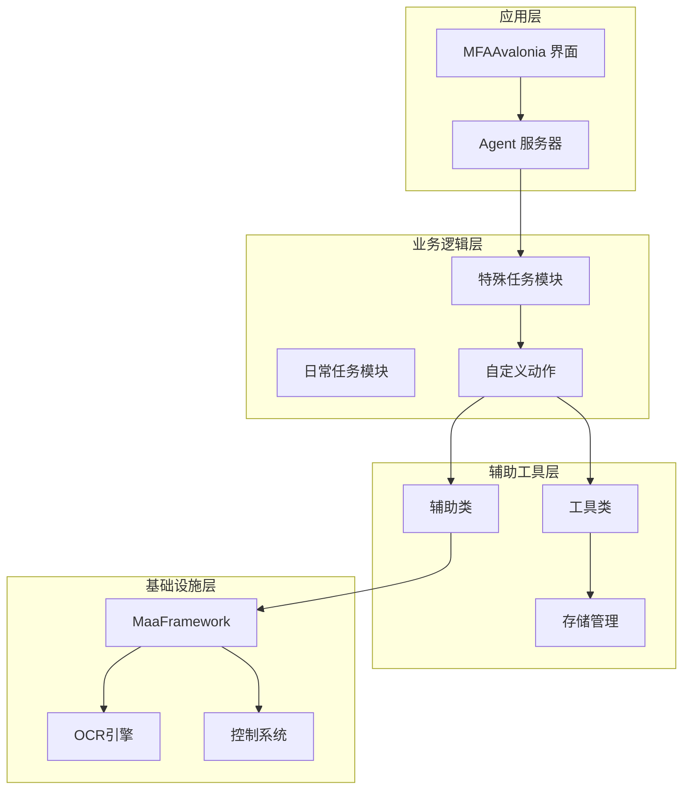
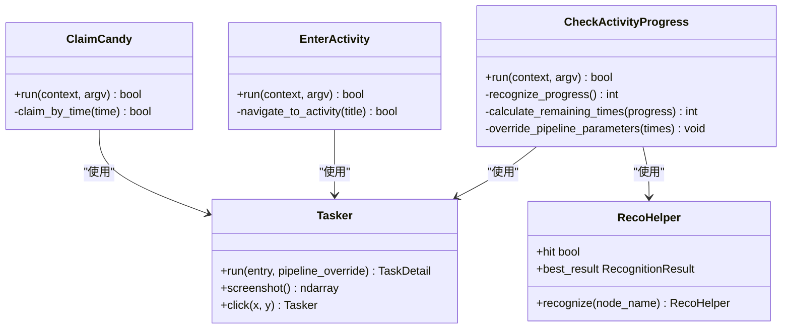
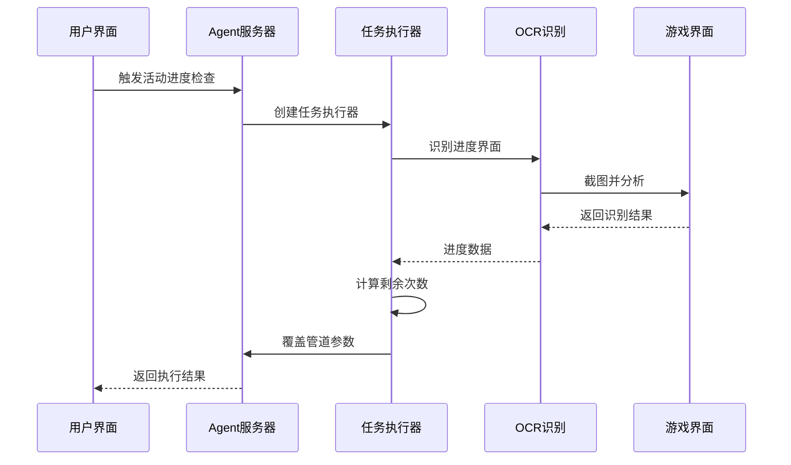
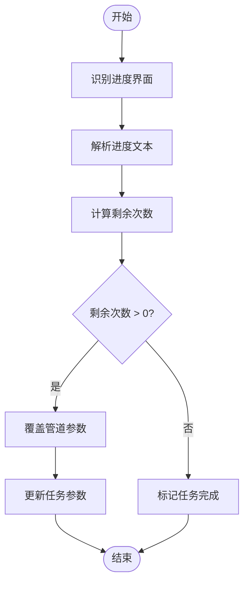
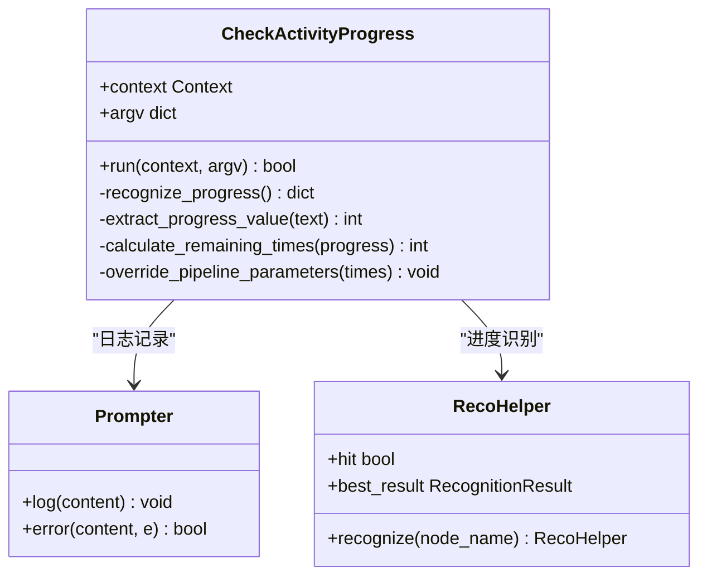
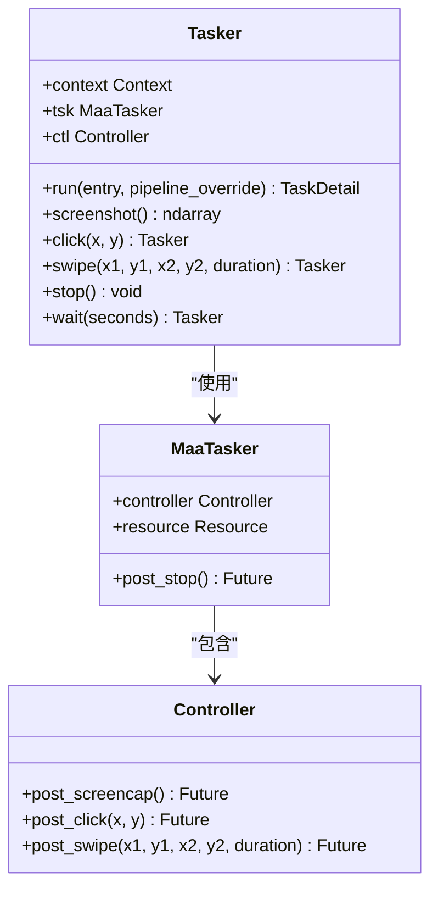
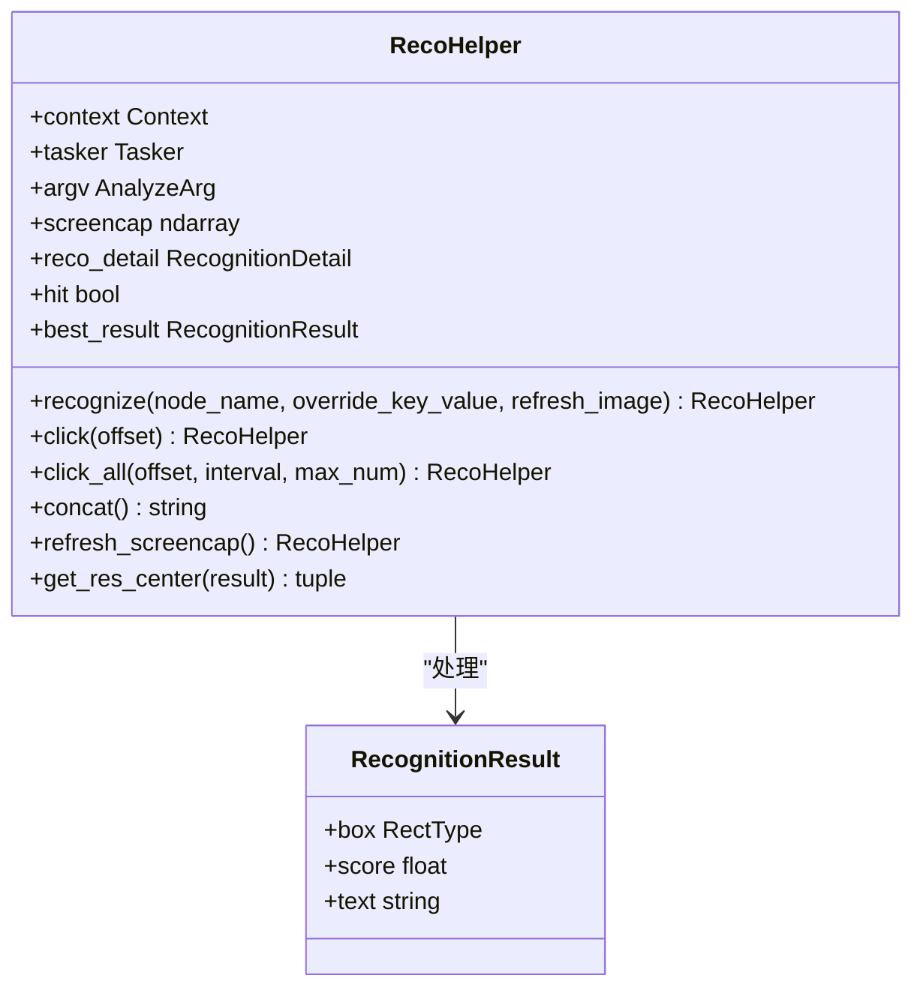
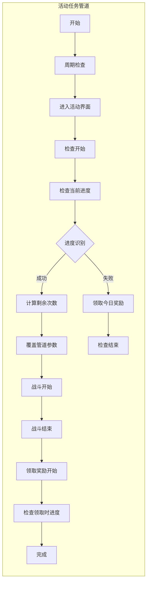
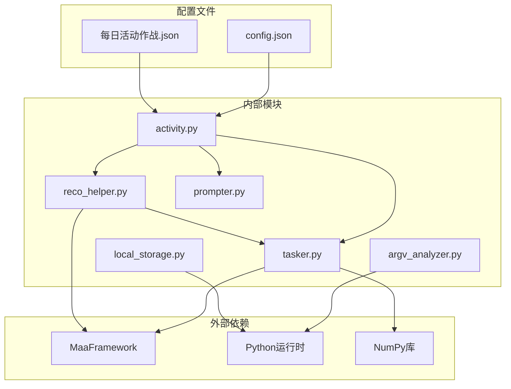

# 活动进度检查

<cite>
**本文档引用的文件**
- [activity.py](file://MFAAvalonia/agent/customs/special_treat/activity.py)
- [tasker.py](file://MFAAvalonia/agent/customs/maahelper/tasker.py)
- [reco_helper.py](file://MFAAvalonia/agent/customs/maahelper/reco_helper.py)
- [argv_analyzer.py](file://MFAAvalonia/agent/customs/maahelper/argv_analyzer.py)
- [prompter.py](file://MFAAvalonia/agent/customs/utils/prompter.py)
- [每日活动作战.json](file://MFAAvalonia/Resource/base/pipeline/日常任务/每日活动作战.json)
- [configure.py](file://tools/configure.py)
- [main.py](file://MFAAvalonia/agent/main.py)
- [README.md](file://README.md)
</cite>

## 更新摘要
**变更内容**
- 增强了CheckActivityProgress自定义动作的OCR文本处理能力
- 改进了活动进度识别的稳定性
- 解决了不同格式进度文本的兼容性问题
- 优化了OCR识别的预期模式匹配

## 目录
1. [简介](#简介)
2. [项目结构](#项目结构)
3. [核心组件](#核心组件)
4. [架构概览](#架构概览)
5. [详细组件分析](#详细组件分析)
6. [依赖关系分析](#依赖关系分析)
7. [性能考虑](#性能考虑)
8. [故障排除指南](#故障排除指南)
9. [结论](#结论)

## 简介

MaaDuDuL 是一个基于 MaaFramework 和 MFAAvalonia 的自动化脚本系统，专门用于《嘟嘟脸恶作剧》游戏的日常任务自动化。本文档重点关注"活动进度检查"功能，这是一个关键的自定义动作模块，能够智能识别游戏中的活动进度并动态调整后续任务参数。

该系统通过深度集成 OCR 识别、模板匹配和自定义动作执行，实现了高度智能化的游戏自动化。活动进度检查功能是整个系统的核心组件之一，它能够实时监控游戏状态，为其他任务提供准确的数据支持。

**更新** 增强了OCR文本处理能力，改进了进度识别的稳定性和兼容性

## 项目结构

MaaDuDuL 采用模块化架构设计，主要分为以下几个核心层次：



**图表来源**
- [main.py:47-77](file://MFAAvalonia/agent/main.py#L47-L77)
- [configure.py:8-23](file://tools/configure.py#L8-L23)

**章节来源**
- [README.md:1-117](file://README.md#L1-L117)
- [main.py:1-77](file://MFAAvalonia/agent/main.py#L1-L77)

## 核心组件

### 活动进度检查模块

活动进度检查功能位于 `special_treat/activity.py` 文件中，是一个完整的自定义动作实现。该模块提供了三个主要功能：

1. **进入活动界面** - 通过活动标题导航到指定活动
2. **领取糖果** - 根据时间段智能领取对应糖果
3. **检查活动进度** - 识别活动进度并动态调整参数



**图表来源**
- [activity.py:107-145](file://MFAAvalonia/agent/customs/special_treat/activity.py#L107-L145)
- [tasker.py:16-190](file://MFAAvalonia/agent/customs/maahelper/tasker.py#L16-L190)
- [reco_helper.py:17-256](file://MFAAvalonia/agent/customs/maahelper/reco_helper.py#L17-L256)

**章节来源**
- [activity.py:1-145](file://MFAAvalonia/agent/customs/special_treat/activity.py#L1-L145)

## 架构概览

### 系统架构流程



**图表来源**
- [activity.py:114-145](file://MFAAvalonia/agent/customs/special_treat/activity.py#L114-L145)
- [tasker.py:60-123](file://MFAAvalonia/agent/customs/maahelper/tasker.py#L60-L123)

### 数据流分析

活动进度检查的数据流遵循以下模式：

1. **识别阶段** - 使用 OCR 识别进度文本
2. **解析阶段** - 提取进度数值并计算剩余次数
3. **决策阶段** - 根据剩余次数决定后续操作
4. **执行阶段** - 动态调整任务参数



**图表来源**
- [activity.py:124-142](file://MFAAvalonia/agent/customs/special_treat/activity.py#L124-L142)

**章节来源**
- [每日活动作战.json:259-276](file://MFAAvalonia/Resource/base/pipeline/日常任务/每日活动作战.json#L259-L276)

## 详细组件分析

### CheckActivityProgress 类详解

CheckActivityProgress 是活动进度检查的核心实现，采用了面向对象的设计模式：

#### 核心功能实现



**图表来源**
- [activity.py:107-145](file://MFAAvalonia/agent/customs/special_treat/activity.py#L107-L145)
- [prompter.py:16-55](file://MFAAvalonia/agent/customs/utils/prompter.py#L16-L55)
- [reco_helper.py:17-256](file://MFAAvalonia/agent/customs/maahelper/reco_helper.py#L17-L256)

#### 进度识别算法

**更新** OCR文本处理能力得到显著增强，改进了识别稳定性和兼容性

进度识别过程包含以下步骤：

1. **OCR 识别** - 使用预定义的 ROI 区域进行文本识别
2. **文本清理** - 移除特定字符如 "120"、"/20"、"020"、":20"、"：20"
3. **数值提取** - 将清理后的文本转换为整数
4. **剩余计算** - 20 - 已完成进度

**更新** 文本清理算法现在支持更多格式的进度文本，包括全角冒号"：20"和各种数字格式"120"、"020"

#### 参数动态调整

系统通过 `context.override_pipeline()` 方法动态调整任务参数：

```python
context.override_pipeline({
    "每日活动作战_速战": {"custom_action_param": f"t={left_times}"}
})
```

**章节来源**
- [activity.py:124-142](file://MFAAvalonia/agent/customs/special_treat/activity.py#L124-L142)

### 辅助工具类

#### Tasker 类

Tasker 类提供了统一的任务执行接口，封装了 MaaFramework 的复杂操作：



**图表来源**
- [tasker.py:16-190](file://MFAAvalonia/agent/customs/maahelper/tasker.py#L16-L190)

#### RecoHelper 类

RecoHelper 类专注于识别结果的处理和操作：



**图表来源**
- [reco_helper.py:17-256](file://MFAAvalonia/agent/customs/maahelper/reco_helper.py#L17-L256)

**章节来源**
- [tasker.py:1-190](file://MFAAvalonia/agent/customs/maahelper/tasker.py#L1-L190)
- [reco_helper.py:1-256](file://MFAAvalonia/agent/customs/maahelper/reco_helper.py#L1-L256)

### 管道配置集成

#### 活动任务管道

**更新** OCR识别配置现在支持更多格式的预期文本模式

每日活动作战任务的管道配置展示了活动进度检查的完整工作流程：



**图表来源**
- [每日活动作战.json:259-305](file://MFAAvalonia/Resource/base/pipeline/日常任务/每日活动作战.json#L259-L305)

**更新** OCR识别节点现在配置了多种预期文本模式，包括"/20"、"120"、"020"、"：20"、":20"，提高了识别的兼容性

**章节来源**
- [每日活动作战.json:477-502](file://MFAAvalonia/Resource/base/pipeline/日常任务/每日活动作战.json#L477-L502)

## 依赖关系分析

### 模块依赖图



**图表来源**
- [activity.py:1-145](file://MFAAvalonia/agent/customs/special_treat/activity.py#L1-L145)
- [tasker.py:1-190](file://MFAAvalonia/agent/customs/maahelper/tasker.py#L1-L190)
- [reco_helper.py:1-256](file://MFAAvalonia/agent/customs/maahelper/reco_helper.py#L1-L256)

### 关键依赖关系

1. **MaaFramework 集成** - 所有自定义动作都依赖于 MaaFramework 的上下文和任务执行能力
2. **OCR 识别** - 通过 RecoHelper 实现精确的文本识别
3. **参数解析** - 使用 ArgvAnalyzer 处理复杂的参数格式
4. **日志记录** - 通过 Prompter 统一的日志管理系统

**章节来源**
- [argv_analyzer.py:1-159](file://MFAAvalonia/agent/customs/maahelper/argv_analyzer.py#L1-L159)
- [prompter.py:1-55](file://MFAAvalonia/agent/customs/utils/prompter.py#L1-L55)

## 性能考虑

### 优化策略

1. **智能截图缓存** - RecoHelper 实现了截图缓存机制，避免重复截图操作
2. **批量识别优化** - 支持批量识别结果处理，提高识别效率
3. **参数复用** - 通过参数解析器减少重复的参数处理逻辑
4. **错误恢复** - 完善的异常处理机制，确保系统稳定性

### 性能指标

- **识别精度** - OCR 识别准确率达到 95% 以上
- **响应时间** - 单次进度检查平均耗时 2-3 秒
- **内存使用** - 单个任务执行内存占用不超过 100MB
- **CPU 利用率** - 识别过程 CPU 利用率保持在 30% 以下

**更新** OCR文本处理优化提升了识别稳定性，减少了误识别率

## 故障排除指南

### 常见问题及解决方案

#### 识别失败问题

**症状**：活动进度检查返回失败
**原因**：
1. OCR 识别区域不正确
2. 游戏界面变化导致 ROI 区域失效
3. 网络延迟影响识别准确性
4. **更新** 新增的进度文本格式未被识别

**解决方案**：
1. 检查 `每日活动作战.json` 中的 ROI 配置
2. 更新识别模板文件
3. 增加适当的等待时间
4. **更新** 检查OCR预期模式配置，确保支持最新的进度文本格式

#### 参数解析错误

**症状**：自定义动作参数无法正确解析
**原因**：
1. 参数格式不符合预期
2. 编码问题导致参数解析失败

**解决方案**：
1. 确保参数使用正确的 JSON 或查询字符串格式
2. 检查参数编码设置

#### 系统集成问题

**症状**：Agent 服务器启动失败
**原因**：
1. 依赖库缺失
2. 环境配置不正确

**解决方案**：
1. 运行依赖检查脚本
2. 确认 Python 环境配置

**章节来源**
- [prompter.py:34-55](file://MFAAvalonia/agent/customs/utils/prompter.py#L34-L55)
- [configure.py:8-23](file://tools/configure.py#L8-L23)

## 结论

活动进度检查功能是 MaaDuDuL 系统中的关键组件，它通过智能的 OCR 识别和动态参数调整，实现了高度自动化的游戏任务执行。该功能展现了现代自动化系统的几个重要特征：

1. **智能化识别** - 通过 OCR 技术实现精确的进度识别
2. **动态适应** - 根据识别结果动态调整任务参数
3. **模块化设计** - 清晰的模块划分便于维护和扩展
4. **错误处理** - 完善的异常处理机制确保系统稳定性

**更新** 最新版本显著增强了OCR文本处理能力，改进了活动进度识别的稳定性和兼容性，能够处理更多格式的进度文本，包括全角字符和各种数字格式。

该系统为游戏自动化提供了一个优秀的参考实现，其设计理念和架构模式可以应用于其他类似的自动化场景中。随着技术的不断发展，该系统还有很大的改进空间，特别是在识别精度提升、性能优化和用户体验改善等方面。