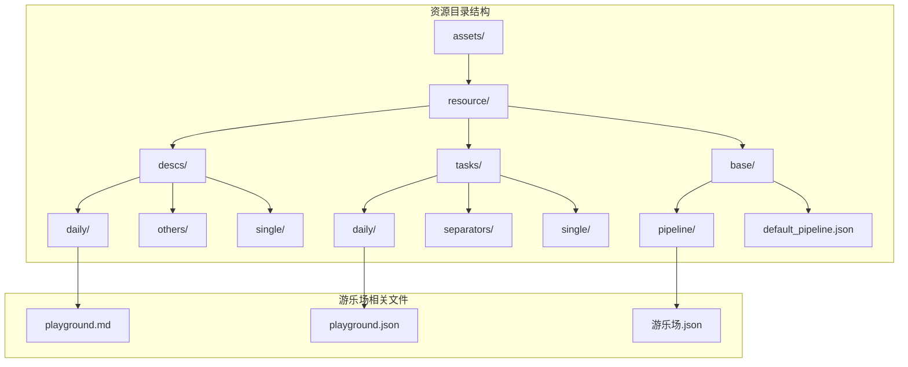
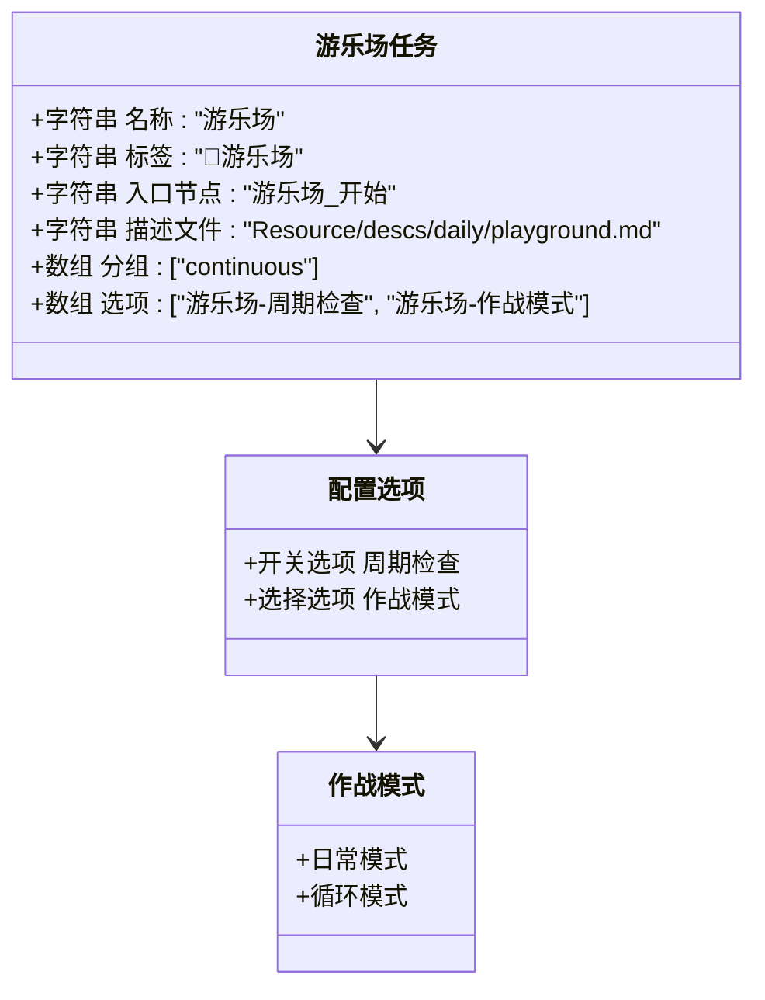
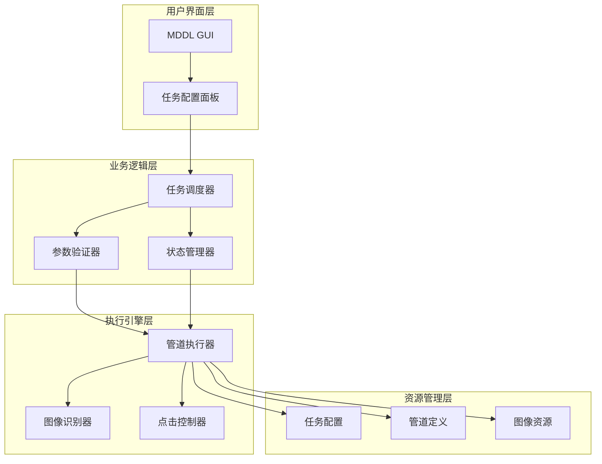
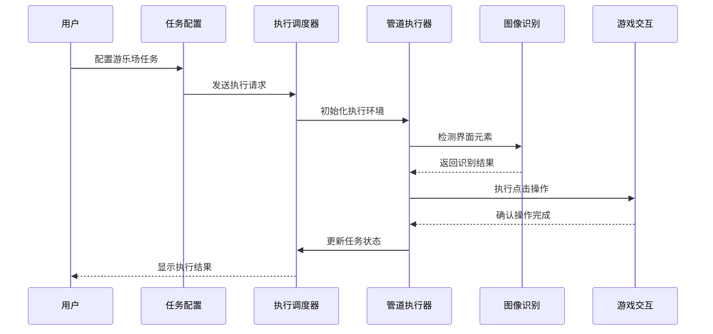
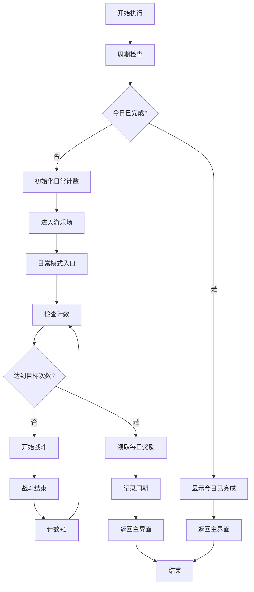
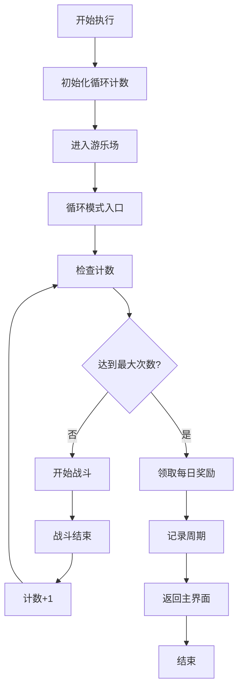
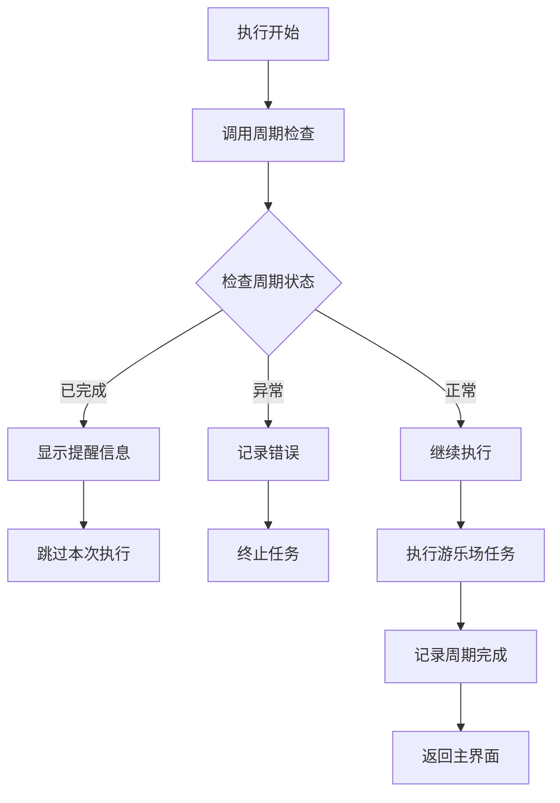

# MaaDuDuL 游乐场任务资源文档

<cite>
**本文档引用的文件**
- [playground.md](file://assets/resource/descs/daily/playground.md)
- [playground.json](file://assets/resource/tasks/daily/playground.json)
- [游乐场.json](file://assets/resource/base/pipeline/日常任务/游乐场.json)
- [default_pipeline.json](file://assets/resource/base/default_pipeline.json)
- [README.md](file://README.md)
</cite>

## 目录
1. [简介](#简介)
2. [项目结构概览](#项目结构概览)
3. [核心组件分析](#核心组件分析)
4. [架构设计](#架构设计)
5. [详细流程分析](#详细流程分析)
6. [配置选项详解](#配置选项详解)
7. [性能与优化](#性能与优化)
8. [故障排除指南](#故障排除指南)
9. [总结](#总结)

## 简介

MaaDuDuL 是一个基于 MaaFramework 和 MFAAvalonia 构建的《嘟嘟脸恶作剧》自动化助手。本文档专注于游乐场日常任务的完整实现方案，包括任务配置、执行流程、参数设置和故障处理机制。

游乐场作为可连续执行的日常任务，提供了两种作战模式：日常模式和循环模式，支持智能周期检查和自动奖励领取功能。

## 项目结构概览

MaaDuDuL 采用模块化架构设计，资源文件组织清晰，便于维护和扩展：

**图表来源**
- [playground.md:1-13](file://assets/resource/descs/daily/playground.md#L1-L13)
- [playground.json:1-58](file://assets/resource/tasks/daily/playground.json#L1-L58)
- [default_pipeline.json:1-8](file://assets/resource/base/default_pipeline.json#L1-L8)

**节来源**
- [README.md:28-72](file://README.md#L28-L72)

## 核心组件分析

### 任务配置核心

游乐场任务通过 JSON 配置文件实现高度可定制化：

**图表来源**
- [playground.json:2-11](file://assets/resource/tasks/daily/playground.json#L2-L11)

### 界面起止点

游乐场任务具有明确的界面转换路径：

- **起始界面**：任意界面
- **结束界面**：主界面

这种设计确保了任务可以在游戏的任何状态下启动，并最终回到主界面等待下一次执行。

**节来源**
- [playground.md:9-12](file://assets/resource/descs/daily/playground.md#L9-L12)

## 架构设计

### 整体架构图

### 数据流架构

**图表来源**
- [playground.json:12-56](file://assets/resource/tasks/daily/playground.json#L12-L56)
- [游乐场.json:214-440](file://assets/resource/base/pipeline/日常任务/游乐场.json#L214-L440)

## 详细流程分析

### 日常模式执行流程

**图表来源**
- [游乐场.json:214-440](file://assets/resource/base/pipeline/日常任务/游乐场.json#L214-L440)

### 循环模式执行流程

**图表来源**
- [游乐场.json:268-440](file://assets/resource/base/pipeline/日常任务/游乐场.json#L268-L440)

### 智能周期检查机制

**图表来源**
- [游乐场.json:171-213](file://assets/resource/base/pipeline/日常任务/游乐场.json#L171-L213)

**节来源**
- [playground.json:12-56](file://assets/resource/tasks/daily/playground.json#L12-L56)

## 配置选项详解

### 周期检查选项

| 选项名称 | 类型 | 默认值 | 描述 |
|---------|------|--------|------|
| 游乐场-周期检查 | Switch | Yes | 控制是否每天只检查一次游乐场 |

**配置行为**：
- **Yes**：启用每日周期检查，避免重复执行
- **No**：禁用周期检查，每次执行都进行检查

### 作战模式选项

| 模式名称 | 描述 | 最大执行次数 | 特殊行为 |
|---------|------|-------------|----------|
| 日常模式 | 标准执行模式 | 4次 | 支持每日奖励领取 |
| 循环模式 | 无限循环执行 | 31次 | 自动停止机制 |

**节来源**
- [playground.json:13-56](file://assets/resource/tasks/daily/playground.json#L13-L56)

## 性能与优化

### 默认配置参数

系统提供统一的默认执行参数：

| 参数名称 | 默认值 | 单位 | 说明 |
|---------|--------|------|------|
| timeout | 30000 | 毫秒 | 操作超时时间 |
| pre_delay | 600 | 毫秒 | 操作前延迟 |
| repeat_delay | 400 | 毫秒 | 重复操作间隔 |

### 优化策略

1. **智能重试机制**：每个节点都有合理的超时设置
2. **资源复用**：图像模板和OCR模型预加载
3. **状态缓存**：周期状态本地存储
4. **异常处理**：完善的错误捕获和恢复机制

**节来源**
- [default_pipeline.json:1-8](file://assets/resource/base/default_pipeline.json#L1-L8)

## 故障排除指南

### 常见问题及解决方案

| 问题类型 | 症状 | 可能原因 | 解决方案 |
|---------|------|----------|----------|
| 识别失败 | OCR无法识别界面元素 | 图像质量差或ROI区域不正确 | 调整ROI参数或更新图像模板 |
| 点击无效 | 点击位置不准确 | 屏幕分辨率变化 | 根据实际分辨率调整坐标 |
| 超时错误 | 操作超过设定时间 | 网络延迟或游戏响应慢 | 增加timeout参数 |
| 周期检查异常 | 重复执行同一任务 | 状态记录失败 | 检查本地存储权限 |

### 调试建议

1. **启用详细日志**：查看每一步的执行状态
2. **逐步测试**：单独测试关键识别节点
3. **环境验证**：确认游戏版本和分辨率设置
4. **资源检查**：验证图像文件完整性

## 总结

MaaDuDuL 的游乐场任务实现了高度自动化和智能化的日常功能执行。通过模块化的配置管理和灵活的执行模式，用户可以根据自己的需求选择最适合的作战策略。

### 主要优势

1. **双模式支持**：满足不同用户的执行需求
2. **智能管理**：自动周期检查避免重复执行
3. **稳定可靠**：完善的错误处理和恢复机制
4. **易于扩展**：模块化设计便于功能扩展

### 技术特点

- 基于 MaaFramework 的强大图像识别能力
- MFAAvalonia 提供优秀的用户界面体验  
- JSON 配置实现高度可定制化
- 模块化架构便于维护和升级

该实现为《嘟嘟脸恶作剧》玩家提供了高效、可靠的自动化解决方案，显著提升了游戏体验和效率。