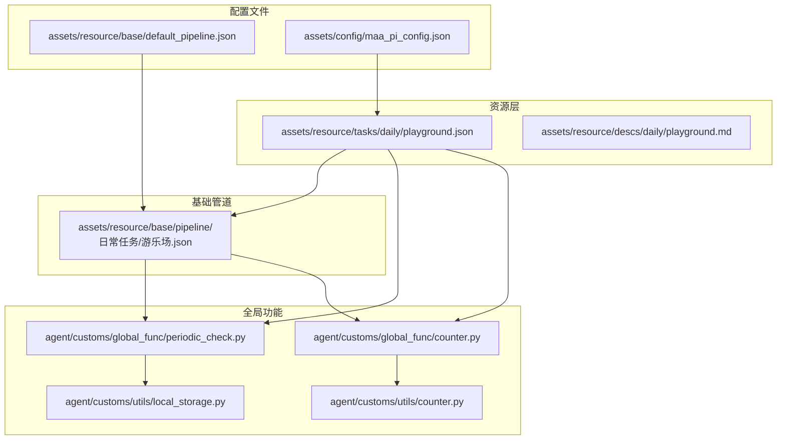
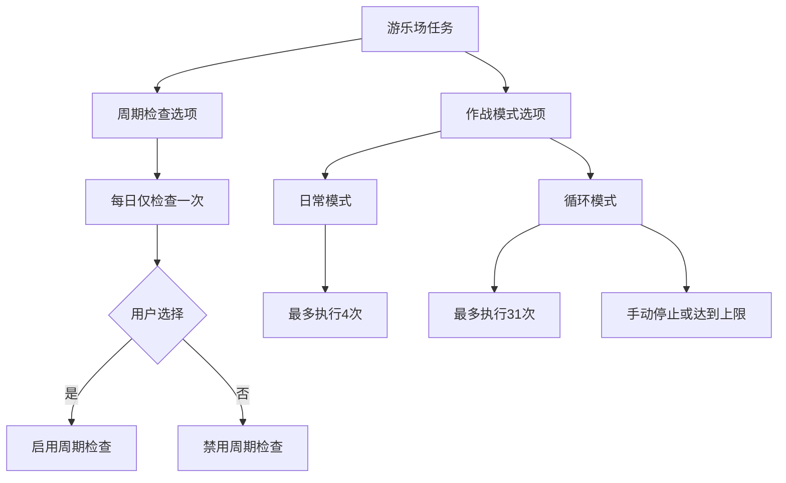
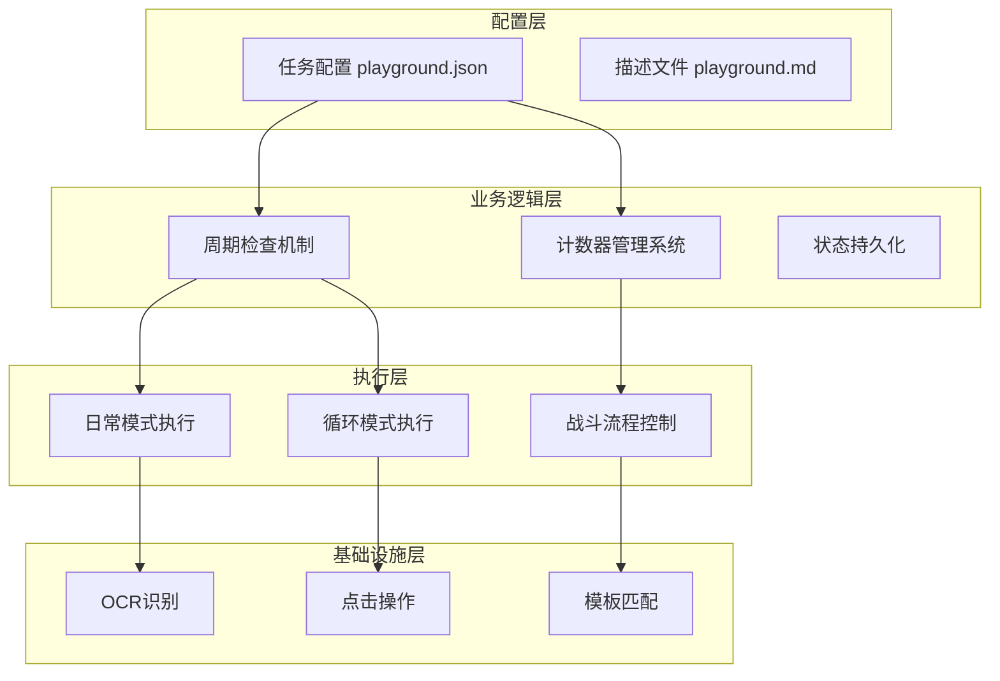
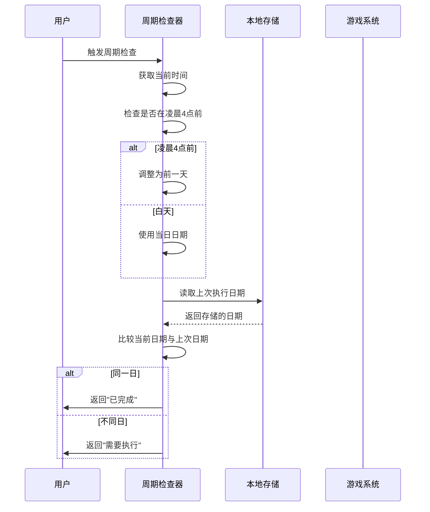
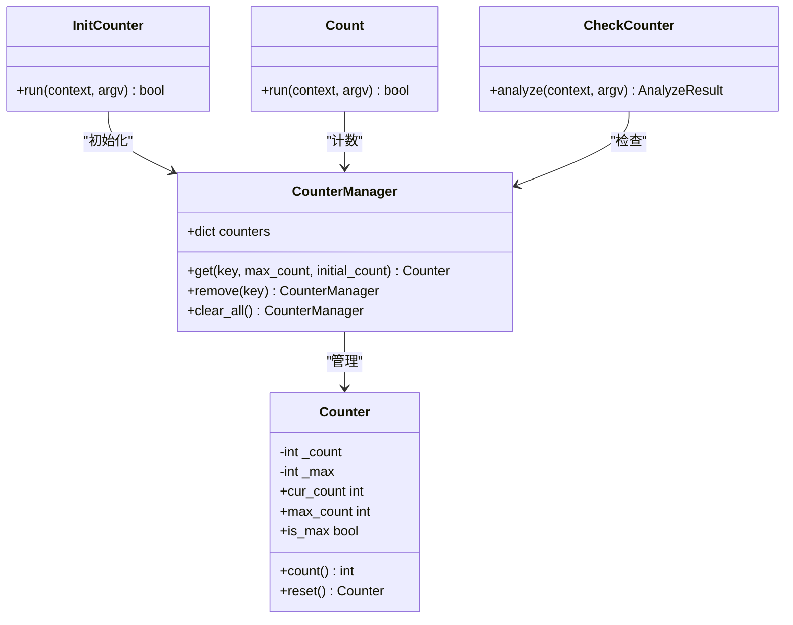
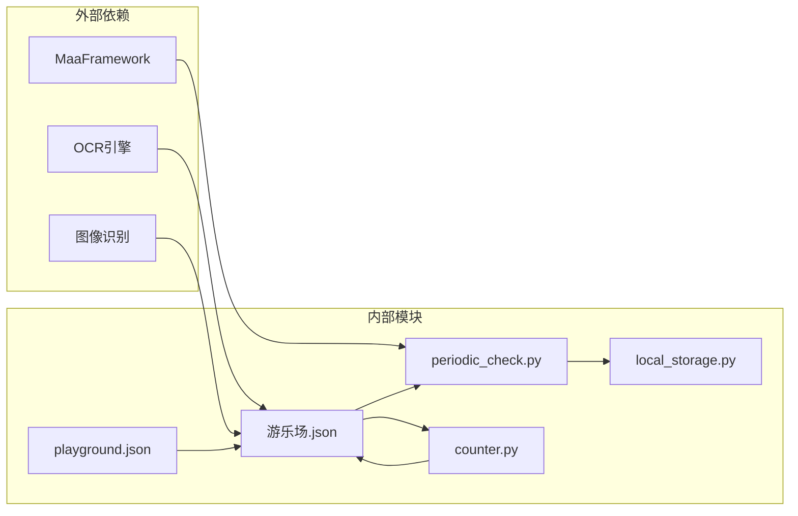
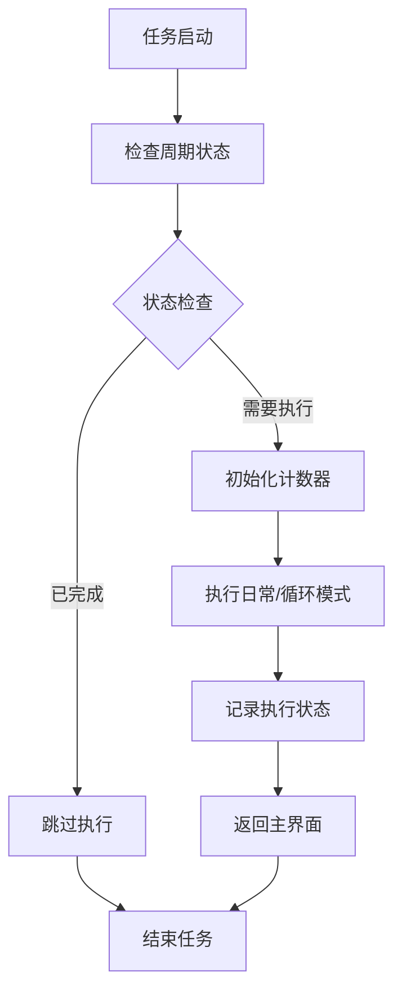

# Assets/resource/tasks/daily/playground.json 文档

<cite>
**本文档引用的文件**
- [playground.json](file://assets/resource/tasks/daily/playground.json)
- [playground.md](file://assets/resource/descs/daily/playground.md)
- [游乐场.json](file://assets/resource/base/pipeline/日常任务/游乐场.json)
- [counter.py](file://agent/customs/global_func/counter.py)
- [counter.py](file://agent/customs/utils/counter.py)
- [periodic_check.py](file://agent/customs/global_func/periodic_check.py)
- [local_storage.py](file://agent/customs/utils/local_storage.py)
- [default_pipeline.json](file://assets/resource/base/default_pipeline.json)
- [maa_pi_config.json](file://assets/config/maa_pi_config.json)
</cite>

## 目录
1. [简介](#简介)
2. [项目结构概览](#项目结构概览)
3. [核心组件分析](#核心组件分析)
4. [架构总览](#架构总览)
5. [详细组件分析](#详细组件分析)
6. [依赖关系分析](#依赖关系分析)
7. [性能考量](#性能考量)
8. [故障排除指南](#故障排除指南)
9. [结论](#结论)

## 简介

游乐场日常任务是 MaaDuDuL 项目中的一个自动化任务配置，用于在游戏环境中自动完成游乐场相关的日常活动。该任务配置实现了智能的周期检查机制，能够根据玩家的游戏进度和系统时间自动判断是否需要执行游乐场任务。

游乐场任务具有以下特点：
- **可连续执行**：支持循环模式和日常模式两种执行方式
- **智能周期检查**：基于游戏刷新时间（凌晨4点）的智能判断机制
- **计数器管理**：内置计数器系统，支持最大次数限制
- **状态持久化**：通过本地存储记录任务执行状态

## 项目结构概览

游乐场任务在整个项目架构中位于资源层的任务配置部分，采用模块化设计：

**图表来源**
- [playground.json:1-58](file://assets/resource/tasks/daily/playground.json#L1-L58)
- [游乐场.json:1-441](file://assets/resource/base/pipeline/日常任务/游乐场.json#L1-L441)

**章节来源**
- [playground.json:1-58](file://assets/resource/tasks/daily/playground.json#L1-L58)
- [playground.md:1-13](file://assets/resource/descs/daily/playground.md#L1-L13)

## 核心组件分析

### 任务配置核心要素

游乐场任务配置包含了完整的任务定义和选项设置：

| 组件 | 描述 | 关键属性 |
|------|------|----------|
| **任务基本信息** | 定义任务的基本元数据 | name, label, entry, description |
| **执行选项** | 用户可配置的执行参数 | group, option 数组 |
| **周期检查开关** | 控制每日检查频率 | switch 类型，Yes/No 选项 |
| **作战模式选择** | 日常模式 vs 循环模式 | select 类型，两种执行策略 |

### 选项配置详解

**图表来源**
- [playground.json:12-56](file://assets/resource/tasks/daily/playground.json#L12-L56)

**章节来源**
- [playground.json:1-58](file://assets/resource/tasks/daily/playground.json#L1-L58)

## 架构总览

游乐场任务采用了分层架构设计，实现了清晰的职责分离：

**图表来源**
- [游乐场.json:1-441](file://assets/resource/base/pipeline/日常任务/游乐场.json#L1-L441)
- [periodic_check.py:29-180](file://agent/customs/global_func/periodic_check.py#L29-L180)

## 详细组件分析

### 周期检查机制

周期检查是游乐场任务的核心功能之一，它基于游戏的刷新时间机制工作：

**图表来源**
- [periodic_check.py:36-146](file://agent/customs/global_func/periodic_check.py#L36-L146)
- [local_storage.py:40-93](file://agent/customs/utils/local_storage.py#L40-L93)

### 计数器管理系统

游乐场任务实现了灵活的计数器机制，支持不同模式下的最大执行次数限制：

**图表来源**
- [counter.py:1-141](file://agent/customs/utils/counter.py#L1-L141)
- [counter.py:21-117](file://agent/customs/global_func/counter.py#L21-L117)

### 执行模式对比

游乐场任务支持两种不同的执行模式，每种模式都有其特定的适用场景：

| 特性 | 日常模式 | 循环模式 |
|------|----------|----------|
| **最大执行次数** | 4次 | 31次 |
| **适用场景** | 日常例行任务 | 需要多次尝试的挑战 |
| **自动停止条件** | 达到最大次数或完成任务 | 达到最大次数或手动停止 |
| **周期检查行为** | 正常执行周期检查 | 跳过周期检查 |
| **计数器初始化** | 初始化日常计数器 | 初始化循环计数器 |

**章节来源**
- [游乐场.json:54-94](file://assets/resource/base/pipeline/日常任务/游乐场.json#L54-L94)
- [游乐场.json:268-280](file://assets/resource/base/pipeline/日常任务/游乐场.json#L268-L280)

## 依赖关系分析

游乐场任务的依赖关系体现了模块化设计的优势：

**图表来源**
- [periodic_check.py:14-23](file://agent/customs/global_func/periodic_check.py#L14-L23)
- [counter.py:9-15](file://agent/customs/global_func/counter.py#L9-L15)

### 关键依赖点

1. **MaaFramework 集成**：所有自定义动作和识别器都依赖于 MaaFramework 的 AgentServer
2. **OCR 识别**：游乐场任务大量使用 OCR 进行界面元素识别
3. **本地存储**：周期检查功能依赖本地存储进行状态持久化
4. **计数器系统**：提供任务执行次数的精确控制

**章节来源**
- [default_pipeline.json:1-8](file://assets/resource/base/default_pipeline.json#L1-L8)
- [maa_pi_config.json:1-3](file://assets/config/maa_pi_config.json#L1-L3)

## 性能考量

### 执行效率优化

游乐场任务在设计时充分考虑了执行效率：

- **智能等待机制**：使用合理的超时设置避免不必要的等待
- **批量处理**：循环模式下支持批量执行减少启动开销
- **状态缓存**：本地存储避免频繁的外部依赖检查

### 资源使用优化

**图表来源**
- [游乐场.json:171-213](file://assets/resource/base/pipeline/日常任务/游乐场.json#L171-L213)

## 故障排除指南

### 常见问题及解决方案

| 问题类型 | 症状 | 可能原因 | 解决方案 |
|----------|------|----------|----------|
| **OCR识别失败** | 无法识别界面元素 | 字体渲染或分辨率问题 | 检查OCR模型配置，调整ROI区域 |
| **周期检查异常** | 重复执行同一任务 | 本地存储损坏 | 清除本地存储文件重新开始 |
| **计数器异常** | 执行次数超出预期 | 计数器状态不正确 | 重置计数器或删除计数器文件 |
| **点击位置错误** | 点击无效或误触 | 屏幕分辨率变化 | 更新点击坐标或使用相对定位 |

### 调试建议

1. **启用详细日志**：检查 AgentServer 的日志输出
2. **验证OCR模型**：确认OCR模型文件完整可用
3. **检查本地存储**：验证 `local_storage.json` 文件格式正确
4. **测试基本功能**：单独测试周期检查和计数器功能

**章节来源**
- [local_storage.py:24-58](file://agent/customs/utils/local_storage.py#L24-L58)
- [periodic_check.py:244-245](file://agent/customs/global_func/periodic_check.py#L244-L245)

## 结论

游乐场日常任务配置展现了现代自动化脚本设计的最佳实践：

### 设计优势

1. **模块化架构**：清晰的分层设计便于维护和扩展
2. **智能决策**：基于游戏逻辑的周期检查机制
3. **状态管理**：完善的本地存储和计数器系统
4. **用户体验**：灵活的配置选项满足不同需求

### 技术亮点

- **时间感知**：考虑游戏刷新时间的智能判断
- **资源控制**：精确的执行次数限制
- **错误处理**：健壮的异常处理和恢复机制
- **可扩展性**：模块化设计支持功能扩展

该配置为其他类似的任务提供了优秀的参考模板，展示了如何在复杂的自动化场景中实现可靠、高效的解决方案。