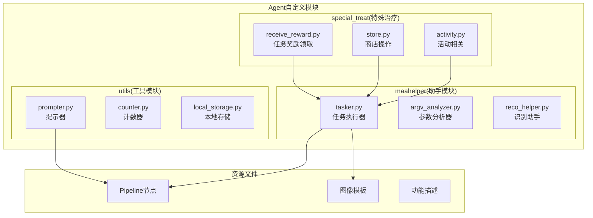
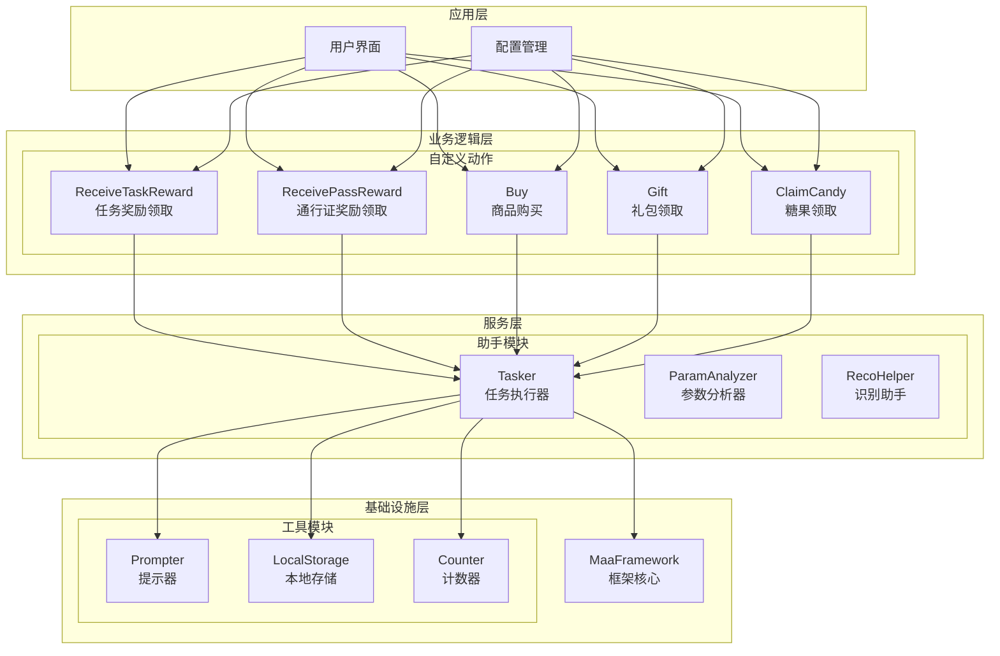
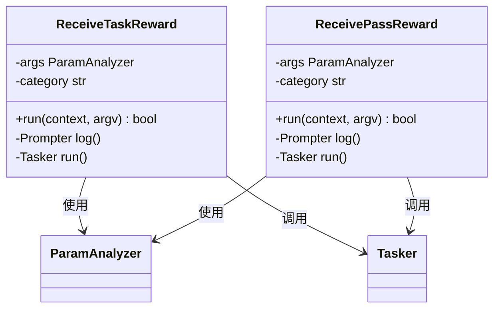
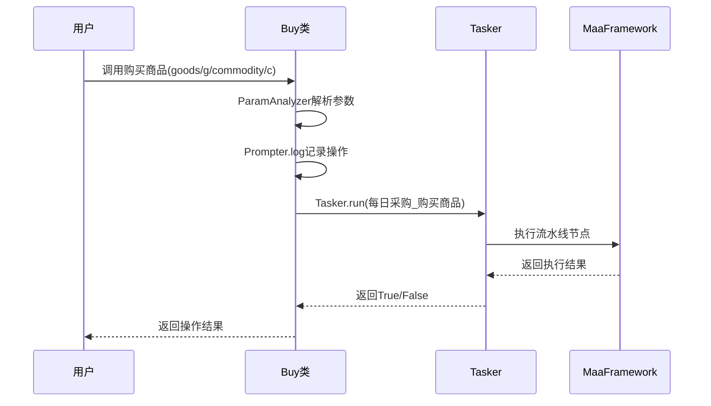
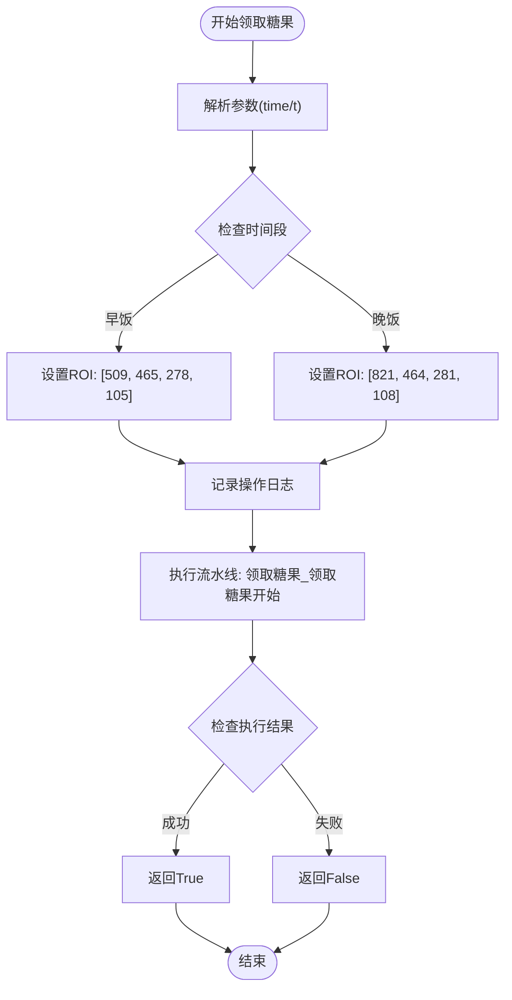
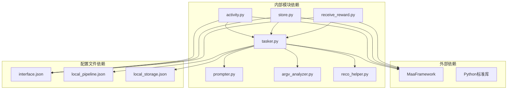

# 组合商品领取

<cite>
**本文档引用的文件**
- [receive_reward.py](file://MFAAvalonia/agent/customs/special_treat/receive_reward.py)
- [store.py](file://MFAAvalonia/agent/customs/special_treat/store.py)
- [activity.py](file://MFAAvalonia/agent/customs/special_treat/activity.py)
- [tasker.py](file://MFAAvalonia/agent/customs/maahelper/tasker.py)
- [prompter.py](file://MFAAvalonia/agent/customs/utils/prompter.py)
- [interface.json](file://assets/interface.json)
- [领取糖果_组合周期检查-早饭.json](file://assets/resource/base/pipeline/日常任务/领取糖果.json)
- [新礼包查看_周期检查.json](file://assets/resource/base/pipeline/开荒功能/新礼包查看.json)
- [领取奖励_领取任务奖励开始.json](file://assets/resource/base/pipeline/日常任务/领取奖励_领取任务奖励开始.json)
- [领取奖励_领取通行证奖励开始.json](file://assets/resource/base/pipeline/日常任务/领取奖励_领取通行证奖励开始.json)
- [每日采购_购买商品.json](file://assets/resource/base/pipeline/日常任务/每日采购_购买商品.json)
- [每日采购_购买礼包开始.json](file://assets/resource/base/pipeline/日常任务/每日采购_购买礼包开始.json)
- [领取糖果描述.md](file://assets/resource/descs/daily/claim_candy.md)
- [领取奖励描述.md](file://assets/resource/descs/daily/claim_reward.md)
- [每日采购描述.md](file://assets/resource/descs/daily/purchase.md)
</cite>

## 目录
1. [简介](#简介)
2. [项目结构](#项目结构)
3. [核心组件](#核心组件)
4. [架构概览](#架构概览)
5. [详细组件分析](#详细组件分析)
6. [依赖关系分析](#依赖关系分析)
7. [性能考虑](#性能考虑)
8. [故障排除指南](#故障排除指南)
9. [结论](#结论)

## 简介

组合商品领取是MaaDuDuL项目中的一个重要功能模块，主要负责自动化处理游戏中的各种奖励领取和商品购买任务。该系统基于MaaFramework构建，通过自定义动作和流水线节点实现了高度自动化的游戏操作。

本功能模块涵盖了三大核心业务场景：
- **任务奖励领取**：包括日常任务奖励和通行证奖励的自动领取
- **商店商品购买**：支持普通商店和特殊商店的商品购买
- **活动奖励领取**：涵盖糖果领取和其他活动奖励的自动化处理

系统采用模块化设计，每个功能都封装在独立的Python类中，通过统一的接口与MaaFramework交互，确保了代码的可维护性和扩展性。

## 项目结构

组合商品领取功能位于项目的Agent自定义模块中，采用清晰的分层架构：

**图表来源**
- [receive_reward.py](file://MFAAvalonia/agent/customs/special_treat/receive_reward.py#L1-L65)
- [store.py](file://MFAAvalonia/agent/customs/special_treat/store.py#L1-L96)
- [tasker.py](file://MFAAvalonia/agent/customs/maahelper/tasker.py#L1-L190)

**章节来源**
- [receive_reward.py](file://MFAAvalonia/agent/customs/special_treat/receive_reward.py#L1-L65)
- [store.py](file://MFAAvalonia/agent/customs/special_treat/store.py#L1-L96)
- [activity.py](file://MFAAvalonia/agent/customs/special_treat/activity.py#L1-L145)

## 核心组件

组合商品领取系统由四个核心组件构成，每个组件都有明确的职责分工：

### 1. 任务奖励领取模块
负责处理各类任务奖励的自动领取，包括日常任务奖励和不同类型的通行证奖励。

### 2. 商店操作模块  
提供商店相关的自动化操作，包括商品购买和礼包领取功能。

### 3. 活动相关模块
处理游戏内活动的各种自动化任务，如活动界面导航和奖励领取。

### 4. 任务执行器
作为底层基础设施，提供统一的任务执行接口和工具方法。

**章节来源**
- [receive_reward.py](file://MFAAvalonia/agent/customs/special_treat/receive_reward.py#L9-L65)
- [store.py](file://MFAAvalonia/agent/customs/special_treat/store.py#L14-L96)
- [activity.py](file://MFAAvalonia/agent/customs/special_treat/activity.py#L17-L145)
- [tasker.py](file://MFAAvalonia/agent/customs/maahelper/tasker.py#L16-L190)

## 架构概览

系统采用分层架构设计，确保了各组件间的松耦合和高内聚：

**图表来源**
- [receive_reward.py](file://MFAAvalonia/agent/customs/special_treat/receive_reward.py#L9-L65)
- [store.py](file://MFAAvalonia/agent/customs/special_treat/store.py#L14-L96)
- [activity.py](file://MFAAvalonia/agent/customs/special_treat/activity.py#L17-L145)
- [tasker.py](file://MFAAvalonia/agent/customs/maahelper/tasker.py#L16-L190)

## 详细组件分析

### 任务奖励领取组件

任务奖励领取组件提供了两个核心功能：任务奖励领取和通行证奖励领取。

#### ReceiveTaskReward类
该类专门处理日常任务奖励的自动领取：

**图表来源**
- [receive_reward.py](file://MFAAvalonia/agent/customs/special_treat/receive_reward.py#L9-L65)

#### 参数处理机制
组件采用灵活的参数处理机制，支持多种参数名称：
- 任务奖励：`category` 或 `c`
- 通行证奖励：`category` 或 `c`
- 商品购买：`goods`、`g`、`commodity`、`c`
- 礼包领取：`gift` 或 `g`

**章节来源**
- [receive_reward.py](file://MFAAvalonia/agent/customs/special_treat/receive_reward.py#L13-L34)
- [receive_reward.py](file://MFAAvalonia/agent/customs/special_treat/receive_reward.py#L40-L64)

### 商店操作组件

商店操作组件提供了完整的商店自动化解决方案，包括商品购买和礼包领取功能。

#### Buy类（商品购买）
该类支持通过多种参数名称指定要购买的商品：

**图表来源**
- [store.py](file://MFAAvalonia/agent/customs/special_treat/store.py#L59-L95)

#### Gift类（礼包领取）
该类专门处理商店中礼包的领取操作：

**章节来源**
- [store.py](file://MFAAvalonia/agent/customs/special_treat/store.py#L52-L96)

### 活动相关组件

活动相关组件提供了活动界面导航和奖励领取的自动化功能。

#### ClaimCandy类（糖果领取）
该类根据指定的时间段（早饭/晚饭）领取对应的糖果奖励：

**图表来源**
- [activity.py](file://MFAAvalonia/agent/customs/special_treat/activity.py#L67-L101)

**章节来源**
- [activity.py](file://MFAAvalonia/agent/customs/special_treat/activity.py#L60-L102)

### 任务执行器组件

Tasker类作为系统的核心基础设施，提供了统一的任务执行接口：

#### 核心功能
- **节点运行**：执行指定的流水线节点
- **截图功能**：支持屏幕截图操作
- **点击操作**：提供精确的点击控制
- **滑动操作**：支持屏幕滑动控制
- **等待机制**：提供可控的延时功能

#### 流水线覆盖机制
Tasker类实现了智能的流水线节点覆盖功能，能够动态修改节点的行为：

**章节来源**
- [tasker.py](file://MFAAvalonia/agent/customs/maahelper/tasker.py#L60-L122)

## 依赖关系分析

组合商品领取系统的依赖关系呈现清晰的分层结构：

**图表来源**
- [receive_reward.py](file://MFAAvalonia/agent/customs/special_treat/receive_reward.py#L1-L12)
- [store.py](file://MFAAvalonia/agent/customs/special_treat/store.py#L6-L12)
- [tasker.py](file://MFAAvalonia/agent/customs/maahelper/tasker.py#L7-L14)

### 关键依赖特性

1. **MaaFramework集成**：所有自定义动作都直接依赖于MaaFramework的核心功能
2. **参数解析统一**：通过ParamAnalyzer实现参数处理的标准化
3. **任务执行抽象**：Tasker类提供统一的任务执行接口
4. **配置驱动**：通过interface.json实现功能开关和参数配置

**章节来源**
- [receive_reward.py](file://MFAAvalonia/agent/customs/special_treat/receive_reward.py#L1-L12)
- [store.py](file://MFAAvalonia/agent/customs/special_treat/store.py#L6-L12)
- [tasker.py](file://MFAAvalonia/agent/customs/maahelper/tasker.py#L7-L14)

## 性能考虑

组合商品领取系统在设计时充分考虑了性能优化：

### 1. 异步操作处理
- 所有MaaFramework操作都是异步执行的
- 通过`.wait()`方法确保操作完成后再继续执行
- 避免了阻塞主线程的长时间等待

### 2. 智能重试机制
- 自动处理节点执行失败的情况
- 通过on_error字段实现错误恢复
- 支持多节点的级联错误处理

### 3. 资源管理优化
- 及时释放不再使用的资源
- 合理的内存使用策略
- 避免重复创建昂贵的对象

### 4. 网络和I/O优化
- 最小化网络请求次数
- 批量处理相似操作
- 缓存常用的配置信息

## 故障排除指南

### 常见问题及解决方案

#### 1. 参数解析失败
**症状**：自定义动作抛出参数错误异常
**原因**：传入的参数名称不正确或参数值为空
**解决方法**：
- 检查参数名称是否符合要求（支持多种别名）
- 确认参数值格式正确
- 查看interface.json中的参数配置

#### 2. 任务执行超时
**症状**：任务长时间无响应或执行超时
**原因**：目标界面未正确识别或节点配置错误
**解决方法**：
- 检查对应节点的识别模板
- 验证ROI区域设置是否正确
- 确认节点间的连接关系

#### 3. 图像识别失败
**症状**：无法正确识别目标元素
**原因**：图像模板质量差或分辨率不匹配
**解决方法**：
- 更新高质量的图像模板
- 调整识别阈值
- 检查屏幕分辨率设置

#### 4. 权限不足错误
**症状**：执行某些操作时出现权限错误
**原因**：操作系统权限限制或模拟器权限配置
**解决方法**：
- 以管理员权限运行程序
- 检查模拟器的无障碍服务设置
- 验证ADB连接状态

**章节来源**
- [prompter.py](file://MFAAvalonia/agent/customs/utils/prompter.py#L33-L55)

## 结论

组合商品领取系统展现了优秀的软件工程实践，通过模块化设计、清晰的分层架构和完善的错误处理机制，实现了高度自动化的游戏操作功能。

### 主要优势

1. **模块化设计**：每个功能都封装在独立的类中，便于维护和扩展
2. **统一接口**：通过Tasker类提供一致的编程接口
3. **灵活配置**：支持多种参数名称和动态配置
4. **健壮性**：完善的错误处理和恢复机制
5. **可扩展性**：易于添加新的功能模块

### 技术亮点

- **智能参数解析**：支持多种参数名称别名
- **动态流水线**：运行时可修改节点行为
- **统一日志系统**：标准化的操作日志输出
- **配置驱动**：通过JSON配置实现功能开关

该系统为类似的游戏自动化项目提供了良好的参考模板，展示了如何在保证功能完整性的同时，保持代码的可维护性和扩展性。