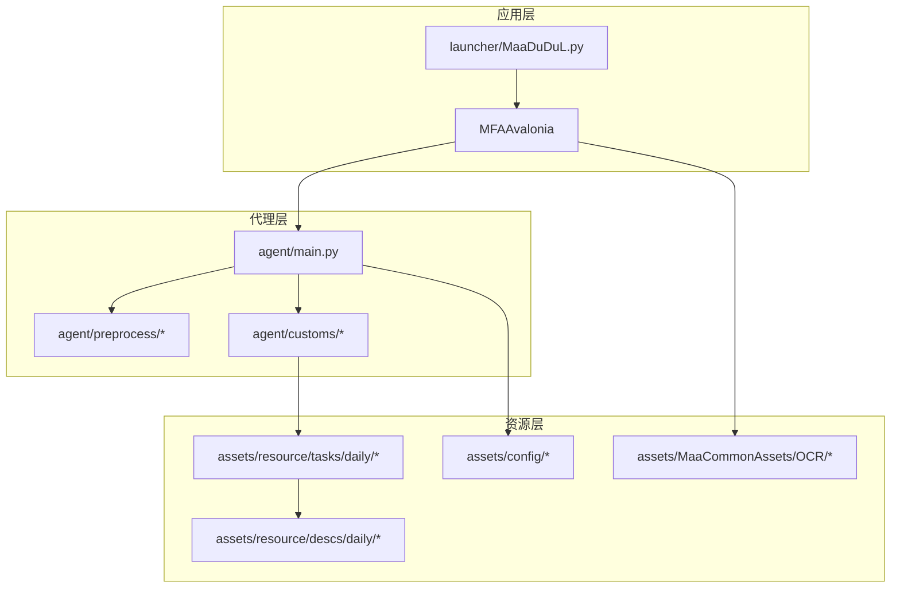
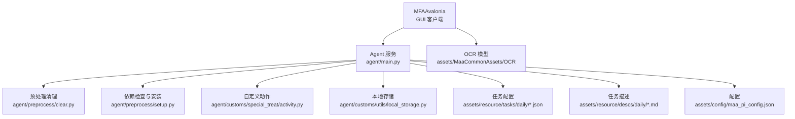
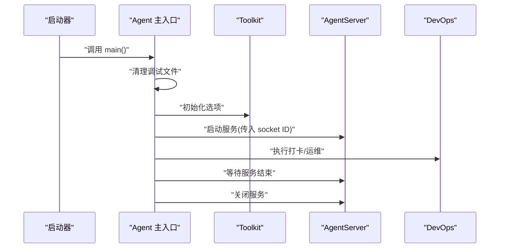
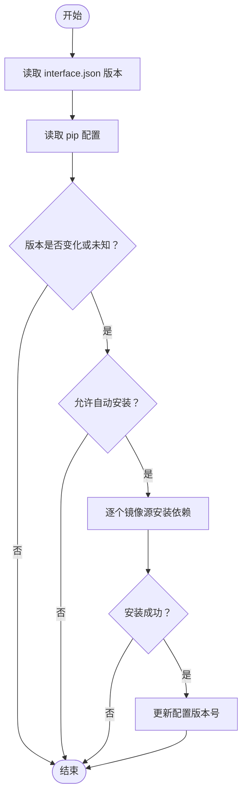
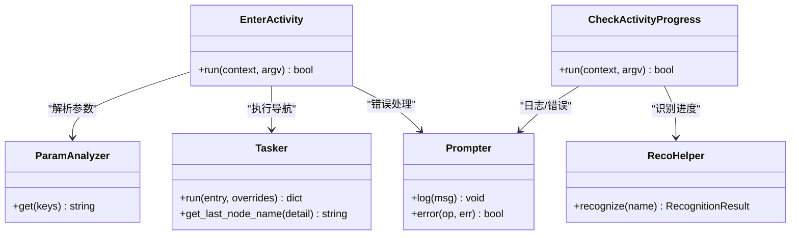
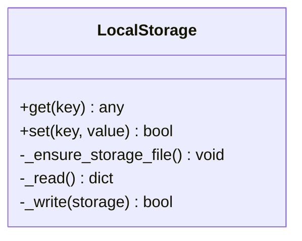
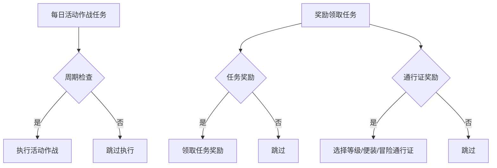
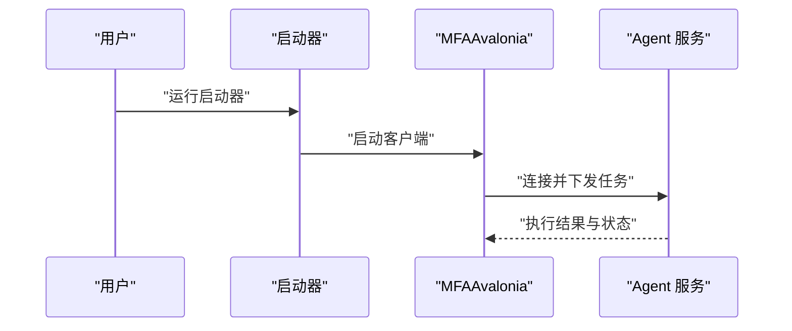
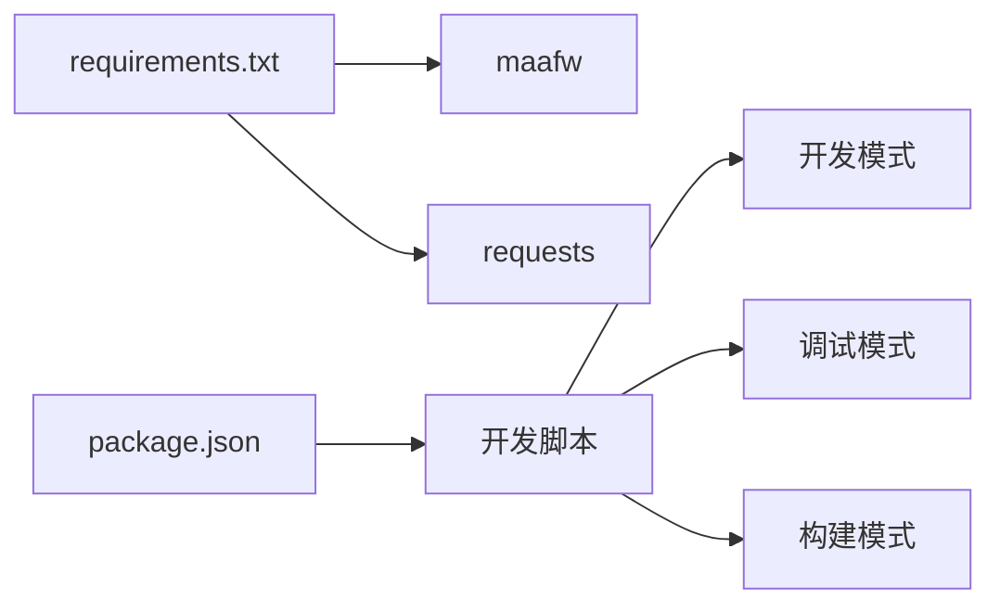

# Daily Activity Combat

<cite>
**本文引用的文件**
- [README.md](file://README.md)
- [agent/main.py](file://agent/main.py)
- [agent/preprocess/setup.py](file://agent/preprocess/setup.py)
- [agent/preprocess/clear.py](file://agent/preprocess/clear.py)
- [agent/customs/special_treat/activity.py](file://agent/customs/special_treat/activity.py)
- [agent/customs/utils/local_storage.py](file://agent/customs/utils/local_storage.py)
- [assets/resource/tasks/daily/activity_daily.json](file://assets/resource/tasks/daily/activity_daily.json)
- [assets/resource/tasks/daily/claim_reward.json](file://assets/resource/tasks/daily/claim_reward.json)
- [assets/resource/descs/daily/activity_daily.md](file://assets/resource/descs/daily/activity_daily.md)
- [assets/config/maa_pi_config.json](file://assets/config/maa_pi_config.json)
- [launcher/MaaDuDuL.py](file://launcher/MaaDuDuL.py)
- [package.json](file://package.json)
- [requirements.txt](file://requirements.txt)
</cite>

## 目录
1. [简介](#简介)
2. [项目结构](#项目结构)
3. [核心组件](#核心组件)
4. [架构总览](#架构总览)
5. [详细组件分析](#详细组件分析)
6. [依赖分析](#依赖分析)
7. [性能考虑](#性能考虑)
8. [故障排除指南](#故障排除指南)
9. [结论](#结论)
10. [附录](#附录)

## 简介
本项目为“嘟嘟脸恶作剧”游戏的自动化助手，基于 MaaFramework 与 MFAAvalonia 构建，提供图形识别与模拟控制能力，实现日常任务、活动作战、奖励领取等自动化流程。项目采用模块化设计，通过任务配置与自定义动作扩展，支持灵活的任务编排与参数化执行。

## 项目结构
项目采用分层组织方式：
- agent：自动化代理核心，包含预处理、自定义动作与工具模块
- assets：资源与配置，包含任务定义、描述文件、OCR模型与默认流水线
- launcher：可执行程序入口，负责启动 GUI 客户端
- ci/dev/docsite/public/tools：构建、开发与文档相关脚本与资源
- requirements.txt：运行依赖声明

**图表来源**
- [launcher/MaaDuDuL.py:1-22](file://launcher/MaaDuDuL.py#L1-L22)
- [agent/main.py:1-78](file://agent/main.py#L1-L78)
- [agent/preprocess/setup.py:1-230](file://agent/preprocess/setup.py#L1-L230)
- [agent/customs/special_treat/activity.py:1-101](file://agent/customs/special_treat/activity.py#L1-L101)
- [assets/resource/tasks/daily/activity_daily.json:1-79](file://assets/resource/tasks/daily/activity_daily.json#L1-L79)
- [assets/resource/descs/daily/activity_daily.md:1-13](file://assets/resource/descs/daily/activity_daily.md#L1-L13)
- [assets/config/maa_pi_config.json:1-3](file://assets/config/maa_pi_config.json#L1-L3)

**章节来源**
- [README.md:1-117](file://README.md#L1-L117)
- [package.json:1-14](file://package.json#L1-L14)

## 核心组件
- 代理主入口：初始化环境、依赖检查、启动 Agent 服务并等待
- 预处理模块：清理调试文件、自动安装依赖
- 自定义动作：活动界面导航与活动进度检查
- 本地存储：基于 JSON 的键值持久化
- 任务配置：每日活动作战与奖励领取的任务定义与选项
- 配置与资源：流水线配置、OCR 模型与任务描述

**章节来源**
- [agent/main.py:47-78](file://agent/main.py#L47-L78)
- [agent/preprocess/clear.py:31-41](file://agent/preprocess/clear.py#L31-L41)
- [agent/preprocess/setup.py:204-230](file://agent/preprocess/setup.py#L204-L230)
- [agent/customs/special_treat/activity.py:17-101](file://agent/customs/special_treat/activity.py#L17-L101)
- [agent/customs/utils/local_storage.py:10-111](file://agent/customs/utils/local_storage.py#L10-L111)
- [assets/resource/tasks/daily/activity_daily.json:1-79](file://assets/resource/tasks/daily/activity_daily.json#L1-L79)
- [assets/resource/tasks/daily/claim_reward.json:1-102](file://assets/resource/tasks/daily/claim_reward.json#L1-L102)
- [assets/config/maa_pi_config.json:1-3](file://assets/config/maa_pi_config.json#L1-L3)

## 架构总览
系统采用“GUI 客户端 → 代理服务 → 自定义动作/工具 → 资源配置”的分层架构。GUI 负责交互与任务调度，代理服务承载自动化逻辑，自定义动作扩展具体业务行为，资源配置支撑识别与流程控制。

**图表来源**
- [agent/main.py:47-78](file://agent/main.py#L47-L78)
- [agent/preprocess/clear.py:31-41](file://agent/preprocess/clear.py#L31-L41)
- [agent/preprocess/setup.py:204-230](file://agent/preprocess/setup.py#L204-L230)
- [agent/customs/special_treat/activity.py:17-101](file://agent/customs/special_treat/activity.py#L17-L101)
- [agent/customs/utils/local_storage.py:10-111](file://agent/customs/utils/local_storage.py#L10-L111)
- [assets/resource/tasks/daily/activity_daily.json:1-79](file://assets/resource/tasks/daily/activity_daily.json#L1-L79)
- [assets/resource/descs/daily/activity_daily.md:1-13](file://assets/resource/descs/daily/activity_daily.md#L1-L13)
- [assets/config/maa_pi_config.json:1-3](file://assets/config/maa_pi_config.json#L1-L3)

## 详细组件分析

### 代理主入口与生命周期
- 初始化：切换工作目录、设置编码、清理调试文件
- 依赖检查：根据 interface.json 版本与 pip 配置决定是否安装
- 启动服务：读取 socket ID，启动 AgentServer 并执行 devops
- 等待与关闭：阻塞等待服务结束，随后关闭

**图表来源**
- [agent/main.py:47-78](file://agent/main.py#L47-L78)

**章节来源**
- [agent/main.py:47-78](file://agent/main.py#L47-L78)

### 预处理与依赖管理
- 清理：删除 on_error 调试图片目录，避免空间占用
- 依赖检查：读取 interface.json 版本与 pip 配置，按镜像源顺序尝试安装
- 安装策略：支持禁用自动安装、自定义镜像源、未知版本兜底

**图表来源**
- [agent/preprocess/setup.py:204-230](file://agent/preprocess/setup.py#L204-L230)
- [agent/preprocess/clear.py:31-41](file://agent/preprocess/clear.py#L31-L41)

**章节来源**
- [agent/preprocess/setup.py:204-230](file://agent/preprocess/setup.py#L204-L230)
- [agent/preprocess/clear.py:31-41](file://agent/preprocess/clear.py#L31-L41)

### 自定义动作：活动界面导航与进度检查
- enter_activity：根据活动标题进入对应活动界面，通过识别与导航 Pipeline 定位目标
- check_activity_progress：识别活动进度文本，计算剩余次数并动态覆盖后续 Pipeline 参数

**图表来源**
- [agent/customs/special_treat/activity.py:17-101](file://agent/customs/special_treat/activity.py#L17-L101)

**章节来源**
- [agent/customs/special_treat/activity.py:17-101](file://agent/customs/special_treat/activity.py#L17-L101)

### 本地存储模块
- 职责：提供键值持久化，数据以 JSON 文件保存，支持读取、写入与自动初始化
- 路径：config/mddl/local_storage.json
- 方法：get(key)、set(key, value)

**图表来源**
- [agent/customs/utils/local_storage.py:10-111](file://agent/customs/utils/local_storage.py#L10-L111)

**章节来源**
- [agent/customs/utils/local_storage.py:10-111](file://agent/customs/utils/local_storage.py#L10-L111)

### 任务配置：每日活动作战与奖励领取
- 每日活动作战：支持周期检查开关、作战次数选择（智能检测/指定次数/最大次数）
- 奖励领取：支持任务奖励与通行证奖励的开关与子选项

**图表来源**
- [assets/resource/tasks/daily/activity_daily.json:1-79](file://assets/resource/tasks/daily/activity_daily.json#L1-L79)
- [assets/resource/tasks/daily/claim_reward.json:1-102](file://assets/resource/tasks/daily/claim_reward.json#L1-L102)

**章节来源**
- [assets/resource/tasks/daily/activity_daily.json:1-79](file://assets/resource/tasks/daily/activity_daily.json#L1-L79)
- [assets/resource/tasks/daily/claim_reward.json:1-102](file://assets/resource/tasks/daily/claim_reward.json#L1-L102)
- [assets/resource/descs/daily/activity_daily.md:1-13](file://assets/resource/descs/daily/activity_daily.md#L1-L13)

### 启动器与 GUI 集成
- 启动器根据操作系统选择可执行文件并启动
- GUI 客户端负责用户交互与任务调度，与代理服务协同工作

**图表来源**
- [launcher/MaaDuDuL.py:1-22](file://launcher/MaaDuDuL.py#L1-L22)

**章节来源**
- [launcher/MaaDuDuL.py:1-22](file://launcher/MaaDuDuL.py#L1-L22)

## 依赖分析
- 运行时依赖：MaaFramework、requests
- 构建与开发：脚本通过 package.json 管理，支持开发、调试与构建流程
- 资源依赖：OCR 模型与任务资源位于 assets 目录

**图表来源**
- [requirements.txt:1-3](file://requirements.txt#L1-L3)
- [package.json:1-14](file://package.json#L1-L14)

**章节来源**
- [requirements.txt:1-3](file://requirements.txt#L1-L3)
- [package.json:1-14](file://package.json#L1-L14)

## 性能考虑
- 依赖安装镜像源轮询：通过多镜像源提升安装成功率与时效性
- 调试文件清理：定期清理 on_error 图片，避免磁盘占用累积
- OCR 识别优化：合理配置识别区域与模型，减少误判与重复尝试
- 任务参数化：通过智能检测与动态参数覆盖，避免无效执行

## 故障排除指南
- 启动失败：检查 Agent 启动日志与依赖安装状态，确认镜像源可用性
- 识别失败：核对 OCR 模型与识别区域配置，确保界面一致性
- 任务未执行：检查任务开关与参数设置，确认 Pipeline 节点正确
- 存储异常：检查 config/mddl/local_storage.json 权限与格式

**章节来源**
- [agent/main.py:69-71](file://agent/main.py#L69-L71)
- [agent/preprocess/setup.py:185-196](file://agent/preprocess/setup.py#L185-L196)
- [agent/customs/utils/local_storage.py:50-58](file://agent/customs/utils/local_storage.py#L50-L58)

## 结论
本项目通过清晰的分层架构与模块化设计，实现了游戏日常任务与活动作战的自动化。代理层负责环境初始化与服务管理，自定义动作扩展业务能力，任务配置与资源文件提供灵活的参数化支持。结合本地存储与预处理机制，系统具备良好的可维护性与可扩展性。

## 附录
- 资源配置示例：流水线配置与 OCR 模型路径
- 任务描述：功能说明与起止界面指引
- 配置文件：资源选择与运行参数

**章节来源**
- [assets/config/maa_pi_config.json:1-3](file://assets/config/maa_pi_config.json#L1-L3)
- [assets/resource/descs/daily/activity_daily.md:1-13](file://assets/resource/descs/daily/activity_daily.md#L1-L13)