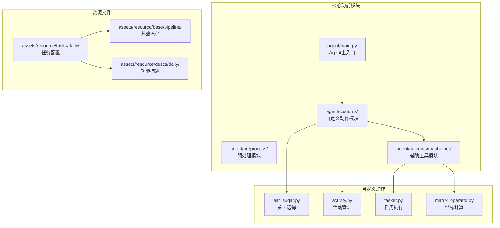
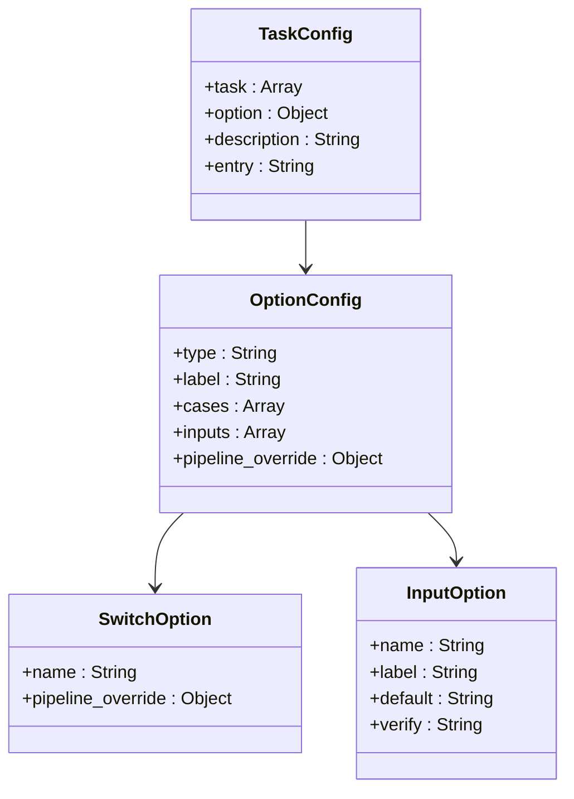
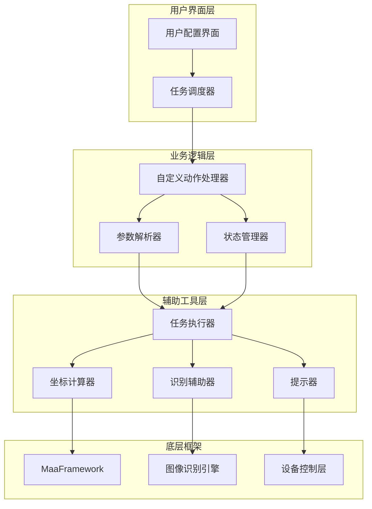
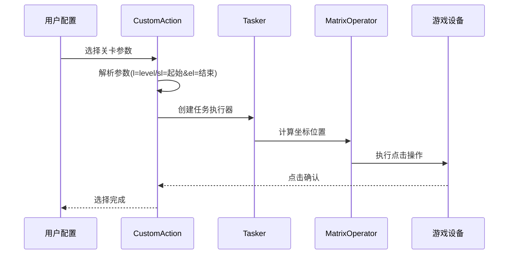
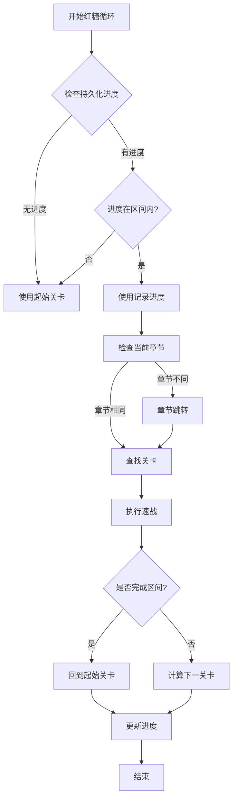
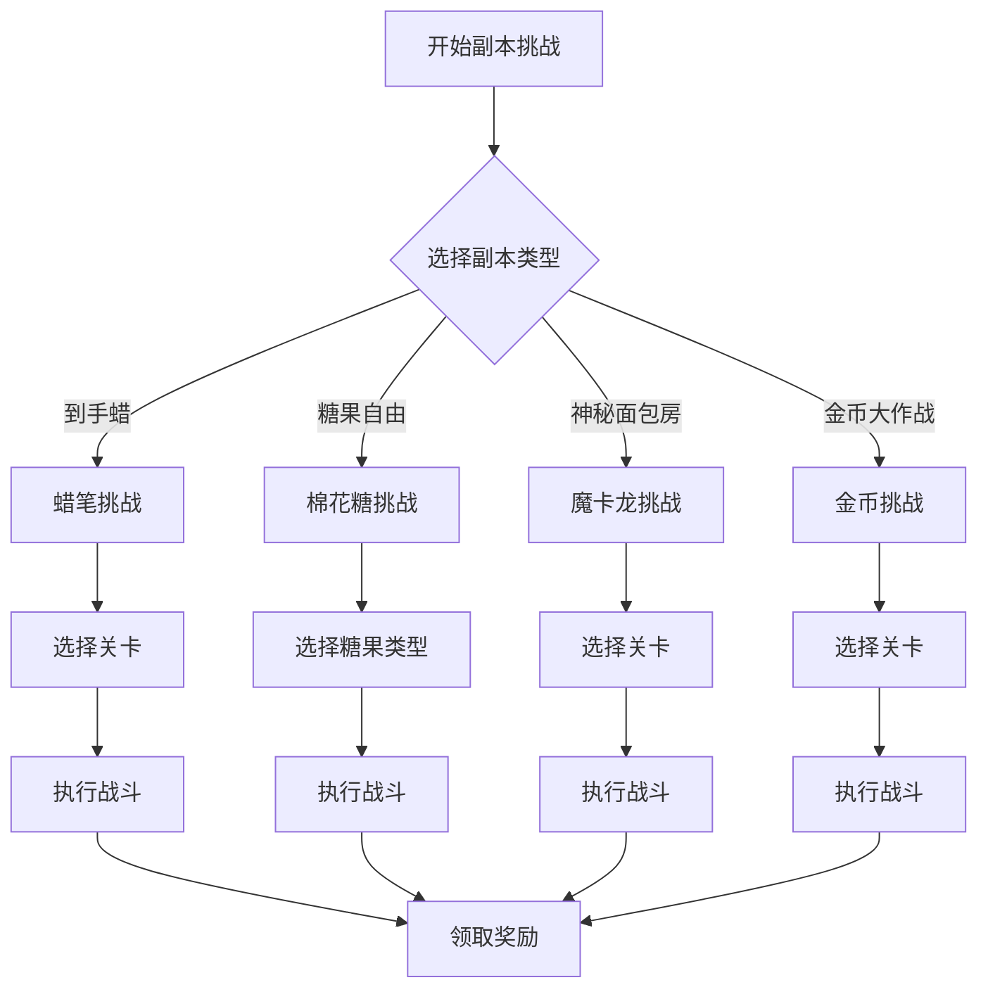
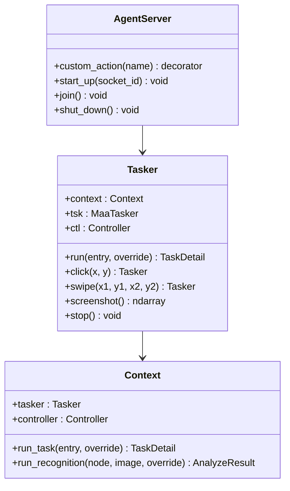
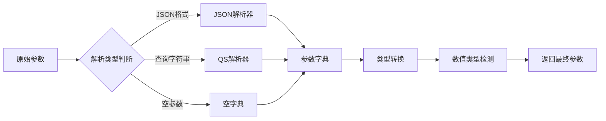
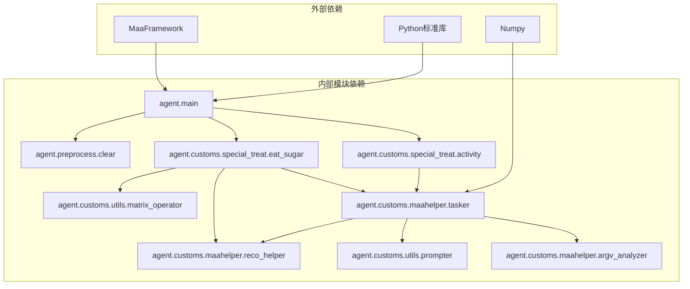
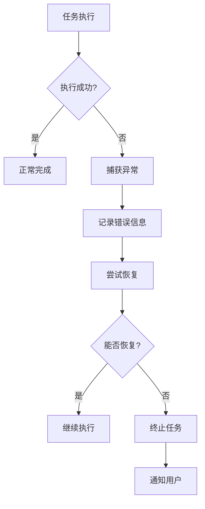

# 日常清紫糖功能文档

<cite>
**本文档引用的文件**
- [清紫糖.json](file://assets/resource/tasks/daily/清紫糖.json)
- [clear_purple_candy.md](file://assets/resource/descs/daily/clear_purple_candy.md)
- [清红糖.json](file://assets/resource/tasks/daily/清红糖.json)
- [clear_red_candy.md](file://assets/resource/descs/daily/clear_red_candy.md)
- [clear.py](file://agent/preprocess/clear.py)
- [eat_sugar.py](file://agent/customs/special_treat/eat_sugar.py)
- [activity.py](file://agent/customs/special_treat/activity.py)
- [matrix_operator.py](file://agent/customs/utils/matrix_operator.py)
- [tasker.py](file://agent/customs/maahelper/tasker.py)
- [prompter.py](file://agent/customs/utils/prompter.py)
- [reco_helper.py](file://agent/customs/maahelper/reco_helper.py)
- [argv_analyzer.py](file://agent/customs/maahelper/argv_analyzer.py)
- [main.py](file://agent/main.py)
- [清紫糖.json](file://assets/resource/base/pipeline/日常任务/清紫糖.json)
- [清红糖.json](file://assets/resource/base/pipeline/日常任务/清红糖.json)
</cite>

## 更新摘要
**所做更改**
- 新增红糖清除功能的完整文档内容
- 扩展功能概述以包含紫糖和红糖双重支持
- 添加红糖关卡循环执行机制的技术细节
- 更新架构图以反映双功能系统
- 增强依赖关系分析以涵盖红糖功能

## 目录
1. [简介](#简介)
2. [项目结构](#项目结构)
3. [核心组件](#核心组件)
4. [架构概览](#架构概览)
5. [详细组件分析](#详细组件分析)
6. [依赖关系分析](#依赖关系分析)
7. [性能考虑](#性能考虑)
8. [故障排除指南](#故障排除指南)
9. [结论](#结论)

## 简介

Daily Clear Purple Candy（清紫糖）功能是 MaaDuDuL 项目中的一个自动化任务系统，现已扩展为支持完整的紫糖和红糖关卡清理自动化。该功能能够自动识别活动界面、选择合适的关卡、执行战斗并领取奖励，为玩家提供高效的角色培养材料获取解决方案。

**更新** 系统现已支持两种主要糖果资源的自动化清理：
- **紫糖功能**：支持克隆工厂、到手蜡、副本挑战等多种战斗模式
- **红糖功能**：支持循环关卡执行和持久化进度记录

该功能支持多种战斗模式，包括克隆工厂、到手蜡和副本挑战，能够根据玩家的配置自动选择最优的关卡进行挑战，同时具备智能的周期检查和状态管理功能。

## 项目结构

MaaDuDuL 项目采用模块化的架构设计，清紫糖和清红糖功能分布在多个关键目录中：

**图表来源**
- [main.py:1-78](file://agent/main.py#L1-L78)
- [清紫糖.json:1-275](file://assets/resource/tasks/daily/清紫糖.json#L1-L275)
- [清红糖.json:1-38](file://assets/resource/tasks/daily/清红糖.json#L1-L38)
- [eat_sugar.py:1-518](file://agent/customs/special_treat/eat_sugar.py#L1-L518)

**章节来源**
- [main.py:1-78](file://agent/main.py#L1-L78)
- [清紫糖.json:1-275](file://assets/resource/tasks/daily/清紫糖.json#L1-L275)
- [清红糖.json:1-38](file://assets/resource/tasks/daily/清红糖.json#L1-L38)

## 核心组件

### 任务配置系统

清紫糖和清红糖功能的核心是基于 JSON 的任务配置系统，该系统提供了灵活的任务选项和参数配置：

**图表来源**
- [清紫糖.json:1-275](file://assets/resource/tasks/daily/清紫糖.json#L1-L275)
- [清红糖.json:1-38](file://assets/resource/tasks/daily/清红糖.json#L1-L38)

### 自定义动作模块

系统实现了多个自定义动作来处理不同的游戏场景：

- **SelectCloneLevel**: 克隆工厂关卡选择
- **SelectCrayonLevel**: 到手蜡关卡选择  
- **SelectDuplicateLevel**: 副本关卡选择
- **SelectRedLevel**: 红糖关卡循环执行（新增）
- **QuickFight**: 快速战斗执行

**更新** 新增的红糖关卡选择系统支持：
- 关卡区间循环执行（支持起始和结束关卡）
- 持久化进度记录和恢复
- 章节跳转和关卡定位
- 自动进度推进机制

**章节来源**
- [eat_sugar.py:1-518](file://agent/customs/special_treat/eat_sugar.py#L1-L518)
- [清紫糖.json:1-275](file://assets/resource/tasks/daily/清紫糖.json#L1-L275)
- [清红糖.json:1-38](file://assets/resource/tasks/daily/清红糖.json#L1-L38)

## 架构概览

清紫糖和清红糖功能采用分层架构设计，从底层的图像识别到上层的任务编排形成了完整的自动化流程：

**图表来源**
- [main.py:47-77](file://agent/main.py#L47-L77)
- [tasker.py:16-190](file://agent/customs/maahelper/tasker.py#L16-L190)
- [reco_helper.py:17-256](file://agent/customs/maahelper/reco_helper.py#L17-L256)

## 详细组件分析

### 关卡选择系统

关卡选择系统是清紫糖和清红糖功能的核心组件，负责根据玩家配置自动选择最优的战斗关卡：

**图表来源**
- [eat_sugar.py:65-120](file://agent/customs/special_treat/eat_sugar.py#L65-L120)
- [eat_sugar.py:282-381](file://agent/customs/special_treat/eat_sugar.py#L282-L381)
- [matrix_operator.py:32-58](file://agent/customs/utils/matrix_operator.py#L32-L58)

#### 克隆工厂关卡选择

克隆工厂采用4列布局设计，支持1-15级关卡的选择：

| 关卡范围 | 布局特点 | 坐标起点 | 行数 |
|---------|---------|---------|------|
| 1-8级 | 可见区域 | (118, 238) | 2行 |
| 9-15级 | 需要滑动 | (117, 343) | 2行 |

#### 到手蜡关卡选择

到手蜡采用5列布局，提供更精细的关卡选择：

| 参数 | 值 |
|------|-----|
| 起始坐标 | (80, 264) |
| 横向间隔 | 123px |
| 纵向间隔 | 276px |
| 每行数量 | 5个 |

#### 红糖关卡循环执行（新增）

**更新** 红糖功能引入了全新的循环执行机制：

**图表来源**
- [eat_sugar.py:282-381](file://agent/customs/special_treat/eat_sugar.py#L282-L381)

**章节来源**
- [eat_sugar.py:65-166](file://agent/customs/special_treat/eat_sugar.py#L65-L166)
- [eat_sugar.py:282-518](file://agent/customs/special_treat/eat_sugar.py#L282-L518)
- [matrix_operator.py:1-58](file://agent/customs/utils/matrix_operator.py#L1-L58)

### 副本挑战系统

副本挑战系统支持三种不同的副本类型，每种都有特定的挑战策略：

**图表来源**
- [清紫糖.json:87-115](file://assets/resource/tasks/daily/清紫糖.json#L87-L115)

#### 糖果类型选择

系统支持三种主要的糖果类型，每种都有特定的战斗策略：

| 糖果类型 | 特殊属性 | 适用策略 |
|---------|---------|---------|
| 输出/辅助 | 高输出能力 | 适合快速通关 |
| 防御/辅助 | 高生存能力 | 适合持久战斗 |
| 防御/输出 | 平衡型 | 适合多样化挑战 |

**章节来源**
- [清紫糖.json:136-167](file://assets/resource/tasks/daily/清紫糖.json#L136-L167)

### 任务执行器

任务执行器是整个系统的协调中心，负责管理所有任务的执行流程：

**图表来源**
- [tasker.py:16-190](file://agent/customs/maahelper/tasker.py#L16-L190)
- [main.py:49-67](file://agent/main.py#L49-L67)

**章节来源**
- [tasker.py:1-190](file://agent/customs/maahelper/tasker.py#L1-L190)
- [main.py:1-78](file://agent/main.py#L1-L78)

### 参数解析系统

参数解析系统支持多种参数格式，确保与不同接口的兼容性：

**图表来源**
- [argv_analyzer.py:48-101](file://agent/customs/maahelper/argv_analyzer.py#L48-L101)

**章节来源**
- [argv_analyzer.py:1-159](file://agent/customs/maahelper/argv_analyzer.py#L1-L159)

## 依赖关系分析

清紫糖和清红糖功能的依赖关系展现了清晰的模块化设计：

**更新** 新增的红糖功能依赖关系：
- **SelectRedLevel**: 红糖关卡循环执行的核心动作
- **LocalStorage**: 持久化进度存储
- **章节识别**: OCR识别当前章节功能

**图表来源**
- [main.py:44-53](file://agent/main.py#L44-L53)
- [eat_sugar.py:11-19](file://agent/customs/special_treat/eat_sugar.py#L11-L19)

**章节来源**
- [main.py:1-78](file://agent/main.py#L1-L78)
- [eat_sugar.py:1-518](file://agent/customs/special_treat/eat_sugar.py#L1-L518)

## 性能考虑

### 图像识别优化

系统采用了多层次的图像识别策略来提高识别准确性和性能：

- **ROI限制**: 通过区域感兴趣(ROI)减少不必要的图像处理
- **模板匹配**: 使用预定义模板进行快速匹配
- **OCR优化**: 针对特定场景优化OCR识别参数
- **章节识别**: 红糖功能新增的章节识别优化

### 点击精度控制

坐标计算系统提供了精确的点击位置控制：

- **矩阵计算**: 支持复杂的矩阵布局计算
- **动态坐标**: 根据屏幕分辨率动态调整坐标
- **容错机制**: 提供坐标容错范围避免点击失败

### 内存管理

预处理模块负责清理临时文件，避免内存泄漏：

- **调试文件清理**: 定期清理错误截图
- **异常处理**: 静默处理清理过程中的异常
- **资源释放**: 确保所有资源正确释放

### 红糖功能性能优化（新增）

**更新** 红糖功能引入了多项性能优化：

- **进度缓存**: 使用LocalStorage减少重复计算
- **智能跳转**: 章节识别避免不必要的滑动操作
- **循环优化**: 持久化进度避免重复执行已完成关卡

## 故障排除指南

### 常见问题诊断

| 问题类型 | 症状 | 可能原因 | 解决方案 |
|---------|------|---------|---------|
| 识别失败 | OCR无法识别文字 | ROI设置错误或图像模糊 | 调整ROI区域或提高图像质量 |
| 点击无效 | 点击位置不正确 | 坐标计算错误 | 检查分辨率设置和坐标计算 |
| 任务中断 | 任务执行过程中断 | 设备连接问题 | 重新建立设备连接 |
| 参数解析错误 | 参数无法正确解析 | 参数格式不正确 | 检查参数格式和编码 |
| **红糖循环错误** | 关卡执行顺序混乱 | 进度记录异常 | 清除LocalStorage中的进度记录 |

### 错误处理机制

系统实现了完善的错误处理机制：

**图表来源**
- [prompter.py:34-55](file://agent/customs/utils/prompter.py#L34-L55)

**章节来源**
- [prompter.py:1-55](file://agent/customs/utils/prompter.py#L1-L55)

### 调试支持

系统提供了丰富的调试功能：

- **日志输出**: 详细的执行日志记录
- **截图功能**: 关键节点的截图保存
- **状态监控**: 实时的任务状态显示
- **错误报告**: 自动生成的错误报告
- **红糖进度监控**: 新增的进度记录调试功能

## 结论

Daily Clear Purple Candy 功能展现了现代自动化测试框架的优秀实践。通过模块化的架构设计、完善的错误处理机制和智能化的任务管理，该功能为玩家提供了稳定可靠的自动化游戏体验。

**更新** 系统现已扩展为完整的紫糖和红糖关卡清理自动化解决方案，具有以下主要优势：

### 主要优势

1. **高度模块化**: 清晰的职责分离使得系统易于维护和扩展
2. **智能配置**: 支持多种配置选项满足不同玩家需求
3. **稳定可靠**: 完善的错误处理和恢复机制确保任务成功率
4. **性能优化**: 多层次的性能优化保证了高效的执行效率
5. **双功能支持**: 同时支持紫糖和红糖的自动化清理
6. **智能循环**: 红糖功能的循环执行和进度管理

### 技术亮点

- **灵活的参数系统**: 支持多种参数格式和动态配置
- **精确的坐标控制**: 基于矩阵计算的精确点击定位
- **智能的状态管理**: 自动化的任务状态跟踪和恢复
- **完善的调试支持**: 丰富的调试工具和错误报告机制
- **持久化进度记录**: 红糖功能的智能循环执行机制

该功能不仅为玩家提供了便利的游戏自动化解决方案，也为类似项目的开发提供了优秀的参考范例。新增的红糖清除功能进一步增强了系统的实用性，为玩家提供了完整的糖果资源自动化清理体验。