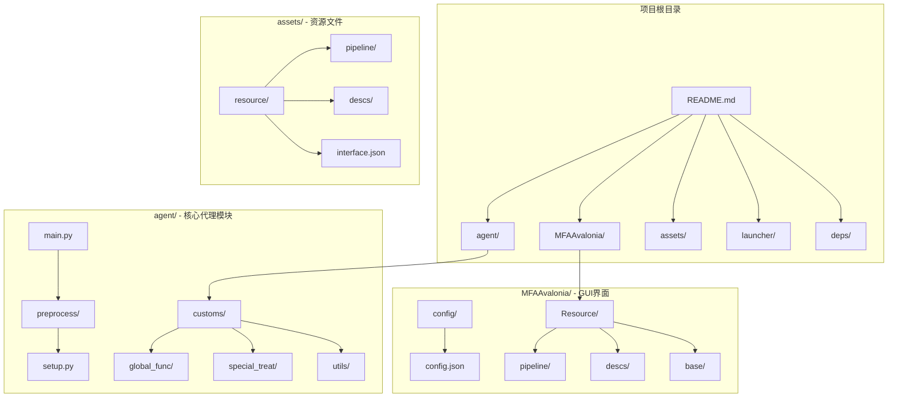
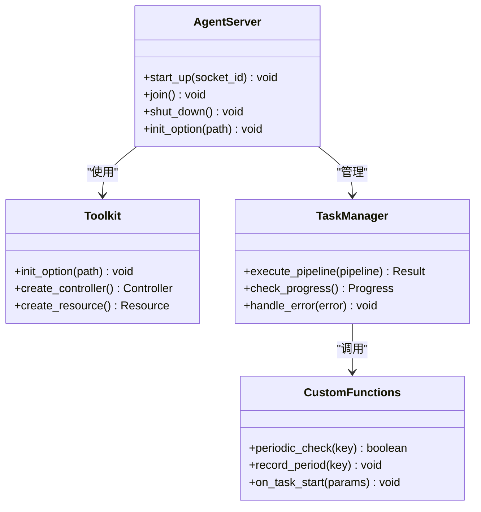
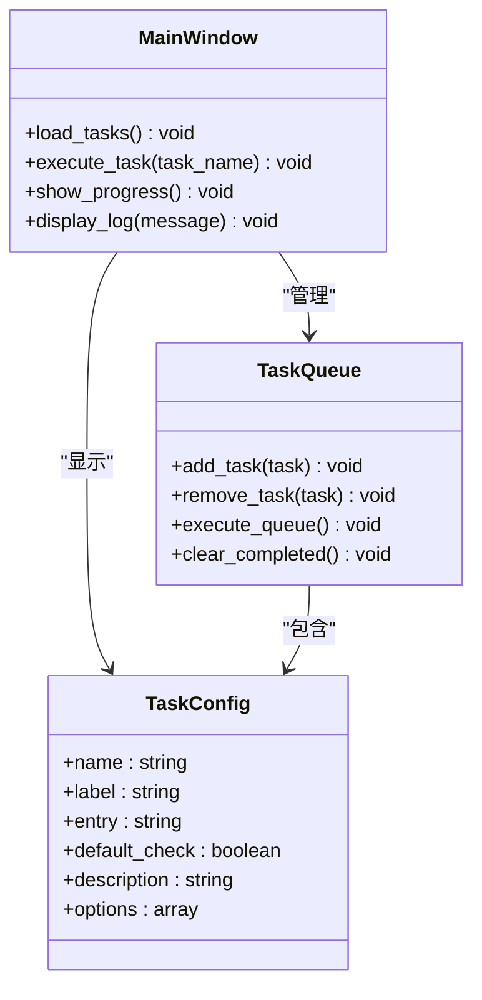
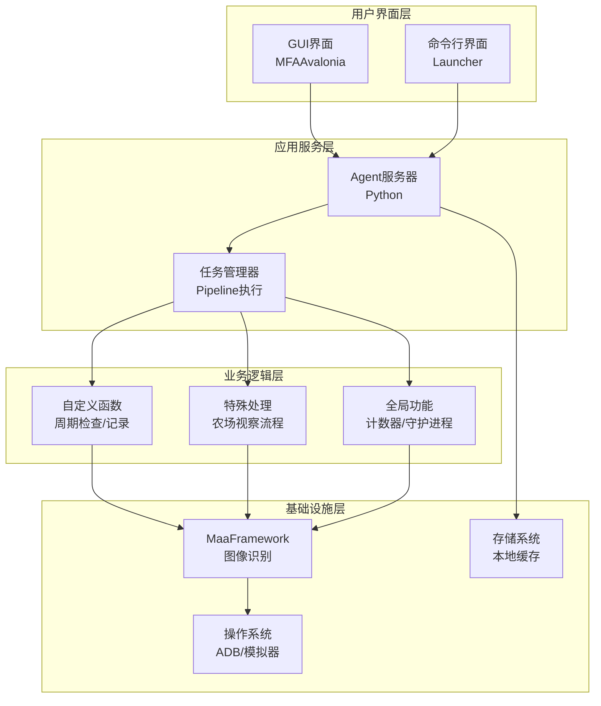
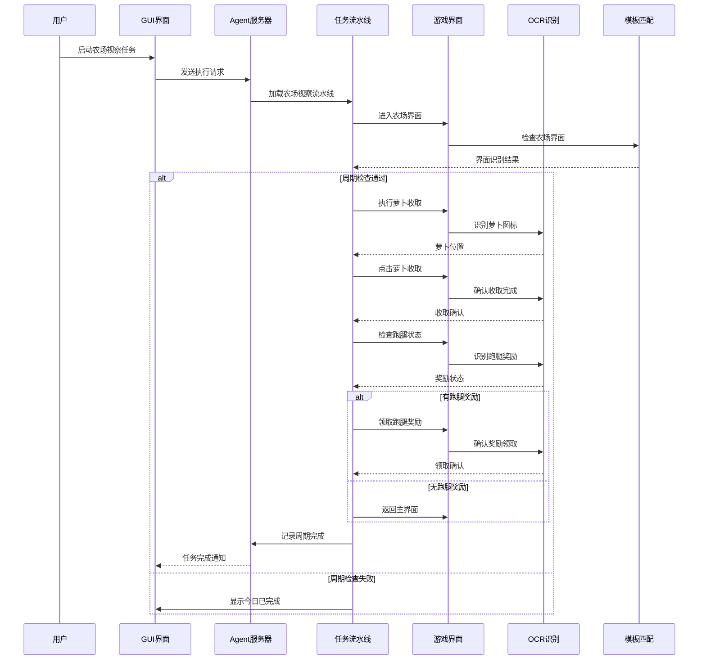
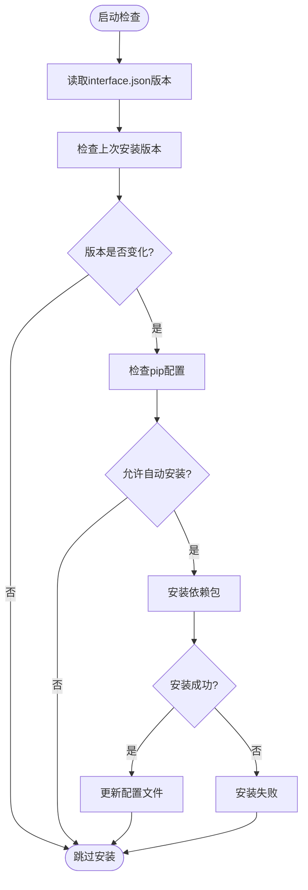
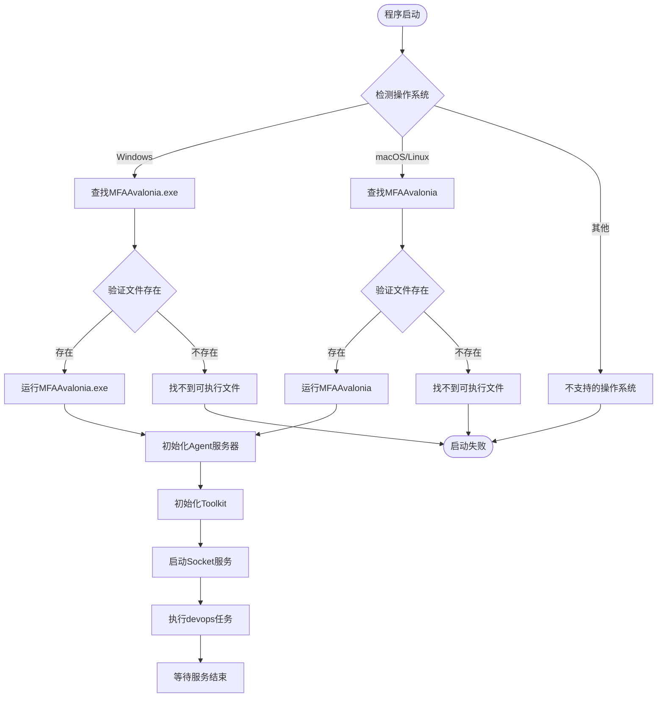
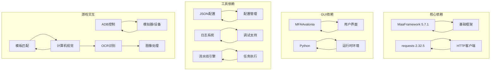

# 日常农场检查

<cite>
**本文档引用的文件**
- [README.md](file://README.md)
- [agent/main.py](file://agent/main.py)
- [launcher/MaaDuDuL.py](file://launcher/MaaDuDuL.py)
- [MFAAvalonia/config/config.json](file://MFAAvalonia/config/config.json)
- [MFAAvalonia/Resource/base/default_pipeline.json](file://MFAAvalonia/Resource/base/default_pipeline.json)
- [MFAAvalonia/Resource/base/pipeline/日常任务/农场视察.json](file://MFAAvalonia/Resource/base/pipeline/日常任务/农场视察.json)
- [agent/preprocess/setup.py](file://agent/preprocess/setup.py)
- [requirements.txt](file://requirements.txt)
- [assets/resource/descs/daily/farm.md](file://assets/resource/descs/daily/farm.md)
</cite>

## 目录
1. [简介](#简介)
2. [项目结构](#项目结构)
3. [核心组件](#核心组件)
4. [架构概览](#架构概览)
5. [详细组件分析](#详细组件分析)
6. [依赖关系分析](#依赖关系分析)
7. [性能考虑](#性能考虑)
8. [故障排除指南](#故障排除指南)
9. [结论](#结论)

## 简介

"Daily Farm Inspection"（每日农场检查）是一个基于MaaFramework和MFAAvalonia框架开发的自动化农场管理助手。该项目专为《嘟嘟脸恶作剧》游戏设计，提供智能化的农场视察、萝卜收取和跑腿派遣功能。

该项目的核心目标是通过图像识别技术和模拟控制，自动完成游戏中的日常农场任务，包括：
- 自动收取农场萝卜
- 智能重新派遣跑腿任务
- 宠物萝卜收集
- 农场状态检查和记录

项目采用现代化的架构设计，结合了Python后端逻辑、Avalonia GUI界面和MaaFramework的图像识别能力。

## 项目结构

项目采用模块化组织结构，主要包含以下几个核心部分：

**图表来源**
- [agent/main.py](file://agent/main.py#L1-L78)
- [MFAAvalonia/config/config.json](file://MFAAvalonia/config/config.json#L1-L545)

**章节来源**
- [README.md](file://README.md#L1-L117)
- [agent/main.py](file://agent/main.py#L1-L78)

## 核心组件

### Agent服务器组件

Agent服务器是整个系统的核心控制单元，负责协调各个功能模块的工作。

**图表来源**
- [agent/main.py](file://agent/main.py#L47-L77)

### GUI界面组件

MFAAvalonia提供了现代化的图形用户界面，支持任务配置和状态监控。

**图表来源**
- [MFAAvalonia/config/config.json](file://MFAAvalonia/config/config.json#L34-L458)

**章节来源**
- [MFAAvalonia/config/config.json](file://MFAAvalonia/config/config.json#L1-L545)

## 架构概览

系统采用分层架构设计，实现了清晰的职责分离：

**图表来源**
- [agent/main.py](file://agent/main.py#L47-L77)
- [MFAAvalonia/config/config.json](file://MFAAvalonia/config/config.json#L1-L545)

## 详细组件分析

### 农场视察任务流程

农场视察是系统中最复杂的任务之一，涉及多个子流程和状态检查。

**图表来源**
- [MFAAvalonia/Resource/base/pipeline/日常任务/农场视察.json](file://MFAAvalonia/Resource/base/pipeline/日常任务/农场视察.json#L25-L447)

### 依赖管理系统

系统具备智能的依赖检测和安装功能，确保运行环境的完整性。

**图表来源**
- [agent/preprocess/setup.py](file://agent/preprocess/setup.py#L204-L230)

**章节来源**
- [MFAAvalonia/Resource/base/pipeline/日常任务/农场视察.json](file://MFAAvalonia/Resource/base/pipeline/日常任务/农场视察.json#L1-L449)
- [agent/preprocess/setup.py](file://agent/preprocess/setup.py#L1-L230)

### 启动流程分析

系统提供了多种启动方式，支持不同环境下的部署需求。

**图表来源**
- [launcher/MaaDuDuL.py](file://launcher/MaaDuDuL.py#L1-L22)
- [agent/main.py](file://agent/main.py#L47-L77)

**章节来源**
- [launcher/MaaDuDuL.py](file://launcher/MaaDuDuL.py#L1-L22)
- [agent/main.py](file://agent/main.py#L1-L78)

## 依赖关系分析

系统依赖关系复杂但层次清晰，主要依赖包括：

**图表来源**
- [requirements.txt](file://requirements.txt#L1-L3)

**章节来源**
- [requirements.txt](file://requirements.txt#L1-L3)

## 性能考虑

系统在设计时充分考虑了性能优化：

### 图像识别优化
- 使用模板匹配进行快速界面识别
- OCR识别采用ROI区域限定，提高准确率
- 自定义识别算法减少误判率

### 内存管理
- 采用流式处理避免大内存占用
- 及时释放图像资源和识别结果
- 缓存机制优化重复操作

### 网络通信
- HTTP请求超时控制
- 重试机制防止临时网络错误
- 连接池复用提升效率

## 故障排除指南

### 常见问题及解决方案

**Agent启动失败**
- 检查MaaFramework依赖是否正确安装
- 验证Python环境编码设置
- 查看调试日志获取详细错误信息

**图像识别失败**
- 确认游戏分辨率和缩放设置
- 检查图像资源文件完整性
- 调整OCR识别参数和阈值

**ADB连接问题**
- 验证模拟器/设备连接状态
- 检查ADB路径配置
- 重启ADB服务尝试重新连接

**任务执行异常**
- 查看任务流水线配置
- 检查自定义函数实现
- 验证权限和资源访问

**章节来源**
- [agent/main.py](file://agent/main.py#L69-L71)
- [agent/preprocess/setup.py](file://agent/preprocess/setup.py#L190-L196)

## 结论

Daily Farm Inspection项目展现了现代自动化工具开发的最佳实践。通过合理的架构设计、完善的组件分离和智能化的任务执行机制，成功实现了农场管理的自动化。

项目的主要优势包括：
- **模块化设计**：清晰的职责分离便于维护和扩展
- **智能识别**：结合OCR和模板匹配提高识别准确性
- **用户友好**：提供直观的GUI界面和详细的配置选项
- **稳定可靠**：完善的错误处理和恢复机制

未来可以考虑的功能增强：
- 更多游戏场景的支持
- 机器学习算法的应用
- 实时状态监控和通知
- 多账户并发管理