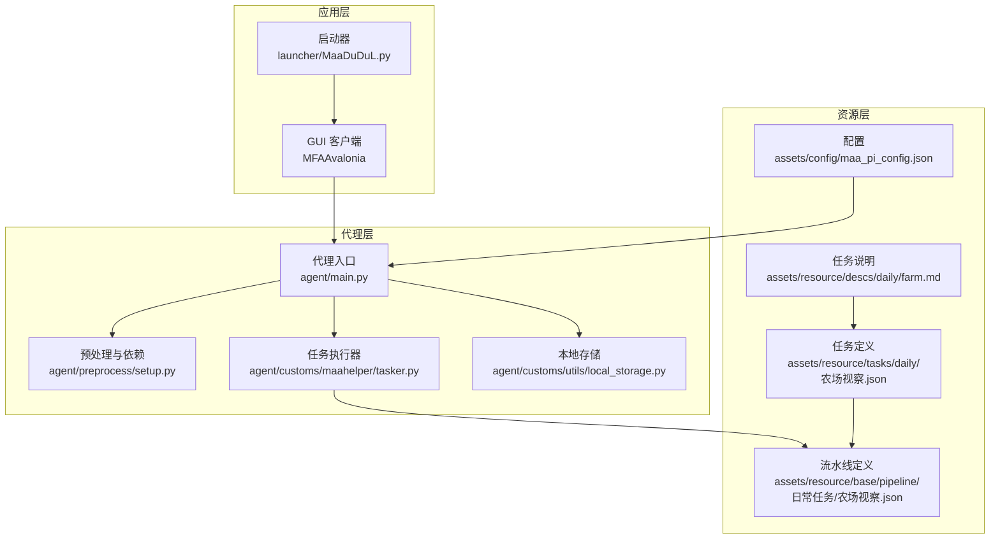
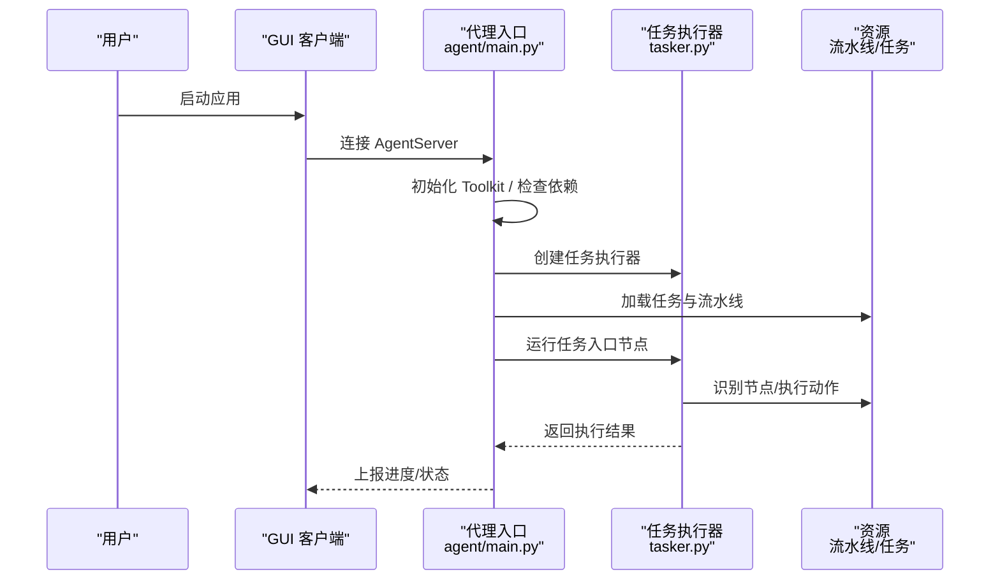
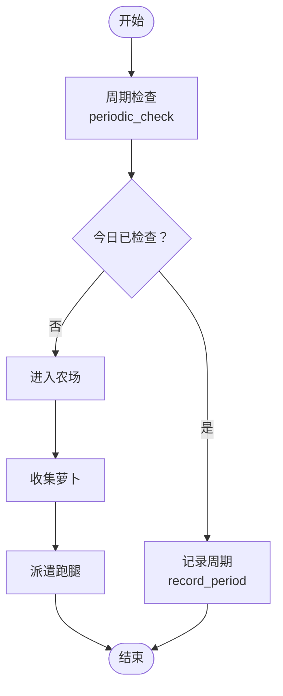
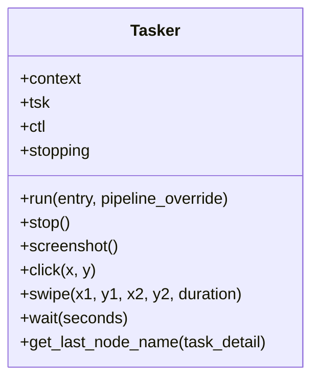
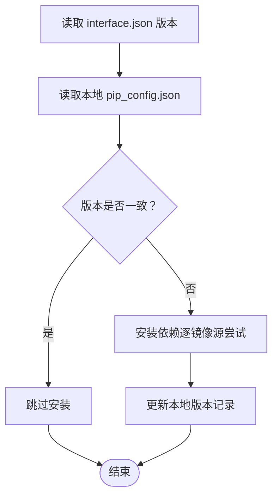
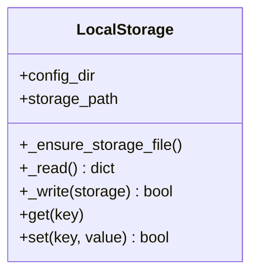
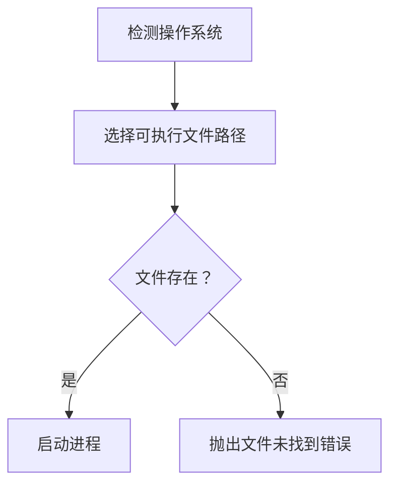
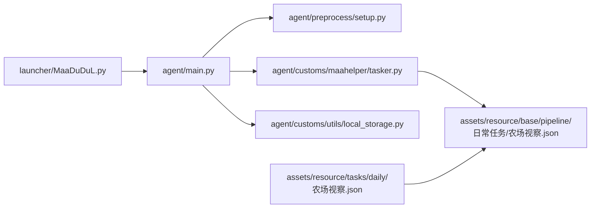

# Daily Farm Inspection

<cite>
**本文引用的文件**
- [README.md](file://README.md)
- [agent/main.py](file://agent/main.py)
- [assets/resource/tasks/daily/农场视察.json](file://assets/resource/tasks/daily/农场视察.json)
- [assets/resource/base/pipeline/日常任务/农场视察.json](file://assets/resource/base/pipeline/日常任务/农场视察.json)
- [assets/config/maa_pi_config.json](file://assets/config/maa_pi_config.json)
- [assets/resource/descs/daily/farm.md](file://assets/resource/descs/daily/farm.md)
- [agent/customs/maahelper/tasker.py](file://agent/customs/maahelper/tasker.py)
- [agent/preprocess/setup.py](file://agent/preprocess/setup.py)
- [agent/customs/utils/local_storage.py](file://agent/customs/utils/local_storage.py)
- [launcher/MaaDuDuL.py](file://launcher/MaaDuDuL.py)
- [package.json](file://package.json)
</cite>

## 目录
1. [简介](#简介)
2. [项目结构](#项目结构)
3. [核心组件](#核心组件)
4. [架构总览](#架构总览)
5. [详细组件分析](#详细组件分析)
6. [依赖关系分析](#依赖关系分析)
7. [性能考虑](#性能考虑)
8. [故障排除指南](#故障排除指南)
9. [结论](#结论)
10. [附录](#附录)

## 简介
本项目为基于 MaaFramework 与 MFAAvalonia 的自动化助手，面向游戏“嘟嘟脸恶作剧”提供日常任务自动化，其中“农场视察”作为核心日常功能之一，实现自动收取萝卜与重新派遣跑腿的全流程自动化。项目采用模块化设计，通过任务流水线（Pipeline）与自定义动作扩展，结合本地存储与依赖管理，形成稳定可维护的自动化体系。

## 项目结构
项目采用功能域与层次相结合的组织方式：
- agent：自动化代理与业务逻辑，包含任务执行器、预处理与自定义功能模块
- assets：资源与配置，包含任务描述、流水线定义、OCR模型与界面说明
- launcher：可执行程序入口，负责启动 GUI 客户端
- 其他：CI/构建脚本、文档站点、工具脚本与依赖清单

**图表来源**
- [launcher/MaaDuDuL.py:1-22](file://launcher/MaaDuDuL.py#L1-L22)
- [agent/main.py:1-78](file://agent/main.py#L1-L78)
- [agent/preprocess/setup.py:1-230](file://agent/preprocess/setup.py#L1-L230)
- [agent/customs/maahelper/tasker.py:1-190](file://agent/customs/maahelper/tasker.py#L1-L190)
- [agent/customs/utils/local_storage.py:1-111](file://agent/customs/utils/local_storage.py#L1-L111)
- [assets/resource/tasks/daily/农场视察.json:1-67](file://assets/resource/tasks/daily/农场视察.json#L1-L67)
- [assets/resource/base/pipeline/日常任务/农场视察.json:1-449](file://assets/resource/base/pipeline/日常任务/农场视察.json#L1-L449)
- [assets/resource/descs/daily/farm.md:1-13](file://assets/resource/descs/daily/farm.md#L1-L13)
- [assets/config/maa_pi_config.json:1-3](file://assets/config/maa_pi_config.json#L1-L3)

**章节来源**
- [README.md:1-117](file://README.md#L1-L117)
- [package.json:1-14](file://package.json#L1-L14)

## 核心组件
- 代理入口与生命周期管理：负责初始化环境、依赖检查、启动 Agent 服务、执行签到与等待服务结束
- 任务执行器：封装 MaaFramework 的上下文与控制器，提供截图、点击、滑动、等待等基础能力，并支持节点级运行与覆盖
- 预处理与依赖安装：根据 interface.json 版本判断是否需要安装依赖，支持镜像源切换与失败回退
- 本地存储：提供键值持久化，用于周期性检查与状态记录
- 任务与流水线：通过 JSON 定义任务选项、节点流程与识别策略，支持条件分支与错误处理

**章节来源**
- [agent/main.py:47-78](file://agent/main.py#L47-L78)
- [agent/customs/maahelper/tasker.py:16-190](file://agent/customs/maahelper/tasker.py#L16-L190)
- [agent/preprocess/setup.py:204-230](file://agent/preprocess/setup.py#L204-L230)
- [agent/customs/utils/local_storage.py:10-111](file://agent/customs/utils/local_storage.py#L10-L111)

## 架构总览
系统采用“GUI → 代理 → 任务执行器 → 资源（流水线/识别）”的分层架构。GUI 通过 MaaFramework 的 AgentServer 与代理通信；代理负责环境初始化与依赖安装；任务执行器基于资源定义的流水线节点执行自动化操作；资源层提供任务说明、流水线节点与配置。

**图表来源**
- [agent/main.py:47-78](file://agent/main.py#L47-L78)
- [agent/customs/maahelper/tasker.py:60-122](file://agent/customs/maahelper/tasker.py#L60-L122)
- [assets/resource/base/pipeline/日常任务/农场视察.json:1-449](file://assets/resource/base/pipeline/日常任务/农场视察.json#L1-L449)

## 详细组件分析

### 任务：农场视察
农场视察任务包含“周期检查”“收获萝卜”“派遣跑腿”三大子流程，支持通过任务选项进行开关控制与节点覆盖，确保在不同状态下跳过不必要步骤。

**图表来源**
- [assets/resource/base/pipeline/日常任务/农场视察.json:38-77](file://assets/resource/base/pipeline/日常任务/农场视察.json#L38-L77)
- [assets/resource/base/pipeline/日常任务/农场视察.json:361-380](file://assets/resource/base/pipeline/日常任务/农场视察.json#L361-L380)
- [assets/resource/base/pipeline/日常任务/农场视察.json:339-360](file://assets/resource/base/pipeline/日常任务/农场视察.json#L339-L360)

**章节来源**
- [assets/resource/tasks/daily/农场视察.json:1-67](file://assets/resource/tasks/daily/农场视察.json#L1-L67)
- [assets/resource/base/pipeline/日常任务/农场视察.json:1-449](file://assets/resource/base/pipeline/日常任务/农场视察.json#L1-L449)
- [assets/resource/descs/daily/farm.md:1-13](file://assets/resource/descs/daily/farm.md#L1-L13)

### 任务执行器（Tasker）
Tasker 封装了 MaaFramework 的 Context、Tasker 与 Controller，提供统一的截图、点击、滑动、等待与任务运行接口，并支持节点级 pipeline 覆盖与错误处理注入，保证任务流程可控与可观测。

**图表来源**
- [agent/customs/maahelper/tasker.py:16-190](file://agent/customs/maahelper/tasker.py#L16-L190)

**章节来源**
- [agent/customs/maahelper/tasker.py:16-190](file://agent/customs/maahelper/tasker.py#L16-L190)

### 预处理与依赖安装
预处理模块根据 interface.json 的版本号与本地配置对比，决定是否执行依赖安装；支持多镜像源与失败回退，确保在不同网络环境下稳定安装。

**图表来源**
- [agent/preprocess/setup.py:204-230](file://agent/preprocess/setup.py#L204-L230)
- [agent/preprocess/setup.py:135-198](file://agent/preprocess/setup.py#L135-L198)

**章节来源**
- [agent/preprocess/setup.py:204-230](file://agent/preprocess/setup.py#L204-L230)

### 本地存储
本地存储模块提供键值持久化能力，用于记录周期性任务状态（如“农场视察”），避免重复执行。

**图表来源**
- [agent/customs/utils/local_storage.py:10-111](file://agent/customs/utils/local_storage.py#L10-L111)

**章节来源**
- [agent/customs/utils/local_storage.py:10-111](file://agent/customs/utils/local_storage.py#L10-L111)

### 启动器
启动器根据操作系统选择对应可执行文件并启动，确保跨平台兼容。

**图表来源**
- [launcher/MaaDuDuL.py:7-22](file://launcher/MaaDuDuL.py#L7-L22)

**章节来源**
- [launcher/MaaDuDuL.py:1-22](file://launcher/MaaDuDuL.py#L1-L22)

## 依赖关系分析
- 代理入口依赖 Toolkit 初始化、依赖检查与 AgentServer 生命周期管理
- 任务执行器依赖资源层的流水线节点与识别策略
- 本地存储为周期性检查与状态记录提供支撑
- 启动器与 GUI 交互，间接驱动代理工作

**图表来源**
- [agent/main.py:47-78](file://agent/main.py#L47-L78)
- [agent/preprocess/setup.py:204-230](file://agent/preprocess/setup.py#L204-L230)
- [agent/customs/maahelper/tasker.py:60-122](file://agent/customs/maahelper/tasker.py#L60-L122)
- [assets/resource/base/pipeline/日常任务/农场视察.json:1-449](file://assets/resource/base/pipeline/日常任务/农场视察.json#L1-L449)
- [assets/resource/tasks/daily/农场视察.json:1-67](file://assets/resource/tasks/daily/农场视察.json#L1-L67)
- [launcher/MaaDuDuL.py:1-22](file://launcher/MaaDuDuL.py#L1-L22)

**章节来源**
- [agent/main.py:47-78](file://agent/main.py#L47-L78)
- [agent/preprocess/setup.py:204-230](file://agent/preprocess/setup.py#L204-L230)
- [agent/customs/maahelper/tasker.py:60-122](file://agent/customs/maahelper/tasker.py#L60-L122)
- [assets/resource/base/pipeline/日常任务/农场视察.json:1-449](file://assets/resource/base/pipeline/日常任务/农场视察.json#L1-L449)
- [assets/resource/tasks/daily/农场视察.json:1-67](file://assets/resource/tasks/daily/农场视察.json#L1-L67)
- [launcher/MaaDuDuL.py:1-22](file://launcher/MaaDuDuL.py#L1-L22)

## 性能考虑
- 节点覆盖与错误处理注入：通过在 next 与 on_error 前注入监测器，减少无效遍历，提升流程收敛速度
- 识别 ROI 与模板匹配：限定识别区域与使用模板匹配，降低误判与计算开销
- 等待策略：合理设置 pre/post delay 与超时，平衡稳定性与效率
- 依赖安装镜像源：多镜像源与失败回退机制，缩短安装等待时间

## 故障排除指南
- 依赖安装失败：检查 pip_config.json 的 enable_pip_install 与 mirrors 配置，确认网络连通性
- 任务无法识别：核对任务说明与流水线节点的 ROI/模板是否匹配当前分辨率与语言
- 周期性任务重复执行：检查本地存储中对应键值是否正确更新
- 启动器找不到可执行文件：确认 launcher 选择的路径与实际文件名一致

**章节来源**
- [agent/preprocess/setup.py:75-110](file://agent/preprocess/setup.py#L75-L110)
- [agent/customs/utils/local_storage.py:24-59](file://agent/customs/utils/local_storage.py#L24-L59)
- [launcher/MaaDuDuL.py:17-22](file://launcher/MaaDuDuL.py#L17-L22)

## 结论
“农场视察”功能通过清晰的任务选项与节点化流水线，实现了稳定的自动化执行。配合本地存储与多镜像源依赖安装机制，项目在易用性与可维护性上达到良好平衡。建议在使用前阅读任务说明与流水线节点，确保识别参数与界面状态匹配，以获得最佳自动化体验。

## 附录
- 任务说明与起止界面可在任务描述文件中查看
- 配置文件用于指定资源环境（如 B 服）

**章节来源**
- [assets/resource/descs/daily/farm.md:1-13](file://assets/resource/descs/daily/farm.md#L1-L13)
- [assets/config/maa_pi_config.json:1-3](file://assets/config/maa_pi_config.json#L1-L3)