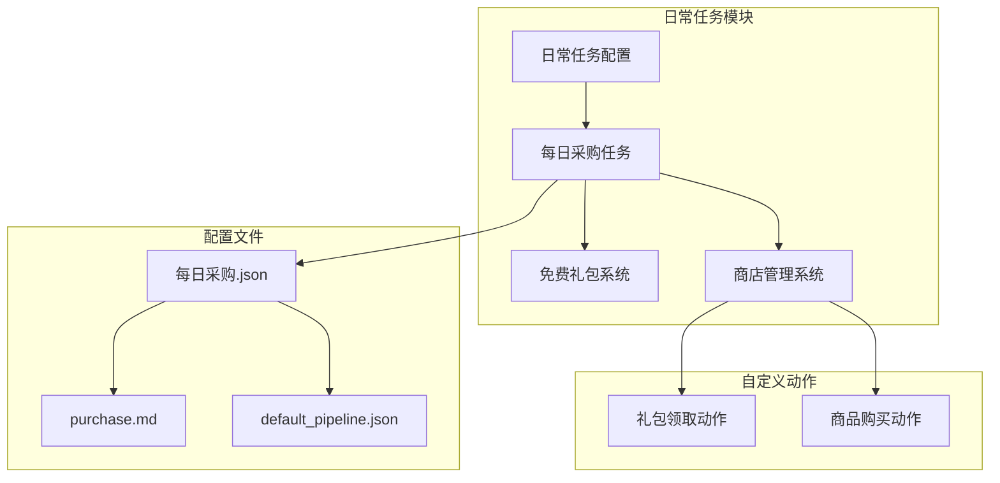
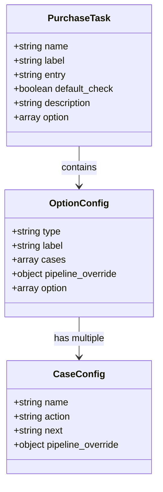
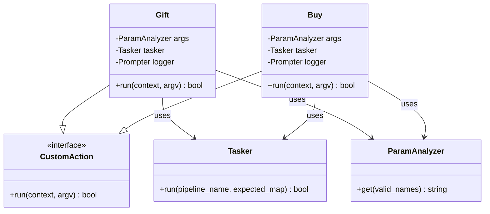
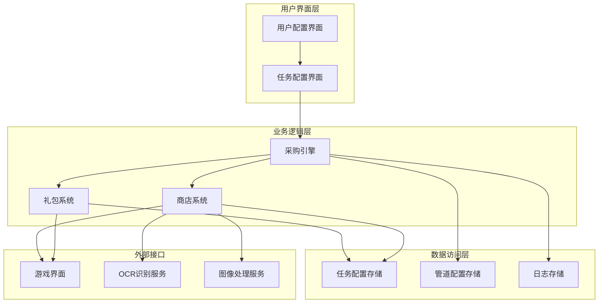
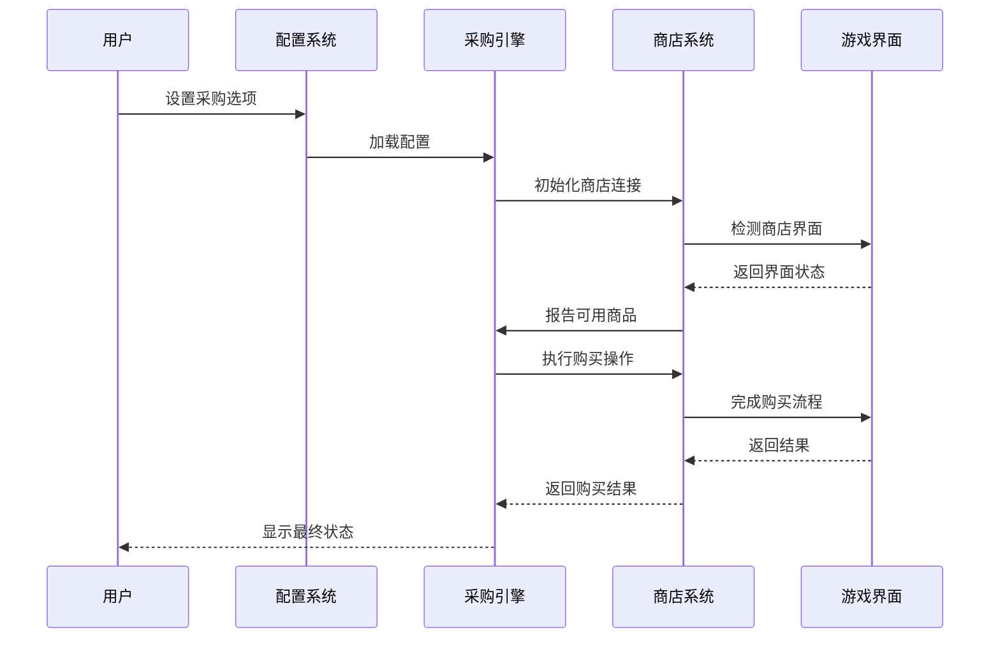
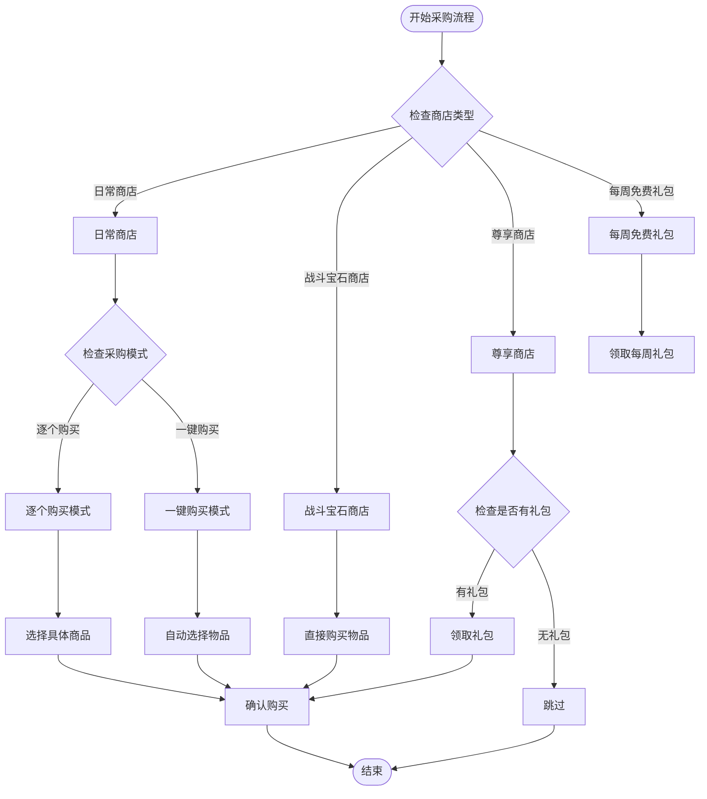
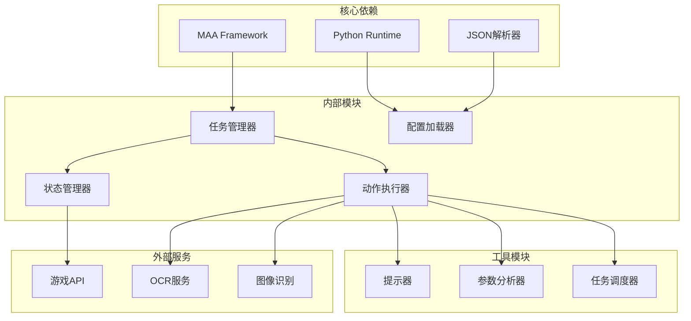
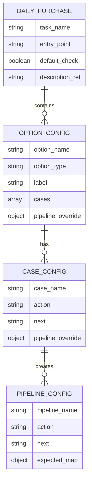
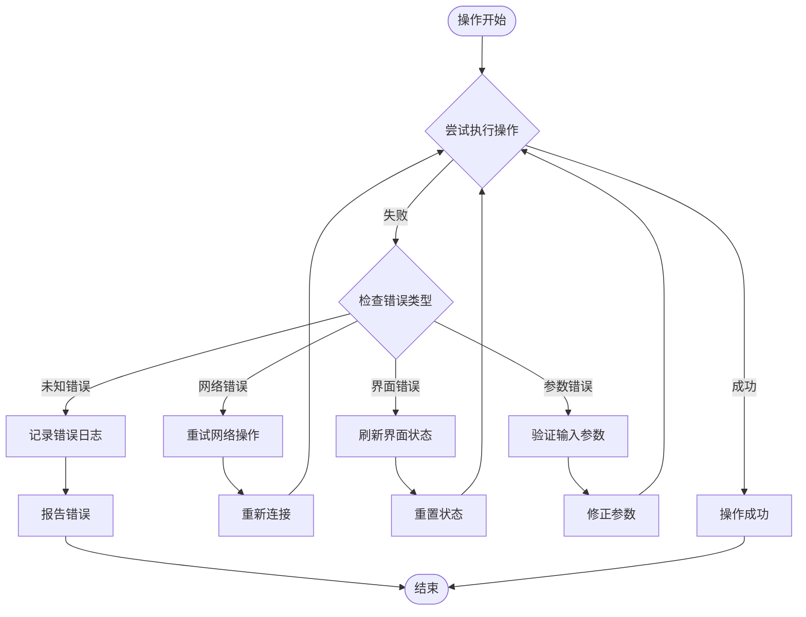

# 日常采购功能文档

<cite>
**本文档引用的文件**
- [每日采购.json](file://assets/resource/tasks/daily/每日采购.json)
- [purchase.md](file://assets/resource/descs/daily/purchase.md)
- [store.py](file://agent/customs/special_treat/store.py)
- [default_pipeline.json](file://assets/resource/base/default_pipeline.json)
</cite>

## 目录
1. [简介](#简介)
2. [项目结构概览](#项目结构概览)
3. [核心组件分析](#核心组件分析)
4. [架构设计](#架构设计)
5. [详细功能分析](#详细功能分析)
6. [依赖关系分析](#依赖关系分析)
7. [性能考虑](#性能考虑)
8. [故障排除指南](#故障排除指南)
9. [结论](#结论)

## 简介

日常采购功能是MaaDuDuL自动化框架中的一个核心日常任务模块，专门负责处理游戏中的每日免费礼包领取和商店采购操作。该功能通过高度模块化的配置系统，实现了对各种商店类型的智能识别和自动化操作。

该功能具有以下特点：
- 支持多种免费礼包类型（每日、每周、每月）
- 覆盖多个商店类型（日常商店、战斗宝石商店、尊享商店等）
- 提供灵活的采购模式（逐个购买、一键购买）
- 具备完善的错误处理和状态监控机制

## 项目结构概览

日常采购功能在项目中的组织结构如下：

**图表来源**
- [每日采购.json:1-456](file://assets/resource/tasks/daily/每日采购.json#L1-L456)
- [store.py:1-96](file://agent/customs/special_treat/store.py#L1-L96)

**章节来源**
- [每日采购.json:1-456](file://assets/resource/tasks/daily/每日采购.json#L1-L456)
- [purchase.md:1-13](file://assets/resource/descs/daily/purchase.md#L1-L13)

## 核心组件分析

### 任务配置系统

日常采购功能采用JSON配置驱动的方式，通过复杂的嵌套结构实现精细化的功能控制：

**图表来源**
- [每日采购.json:1-456](file://assets/resource/tasks/daily/每日采购.json#L1-L456)

### 自定义动作模块

系统提供了两个核心的自定义动作类来处理具体的业务逻辑：

**图表来源**
- [store.py:14-95](file://agent/customs/special_treat/store.py#L14-L95)

**章节来源**
- [store.py:1-96](file://agent/customs/special_treat/store.py#L1-L96)

## 架构设计

### 整体架构图

**图表来源**
- [每日采购.json:1-456](file://assets/resource/tasks/daily/每日采购.json#L1-L456)
- [store.py:1-96](file://agent/customs/special_treat/store.py#L1-L96)

### 数据流架构

**图表来源**
- [每日采购.json:145-161](file://assets/resource/tasks/daily/每日采购.json#L145-L161)
- [store.py:52-95](file://agent/customs/special_treat/store.py#L52-L95)

## 详细功能分析

### 免费礼包系统

系统支持三种不同周期的免费礼包：

| 礼包类型 | 周期频率 | 触发条件 | 特殊功能 |
|---------|---------|---------|----------|
| 每日免费礼包 | 每日 | 服务器时间变化 | 周期检查、重复领取保护 |
| 每周免费礼包 | 每周 | 星期一凌晨 | 周期检查、自动重置 |
| 每月免费礼包 | 每月 | 每月1日凌晨 | 周期检查、月份验证 |

### 商店采购系统

系统支持四种主要商店类型：

**图表来源**
- [每日采购.json:180-230](file://assets/resource/tasks/daily/每日采购.json#L180-L230)
- [每日采购.json:385-453](file://assets/resource/tasks/daily/每日采购.json#L385-L453)

### 商品采购模式

系统提供两种不同的采购模式：

#### 逐个购买模式
- **适用场景**：需要精确控制购买的商品
- **优势**：完全可控，可以针对特定商品进行优化
- **劣势**：操作步骤较多，耗时较长
- **典型商品**：朱珠糖、星星糖、锻造书、魔卡龙等

#### 一键购买模式
- **适用场景**：批量购买预设的商品组合
- **优势**：操作简便，效率高
- **劣势**：需要预先配置好购买清单
- **使用要求**：需要用户自行勾选要购买的物品

**章节来源**
- [每日采购.json:198-230](file://assets/resource/tasks/daily/每日采购.json#L198-L230)

## 依赖关系分析

### 组件依赖图

**图表来源**
- [store.py:6-11](file://agent/customs/special_treat/store.py#L6-L11)

### 配置依赖关系

**图表来源**
- [每日采购.json:12-454](file://assets/resource/tasks/daily/每日采购.json#L12-L454)

**章节来源**
- [default_pipeline.json:1-8](file://assets/resource/base/default_pipeline.json#L1-L8)

## 性能考虑

### 执行效率优化

日常采购功能在设计时充分考虑了执行效率：

1. **智能跳过机制**：通过周期检查避免重复操作
2. **批量处理**：一键购买模式减少交互次数
3. **缓存策略**：状态信息本地缓存减少重复查询
4. **并发控制**：合理的时间间隔设置避免过度频繁的操作

### 资源管理

- **内存使用**：配置信息按需加载，避免内存占用过高
- **网络带宽**：OCR识别和图像处理采用本地化方案
- **CPU占用**：异步处理机制减少主线程阻塞

## 故障排除指南

### 常见问题及解决方案

| 问题类型 | 症状描述 | 可能原因 | 解决方案 |
|---------|---------|---------|---------|
| 配置加载失败 | 任务无法启动 | JSON格式错误或文件缺失 | 检查配置文件语法，确保文件存在 |
| 商店识别失败 | 无法进入商店界面 | OCR识别错误或界面变化 | 调整OCR参数，更新界面识别规则 |
| 购买操作超时 | 购买流程中断 | 网络延迟或游戏响应慢 | 增加超时等待时间，检查网络连接 |
| 礼包领取失败 | 礼包无法领取 | 礼包已过期或已被领取 | 检查礼包状态，重新触发领取流程 |

### 错误处理机制

系统采用多层次的错误处理策略：

**图表来源**
- [store.py:48-49](file://agent/customs/special_treat/store.py#L48-L49)
- [store.py:94-95](file://agent/customs/special_treat/store.py#L94-L95)

**章节来源**
- [store.py:14-95](file://agent/customs/special_treat/store.py#L14-L95)

## 结论

日常采购功能作为MaaDuDuL自动化框架的重要组成部分，展现了现代自动化系统的几个关键特征：

1. **模块化设计**：通过清晰的组件分离实现了高度的可维护性和可扩展性
2. **配置驱动**：灵活的配置系统使得功能可以根据需求进行定制
3. **错误处理**：完善的异常处理机制确保了系统的稳定运行
4. **用户体验**：直观的界面设计和详细的帮助文档提升了用户的使用体验

该功能的成功实施为类似的游戏自动化任务提供了良好的参考模板，其设计理念和实现方法值得在其他自动化项目中借鉴和应用。