# 日常圣团巡礼功能文档

<cite>
**本文档引用的文件**
- [圣团巡礼.json](file://assets/resource/base/pipeline/日常任务/圣团巡礼.json)
- [圣团巡礼.md](file://assets/resource/descs/daily/saint_tour.md)
- [main.py](file://agent/main.py)
- [tasker.py](file://agent/customs/maahelper/tasker.py)
- [counter.py](file://agent/customs/global_func/counter.py)
- [counter.py](file://agent/customs/utils/counter.py)
- [local_storage.py](file://agent/customs/utils/local_storage.py)
- [setup.py](file://agent/preprocess/setup.py)
- [periodic_check.py](file://agent/customs/global_func/periodic_check.py)
- [prompter.py](file://agent/customs/utils/prompter.py)
- [saint_tour.json](file://assets/resource/tasks/daily/saint_tour.json)
</cite>

## 更新摘要
**变更内容**
- 升级至 v1.3.1 版本，管道文件从约1300行扩展到1715行
- **重大调整**：任务流重新组织，从'圣团巡礼_开始'节点恢复到'圣团巡礼_开始1'节点作为主要入口
- **坐标修正**：viewport坐标更新，x: -4408, y: -552, zoom: 0.72
- **任务流变更**：下一个任务从'圣团巡礼_冒险开始'改为'圣团巡礼_宠物礼物开始'
- **lastSyncTime更新**：文件同步时间为1774525564220
- 新增房间探索系统，支持多房间类型识别和循环管理
- 扩展宠物互动功能，新增区域循环管理和多地点寻访
- 完善冒险协调系统，支持角色轮换和日程管理
- 增强周期检查机制，支持更精细的任务调度控制
- 新增世界树奖励检测和额外奖励处理功能

## 目录
1. [功能概述](#功能概述)
2. [项目结构](#项目结构)
3. [核心组件](#核心组件)
4. [架构概览](#架构概览)
5. [详细组件分析](#详细组件分析)
6. [依赖关系分析](#依赖关系分析)
7. [性能考虑](#性能考虑)
8. [故障排除指南](#故障排除指南)
9. [结论](#结论)

## 功能概述

日常圣团巡礼功能是MaaDuDuL项目中的一个自动化日常任务系统，专门用于自动完成《蔚蓝档案》游戏中的圣团巡礼相关日常任务。该功能支持四种主要的日常活动：

- **收获世界树**：自动收集世界树的奖励，包括基础奖励和额外奖励检测
- **参观并打扫房间**：自动参观并清理各个房间，支持多种房间类型识别和循环管理
- **领取宠物礼物**：自动寻找并领取宠物礼物，支持多地点宠物寻访和区域循环
- **冒险协调**：管理角色的冒险日程，支持角色轮换和日程选择

该功能具有智能的周期检查机制，可以避免重复执行已完成的任务，并提供灵活的配置选项和强大的错误恢复能力。

## 项目结构

该项目采用模块化设计，主要包含以下关键目录结构：

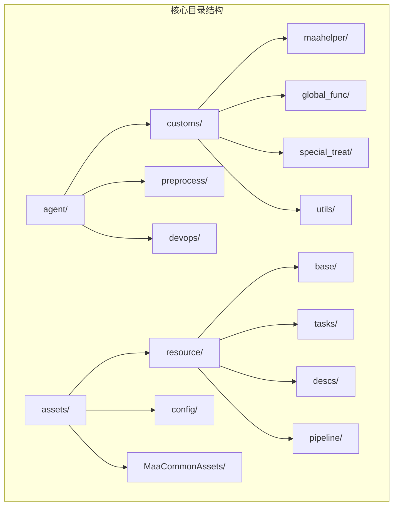

**图表来源**
- [main.py:1-78](file://agent/main.py#L1-L78)
- [圣团巡礼.json:1-1715](file://assets/resource/base/pipeline/日常任务/圣团巡礼.json#L1-L1715)

**章节来源**
- [main.py:1-78](file://agent/main.py#L1-L78)
- [setup.py:1-230](file://agent/preprocess/setup.py#L1-L230)

## 核心组件

### 任务配置系统

圣团巡礼功能通过JSON配置文件定义完整的任务流程和选项：

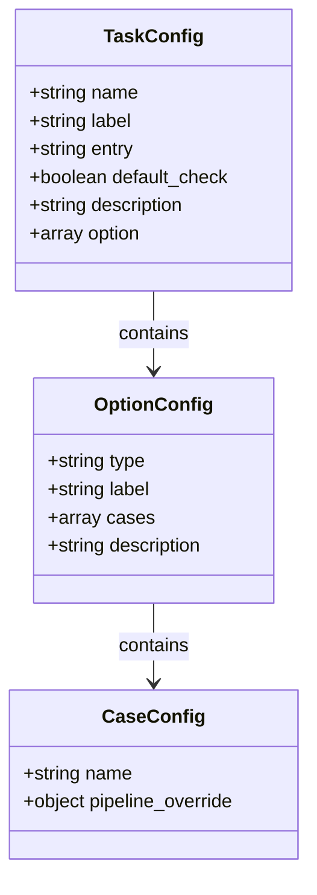

**图表来源**
- [圣团巡礼.json:1-1715](file://assets/resource/base/pipeline/日常任务/圣团巡礼.json#L1-L1715)

### 任务执行器

任务执行器封装了MaaFramework的核心功能，提供统一的任务执行接口：

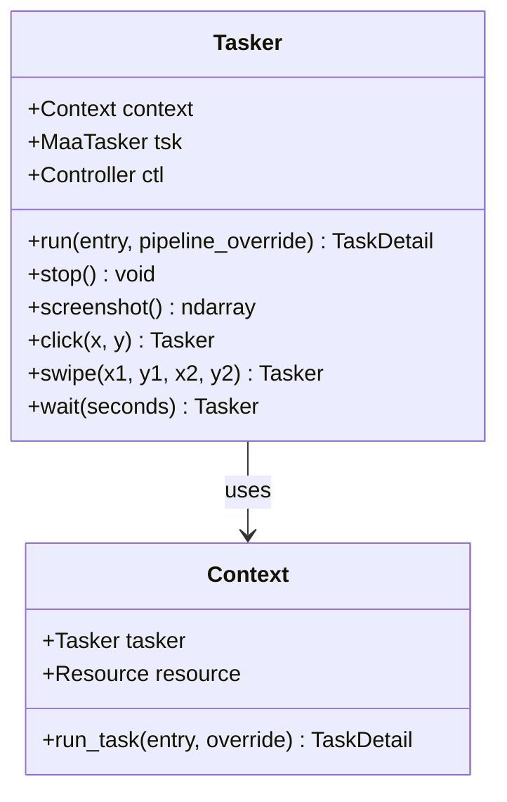

**图表来源**
- [tasker.py:16-190](file://agent/customs/maahelper/tasker.py#L16-L190)

**章节来源**
- [tasker.py:16-190](file://agent/customs/maahelper/tasker.py#L16-L190)
- [圣团巡礼.json:1-1715](file://assets/resource/base/pipeline/日常任务/圣团巡礼.json#L1-L1715)

## 架构概览

### 整体架构设计

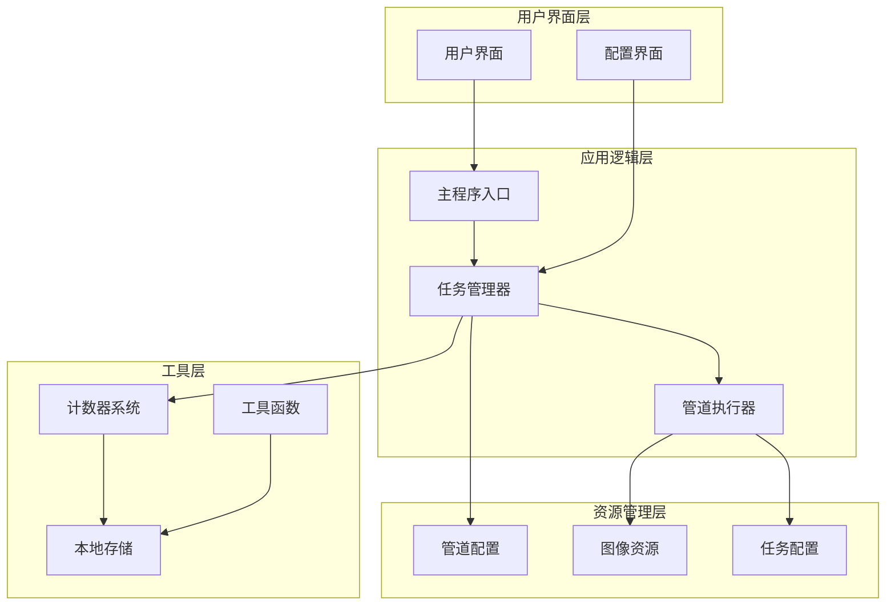

**图表来源**
- [main.py:47-78](file://agent/main.py#L47-L78)
- [圣团巡礼.json:1-1715](file://assets/resource/base/pipeline/日常任务/圣团巡礼.json#L1-L1715)

### 任务执行流程

```mermaid
sequenceDiagram
participant User as 用户
participant Main as 主程序
participant Tasker as 任务执行器
participant Pipeline as 管道系统
participant Game as 游戏界面
User->>Main : 启动圣团巡礼任务
Main->>Tasker : 初始化任务执行器
Tasker->>Pipeline : 加载管道配置
Pipeline->>Game : 进入圣团界面
Game-->>Pipeline : 界面识别成功
alt 收获世界树
Pipeline->>Game : 查找世界树
Game-->>Pipeline : 发现世界树
Pipeline->>Game : 点击收获
Game-->>Pipeline : 获得奖励
alt 参观房间
Pipeline->>Game : 打开参观列表
Game-->>Pipeline : 显示房间列表
Pipeline->>Game : 依次清理房间
Game-->>Pipeline : 完成清理
alt 领取宠物礼物
Pipeline->>Game : 寻找宠物
Game-->>Pipeline : 发现宠物
Pipeline->>Game : 领取礼物
Game-->>Pipeline : 礼物已领取
else 冒险协调
Pipeline->>Game : 检查冒险日程
Game-->>Pipeline : 发现可用冒险
Pipeline->>Game : 选择角色和日程
Game-->>Pipeline : 完成冒险
end
Pipeline->>Game : 返回主界面
Game-->>User : 任务完成
```

**图表来源**
- [main.py:47-78](file://agent/main.py#L47-L78)
- [tasker.py:60-122](file://agent/customs/maahelper/tasker.py#L60-L122)
- [圣团巡礼.json:607-1715](file://assets/resource/base/pipeline/日常任务/圣团巡礼.json#L607-L1715)

## 详细组件分析

### 任务配置组件

#### 主任务配置

主任务配置定义了圣团巡礼的基本信息和入口点：

| 配置项 | 值 | 描述 |
|--------|-----|------|
| name | 圣团巡礼 | 任务名称 |
| label | ⛪圣团巡礼 | 显示标签 |
| entry | 圣团巡礼_开始1 | 入口节点（已更新） |
| default_check | true | 默认启用 |
| description | Resource/descs/daily/saint_tour.md | 描述文件路径 |
| version | v1.3.1 | 当前版本 |

#### 选项配置系统

系统支持四个主要选项，每个选项都有独立的开关控制：

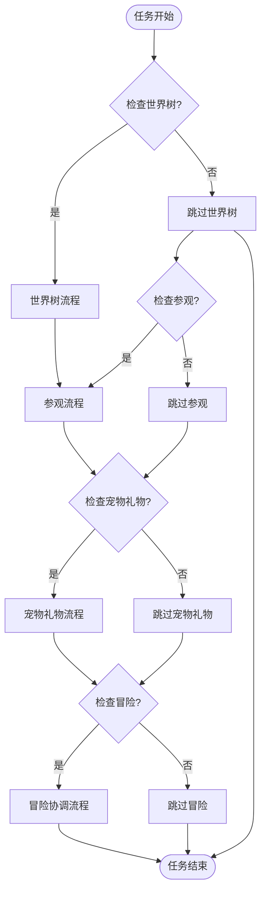

**图表来源**
- [圣团巡礼.json:1-1715](file://assets/resource/base/pipeline/日常任务/圣团巡礼.json#L1-L1715)

#### 周期检查机制

系统实现了智能的周期检查机制，防止重复执行：

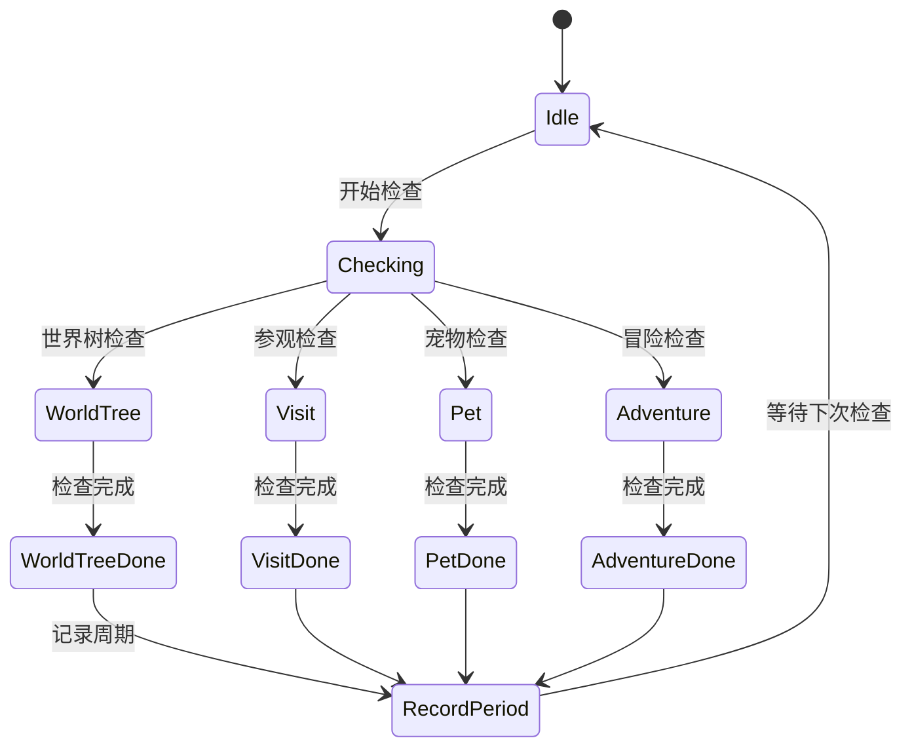

**图表来源**
- [圣团巡礼.json:254-299](file://assets/resource/base/pipeline/日常任务/圣团巡礼.json#L254-L299)
- [圣团巡礼.json:541-586](file://assets/resource/base/pipeline/日常任务/圣团巡礼.json#L541-L586)
- [圣团巡礼.json:658-703](file://assets/resource/base/pipeline/日常任务/圣团巡礼.json#L658-L703)

**章节来源**
- [圣团巡礼.json:1-1715](file://assets/resource/base/pipeline/日常任务/圣团巡礼.json#L1-L1715)

### 管道执行组件

#### 管道节点设计

管道系统通过节点化的任务流程实现复杂的自动化操作：

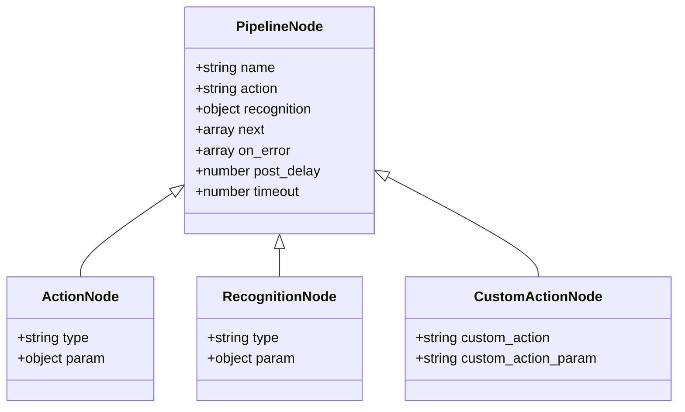

**图表来源**
- [圣团巡礼.json:25-1715](file://assets/resource/base/pipeline/日常任务/圣团巡礼.json#L25-L1715)

#### 关键管道节点

系统包含多个关键的管道节点，每个节点负责特定的功能：

| 节点类型 | 功能描述 | 关键参数 |
|----------|----------|----------|
| 圣团巡礼_开始 | 任务入口节点 | custom_action: on_task_start |
| 圣团巡礼_进入圣团 | 进入圣团界面 | template: main/holy.png |
| 圣团巡礼_收获世界树 | 收获世界树奖励 | target: 世界树坐标 |
| 圣团巡礼_参观开始 | 开始参观流程 | next: 参观周期检查 |
| 圣团巡礼_领取宠物礼物 | 领取宠物礼物 | template: holy/love.png |
| 圣团巡礼_冒险开始 | 开始冒险流程 | next: 冒险周期检查 |
| 圣团巡礼_切换至各地点 | 多地点宠物寻访 | custom_action: run |

**更新** 任务流重新组织后的节点关系：
- **主要入口**：从'圣团巡礼_开始'恢复到'圣团巡礼_开始1'节点
- **任务顺序**：世界树 → 宠物礼物 → 冒险协调
- **坐标修正**：viewport坐标更新为 x: -4408, y: -552, zoom: 0.72

**章节来源**
- [圣团巡礼.json:607-1715](file://assets/resource/base/pipeline/日常任务/圣团巡礼.json#L607-L1715)

### 计数器系统

#### 计数器管理器

计数器系统提供了灵活的状态管理和周期控制功能：

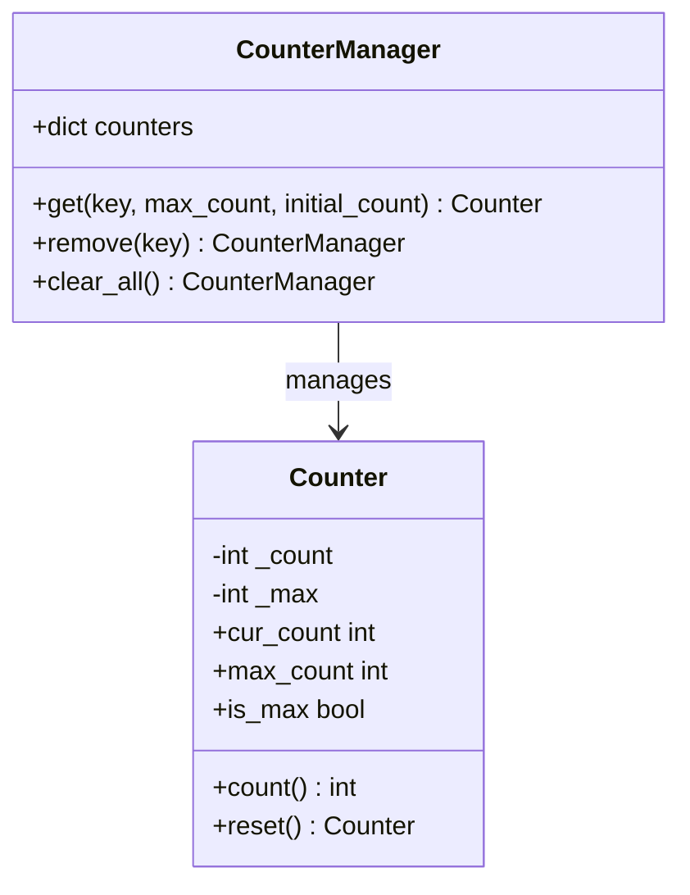

**图表来源**
- [counter.py:75-141](file://agent/customs/utils/counter.py#L75-L141)

#### 自定义计数器动作

系统提供了三个自定义的计数器相关动作：

| 动作名称 | 功能 | 参数 |
|----------|------|------|
| init_counter | 初始化计数器 | key, initial_count, max_count |
| count | 执行计数操作 | key |
| check_counter | 检查计数器状态 | key |

**章节来源**
- [counter.py:21-118](file://agent/customs/global_func/counter.py#L21-L118)
- [counter.py:75-141](file://agent/customs/utils/counter.py#L75-L141)

### 本地存储系统

#### 数据持久化

本地存储系统提供了键值对的数据持久化功能：

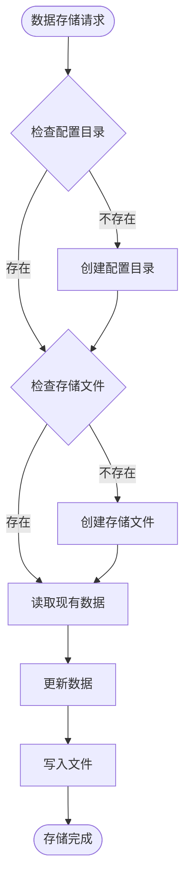

**图表来源**
- [local_storage.py:24-111](file://agent/customs/utils/local_storage.py#L24-L111)

**章节来源**
- [local_storage.py:10-111](file://agent/customs/utils/local_storage.py#L10-L111)

### 周期检查系统

#### 周期检查器

周期检查系统提供了智能的任务执行时机控制：

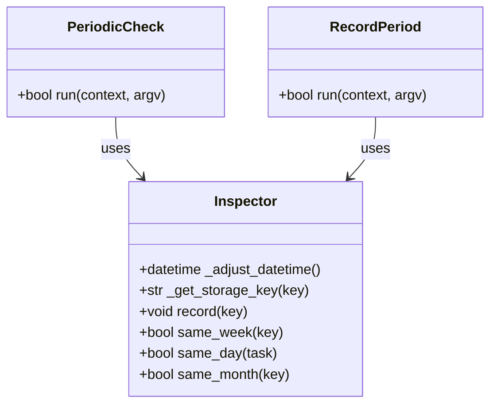

**图表来源**
- [periodic_check.py:29-279](file://agent/customs/global_func/periodic_check.py#L29-L279)

#### 周期检查功能

系统支持按天、按周、按月三种周期模式：

| 周期类型 | 功能 | 参数 |
|----------|------|------|
| day/d | 按天检查 | k=任务标识符 |
| week/w | 按周检查 | k=任务标识符 |
| month/m | 按月检查 | k=任务标识符 |

**章节来源**
- [periodic_check.py:185-279](file://agent/customs/global_func/periodic_check.py#L185-L279)

### 提示器系统

#### 错误处理机制

提示器系统提供了统一的日志输出和错误处理功能：

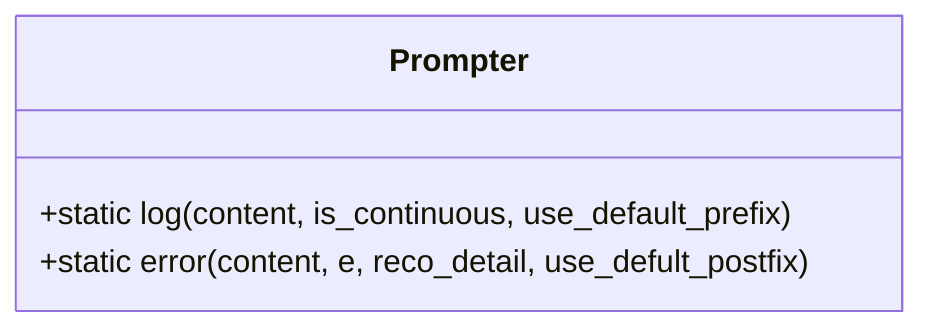

**图表来源**
- [prompter.py:16-55](file://agent/customs/utils/prompter.py#L16-L55)

**章节来源**
- [prompter.py:16-55](file://agent/customs/utils/prompter.py#L16-L55)

## 依赖关系分析

### 外部依赖

项目依赖于多个关键的外部库和框架：

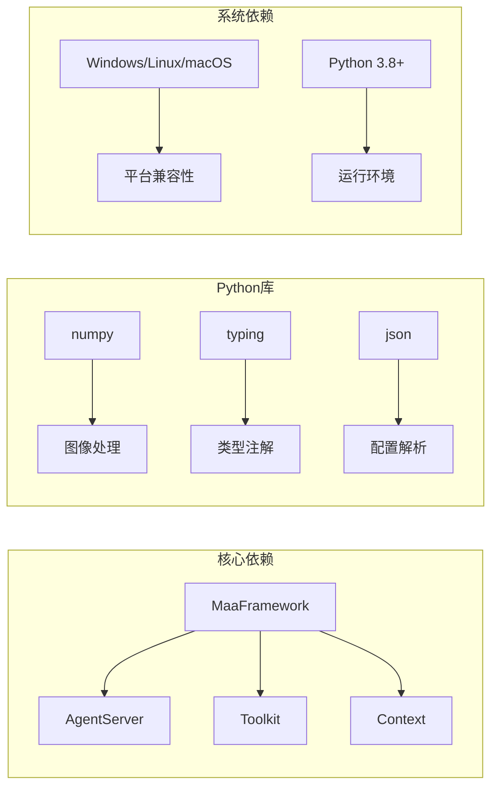

**图表来源**
- [main.py:49-53](file://agent/main.py#L49-L53)
- [setup.py:135-198](file://agent/preprocess/setup.py#L135-L198)

### 内部模块依赖

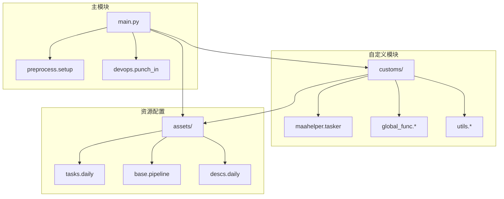

**图表来源**
- [main.py:44-67](file://agent/main.py#L44-L67)
- [setup.py:204-230](file://agent/preprocess/setup.py#L204-L230)

**章节来源**
- [main.py:44-78](file://agent/main.py#L44-L78)
- [setup.py:1-230](file://agent/preprocess/setup.py#L1-L230)

## 性能考虑

### 执行效率优化

系统在设计时考虑了多个性能优化方面：

1. **异步任务处理**：利用MaaFramework的异步特性提高任务执行效率
2. **智能重试机制**：在识别失败时自动重试，减少人工干预
3. **缓存策略**：合理使用图像模板缓存，减少重复计算
4. **内存管理**：及时释放不再使用的资源和对象
5. **节点复用**：通过CustomAction实现节点功能复用

### 资源管理

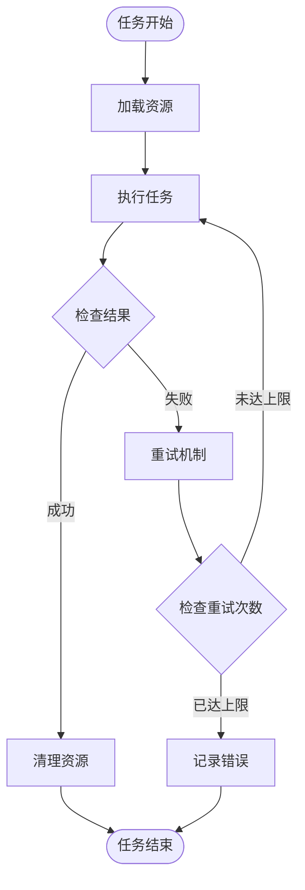

## 故障排除指南

### 常见问题及解决方案

| 问题类型 | 症状 | 解决方案 |
|----------|------|----------|
| 识别失败 | 任务卡在某个界面 | 检查图像模板匹配度，调整ROI区域 |
| 点击无效 | 点击坐标不正确 | 校准屏幕分辨率，重新录制坐标 |
| 周期检查失效 | 重复执行相同任务 | 检查计数器状态，重置计数器 |
| 资源缺失 | 任务无法启动 | 检查依赖安装，重新安装资源包 |
| 冒险日程冲突 | 角色无法选择 | 检查角色状态，等待休息中状态结束 |
| 宠物寻访失败 | 无法找到宠物 | 检查多地点切换，确认宠物出现 |
| 房间探索异常 | 无法正确识别房间类型 | 检查特征匹配参数，调整阈值 |
| **坐标偏移** | 界面元素位置不正确 | **检查viewport坐标修正** |

### 调试工具

系统提供了多种调试和监控工具：

1. **日志记录**：详细的执行日志和错误信息
2. **截图功能**：自动截取关键执行时刻的屏幕
3. **状态监控**：实时监控任务执行状态
4. **错误恢复**：自动错误检测和恢复机制

**章节来源**
- [setup.py:135-198](file://agent/preprocess/setup.py#L135-L198)
- [tasker.py:128-183](file://agent/customs/maahelper/tasker.py#L128-L183)

## 结论

日常圣团巡礼功能是一个设计精良的自动化任务系统，经过v1.3.1版本的重大升级，现已具备以下特点：

1. **模块化设计**：清晰的模块分离和职责划分
2. **灵活配置**：支持四种任务选项和自定义配置
3. **智能控制**：完善的周期检查和状态管理机制
4. **强大扩展性**：新增房间探索、多地点宠物寻访、区域循环管理等功能
5. **稳定可靠**：完善的错误处理和恢复机制
6. **高效执行**：优化的节点设计和资源管理

**重大更新总结**：
- **任务流重组**：从'圣团巡礼_开始'节点恢复到'圣团巡礼_开始1'节点，优化了任务执行顺序
- **坐标修正**：viewport坐标更新为 x: -4408, y: -552, zoom: 0.72，提高了界面适配准确性
- **任务顺序调整**：下一个任务从'圣团巡礼_冒险开始'改为'圣团巡礼_宠物礼物开始'，符合新的执行逻辑
- **lastSyncTime更新**：文件同步时间为1774525564220，确保配置文件的最新状态

该系统为玩家提供了高效、可靠的自动化游戏体验，是MaaDuDuL项目的重要组成部分。通过合理的架构设计和丰富的功能实现，成功地解决了游戏日常任务的自动化需求。v1.3.1版本的大幅扩展使其成为了一个功能完整、稳定性强的综合自动化解决方案。