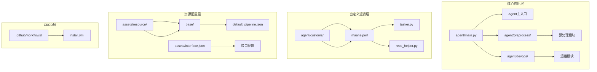
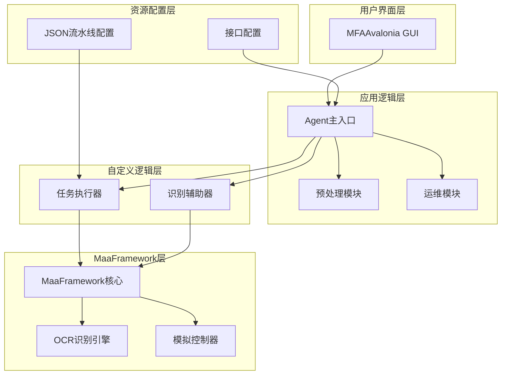
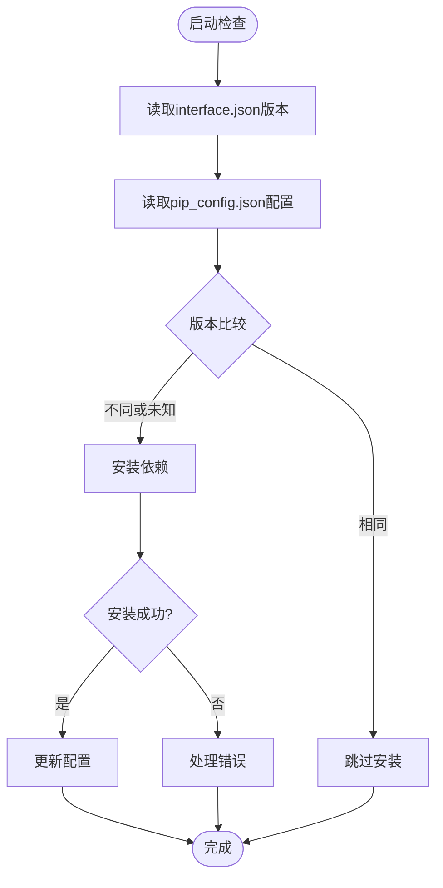
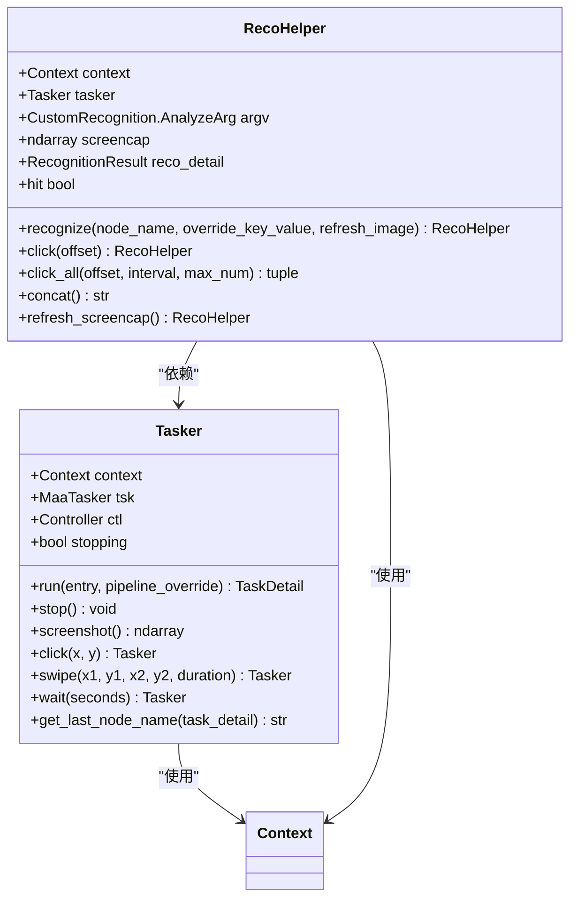
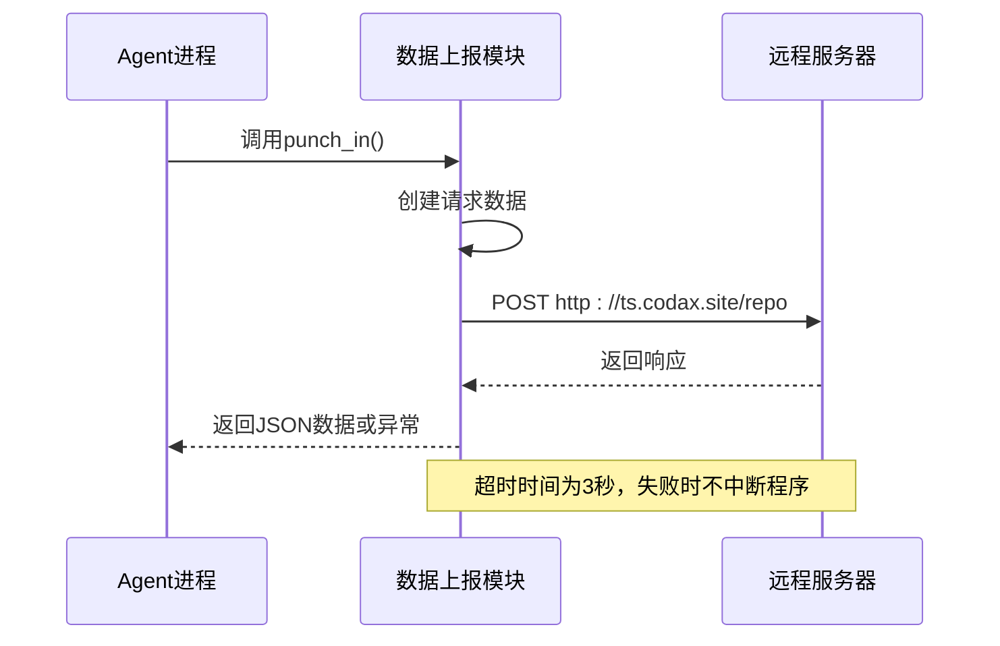
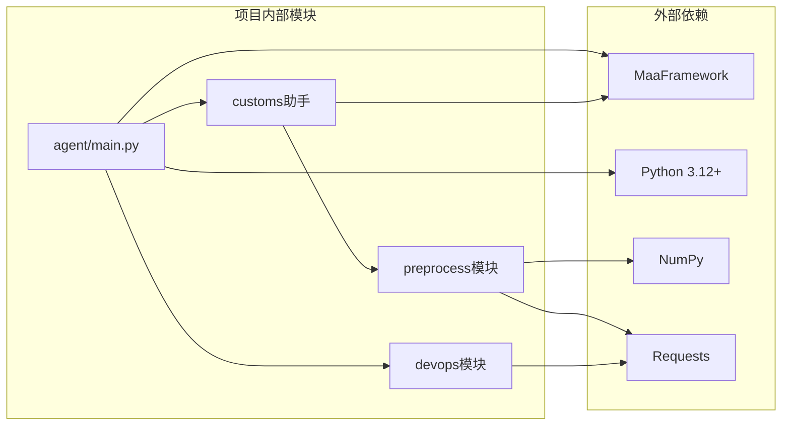

# 传统流水线执行

<cite>
**本文档引用的文件**
- [agent/main.py](file://agent/main.py)
- [agent/preprocess/setup.py](file://agent/preprocess/setup.py)
- [agent/preprocess/clear.py](file://agent/preprocess/clear.py)
- [agent/devops/report.py](file://agent/devops/report.py)
- [agent/customs/maahelper/tasker.py](file://agent/customs/maahelper/tasker.py)
- [agent/customs/maahelper/reco_helper.py](file://agent/customs/maahelper/reco_helper.py)
- [assets/resource/base/default_pipeline.json](file://assets/resource/base/default_pipeline.json)
- [.github/workflows/install.yml](file://.github/workflows/install.yml)
- [README.md](file://README.md)
</cite>

## 目录
1. [简介](#简介)
2. [项目结构](#项目结构)
3. [核心组件](#核心组件)
4. [架构概览](#架构概览)
5. [详细组件分析](#详细组件分析)
6. [依赖关系分析](#依赖关系分析)
7. [性能考虑](#性能考虑)
8. [故障排除指南](#故障排除指南)
9. [结论](#结论)

## 简介

MaaDuDuL（MDDL）是一个基于MaaFramework和MFAAvalonia的自动化助手，专门用于《嘟嘟脸恶作剧》游戏的自动化操作。该项目采用传统的流水线执行模式，通过JSON配置文件定义任务流程，结合Python自定义逻辑实现复杂的自动化操作。

该项目的核心特点包括：
- 基于MaaFramework的图像识别和模拟控制
- 通过JSON流水线文件定义任务流程
- 自动化的依赖管理和环境配置
- 支持多种游戏功能的自动化执行

## 项目结构

项目采用模块化设计，主要分为以下几个核心部分：

**图表来源**
- [agent/main.py:1-78](file://agent/main.py#L1-L78)
- [agent/preprocess/setup.py:1-230](file://agent/preprocess/setup.py#L1-L230)
- [agent/devops/report.py:1-34](file://agent/devops/report.py#L1-L34)

**章节来源**
- [README.md:1-117](file://README.md#L1-L117)
- [agent/main.py:1-78](file://agent/main.py#L1-L78)

## 核心组件

### Agent主入口组件

Agent主入口负责整个系统的初始化和协调工作，包括环境设置、依赖检查、服务启动等功能。

### 预处理组件

预处理组件包含两个主要功能：
- **依赖管理**：自动检测和安装Python依赖包
- **清理功能**：清理调试产生的临时文件

### 自定义助手组件

自定义助手组件提供MaaFramework的高级封装，包括任务执行器和识别辅助器。

### 运维组件

运维组件负责数据上报和统计功能，向远程服务器发送使用信息。

**章节来源**
- [agent/main.py:47-77](file://agent/main.py#L47-L77)
- [agent/preprocess/setup.py:204-230](file://agent/preprocess/setup.py#L204-L230)
- [agent/preprocess/clear.py:31-41](file://agent/preprocess/clear.py#L31-L41)

## 架构概览

MaaDuDuL采用分层架构设计，从底层的MaaFramework到顶层的应用逻辑，形成了清晰的职责分离：

**图表来源**
- [agent/main.py:49-67](file://agent/main.py#L49-L67)
- [agent/customs/maahelper/tasker.py:16-58](file://agent/customs/maahelper/tasker.py#L16-L58)
- [agent/customs/maahelper/reco_helper.py:17-58](file://agent/customs/maahelper/reco_helper.py#L17-L58)

## 详细组件分析

### 依赖管理系统

依赖管理系统是整个项目的核心基础设施，负责确保运行环境的正确性和完整性。

**图表来源**
- [agent/preprocess/setup.py:204-230](file://agent/preprocess/setup.py#L204-L230)
- [agent/preprocess/setup.py:135-198](file://agent/preprocess/setup.py#L135-L198)

依赖管理的关键特性包括：
- **版本跟踪**：通过interface.json和pip_config.json实现版本控制
- **镜像源支持**：支持多个镜像源，提高安装成功率
- **嵌入式Python**：优先使用项目内置的Python环境
- **错误处理**：完善的异常处理机制，确保系统稳定性

**章节来源**
- [agent/preprocess/setup.py:29-46](file://agent/preprocess/setup.py#L29-L46)
- [agent/preprocess/setup.py:57-72](file://agent/preprocess/setup.py#L57-L72)
- [agent/preprocess/setup.py:135-198](file://agent/preprocess/setup.py#L135-L198)

### 任务执行器组件

任务执行器是对MaaFramework的高级封装，提供了更易用的API接口。

**图表来源**
- [agent/customs/maahelper/tasker.py:16-190](file://agent/customs/maahelper/tasker.py#L16-L190)
- [agent/customs/maahelper/reco_helper.py:17-256](file://agent/customs/maahelper/reco_helper.py#L17-L256)

任务执行器的主要功能包括：
- **智能节点管理**：自动为所有节点注入运行监测器
- **统一API接口**：提供简洁一致的操作接口
- **链式调用支持**：支持方法链式调用提升代码可读性
- **截图和控制**：集成截图、点击、滑动等基础操作

**章节来源**
- [agent/customs/maahelper/tasker.py:60-122](file://agent/customs/maahelper/tasker.py#L60-L122)
- [agent/customs/maahelper/reco_helper.py:62-94](file://agent/customs/maahelper/reco_helper.py#L62-L94)

### 数据上报组件

数据上报组件负责向远程服务器发送使用统计信息，用于项目监控和分析。

**图表来源**
- [agent/devops/report.py:9-33](file://agent/devops/report.py#L9-L33)

数据上报的关键特性：
- **轻量级设计**：简单的POST请求，不干扰主业务逻辑
- **容错处理**：网络异常时不会影响Agent正常运行
- **隐私保护**：只发送必要的统计信息
- **快速响应**：超时时间控制在合理范围内

**章节来源**
- [agent/devops/report.py:9-33](file://agent/devops/report.py#L9-L33)

### 默认流水线配置

默认流水线配置文件定义了系统的基本运行参数和行为规范。

| 配置项 | 默认值 | 描述 |
|--------|--------|------|
| timeout | 30000 | 任务超时时间（毫秒） |
| pre_delay | 600 | 任务前延迟（毫秒） |
| repeat_delay | 400 | 重复任务间隔（毫秒） |

这些配置参数直接影响任务执行的稳定性和效率，需要根据具体的游戏环境和硬件条件进行调整。

**章节来源**
- [assets/resource/base/default_pipeline.json:1-8](file://assets/resource/base/default_pipeline.json#L1-L8)

## 依赖关系分析

项目的依赖关系相对简单，主要围绕MaaFramework展开：

**图表来源**
- [agent/main.py:49-53](file://agent/main.py#L49-L53)
- [agent/preprocess/setup.py:135-198](file://agent/preprocess/setup.py#L135-L198)

**章节来源**
- [agent/main.py:49-53](file://agent/main.py#L49-L53)
- [agent/preprocess/setup.py:135-198](file://agent/preprocess/setup.py#L135-L198)

## 性能考虑

### 内存管理

项目采用了高效的内存管理模式：
- **延迟加载**：只有在需要时才加载相关的资源和模块
- **及时释放**：任务完成后及时释放占用的内存资源
- **缓存策略**：对频繁使用的截图进行缓存，减少重复操作

### 网络优化

数据上报模块采用了优化的网络策略：
- **短连接**：使用一次性HTTP请求，避免长时间连接占用
- **超时控制**：严格的超时机制，防止阻塞主程序
- **重试机制**：在网络异常时自动重试，提高成功率

### 任务调度

任务执行采用了智能的调度策略：
- **异步处理**：大部分操作都是异步执行，提高并发性能
- **错误恢复**：具备完善的错误恢复机制，避免单点故障
- **资源监控**：实时监控系统资源使用情况，及时调整执行策略

## 故障排除指南

### 常见问题及解决方案

**问题1：依赖安装失败**
- 检查网络连接和代理设置
- 尝试更换镜像源
- 确认Python版本兼容性

**问题2：任务执行异常**
- 检查游戏界面是否符合预期
- 验证OCR模型文件完整性
- 查看日志文件获取详细错误信息

**问题3：数据上报失败**
- 检查网络连接状态
- 验证服务器地址可达性
- 查看防火墙设置

**章节来源**
- [agent/preprocess/setup.py:190-196](file://agent/preprocess/setup.py#L190-L196)
- [agent/devops/report.py:32-33](file://agent/devops/report.py#L32-L33)

### 调试技巧

1. **启用详细日志**：通过修改日志级别获取更多信息
2. **截图验证**：使用截图功能验证识别准确性
3. **逐步调试**：将复杂任务分解为简单步骤逐一测试
4. **环境隔离**：在独立环境中测试新功能

## 结论

MaaDuDuL项目展现了传统流水线执行模式在游戏自动化领域的强大能力。通过精心设计的模块化架构和完善的错误处理机制，该项目实现了稳定可靠的自动化操作。

项目的主要优势包括：
- **模块化设计**：清晰的职责分离便于维护和扩展
- **自动化程度高**：从依赖管理到任务执行全程自动化
- **稳定性强**：完善的错误处理和恢复机制
- **易于使用**：简洁的API接口和丰富的示例

未来的发展方向可能包括：
- **性能优化**：进一步提升任务执行效率
- **功能扩展**：支持更多游戏功能的自动化
- **智能化改进**：引入机器学习提升识别准确率
- **用户体验优化**：改善用户界面和交互体验

通过持续的改进和完善，MaaDuDuL将继续为用户提供强大而可靠的游戏自动化解决方案。