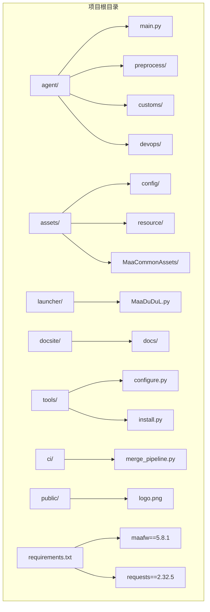
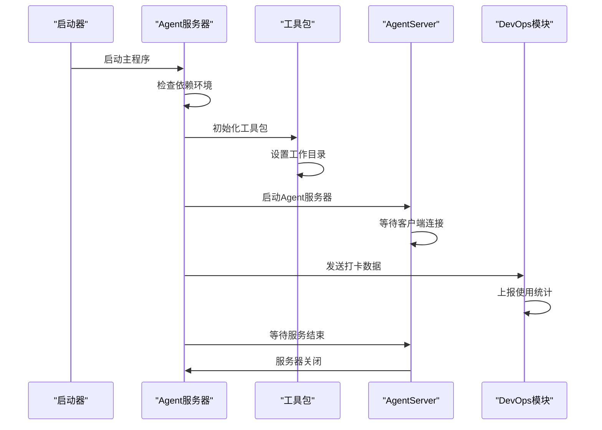
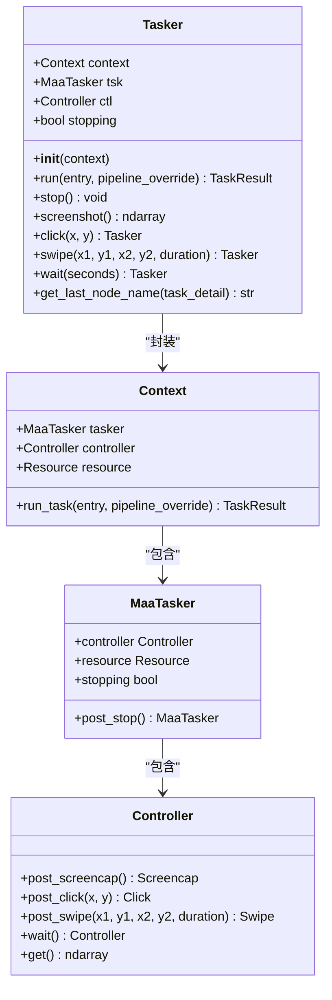
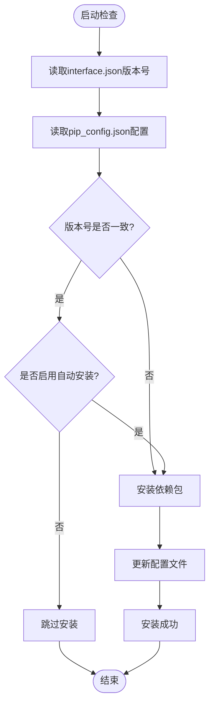
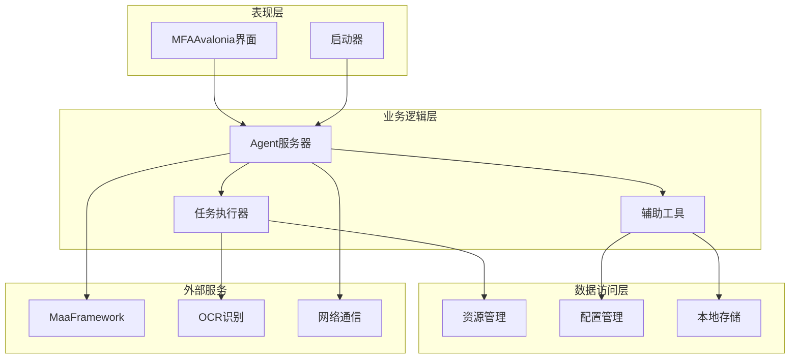
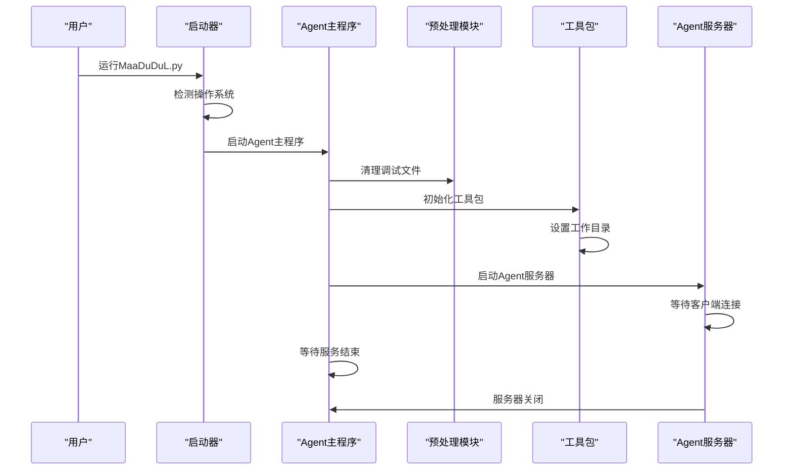
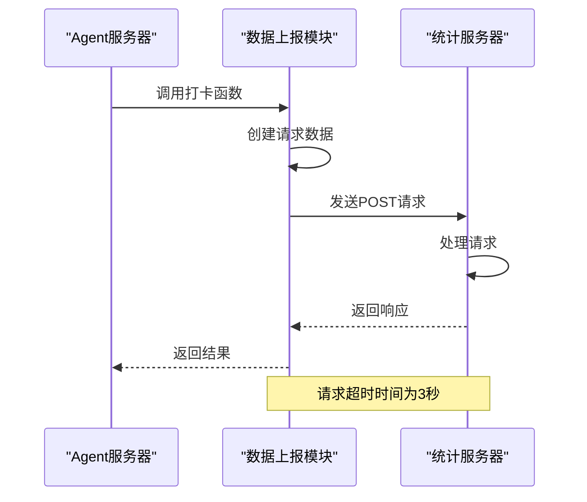
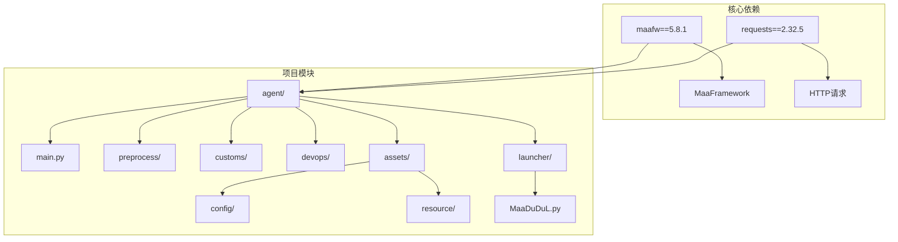

# MaaDuDuL 操作指南

<cite>
**本文档引用的文件**
- [README.md](file://README.md)
- [agent/main.py](file://agent/main.py)
- [launcher/MaaDuDuL.py](file://launcher/MaaDuDuL.py)
- [requirements.txt](file://requirements.txt)
- [agent/preprocess/setup.py](file://agent/preprocess/setup.py)
- [agent/customs/maahelper/tasker.py](file://agent/customs/maahelper/tasker.py)
- [agent/devops/report.py](file://agent/devops/report.py)
- [assets/config/maa_pi_config.json](file://assets/config/maa_pi_config.json)
- [docsite/docs/10.用户手册/10.旅程的开始/10.下载与安装.md](file://docsite/docs/10.用户手册/10.旅程的开始/10.下载与安装.md)
- [assets/resource/tasks/daily/启动游戏.json](file://assets/resource/tasks/daily/启动游戏.json)
- [assets/resource/tasks/daily/关闭游戏.json](file://assets/resource/tasks/daily/关闭游戏.json)
- [assets/resource/tasks/daily/说明.json](file://assets/resource/tasks/daily/说明.json)
- [assets/resource/descs/daily/activity_daily.md](file://assets/resource/descs/daily/activity_daily.md)
</cite>

## 目录
1. [简介](#简介)
2. [项目结构](#项目结构)
3. [核心组件](#核心组件)
4. [架构概览](#架构概览)
5. [详细组件分析](#详细组件分析)
6. [依赖关系分析](#依赖关系分析)
7. [性能考虑](#性能考虑)
8. [故障排除指南](#故障排除指南)
9. [结论](#结论)

## 简介

MaaDuDuL（MDDL - 嘟嘟脸小助手）是一个基于全新架构的《嘟嘟脸恶作剧》小助手，采用图像技术和模拟控制技术，通过MaaFramework与MFAAvalonia强力驱动，实现自动化操作。该项目旨在解放双手，通过智能识别和自动化控制完成游戏中的重复性任务。

项目提供了完整的日常任务自动化功能，包括登录签到、日常补给、每日采购、清体力、圣团巡礼、农场视察、巅峰对决、奖励领取、活动相关和开荒相关等功能。

## 项目结构

MaaDuDuL项目采用模块化设计，主要包含以下几个核心部分：

**图表来源**
- [agent/main.py:1-78](file://agent/main.py#L1-L78)
- [launcher/MaaDuDuL.py:1-22](file://launcher/MaaDuDuL.py#L1-L22)
- [requirements.txt:1-3](file://requirements.txt#L1-L3)

**章节来源**
- [README.md:1-117](file://README.md#L1-L117)
- [agent/main.py:1-78](file://agent/main.py#L1-L78)

## 核心组件

### Agent 服务器

Agent服务器是MaaDuDuL的核心执行引擎，负责初始化环境、检查依赖、启动Agent服务器并管理任务执行。

**图表来源**
- [agent/main.py:47-78](file://agent/main.py#L47-L78)
- [agent/devops/report.py:9-34](file://agent/devops/report.py#L9-L34)

### 任务执行器

任务执行器封装了MaaFramework的上下文对象，提供便捷的任务执行接口，包括节点运行、截图、点击等常用功能。

**图表来源**
- [agent/customs/maahelper/tasker.py:16-190](file://agent/customs/maahelper/tasker.py#L16-L190)

### 环境依赖管理

系统具备自动化的环境依赖检测和安装功能，通过读取interface.json中的版本号与本地配置进行对比，决定是否需要执行pip安装操作。

**图表来源**
- [agent/preprocess/setup.py:204-230](file://agent/preprocess/setup.py#L204-L230)

**章节来源**
- [agent/main.py:47-78](file://agent/main.py#L47-L78)
- [agent/customs/maahelper/tasker.py:16-190](file://agent/customs/maahelper/tasker.py#L16-L190)
- [agent/preprocess/setup.py:204-230](file://agent/preprocess/setup.py#L204-L230)

## 架构概览

MaaDuDuL采用分层架构设计，各组件职责明确，耦合度低，便于维护和扩展。

**图表来源**
- [agent/main.py:47-78](file://agent/main.py#L47-L78)
- [agent/customs/maahelper/tasker.py:16-190](file://agent/customs/maahelper/tasker.py#L16-L190)

## 详细组件分析

### 启动流程组件

启动流程负责整个应用的初始化和配置，确保所有必要的组件都正确加载。

**图表来源**
- [launcher/MaaDuDuL.py:1-22](file://launcher/MaaDuDuL.py#L1-L22)
- [agent/main.py:47-78](file://agent/main.py#L47-L78)

### 任务管理系统

系统提供了丰富的任务类型，每种任务都有详细的描述和配置选项。

#### 日常任务类型

| 任务类别 | 任务名称 | 功能描述 | 是否支持 |
|---------|----------|----------|----------|
| 登录签到 | 启动游戏 | 启动登录（模拟器/游戏） | ✅ |
| 登录签到 | 关闭游戏 | 每日签到（打卡/月卡） | ✅ |
| 日常补给 | 领取邮件 | 领取邮件 | ✅ |
| 日常补给 | 每日糖果 | 每日糖果 | ✅ |
| 日常补给 | 叶子互换 | 叶子互换 | ✅ |
| 每日采购 | 免费礼包 | 免费礼包 | ✅ |
| 每日采购 | 新礼包查阅奖励 | 新礼包查阅奖励 | ✅ |
| 每日采购 | 商店物资购买 | 商店物资购买 | ✅ |
| 清体力 | 清紫糖 | 清紫糖（副本） | ✅ |
| 圣团巡礼 | 领取世界树贡品 | 领取世界树贡品 | ✅ |
| 圣团巡礼 | 大扫除 | 大扫除（手动/女仆） | ✅ |
| 农场视察 | 领取每日萝卜 | 领取每日萝卜 | ✅ |
| 农场视察 | 每日派遣 | 每日派遣 | ✅ |
| 峰对决 | 领取战斗宝石 | 领取战斗宝石 | ✅ |
| 峰对决 | PVP | PVP | ✅ |
| 领取奖励 | 每日/周奖励 | 每日/周奖励 | ✅ |
| 领取奖励 | 通行证奖励 | 通行证奖励 | ✅ |
| 活动相关 | 每日通关 | 每日通关 | ✅ |
| 活动相关 | 每日成就 | 每日成就 | ✅ |
| 开荒相关 | 副本连续作战 | 副本连续作战 | ✅ |
| 开荒相关 | 领取章节奖励 | 领取章节奖励 | ✅ |

**章节来源**
- [assets/resource/tasks/daily/启动游戏.json:1-13](file://assets/resource/tasks/daily/启动游戏.json#L1-L13)
- [assets/resource/tasks/daily/关闭游戏.json:1-12](file://assets/resource/tasks/daily/关闭游戏.json#L1-L12)
- [assets/resource/tasks/daily/说明.json:1-12](file://assets/resource/tasks/daily/说明.json#L1-L12)
- [assets/resource/descs/daily/activity_daily.md:1-13](file://assets/resource/descs/daily/activity_daily.md#L1-L13)

### 数据上报组件

系统集成了数据上报功能，用于收集使用统计信息，帮助开发者了解用户使用情况。

**图表来源**
- [agent/devops/report.py:9-34](file://agent/devops/report.py#L9-L34)

**章节来源**
- [agent/devops/report.py:9-34](file://agent/devops/report.py#L9-L34)

## 依赖关系分析

项目的依赖关系清晰明确，主要依赖于MaaFramework和相关的Python库。

**图表来源**
- [requirements.txt:1-3](file://requirements.txt#L1-L3)
- [agent/main.py:47-78](file://agent/main.py#L47-L78)

**章节来源**
- [requirements.txt:1-3](file://requirements.txt#L1-L3)
- [agent/main.py:47-78](file://agent/main.py#L47-L78)

## 性能考虑

### 系统要求

MaaDuDuL对系统环境有明确的要求，以确保稳定运行：

- **Windows**: 仅支持Windows 10和11，不支持Windows 7及更早版本
- **macOS/Linux**: 支持X86_64和ARM64架构
- **硬件要求**: 需要稳定的网络环境和足够的系统资源
- **兼容性**: 不支持定制系统、微PE系统、HarmonyOS系统等

### 网络配置

系统支持多种下载方式，包括GitHub Release和Mirror酱加速服务：

- **GitHub Release**: 最新版本下载，可能受网络影响
- **Mirror酱**: 国内加速服务，提供稳定下载体验
- **QQ群文件**: 通过群文件获取安装包

### 环境准备

首次使用前需要完成环境依赖的安装：

1. **管理员权限**: 需要以管理员身份运行依赖安装程序
2. **网络环境**: 需要稳定的网络连接进行依赖下载
3. **磁盘空间**: 需要足够的磁盘空间存储依赖包
4. **系统权限**: 避免安装到需要UAC权限的系统目录

## 故障排除指南

### 常见问题及解决方案

#### 启动失败问题

**问题**: Agent服务器启动失败
**可能原因**:
- 依赖包安装不完整
- 系统权限不足
- 网络连接问题

**解决方案**:
1. 检查依赖包安装状态
2. 以管理员身份重新运行
3. 检查网络连接稳定性

#### 任务执行异常

**问题**: 任务执行过程中出现错误
**可能原因**:
- 图像识别失败
- 界面元素位置变化
- 网络延迟影响

**解决方案**:
1. 检查OCR模型配置
2. 更新界面识别参数
3. 调整等待时间设置

#### 环境依赖问题

**问题**: 依赖包安装失败
**可能原因**:
- 网络连接不稳定
- 镜像源不可用
- Python环境问题

**解决方案**:
1. 更换镜像源地址
2. 检查Python版本兼容性
3. 手动安装依赖包

### 调试和诊断

系统提供了完善的日志记录和错误处理机制：

1. **启动日志**: 记录Agent服务器启动过程
2. **任务日志**: 记录每个任务的执行状态
3. **错误日志**: 记录异常情况和错误信息
4. **性能日志**: 记录执行时间和资源使用情况

**章节来源**
- [docsite/docs/10.用户手册/10.旅程的开始/10.下载与安装.md:10-26](file://docsite/docs/10.用户手册/10.旅程的开始/10.下载与安装.md#L10-L26)
- [agent/main.py:69-71](file://agent/main.py#L69-L71)

## 结论

MaaDuDuL是一个功能完善、架构清晰的自动化工具。通过模块化设计和分层架构，项目实现了高度的可维护性和可扩展性。系统提供了丰富的日常任务自动化功能，能够有效提升游戏体验，减少重复性劳动。

项目的主要优势包括：
- 完善的功能覆盖范围
- 稳定的架构设计
- 详细的文档支持
- 良好的用户体验
- 强大的扩展能力

建议用户在使用过程中：
1. 严格按照文档要求进行环境配置
2. 定期更新依赖包和资源文件
3. 根据实际需求调整任务配置
4. 及时关注项目更新和维护通知

通过合理使用MaaDuDuL，用户可以更好地享受游戏乐趣，同时避免繁琐的重复操作。