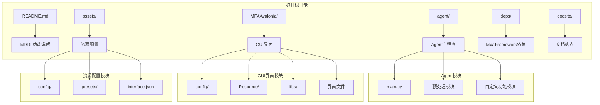
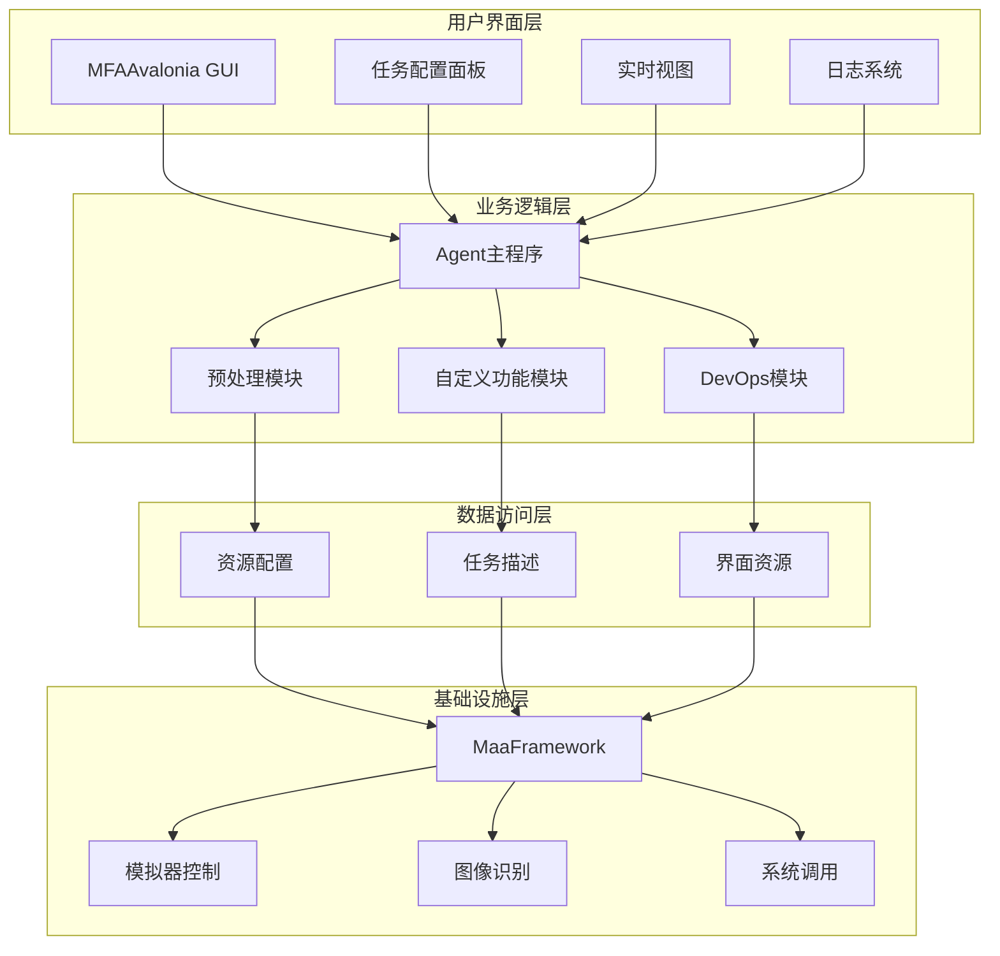
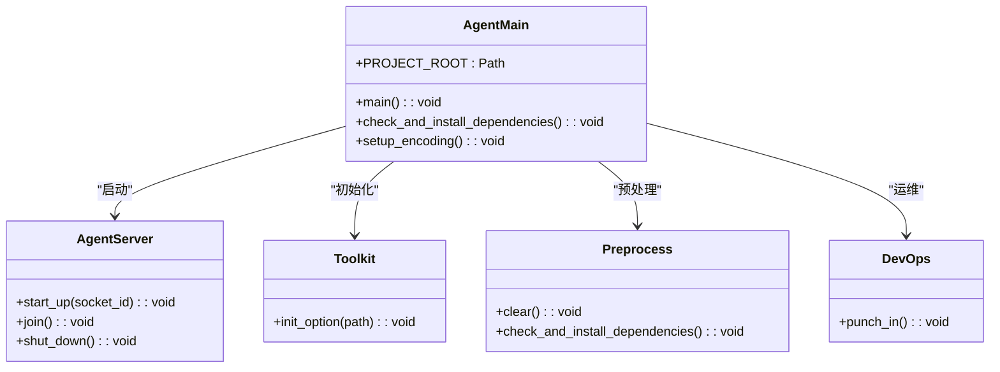
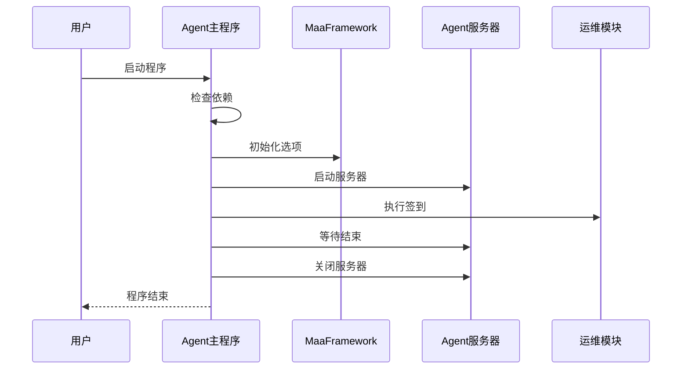
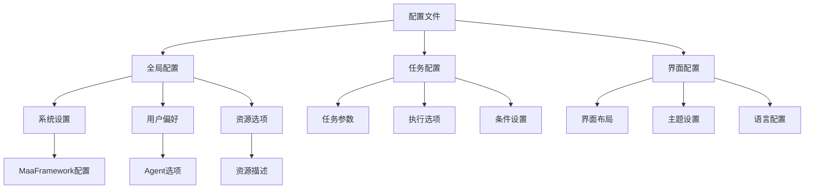
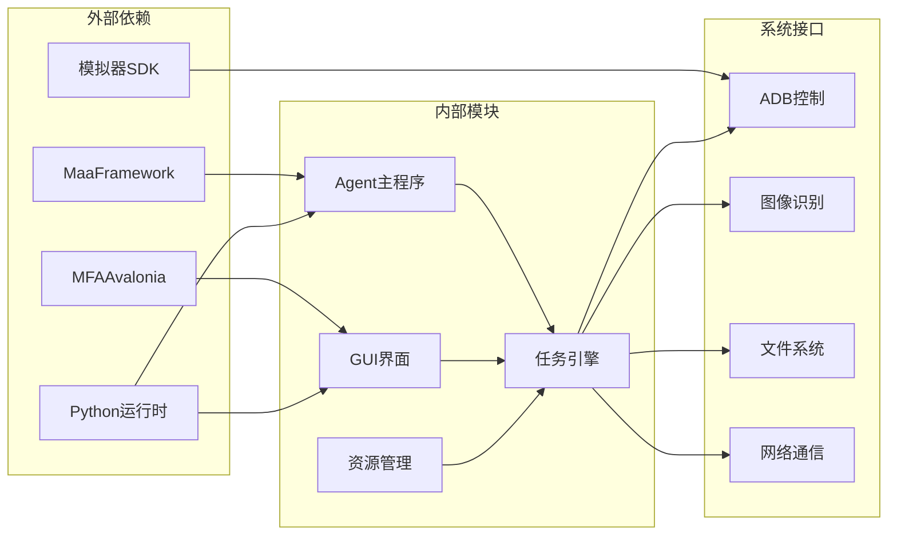

# MaaDuDuL 操作指南内容

<cite>
**本文档引用的文件**
- [README.md](file://README.md)
- [agent/main.py](file://agent/main.py)
- [MFAAvalonia/config/config.json](file://MFAAvalonia/config/config.json)
- [agent/config/maa_option.json](file://agent/config/maa_option.json)
- [assets/config/maa_pi_config.json](file://assets/config/maa_pi_config.json)
- [MFAAvalonia/Resource/descs/others/guide.md](file://MFAAvalonia/Resource/descs/others/guide.md)
- [MFAAvalonia/Resource/descs/others/illustrate.md](file://MFAAvalonia/Resource/descs/others/illustrate.md)
- [MFAAvalonia/Resource/descs/others/continuous_task.md](file://MFAAvalonia/Resource/descs/others/continuous_task.md)
- [MFAAvalonia/Resource/descs/daily/start_game.md](file://MFAAvalonia/Resource/descs/daily/start_game.md)
- [MFAAvalonia/Resource/descs/daily/claim_mail.md](file://MFAAvalonia/Resource/descs/daily/claim_mail.md)
- [MFAAvalonia/Resource/descs/daily/claim_candy.md](file://MFAAvalonia/Resource/descs/daily/claim_candy.md)
- [MFAAvalonia/Resource/descs/daily/purchase.md](file://MFAAvalonia/Resource/descs/daily/purchase.md)
- [MFAAvalonia/Resource/descs/daily/saint_tour.md](file://MFAAvalonia/Resource/descs/daily/saint_tour.md)
</cite>

## 目录
1. [简介](#简介)
2. [项目结构](#项目结构)
3. [核心组件](#核心组件)
4. [架构概览](#架构概览)
5. [详细组件分析](#详细组件分析)
6. [依赖关系分析](#依赖关系分析)
7. [性能考虑](#性能考虑)
8. [故障排除指南](#故障排除指南)
9. [结论](#结论)

## 简介

MaaDuDuL（MDDL - 嘟嘟脸小助手）是一个基于全新架构的《嘟嘟脸恶作剧》游戏自动化助手。该项目采用图像识别技术和模拟控制技术，通过MaaFramework与MFAAvalonia框架驱动，实现游戏内各项日常任务的自动化执行。

### 主要功能特性

- **登录签到系统**：支持启动登录和每日签到功能
- **日常补给管理**：自动领取邮件、每日糖果和叶子互换
- **采购管理系统**：处理免费礼包、新商品奖励和商店物资购买
- **体力清理功能**：支持紫糖和红糖清理
- **圣团巡礼自动化**：包括世界树贡品、大扫除和宠物礼物领取
- **农场视察功能**：每日萝卜领取和派遣功能
- **巅峰对决系统**：战斗宝石领取和PVP功能
- **奖励领取管理**：每日/周奖励和通行证奖励
- **活动相关功能**：每日通关和成就系统
- **开荒辅助功能**：副本连续作战和章节奖励领取

## 项目结构

MaaDuDuL项目采用模块化架构设计，主要包含以下几个核心目录：

**图表来源**
- [README.md](file://README.md#L1-L117)
- [agent/main.py](file://agent/main.py#L1-L78)

**章节来源**
- [README.md](file://README.md#L28-L66)
- [agent/main.py](file://agent/main.py#L1-L78)

## 核心组件

### Agent主程序组件

Agent主程序是整个系统的控制中心，负责初始化环境、检查依赖并启动Agent服务器。其核心职责包括：

- **环境初始化**：设置Python路径和编码环境
- **依赖检查**：验证并安装必要的运行时依赖
- **服务器启动**：启动Agent服务器并建立通信连接
- **任务调度**：协调各个功能模块的执行

### GUI界面组件

MFAAvalonia提供了直观的图形用户界面，包含以下主要功能：

- **任务配置面板**：用于配置和管理各种自动化任务
- **实时视图**：显示游戏画面，便于监控执行状态
- **日志系统**：提供详细的执行日志和错误信息
- **设置管理**：支持多种配置选项和个性化设置

### 资源配置组件

系统采用分层资源配置机制，包括：

- **全局配置**：存储基本的系统设置和偏好
- **任务配置**：针对具体任务的参数设置
- **界面配置**：控制GUI界面的布局和外观
- **资源描述**：提供任务说明和使用指南

**章节来源**
- [agent/main.py](file://agent/main.py#L47-L77)
- [MFAAvalonia/config/config.json](file://MFAAvalonia/config/config.json#L1-L545)

## 架构概览

MaaDuDuL采用分层架构设计，实现了清晰的职责分离和模块化组织：

**图表来源**
- [agent/main.py](file://agent/main.py#L49-L67)
- [MFAAvalonia/config/config.json](file://MFAAvalonia/config/config.json#L459-L470)

## 详细组件分析

### Agent主程序组件分析

Agent主程序作为系统的核心控制单元，采用了模块化的架构设计：

**图表来源**
- [agent/main.py](file://agent/main.py#L47-L77)

#### Agent主程序执行流程

**图表来源**
- [agent/main.py](file://agent/main.py#L55-L71)

**章节来源**
- [agent/main.py](file://agent/main.py#L1-L78)

### GUI界面组件分析

MFAAvalonia GUI提供了完整的图形用户界面解决方案，包含以下核心功能模块：

#### 任务配置面板

任务配置面板是用户与系统交互的主要界面，支持以下功能：

- **任务列表管理**：显示所有可用任务并允许用户选择执行
- **参数配置**：为每个任务提供详细的参数设置选项
- **执行控制**：支持批量操作和单任务执行
- **状态监控**：实时显示任务执行状态和结果

#### 实时视图系统

实时视图系统提供了游戏画面的实时显示功能：

- **画面捕获**：从模拟器获取游戏画面
- **显示控制**：支持调整刷新率和显示质量
- **性能优化**：平衡显示质量和系统性能

#### 日志管理系统

日志系统提供了完整的执行监控和问题诊断能力：

- **多级别日志**：支持不同详细程度的日志输出
- **错误追踪**：记录执行过程中的错误和异常
- **性能监控**：跟踪任务执行时间和资源使用情况

**章节来源**
- [MFAAvalonia/config/config.json](file://MFAAvalonia/config/config.json#L1-L545)
- [MFAAvalonia/Resource/descs/others/guide.md](file://MFAAvalonia/Resource/descs/others/guide.md#L1-L36)

### 资源配置组件分析

资源配置系统采用了层次化的设计模式，确保了配置的灵活性和可维护性：

**图表来源**
- [MFAAvalonia/config/config.json](file://MFAAvalonia/config/config.json#L1-L545)
- [agent/config/maa_option.json](file://agent/config/maa_option.json#L1-L6)
- [assets/config/maa_pi_config.json](file://assets/config/maa_pi_config.json#L1-L3)

**章节来源**
- [MFAAvalonia/config/config.json](file://MFAAvalonia/config/config.json#L459-L470)
- [agent/config/maa_option.json](file://agent/config/maa_option.json#L1-L6)

## 依赖关系分析

MaaDuDuL项目建立了清晰的依赖关系网络，确保了模块间的松耦合和高内聚：

**图表来源**
- [agent/main.py](file://agent/main.py#L49-L53)
- [MFAAvalonia/config/config.json](file://MFAAvalonia/config/config.json#L459-L470)

### 核心依赖关系

系统的关键依赖关系包括：

1. **MaaFramework依赖**：提供底层的图像识别和控制功能
2. **MFAAvalonia依赖**：提供图形用户界面框架
3. **模拟器依赖**：通过ADB协议控制游戏模拟器
4. **Python生态依赖**：利用丰富的Python库生态系统

**章节来源**
- [agent/main.py](file://agent/main.py#L49-L53)
- [MFAAvalonia/config/config.json](file://MFAAvalonia/config/config.json#L459-L470)

## 性能考虑

### 系统性能优化

MaaDuDuL在设计时充分考虑了性能优化，主要包括：

- **异步执行**：任务执行采用异步模式，避免阻塞主线程
- **资源管理**：合理管理内存和CPU资源，防止过度消耗
- **缓存机制**：对频繁使用的资源进行缓存，提高访问速度
- **批处理优化**：支持任务批量执行，减少系统调用开销

### 内存使用优化

系统采用了多种内存管理策略：

- **延迟加载**：按需加载资源，减少初始内存占用
- **对象复用**：重用对象实例，降低垃圾回收压力
- **资源池**：使用资源池管理临时对象
- **及时释放**：确保不再使用的资源及时释放

### 网络通信优化

对于需要网络通信的功能，系统实现了以下优化：

- **连接复用**：复用网络连接，减少握手开销
- **请求合并**：将多个小请求合并为大请求
- **超时控制**：设置合理的超时时间，避免长时间等待
- **错误重试**：实现智能的错误重试机制

## 故障排除指南

### 常见问题诊断

#### Agent启动失败

**问题症状**：Agent程序无法正常启动

**可能原因**：
1. 依赖库未正确安装
2. 环境变量配置错误
3. 权限不足
4. 端口被占用

**解决方案**：
1. 检查Python环境和依赖库
2. 验证系统权限
3. 确认端口可用性
4. 查看详细错误日志

#### GUI界面显示异常

**问题症状**：GUI界面无法正常显示或显示异常

**可能原因**：
1. 显示驱动问题
2. 分辨率设置不当
3. 字体渲染问题
4. 界面资源缺失

**解决方案**：
1. 更新显示驱动
2. 调整分辨率设置
3. 检查字体文件
4. 重新安装界面资源

#### 任务执行失败

**问题症状**：自动化任务执行失败

**可能原因**：
1. 游戏界面变化
2. 图像识别错误
3. 控制命令失败
4. 网络连接问题

**解决方案**：
1. 更新任务脚本
2. 调整识别参数
3. 检查控制设备
4. 重置网络连接

### 日志分析方法

系统提供了详细的日志记录功能，有助于问题诊断：

#### 日志级别说明

- **INFO**：一般信息，用于跟踪程序执行流程
- **WARNING**：警告信息，提示潜在问题
- **ERROR**：错误信息，指示程序执行失败
- **DEBUG**：调试信息，用于开发和高级用户

#### 日志位置和格式

- **Agent日志**：位于`debug/maa.log`
- **GUI日志**：位于`MFAAvalonia/debug/maa.log`
- **错误截图**：保存在`debug/on_error/`目录下

**章节来源**
- [agent/main.py](file://agent/main.py#L69-L71)
- [MFAAvalonia/config/config.json](file://MFAAvalonia/config/config.json#L459-L470)

## 结论

MaaDuDuL项目展现了现代游戏自动化助手的完整架构设计。通过采用模块化设计、分层架构和清晰的依赖管理，系统实现了功能完整性与可维护性的良好平衡。

### 主要优势

1. **架构清晰**：模块化设计使得系统易于理解和维护
2. **功能完整**：覆盖了游戏的主要日常任务场景
3. **用户友好**：提供直观的图形界面和详细的操作指导
4. **扩展性强**：支持自定义功能和第三方扩展
5. **稳定性好**：完善的错误处理和日志系统

### 发展方向

随着项目的持续发展，建议重点关注以下方面：

1. **性能优化**：进一步提升执行效率和资源利用率
2. **功能扩展**：增加更多游戏场景的支持
3. **用户体验**：持续改进界面设计和交互体验
4. **稳定性增强**：提高系统在各种环境下的可靠性
5. **社区建设**：加强开源社区的参与和贡献

通过持续的改进和完善，MaaDuDuL有望成为游戏自动化领域的优秀解决方案，为用户提供更加便捷和高效的服务体验。