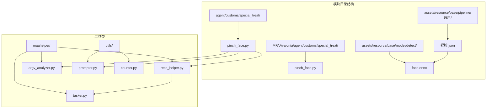
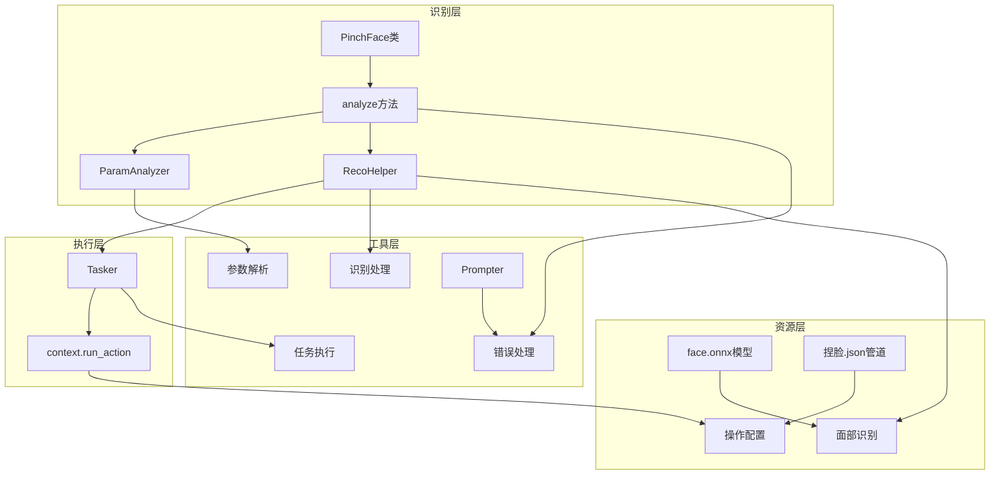
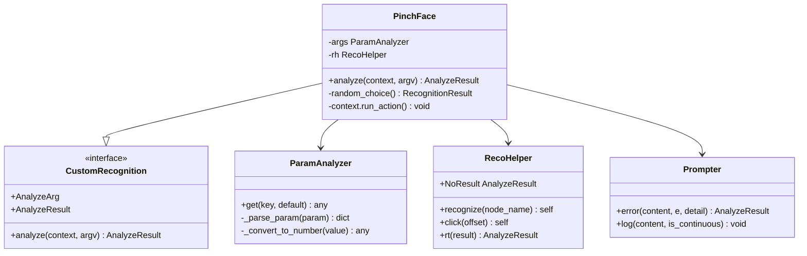
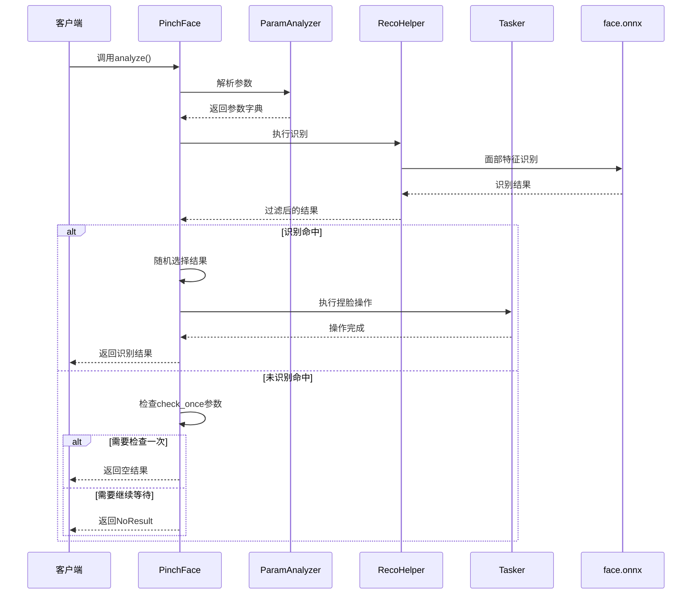
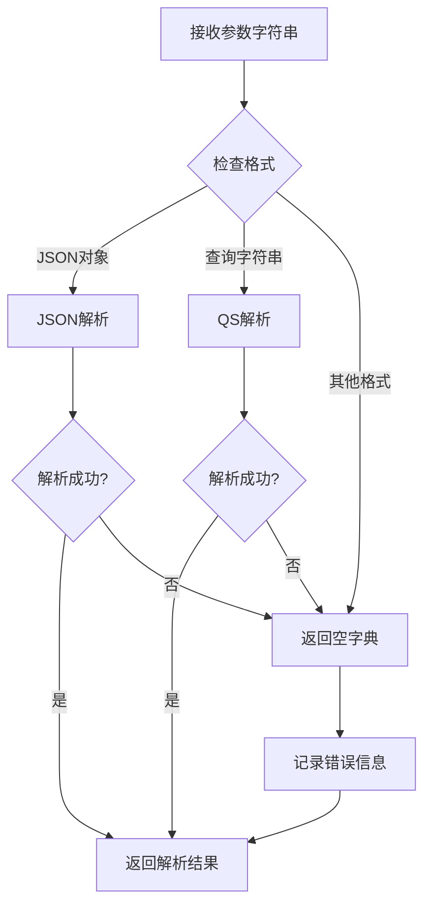
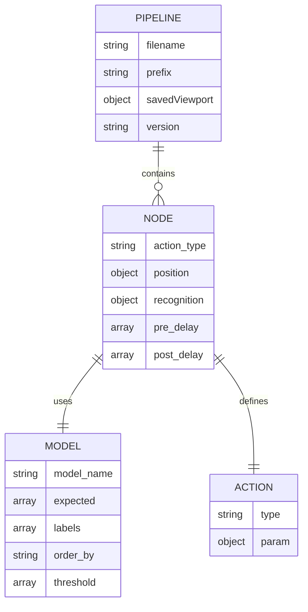
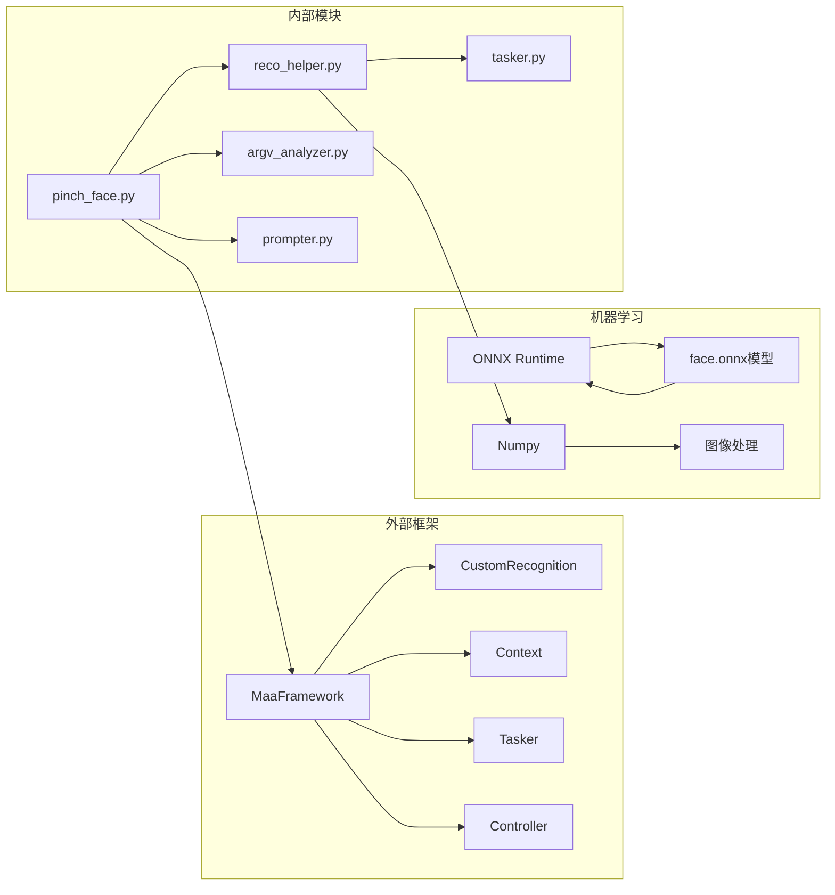

# Pinch Face Module（捏脸模块）

<cite>
**本文档引用的文件**
- [pinch_face.py](file://agent/customs/special_treat/pinch_face.py)
- [pinch_face.py](file://MFAAvalonia/agent/customs/special_treat/pinch_face.py)
- [捏脸.json](file://assets/resource/base/pipeline/通用/捏脸.json)
- [face.onnx](file://assets/resource/base/model/detect/face.onnx)
- [reco_helper.py](file://agent/customs/maahelper/reco_helper.py)
- [argv_analyzer.py](file://agent/customs/maahelper/argv_analyzer.py)
- [tasker.py](file://agent/customs/maahelper/tasker.py)
- [prompter.py](file://agent/customs/utils/prompter.py)
- [counter.py](file://agent/customs/utils/counter.py)
- [README.md](file://README.md)
</cite>

## 目录
1. [简介](#简介)
2. [项目结构](#项目结构)
3. [核心组件](#核心组件)
4. [架构概览](#架构概览)
5. [详细组件分析](#详细组件分析)
6. [依赖关系分析](#依赖关系分析)
7. [性能考虑](#性能考虑)
8. [故障排除指南](#故障排除指南)
9. [结论](#结论)

## 简介

Pinch Face Module（捏脸模块）是基于 MaaFramework 的自动化识别与操作模块，专门用于游戏内的捏脸功能。该模块通过面部特征识别技术，自动执行左右捏脸动作，实现游戏内角色外观的自动化调整。

该模块采用深度学习神经网络模型进行面部识别，支持左侧（lf）和右侧（rf）面部特征的智能识别与操作。模块设计遵循 MaaFramework 的自定义识别规范，提供完整的错误处理和调试支持。

## 项目结构

捏脸模块在项目中的组织结构如下：

**图表来源**
- [pinch_face.py](file://agent/customs/special_treat/pinch_face.py#L1-L62)
- [reco_helper.py](file://agent/customs/maahelper/reco_helper.py#L1-L256)
- [argv_analyzer.py](file://agent/customs/maahelper/argv_analyzer.py#L1-L159)

**章节来源**
- [pinch_face.py](file://agent/customs/special_treat/pinch_face.py#L1-L62)
- [README.md](file://README.md#L1-L117)

## 核心组件

### 主要功能特性

1. **面部特征识别**：使用神经网络模型识别游戏界面中的面部特征
2. **智能操作执行**：根据识别结果自动执行相应的捏脸操作
3. **参数化配置**：支持多种参数配置选项，包括检查模式和操作参数
4. **错误处理机制**：完善的异常捕获和错误报告系统
5. **调试支持**：提供详细的日志输出和错误信息

### 关键配置参数

| 参数名称 | 别名 | 默认值 | 描述 |
|---------|------|--------|------|
| check_once | co, o | "t" | 是否只检查一次，命中后立即返回 |
| duration | - | 200ms | 滑动操作持续时间 |
| end_hold | - | 400ms | 操作结束保持时间 |
| end_offset | - | [-100, 35, 0, 0] | 结束偏移量配置 |

**章节来源**
- [pinch_face.py](file://agent/customs/special_treat/pinch_face.py#L45-L59)
- [argv_analyzer.py](file://agent/customs/maahelper/argv_analyzer.py#L103-L131)

## 架构概览

捏脸模块采用分层架构设计，各组件职责明确，耦合度低：

**图表来源**
- [pinch_face.py](file://agent/customs/special_treat/pinch_face.py#L17-L61)
- [reco_helper.py](file://agent/customs/maahelper/reco_helper.py#L62-L94)
- [tasker.py](file://agent/customs/maahelper/tasker.py#L128-L169)

## 详细组件分析

### PinchFace 类分析

PinchFace 类是整个模块的核心，继承自 CustomRecognition，实现了自定义识别逻辑：

**图表来源**
- [pinch_face.py](file://agent/customs/special_treat/pinch_face.py#L17-L61)
- [argv_analyzer.py](file://agent/customs/maahelper/argv_analyzer.py#L17-L159)
- [reco_helper.py](file://agent/customs/maahelper/reco_helper.py#L17-L256)

#### 分析流程详解

**图表来源**
- [pinch_face.py](file://agent/customs/special_treat/pinch_face.py#L25-L61)
- [reco_helper.py](file://agent/customs/maahelper/reco_helper.py#L62-L94)

**章节来源**
- [pinch_face.py](file://agent/customs/special_treat/pinch_face.py#L17-L61)

### 参数解析器分析

ParamAnalyzer 提供灵活的参数解析功能，支持多种输入格式：

**图表来源**
- [argv_analyzer.py](file://agent/customs/maahelper/argv_analyzer.py#L48-L101)

**章节来源**
- [argv_analyzer.py](file://agent/customs/maahelper/argv_analyzer.py#L17-L159)

### 识别辅助器分析

RecoHelper 封装了常用的识别和操作功能：

| 方法 | 功能描述 | 返回值 |
|------|----------|--------|
| recognize() | 执行识别操作 | self（支持链式调用） |
| click() | 点击最佳匹配项 | self 或 None |
| click_all() | 点击所有匹配项 | self 或 None |
| concat() | 拼接识别文本 | str 或 None |
| rt() | 构造识别结果 | AnalyzeResult |

**章节来源**
- [reco_helper.py](file://agent/customs/maahelper/reco_helper.py#L62-L256)

### 管道配置分析

捏脸模块的管道配置文件定义了完整的操作流程：

**图表来源**
- [捏脸.json](file://assets/resource/base/pipeline/通用/捏脸.json#L1-L104)

**章节来源**
- [捏脸.json](file://assets/resource/base/pipeline/通用/捏脸.json#L16-L103)

## 依赖关系分析

### 外部依赖

**图表来源**
- [pinch_face.py](file://agent/customs/special_treat/pinch_face.py#L7-L14)
- [reco_helper.py](file://agent/customs/maahelper/reco_helper.py#L6-L14)

### 内部模块依赖

| 模块 | 依赖模块 | 用途 |
|------|----------|------|
| pinch_face.py | reco_helper.py | 识别结果处理 |
| pinch_face.py | argv_analyzer.py | 参数解析 |
| pinch_face.py | prompter.py | 错误处理 |
| reco_helper.py | tasker.py | 任务执行 |
| reco_helper.py | numpy | 图像处理 |
| argv_analyzer.py | json, urllib | 参数解析 |

**章节来源**
- [pinch_face.py](file://agent/customs/special_treat/pinch_face.py#L7-L14)
- [reco_helper.py](file://agent/customs/maahelper/reco_helper.py#L6-L14)

## 性能考虑

### 识别性能优化

1. **模型优化**：face.onnx 模型经过量化和优化，提高识别速度
2. **缓存机制**：RecoHelper 支持截图缓存，避免重复截图
3. **异步处理**：MaaFramework 提供异步任务执行能力
4. **批量处理**：支持批量识别和操作，提高整体效率

### 内存管理

- **及时释放**：识别完成后及时清理临时变量
- **资源回收**：合理管理 numpy 数组内存
- **连接池**：复用 MaaFramework 连接资源

### 错误恢复

- **重试机制**：识别失败时自动重试
- **降级策略**：网络异常时使用本地缓存
- **优雅降级**：部分功能失效时不影响整体流程

## 故障排除指南

### 常见问题及解决方案

| 问题类型 | 症状 | 可能原因 | 解决方案 |
|----------|------|----------|----------|
| 识别失败 | 无法识别面部特征 | 模型文件损坏 | 重新下载 face.onnx |
| 操作无效 | 捏脸操作不生效 | 坐标偏移错误 | 调整 end_offset 参数 |
| 性能问题 | 识别速度慢 | 模型过大 | 使用更小的模型 |
| 内存泄漏 | 内存占用持续增长 | 资源未正确释放 | 检查资源清理逻辑 |

### 调试技巧

1. **启用详细日志**：使用 Prompter.log 输出详细信息
2. **参数验证**：检查 argv 参数格式和有效性
3. **模型测试**：单独测试 face.onnx 模型的识别效果
4. **截图分析**：保存和分析识别时的截图

**章节来源**
- [prompter.py](file://agent/customs/utils/prompter.py#L16-L55)
- [pinch_face.py](file://agent/customs/special_treat/pinch_face.py#L60-L61)

## 结论

Pinch Face Module 是一个设计精良的自动化识别模块，具有以下特点：

1. **模块化设计**：清晰的分层架构，职责分离明确
2. **可扩展性**：支持参数化配置和自定义扩展
3. **稳定性**：完善的错误处理和恢复机制
4. **易用性**：简洁的 API 接口和详细的文档说明

该模块为游戏自动化提供了可靠的面部识别基础，通过合理的架构设计和性能优化，能够满足复杂的自动化需求。建议在实际使用中结合具体的业务场景进行参数调优和功能扩展。