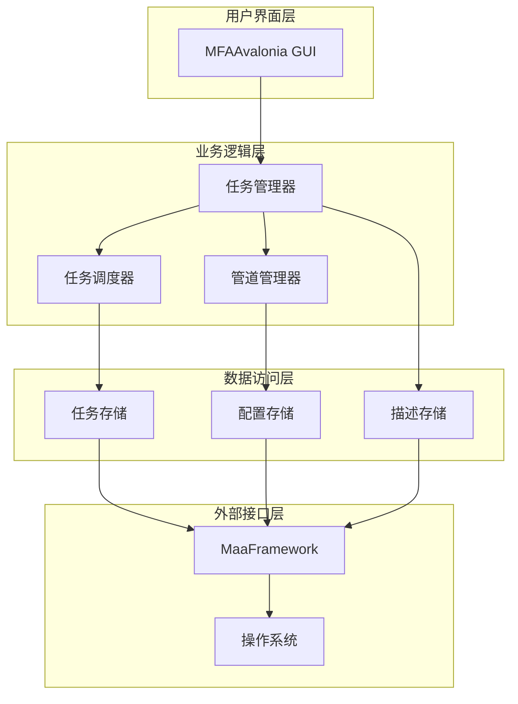
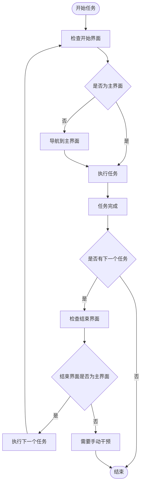
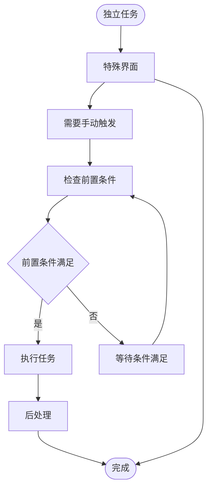
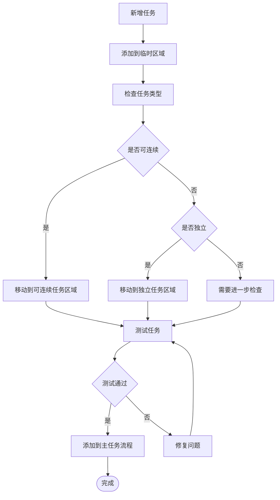
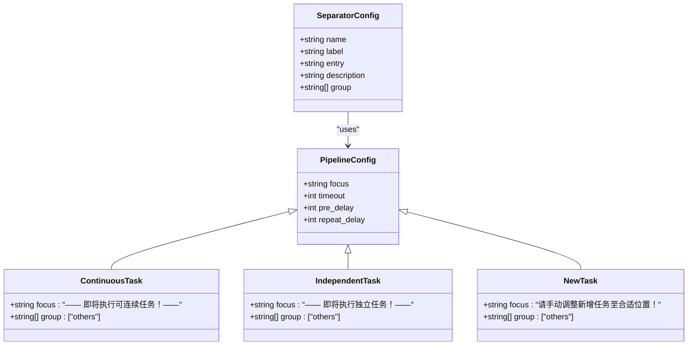
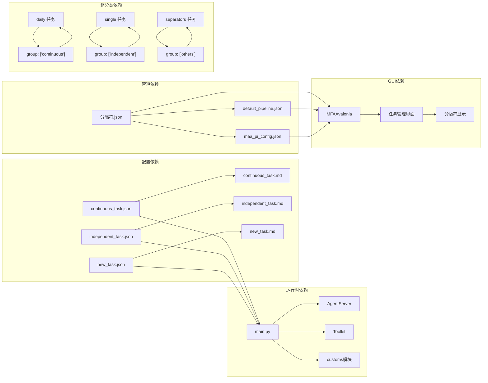

# 分隔符任务

<cite>
**本文档引用的文件**
- [continuous_task.json](file://assets/resource/tasks/separators/continuous_task.json)
- [independent_task.json](file://assets/resource/tasks/separators/independent_task.json)
- [new_task.json](file://assets/resource/tasks/separators/new_task.json)
- [continuous_task.md](file://assets/resource/descs/others/continuous_task.md)
- [independent_task.md](file://assets/resource/descs/others/independent_task.md)
- [new_task.md](file://assets/resource/descs/others/new_task.md)
- [分隔符.json](file://MFAAvalonia/Resource/base/pipeline/其他/分隔符.json)
- [default_pipeline.json](file://MFAAvalonia/Resource/base/default_pipeline.json)
- [main.py](file://agent/main.py)
- [maa_pi_config.json](file://assets/config/maa_pi_config.json)
- [activity_daily.json](file://assets/resource/tasks/daily/activity_daily.json)
- [continuous_battle.json](file://assets/resource/tasks/single/continuous_battle.json)
</cite>

## 更新摘要
**所做更改**
- 更新了分隔符任务的组分类系统，从传统的"continuous"、"independent"、"single"改为新的"others"组分类
- 新增了任务组分类的概念，明确了任务的组织性分类方式
- 完善了任务分类系统的层次结构，包括可连续任务、独立任务、新增任务等组织性分类

## 目录
1. [简介](#简介)
2. [项目结构](#项目结构)
3. [核心组件](#核心组件)
4. [架构概览](#架构概览)
5. [详细组件分析](#详细组件分析)
6. [依赖关系分析](#依赖关系分析)
7. [性能考虑](#性能考虑)
8. [故障排除指南](#故障排除指南)
9. [结论](#结论)

## 简介

分隔符任务是MaaDuDuL项目中的一个重要功能模块，用于管理和组织不同类型的任务类型。该项目基于MaaFramework和MFAAvalonia构建，为"嘟嘟脸恶作剧"游戏提供自动化辅助功能。

分隔符任务系统现已升级为基于组分类的任务管理系统，主要分为三种组织性任务类型：
- **可连续任务**：可以在完成当前任务后自动继续执行下一个任务的任务类型
- **独立任务**：无法与其他任务自动串联执行的任务类型  
- **新增任务**：当游戏更新后新增的任务，需要手动调整到合适位置

**更新** 新的任务分类系统引入了"others"组概念，为任务提供了更加灵活的组织方式。

## 项目结构

项目采用模块化设计，主要包含以下关键目录：

```mermaid
graph TB
subgraph "项目根目录"
A[MaaDuDuL 项目]
B[agent 代理模块]
C[assets 资源文件]
D[MFAAvalonia GUI]
E[launcher 启动器]
end
subgraph "agent模块"
B1[customs 自定义功能]
B2[preprocess 预处理]
B3[devops 开发运维]
B4[main.py 主入口]
end
subgraph "assets资源"
C1[resource 任务资源]
C2[config 配置文件]
C3[interface 接口定义]
end
subgraph "任务资源结构"
C11[tasks 任务文件]
C12[descs 任务描述]
C13[presets 预设配置]
end
A --> B
A --> C
A --> D
A --> E
B --> B1
B --> B2
B --> B3
B --> B4
C --> C1
C --> C2
C --> C3
C1 --> C11
C1 --> C12
C1 --> C13
C11 --> C111[separators 分隔符任务]
C11 --> C112[daily 日常任务]
C11 --> C113[single 单次任务]
C112 --> C1121[group: ["continuous"]]
C113 --> C1131[group: ["independent"]]
```

**图表来源**
- [main.py:1-78](file://agent/main.py#L1-L78)
- [continuous_task.json:1-13](file://assets/resource/tasks/separators/continuous_task.json#L1-L13)

**章节来源**
- [main.py:1-78](file://agent/main.py#L1-L78)

## 核心组件

分隔符任务系统的核心组件包括三个主要的JSON配置文件，每个文件对应一种任务类型。所有分隔符任务现在都归类到"others"组中：

### 可连续任务分隔符
- **名称**：可连续任务
- **标签**：——— 可连续任务 ———
- **入口**：可连续任务分隔符
- **描述文件**：Resource/descs/others/continuous_task.md
- **组分类**：others

### 独立任务分隔符  
- **名称**：独立任务
- **标签**：——— 独立任务 ———
- **入口**：独立任务分隔符
- **描述文件**：Resource/descs/others/independent_task.md
- **组分类**：others

### 新增任务分隔符
- **名称**：新增任务
- **标签**：——— 新增任务 ———
- **入口**：新增任务分隔符
- **描述文件**：Resource/descs/others/new_task.md
- **组分类**：others

**更新** 所有分隔符任务现在都统一使用"others"组分类，简化了任务的组织结构。

**章节来源**
- [continuous_task.json:1-13](file://assets/resource/tasks/separators/continuous_task.json#L1-L13)
- [independent_task.json:1-13](file://assets/resource/tasks/separators/independent_task.json#L1-L13)
- [new_task.json:1-13](file://assets/resource/tasks/separators/new_task.json#L1-L13)

## 架构概览

分隔符任务系统采用分层架构设计，通过JSON配置文件实现任务类型的分类管理。新的组分类系统提供了更加灵活的任务组织方式：



**图表来源**
- [main.py:47-78](file://agent/main.py#L47-L78)
- [分隔符.json:1-12](file://MFAAvalonia/Resource/base/pipeline/其他/分隔符.json#L1-L12)

## 详细组件分析

### 可连续任务系统

可连续任务是指在完成当前任务后，可以自动继续执行下一个任务的任务类型。这类任务具有以下特点：



**图表来源**
- [continuous_task.md:1-9](file://assets/resource/descs/others/continuous_task.md#L1-L9)

#### 任务特性
- **收尾相接**：开始界面与结束界面都为主界面
- **流程连贯**：多个任务之间形成完整的执行流程
- **自动执行**：无需人工干预即可连续执行

#### 配置要求
- 任务之间的依赖关系必须明确
- 执行顺序需要合理安排
- 界面导航逻辑需要完善

**更新** 可连续任务现在归类到"others"组中，与传统"continuous"组保持一致的功能特性。

**章节来源**
- [continuous_task.md:1-9](file://assets/resource/descs/others/continuous_task.md#L1-L9)

### 独立任务系统

独立任务是指无法与其他任务自动串联执行的任务类型。这类任务具有以下特点：



**图表来源**
- [independent_task.md:1-15](file://assets/resource/descs/others/independent_task.md#L1-L15)

#### 任务特性
- **界面独立**：开始界面或结束界面不是主界面
- **手动触发**：通常需要用户手动选择执行
- **流程特殊**：执行流程较为特殊，需要特定前置条件

#### 使用建议
- 建议使用独立执行功能启动
- 不要将独立任务放入可连续任务链中
- 需要特定的前置条件或后续处理

**更新** 独立任务现在归类到"others"组中，与传统"independent"组保持一致的功能特性。

**章节来源**
- [independent_task.md:1-15](file://assets/resource/descs/others/independent_task.md#L1-L15)

### 新增任务系统

新增任务是指游戏更新后新增的任务，需要手动调整到合适位置：



**图表来源**
- [new_task.md:1-17](file://assets/resource/descs/others/new_task.md#L1-L17)

#### 使用说明
1. **任务位置调整**：根据任务类型手动调整位置
2. **配置建议**：新增任务完成后先进行单独测试
3. **注意事项**：不建议长期保留任务在此区域

**更新** 新增任务现在归类到"others"组中，作为临时存放区域使用。

**章节来源**
- [new_task.md:1-17](file://assets/resource/descs/others/new_task.md#L1-L17)

### 管道配置系统

分隔符任务系统还包含相应的管道配置：



**图表来源**
- [分隔符.json:1-12](file://MFAAvalonia/Resource/base/pipeline/其他/分隔符.json#L1-L12)
- [default_pipeline.json:1-8](file://MFAAvalonia/Resource/base/default_pipeline.json#L1-L8)

**更新** 管道配置现在包含了组分类信息，所有分隔符任务都使用"others"组。

**章节来源**
- [分隔符.json:1-12](file://MFAAvalonia/Resource/base/pipeline/其他/分隔符.json#L1-L12)
- [default_pipeline.json:1-8](file://MFAAvalonia/Resource/base/default_pipeline.json#L1-L8)

## 依赖关系分析

分隔符任务系统涉及多个组件之间的复杂依赖关系。新的组分类系统提供了更加清晰的依赖关系：



**图表来源**
- [main.py:47-78](file://agent/main.py#L47-L78)
- [maa_pi_config.json:1-3](file://assets/config/maa_pi_config.json#L1-L3)

### 直接依赖
- **配置文件依赖**：JSON配置文件依赖对应的描述文件
- **管道配置依赖**：分隔符配置依赖默认管道设置
- **运行时依赖**：主程序依赖MaaFramework的各种组件
- **组分类依赖**：任务文件依赖正确的组分类标识

### 间接依赖
- **GUI依赖**：用户界面依赖配置文件和管道设置
- **资源依赖**：所有组件依赖项目的资源配置
- **框架依赖**：整个系统依赖MaaFramework和MFAAvalonia框架
- **分类依赖**：任务系统依赖清晰的分类体系

**更新** 新的组分类系统简化了任务的依赖关系，统一了"others"组的使用。

**章节来源**
- [main.py:47-78](file://agent/main.py#L47-L78)
- [maa_pi_config.json:1-3](file://assets/config/maa_pi_config.json#L1-L3)

## 性能考虑

分隔符任务系统在设计时考虑了以下性能因素：

### 内存优化
- JSON配置文件采用轻量级格式，减少内存占用
- 描述文件按需加载，避免不必要的资源消耗
- 管道配置采用默认值，减少重复配置
- 统一的"others"组分类减少了配置复杂度

### 执行效率
- 可连续任务通过界面检测减少导航开销
- 独立任务采用异步执行模式
- 新增任务提供测试机制避免无效执行
- 组分类系统提高了任务查找和管理效率

### 资源管理
- 配置文件缓存机制提高访问速度
- 描述文件懒加载策略
- 管道配置预编译优化
- 统一的组分类减少了资源冲突

**更新** 新的组分类系统提高了系统的整体性能和资源利用率。

## 故障排除指南

### 常见问题及解决方案

#### 任务无法自动执行
1. **检查界面导航**：确认任务开始和结束界面是否正确
2. **验证前置条件**：确保任务所需的前置条件已满足
3. **检查依赖关系**：确认任务间的依赖关系配置正确
4. **验证组分类**：确认任务的组分类设置正确

#### 分隔符显示异常
1. **验证配置文件**：检查JSON配置文件语法是否正确
2. **检查描述文件**：确认描述文件路径和内容有效
3. **重新加载配置**：重启应用使配置生效
4. **检查组分类**：确认"others"组分类配置正确

#### 管道执行错误
1. **检查超时设置**：确认超时时间设置合理
2. **验证延迟配置**：检查预延迟和重复延迟设置
3. **查看日志信息**：分析执行过程中的错误信息
4. **验证组分类兼容性**：确认任务组分类与管道配置兼容

#### 组分类相关问题
1. **检查组名称**：确认组名称使用正确的"others"标识
2. **验证数组格式**：确认组分类使用正确的数组格式
3. **检查大小写**：确认组名称大小写正确
4. **验证配置一致性**：确认所有相关配置文件的一致性

**更新** 新增了组分类相关的故障排除指南。

**章节来源**
- [continuous_task.md:1-9](file://assets/resource/descs/others/continuous_task.md#L1-L9)
- [independent_task.md:1-15](file://assets/resource/descs/others/independent_task.md#L1-L15)
- [new_task.md:1-17](file://assets/resource/descs/others/new_task.md#L1-L17)

## 结论

分隔符任务系统是MaaDuDuL项目中的重要组成部分，通过合理的任务分类和配置管理，实现了高效的自动化任务执行。系统经过升级后的主要优势包括：

1. **统一的组分类系统**：通过"others"组统一管理所有分隔符任务，简化了任务组织结构
2. **清晰的任务分类**：通过三种不同类型的分隔符，明确了任务的执行特性和使用场景
3. **灵活的配置管理**：采用JSON配置文件，便于维护和扩展
4. **完善的描述系统**：提供了详细的使用说明和最佳实践指导
5. **良好的用户体验**：通过GUI界面和管道配置，简化了任务管理流程
6. **改进的性能表现**：新的组分类系统提高了系统的整体性能和资源利用率

未来的发展方向包括：
- 增加更多的任务类型支持
- 优化任务执行效率
- 改进错误处理和故障恢复机制
- 提供更丰富的配置选项和自定义功能
- 扩展组分类系统的功能和灵活性

该系统为MaaDuDuL项目提供了坚实的基础设施，为用户提供了便捷的自动化任务管理体验。新的组分类系统进一步提升了系统的易用性和维护性，为用户提供了更好的使用体验。