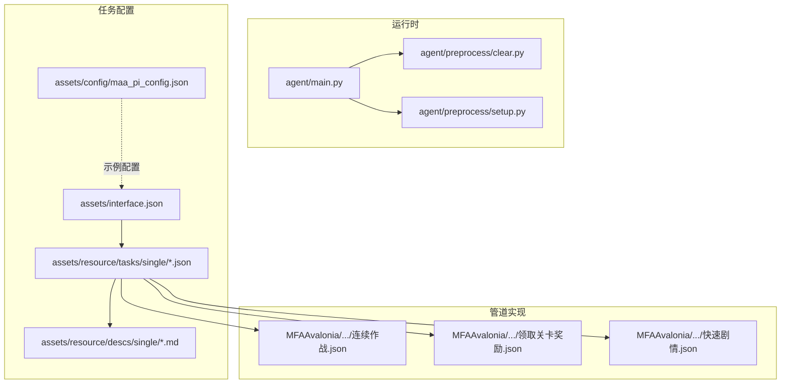
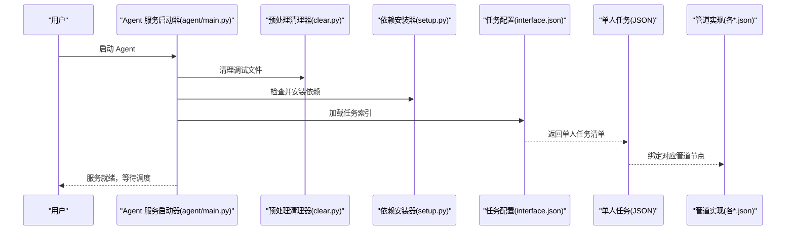
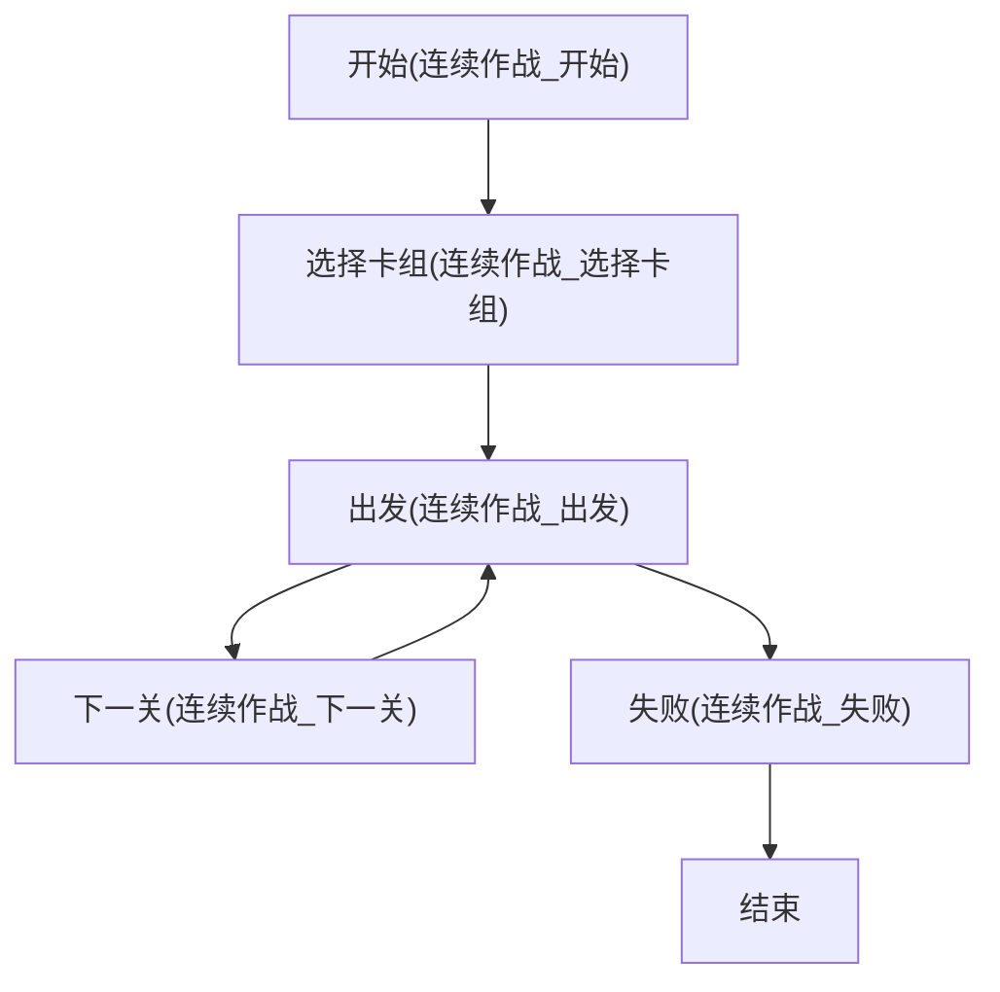
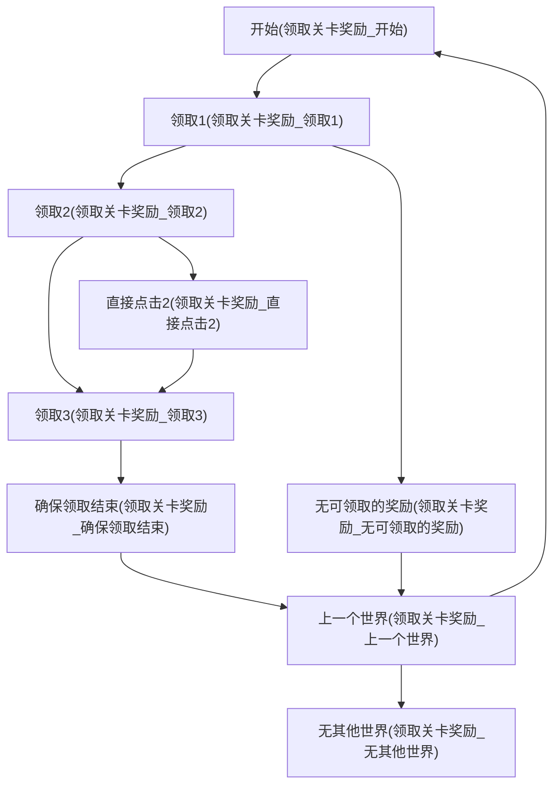
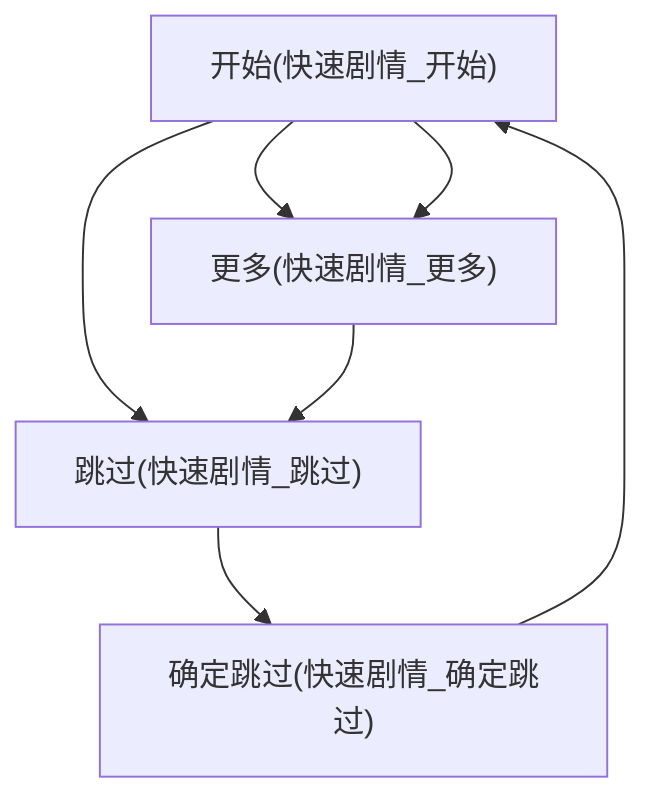
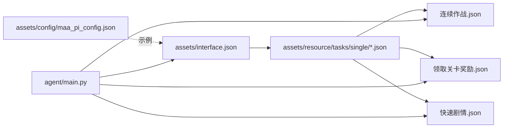

# 单人任务

<cite>
**本文引用的文件**
- [README.md](file://README.md)
- [agent/main.py](file://agent/main.py)
- [agent/preprocess/setup.py](file://agent/preprocess/setup.py)
- [agent/preprocess/clear.py](file://agent/preprocess/clear.py)
- [assets/interface.json](file://assets/interface.json)
- [assets/config/maa_pi_config.json](file://assets/config/maa_pi_config.json)
- [assets/resource/tasks/single/continuous_battle.json](file://assets/resource/tasks/single/continuous_battle.json)
- [assets/resource/tasks/single/level_rewards.json](file://assets/resource/tasks/single/level_rewards.json)
- [assets/resource/tasks/single/quick_plot.json](file://assets/resource/tasks/single/quick_plot.json)
- [assets/resource/descs/single/continuous_battle.md](file://assets/resource/descs/single/continuous_battle.md)
- [assets/resource/descs/single/level_rewards.md](file://assets/resource/descs/single/level_rewards.md)
- [assets/resource/descs/single/quick_plot.md](file://assets/resource/descs/single/quick_plot.md)
- [MFAAvalonia/Resource/base/pipeline/开荒功能/连续作战.json](file://MFAAvalonia/Resource/base/pipeline/开荒功能/连续作战.json)
- [MFAAvalonia/Resource/base/pipeline/开荒功能/领取关卡奖励.json](file://MFAAvalonia/Resource/base/pipeline/开荒功能/领取关卡奖励.json)
- [MFAAvalonia/Resource/base/pipeline/开荒功能/快速剧情.json](file://MFAAvalonia/Resource/base/pipeline/开荒功能/快速剧情.json)
</cite>

## 目录
1. [简介](#简介)
2. [项目结构](#项目结构)
3. [核心组件](#核心组件)
4. [架构总览](#架构总览)
5. [详细组件分析](#详细组件分析)
6. [依赖关系分析](#依赖关系分析)
7. [性能考虑](#性能考虑)
8. [故障排除指南](#故障排除指南)
9. [结论](#结论)

## 简介
本文件聚焦于“单人任务”能力，涵盖三类独立的自动化任务：连续作战、领取关卡奖励、快速剧情。这些任务属于“开荒功能”，可在无需人工干预的情况下完成重复性操作，显著提升游戏体验效率。文档从系统架构、组件关系、数据流、处理逻辑、集成点、错误处理与性能特征等方面进行深入解析，并提供可视化图表与排障建议。

## 项目结构
围绕“单人任务”的关键文件分布如下：
- 任务入口与运行时
  - agent/main.py：Agent 服务启动入口，负责初始化环境、依赖检查、启动 Agent 服务器与守护流程。
  - agent/preprocess/setup.py：依赖环境自动安装模块，依据 interface.json 版本与本地配置决定是否安装/更新依赖。
  - agent/preprocess/clear.py：预处理清理模块，清理调试产生的临时文件。
- 任务配置与描述
  - assets/resource/tasks/single/*.json：单人任务的任务清单与选项配置。
  - assets/resource/descs/single/*.md：任务功能说明与起止界面描述。
  - assets/interface.json：任务资源索引，包含单人任务的 JSON 列表。
  - assets/config/maa_pi_config.json：资源配置示例（如资源分组标识）。
- 管道实现
  - MFAAvalonia/Resource/base/pipeline/开荒功能/*.json：各任务的节点化流水线实现，定义识别、动作与状态流转。

**图表来源**
- [agent/main.py:47-78](file://agent/main.py#L47-L78)
- [agent/preprocess/clear.py:31-41](file://agent/preprocess/clear.py#L31-L41)
- [agent/preprocess/setup.py:204-230](file://agent/preprocess/setup.py#L204-L230)
- [assets/interface.json:48-65](file://assets/interface.json#L48-L65)
- [assets/resource/tasks/single/continuous_battle.json:1-12](file://assets/resource/tasks/single/continuous_battle.json#L1-L12)
- [assets/resource/tasks/single/level_rewards.json:1-33](file://assets/resource/tasks/single/level_rewards.json#L1-L33)
- [assets/resource/tasks/single/quick_plot.json:1-12](file://assets/resource/tasks/single/quick_plot.json#L1-L12)
- [MFAAvalonia/Resource/base/pipeline/开荒功能/连续作战.json:1-120](file://MFAAvalonia/Resource/base/pipeline/开荒功能/连续作战.json#L1-L120)
- [MFAAvalonia/Resource/base/pipeline/开荒功能/领取关卡奖励.json:1-250](file://MFAAvalonia/Resource/base/pipeline/开荒功能/领取关卡奖励.json#L1-L250)
- [MFAAvalonia/Resource/base/pipeline/开荒功能/快速剧情.json:1-101](file://MFAAvalonia/Resource/base/pipeline/开荒功能/快速剧情.json#L1-L101)

**章节来源**
- [agent/main.py:47-78](file://agent/main.py#L47-L78)
- [agent/preprocess/setup.py:204-230](file://agent/preprocess/setup.py#L204-L230)
- [agent/preprocess/clear.py:31-41](file://agent/preprocess/clear.py#L31-L41)
- [assets/interface.json:48-65](file://assets/interface.json#L48-L65)

## 核心组件
- Agent 服务启动器
  - 职责：初始化 MaaFramework 工具包、启动 Agent 服务器、执行 devops 打卡、等待服务结束并优雅关闭。
  - 关键点：依赖检查与清理在主流程之前执行；异常捕获并退出码控制。
- 预处理清理器
  - 职责：清理调试目录下的错误截图，避免历史图片占用空间。
- 依赖环境自动安装器
  - 职责：根据 interface.json 的版本号与本地配置对比，决定是否安装/更新依赖；支持多镜像源回退。
- 任务配置与描述
  - 职责：定义单人任务的入口、标签、描述与可选参数；与对应管道实现绑定。
- 管道实现
  - 职责：以节点化流水线形式描述识别、动作与状态流转，支撑任务自动化执行。

**章节来源**
- [agent/main.py:47-78](file://agent/main.py#L47-L78)
- [agent/preprocess/clear.py:31-41](file://agent/preprocess/clear.py#L31-L41)
- [agent/preprocess/setup.py:204-230](file://agent/preprocess/setup.py#L204-L230)
- [assets/resource/tasks/single/continuous_battle.json:1-12](file://assets/resource/tasks/single/continuous_battle.json#L1-L12)
- [assets/resource/tasks/single/level_rewards.json:1-33](file://assets/resource/tasks/single/level_rewards.json#L1-L33)
- [assets/resource/tasks/single/quick_plot.json:1-12](file://assets/resource/tasks/single/quick_plot.json#L1-L12)

## 架构总览
单人任务的执行链路从 Agent 服务启动开始，经过预处理与依赖检查，最终由 MaaFramework 调度对应管道节点完成自动化操作。

**图表来源**
- [agent/main.py:47-78](file://agent/main.py#L47-L78)
- [agent/preprocess/clear.py:31-41](file://agent/preprocess/clear.py#L31-L41)
- [agent/preprocess/setup.py:204-230](file://agent/preprocess/setup.py#L204-L230)
- [assets/interface.json:48-65](file://assets/interface.json#L48-L65)

## 详细组件分析

### 连续作战
- 任务定位
  - 独立任务，属于开荒功能，用于重复挑战关卡，适用于副本等无自动连续作战的场景。
- 起止界面
  - 启动界面：关卡选择界面；结束界面：战斗结算界面或失败界面。
- 管道节点概览
  - 开始节点：进入流程起点。
  - 选择卡组：进入战斗准备阶段。
  - 出发：发起挑战，设置超时与速率限制。
  - 下一关：推进到下一关卡。
  - 失败：识别挑战失败并处理。

**图表来源**
- [MFAAvalonia/Resource/base/pipeline/开荒功能/连续作战.json:16-118](file://MFAAvalonia/Resource/base/pipeline/开荒功能/连续作战.json#L16-L118)

**章节来源**
- [assets/resource/tasks/single/continuous_battle.json:1-12](file://assets/resource/tasks/single/continuous_battle.json#L1-L12)
- [assets/resource/descs/single/continuous_battle.md:1-13](file://assets/resource/descs/single/continuous_battle.md#L1-L13)
- [MFAAvalonia/Resource/base/pipeline/开荒功能/连续作战.json:16-118](file://MFAAvalonia/Resource/base/pipeline/开荒功能/连续作战.json#L16-L118)

### 领取关卡奖励
- 任务定位
  - 独立任务，属于开荒功能，用于领取通关奖励，需按世界逐一运行。
- 起止界面
  - 启动界面：最后未领取奖励的关卡选择界面；结束界面：第一个关卡选择界面。
- 任务选项
  - “尝试全部”开关：在特定情况下（如已领取奖励2但未领取奖励3）可开启以完整领取。
- 管道节点概览
  - 开始：进入世界游历。
  - 上一个世界：切换到上一世界。
  - 领取1/2/3：依次点击领取奖励。
  - 直接点击2/3：在特定分支中直接跳转领取。
  - 确保领取结束：确认领取完成并继续流程。
  - 无可领取的奖励/无其他世界：流程终止条件。

**图表来源**
- [MFAAvalonia/Resource/base/pipeline/开荒功能/领取关卡奖励.json:42-248](file://MFAAvalonia/Resource/base/pipeline/开荒功能/领取关卡奖励.json#L42-L248)
- [assets/resource/tasks/single/level_rewards.json:11-31](file://assets/resource/tasks/single/level_rewards.json#L11-L31)

**章节来源**
- [assets/resource/tasks/single/level_rewards.json:1-33](file://assets/resource/tasks/single/level_rewards.json#L1-L33)
- [assets/resource/descs/single/level_rewards.md:1-13](file://assets/resource/descs/single/level_rewards.md#L1-L13)
- [MFAAvalonia/Resource/base/pipeline/开荒功能/领取关卡奖励.json:42-248](file://MFAAvalonia/Resource/base/pipeline/开荒功能/领取关卡奖励.json#L42-L248)

### 快速剧情
- 任务定位
  - 独立任务，属于开荒功能，用于快速跳过剧情。
- 起止界面
  - 启动界面：剧情内；结束界面：剧情选择界面。
- 管道节点概览
  - 开始：进入流程起点，等待识别。
  - 更多：展开“更多”菜单。
  - 跳过：识别并点击跳过按钮。
  - 确定跳过：确认跳过对话框。

**图表来源**
- [MFAAvalonia/Resource/base/pipeline/开荒功能/快速剧情.json:16-99](file://MFAAvalonia/Resource/base/pipeline/开荒功能/快速剧情.json#L16-L99)

**章节来源**
- [assets/resource/tasks/single/quick_plot.json:1-12](file://assets/resource/tasks/single/quick_plot.json#L1-L12)
- [assets/resource/descs/single/quick_plot.md:1-13](file://assets/resource/descs/single/quick_plot.md#L1-L13)
- [MFAAvalonia/Resource/base/pipeline/开荒功能/快速剧情.json:16-99](file://MFAAvalonia/Resource/base/pipeline/开荒功能/快速剧情.json#L16-L99)

## 依赖关系分析
- 任务清单与资源索引
  - assets/interface.json 中包含单人任务的 JSON 文件路径，Agent 在启动时加载该索引以发现可用任务。
- 任务与管道的绑定
  - assets/resource/tasks/single/*.json 定义任务入口与选项，对应 MFAAvalonia/Resource/base/pipeline/开荒功能/*.json 的节点实现。
- 配置与运行时
  - agent/main.py 负责启动 Agent 服务并与 MaaFramework 交互；agent/preprocess/setup.py 与 agent/preprocess/clear.py 提供环境与清理保障。

**图表来源**
- [assets/interface.json:48-65](file://assets/interface.json#L48-L65)
- [assets/resource/tasks/single/continuous_battle.json:1-12](file://assets/resource/tasks/single/continuous_battle.json#L1-L12)
- [assets/resource/tasks/single/level_rewards.json:1-33](file://assets/resource/tasks/single/level_rewards.json#L1-L33)
- [assets/resource/tasks/single/quick_plot.json:1-12](file://assets/resource/tasks/single/quick_plot.json#L1-L12)
- [MFAAvalonia/Resource/base/pipeline/开荒功能/连续作战.json:1-120](file://MFAAvalonia/Resource/base/pipeline/开荒功能/连续作战.json#L1-L120)
- [MFAAvalonia/Resource/base/pipeline/开荒功能/领取关卡奖励.json:1-250](file://MFAAvalonia/Resource/base/pipeline/开荒功能/领取关卡奖励.json#L1-L250)
- [MFAAvalonia/Resource/base/pipeline/开荒功能/快速剧情.json:1-101](file://MFAAvalonia/Resource/base/pipeline/开荒功能/快速剧情.json#L1-L101)
- [assets/config/maa_pi_config.json:1-3](file://assets/config/maa_pi_config.json#L1-L3)

**章节来源**
- [assets/interface.json:48-65](file://assets/interface.json#L48-L65)
- [agent/main.py:47-78](file://agent/main.py#L47-L78)

## 性能考虑
- 识别与动作延迟
  - 管道节点中普遍设置 pre/post delay 与 rate_limit/timeout，平衡稳定性与效率。
- 超时与重试
  - 部分节点配置 repeat 与 on_error，增强容错能力。
- 资源占用
  - 预处理清理器定期清理调试图片，避免磁盘占用累积。
- 依赖安装策略
  - 多镜像源回退与版本一致性检查，减少安装失败与重复安装带来的性能损耗。

**章节来源**
- [MFAAvalonia/Resource/base/pipeline/开荒功能/连续作战.json:50-58](file://MFAAvalonia/Resource/base/pipeline/开荒功能/连续作战.json#L50-L58)
- [MFAAvalonia/Resource/base/pipeline/开荒功能/领取关卡奖励.json:189-220](file://MFAAvalonia/Resource/base/pipeline/开荒功能/领取关卡奖励.json#L189-L220)
- [MFAAvalonia/Resource/base/pipeline/开荒功能/快速剧情.json:26-27](file://MFAAvalonia/Resource/base/pipeline/开荒功能/快速剧情.json#L26-L27)
- [agent/preprocess/clear.py:31-41](file://agent/preprocess/clear.py#L31-L41)
- [agent/preprocess/setup.py:164-198](file://agent/preprocess/setup.py#L164-L198)

## 故障排除指南
- Agent 启动失败
  - 现象：启动时报错并退出。
  - 排查：检查依赖安装状态、UTF-8 编码设置、Toolkit 初始化与 socket ID 参数。
  - 参考：[agent/main.py:69-71](file://agent/main.py#L69-L71)
- 依赖安装失败
  - 现象：无法安装或更新依赖。
  - 排查：确认网络连通性、镜像源列表、pip_config.json 配置；必要时切换默认源。
  - 参考：[agent/preprocess/setup.py:164-198](file://agent/preprocess/setup.py#L164-L198)
- 调试文件堆积
  - 现象：debug/on_error 目录占用空间过大。
  - 排查：确认预处理清理器是否正常执行；检查权限与异常中断。
  - 参考：[agent/preprocess/clear.py:31-41](file://agent/preprocess/clear.py#L31-L41)
- 任务识别失败
  - 现象：OCR/模板匹配未命中。
  - 排查：调整 ROI、阈值、模板质量；确认界面缩放与分辨率；核对任务描述中的起止界面。
  - 参考：[MFAAvalonia/Resource/base/pipeline/开荒功能/快速剧情.json:42-48](file://MFAAvalonia/Resource/base/pipeline/开荒功能/快速剧情.json#L42-L48)

**章节来源**
- [agent/main.py:69-71](file://agent/main.py#L69-L71)
- [agent/preprocess/setup.py:164-198](file://agent/preprocess/setup.py#L164-L198)
- [agent/preprocess/clear.py:31-41](file://agent/preprocess/clear.py#L31-L41)
- [MFAAvalonia/Resource/base/pipeline/开荒功能/快速剧情.json:42-48](file://MFAAvalonia/Resource/base/pipeline/开荒功能/快速剧情.json#L42-L48)

## 结论
单人任务通过清晰的任务配置与节点化管道实现，实现了连续作战、领取关卡奖励与快速剧情的自动化。Agent 启动器、预处理清理器与依赖安装器共同保障运行时稳定性；任务描述与管道节点的明确边界使得扩展与维护更加便捷。建议在实际使用中结合界面差异与网络状况，合理调整识别参数与超时策略，以获得更佳的自动化体验。