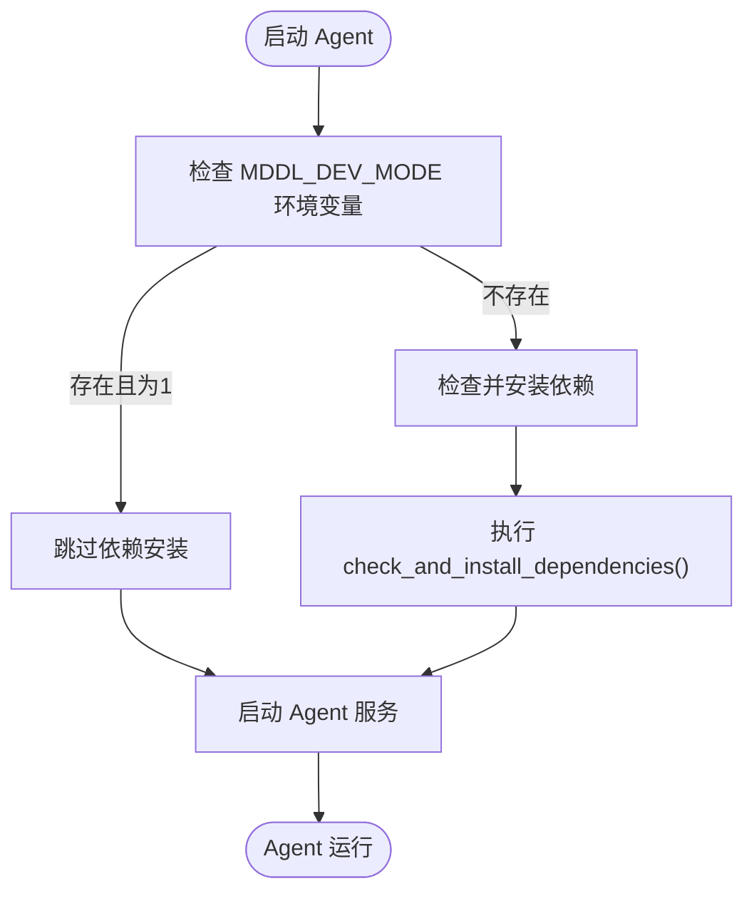
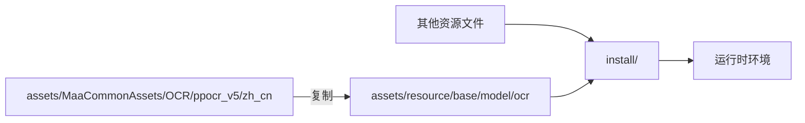

# 开发环境搭建

<cite>
**本文档中引用的文件**
- [README.md](file://README.md)
- [requirements.txt](file://requirements.txt)
- [dev/run_agent.py](file://dev/run_agent.py)
- [tools/configure.py](file://tools/configure.py)
- [ci/setup_embed_python.sh](file://ci/setup_embed_python.sh)
- [ci/setup_pip.py](file://ci/setup_pip.py)
- [agent/main.py](file://agent/main.py)
- [tools/install.py](file://tools/install.py)
- [agent/preprocess/setup.py](file://agent/preprocess/setup.py)
- [package.json](file://package.json)
- [check_resource.py](file://check_resource.py)
- [launcher/MaaDuDuL.py](file://launcher/MaaDuDuL.py)
</cite>

## 目录

1. [简介](#简介)
2. [Python环境要求](#python环境要求)
3. [项目克隆与目录结构](#项目克隆与目录结构)
4. [run_agent.py使用方式](#run_agentpy使用方式)
5. [依赖管理脚本](#依赖管理脚本)
6. [OCR模型配置](#ocr模型配置)
7. [常见问题排查](#常见问题排查)
8. [初始化命令示例](#初始化命令示例)

## 简介

MaaDuDuL 是一个基于 MaaFramework 的自动化助手工具，专为《嘟嘟脸恶作剧》游戏设计。本指南将详细介绍如何在本地搭建完整的开发环境，包括 Python 环境配置、项目结构说明、核心脚本使用方法以及资源初始化流程。

**Section sources**
- [README.md](file://README.md)

## Python环境要求

MaaDuDuL 项目对 Python 环境有明确要求：

- **Python 版本**：推荐使用 Python 3.12.7，项目在 `ci/setup_embed_python.sh` 脚本中明确指定了该版本。
- **依赖包**：项目依赖 `maafw==5.3.0b5` 和 `requests==2.32.5`，这些依赖定义在根目录的 `requirements.txt` 文件中。
- **嵌入式Python**：项目支持使用嵌入式 Python 环境，通过 `ci/setup_embed_python.sh`（Unix）或 `.ps1`（Windows）脚本自动安装独立的 Python 运行时，避免与系统环境冲突。

项目通过 `agent/preprocess/setup.py` 实现智能依赖管理，能够根据 `interface.json` 中的版本号自动判断是否需要更新依赖包，并支持配置多个 pip 镜像源以提高安装成功率。

**Section sources**
- [requirements.txt](file://requirements.txt)
- [ci/setup_embed_python.sh](file://ci/setup_embed_python.sh)
- [agent/preprocess/setup.py](file://agent/preprocess/setup.py)

## 项目克隆与目录结构

### 项目克隆

要开始开发，请首先克隆项目仓库：

```bash
git clone https://github.com/kqcoxn/MaaDuDuL.git
cd MaaDuDuL
```

### 目录结构说明

项目采用模块化设计，主要目录结构如下：

```
.
├── agent/               # 核心Agent逻辑
├── assets/              # 静态资源文件
├── ci/                  # 持续集成脚本
├── dev/                 # 开发工具脚本
├── tools/               # 工具脚本
├── launcher/            # 启动器
└── requirements.txt     # 依赖列表
```

- `agent/`：包含主程序逻辑、自定义功能和预处理模块。
- `assets/`：存放 OCR 模型、配置文件和界面资源。
- `ci/`：包含嵌入式 Python 安装和 pip 初始化脚本。
- `dev/`：开发专用脚本，如 `run_agent.py` 用于调试启动。
- `tools/`：工具脚本，如 `configure.py` 用于配置 OCR 模型。

**Section sources**
- [README.md](file://README.md)
- [project_structure](file://project_structure)

## run_agent.py使用方式

`dev/run_agent.py` 是专为开发调试设计的启动脚本，用于快速启动 Agent 服务。

### 调试模式启动

运行以下命令即可以调试模式启动 Agent：

```bash
python dev/run_agent.py
```

该脚本会自动执行以下操作：
1. 切换到项目根目录
2. 将项目根目录添加到 Python 路径
3. 设置 `MDDL_DEV_MODE=1` 环境变量
4. 启动 `agent/main.py`

### MDDL_DEV_MODE环境变量

`MDDL_DEV_MODE` 是一个关键的环境变量，其作用如下：

- 当该变量设置为 `1` 时，`agent/main.py` 会跳过依赖检查和自动安装流程，便于开发者在调试时避免重复安装依赖。
- 在生产环境中，此变量不存在，系统会自动执行依赖检查和更新。

该机制通过 `agent/main.py` 中的条件判断实现，确保开发和生产环境的行为分离。



**Diagram sources**
- [dev/run_agent.py](file://dev/run_agent.py#L1-L51)
- [agent/main.py](file://agent/main.py#L45-L47)

**Section sources**
- [dev/run_agent.py](file://dev/run_agent.py)
- [agent/main.py](file://agent/main.py)

## 依赖管理脚本

### setup_embed_python.sh

`ci/setup_embed_python.sh` 是 Unix 平台（macOS/Linux）的嵌入式 Python 安装脚本，主要功能包括：

- 自动检测操作系统和架构
- 下载指定版本（3.12.7）的独立 Python 构建
- 解压到 `install/python` 目录
- 复制 `setup_pip.py` 脚本用于后续 pip 安装
- 安装 pip 包管理工具
- 清理临时文件

该脚本确保项目在不同 Unix 系统上都能拥有统一的 Python 运行环境。

### setup_pip.py

`ci/setup_pip.py` 负责在嵌入式 Python 环境中安装 pip，其工作流程为：

1. 下载官方 `get-pip.py` 安装脚本
2. 执行安装脚本以安装 pip
3. 删除临时下载的安装文件

此脚本被 `setup_embed_python.sh` 调用，是构建完整 Python 环境的关键步骤。

**Section sources**
- [ci/setup_embed_python.sh](file://ci/setup_embed_python.sh)
- [ci/setup_pip.py](file://ci/setup_pip.py)

## OCR模型配置

### configure.py 功能

`tools/configure.py` 是资源配置工具，主要负责初始化 OCR 模型资源。

### configure_ocr_model() 函数

`configure_ocr_model()` 函数是 OCR 配置的核心，其工作流程如下：

1. 检查 `assets/MaaCommonAssets/OCR` 目录是否存在
2. 如果 `assets/resource/base/model/ocr` 目录不存在，则从 `assets/MaaCommonAssets/OCR/ppocr_v5/zh_cn` 复制默认 OCR 模型
3. 如果目标目录已存在，则跳过复制，避免覆盖用户自定义模型

该函数确保项目启动时拥有必要的 OCR 识别能力，同时尊重用户已配置的模型。

### 资源路径配置

正确配置路径是确保项目正常运行的关键：
- `assets/`：存放原始资源文件
- `resource/`：运行时使用的资源，由 `tools/install.py` 复制生成
- `install/`：最终的安装目录，包含所有运行所需文件



**Diagram sources**
- [tools/configure.py](file://tools/configure.py#L8-L28)
- [tools/install.py](file://tools/install.py)

**Section sources**
- [tools/configure.py](file://tools/configure.py)
- [tools/install.py](file://tools/install.py)

## 常见问题排查

### 路径错误

**问题**：脚本无法找到资源文件或模块。

**解决方案**：
1. 确保当前工作目录为项目根目录
2. 检查 `PYTHONPATH` 是否包含项目根目录
3. 验证 `assets/` 目录结构是否完整
4. 使用 `check_resource.py` 验证资源完整性

### 依赖缺失

**问题**：运行时提示模块未找到。

**解决方案**：
1. 检查 `requirements.txt` 是否正确安装
2. 确认 Python 环境是否正确激活
3. 查看 `config/mddl/pip_config.json` 中的镜像源配置
4. 手动执行 `pip install -r requirements.txt`

### OCR模型问题

**问题**：OCR识别失败或准确率低。

**解决方案**：
1. 确认 `assets/resource/base/model/ocr` 目录存在且包含必要文件
2. 检查 `keys.txt` 文件是否完整
3. 重新运行 `python tools/configure.py` 重新配置模型

### 环境变量问题

**问题**：行为不符合预期。

**解决方案**：
1. 检查 `MDDL_DEV_MODE` 环境变量设置
2. 确认 `MDDL_SOCKET_ID` 是否正确设置
3. 验证嵌入式 Python 路径配置

**Section sources**
- [check_resource.py](file://check_resource.py)
- [agent/preprocess/setup.py](file://agent/preprocess/setup.py)
- [tools/configure.py](file://tools/configure.py)

## 初始化命令示例

以下是完整的开发环境初始化命令序列：

```bash
# 1. 克隆项目
git clone https://github.com/kqcoxn/MaaDuDuL.git
cd MaaDuDuL

# 2. 安装嵌入式Python（Unix）
bash ci/setup_embed_python.sh

# 3. 配置OCR模型
python tools/configure.py

# 4. 安装项目依赖
pip install -r requirements.txt

# 5. 以调试模式启动Agent
python dev/run_agent.py

# 或使用npm脚本（如果已配置）
npm run agent
```

对于 Windows 用户，可使用对应的 PowerShell 脚本：
```powershell
.\ci\setup_embed_python.ps1
```

这些命令将构建一个完整的开发环境，使您能够立即开始调试和开发工作。

**Section sources**
- [package.json](file://package.json)
- [ci/setup_embed_python.sh](file://ci/setup_embed_python.sh)
- [tools/configure.py](file://tools/configure.py)
- [dev/run_agent.py](file://dev/run_agent.py)