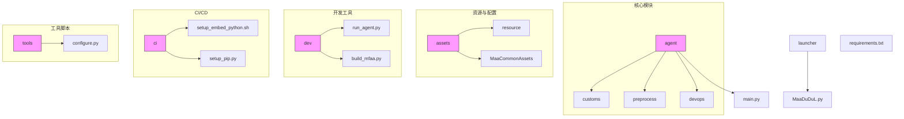
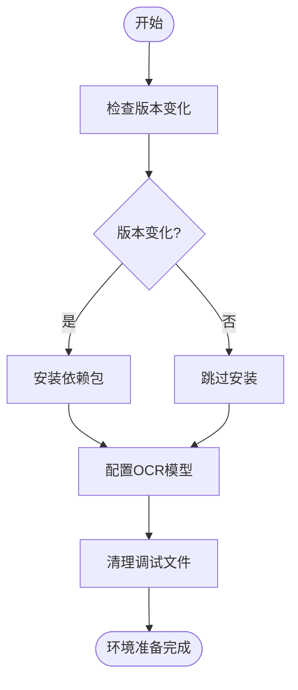
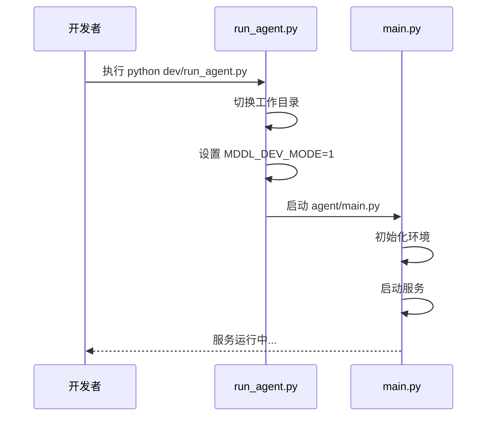
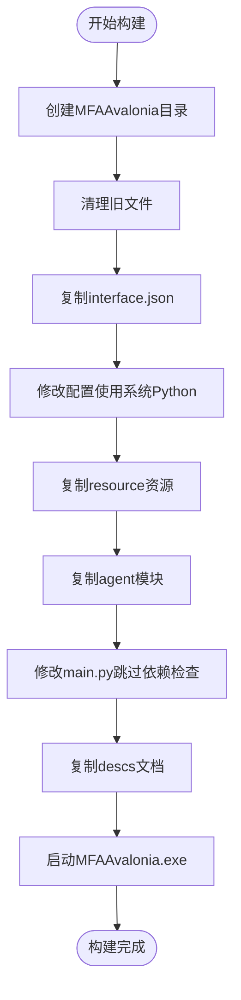
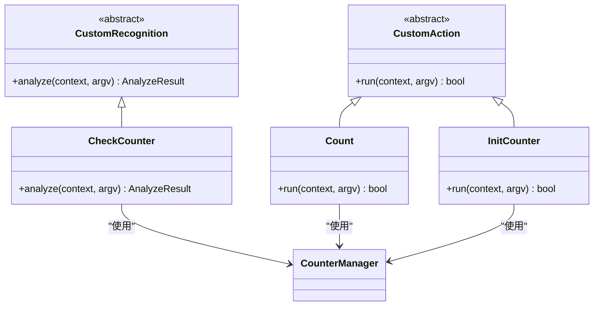
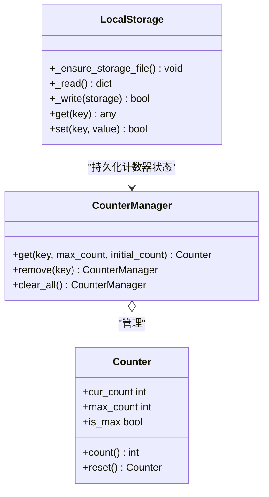
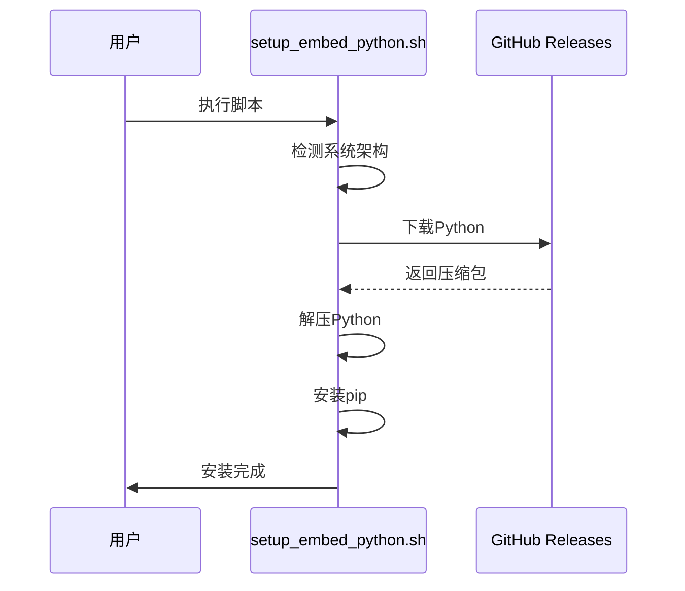
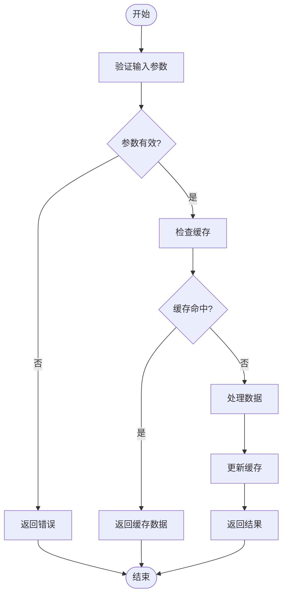

# 开发者指南

<cite>
**本文档引用的文件**
- [run_agent.py](file://dev/run_agent.py)
- [build_mfaa.py](file://dev/build_mfaa.py)
- [configure.py](file://tools/configure.py)
- [main.py](file://agent/main.py)
- [setup.py](file://agent/preprocess/setup.py)
- [clear.py](file://agent/preprocess/clear.py)
- [report.py](file://agent/devops/report.py)
- [setup_embed_python.sh](file://ci/setup_embed_python.sh)
- [setup_pip.py](file://ci/setup_pip.py)
- [interface.json](file://assets/interface.json)
- [requirements.txt](file://requirements.txt)
- [MaaDuDuL.py](file://launcher/MaaDuDuL.py)
- [counter.py](file://agent/customs/global_func/counter.py)
- [counter.py](file://agent/customs/utils/counter.py)
- [local_storage.py](file://agent/customs/utils/local_storage.py)
- [__init__.py](file://agent/customs/__init__.py)
- [2.1-集成文档.md](file://instructions/maafw-guide/2.1-集成文档.md)
- [2.2-集成接口一览.md](file://instructions/maafw-guide/2.2-集成接口一览.md)
- [2.3-回调协议.md](file://instructions/maafw-guide/2.3-回调协议.md)
- [2.4-控制方式说明.md](file://instructions/maafw-guide/2.4-控制方式说明.md)
- [3.1-任务流水线协议.md](file://instructions/maafw-guide/3.1-任务流水线协议.md)
- [3.2-ProjectInterface协议.md](file://instructions/maafw-guide/3.2-ProjectInterface协议.md)
- [3.3-ProjectInterfaceV2协议.md](file://instructions/maafw-guide/3.3-ProjectInterfaceV2协议.md)
- [4.1-构建指南.md](file://instructions/maafw-guide/4.1-构建指南.md)
- [4.2-标准化接口设计.md](file://instructions/maafw-guide/4.2-标准化接口设计.md)
</cite>

## 更新摘要
**变更内容**
- 新增了关于MaaFramework集成接口、任务流水线协议和ProjectInterfaceV2协议的详细指南
- 扩展了配置管理、自定义模块开发和CI/CD流程的说明
- 更新了项目结构和环境搭建部分以反映最新实践

## 目录
1. [简介](#简介)
2. [项目结构](#项目结构)
3. [环境搭建](#环境搭建)
4. [调试与运行](#调试与运行)
5. [打包与构建](#打包与构建)
6. [自定义模块开发](#自定义模块开发)
7. [配置管理](#配置管理)
8. [CI/CD与自动化部署](#cicd与自动化部署)
9. [代码规范与最佳实践](#代码规范与最佳实践)
10. [MaaFramework集成接口](#maaframework集成接口)
11. [任务流水线协议](#任务流水线协议)
12. [ProjectInterfaceV2协议](#projectinterfacev2协议)
13. [附录](#附录)

## 简介
本指南面向二次开发者，提供MaaDuDuL项目的完整开发流程指导。涵盖从环境配置、模块开发、调试运行到打包发布的全流程，帮助开发者快速上手并进行功能扩展。

## 项目结构
MaaDuDuL项目采用模块化设计，主要目录结构如下：



**图示来源**
- [项目结构](file://README.md#L1-L118)

## 环境搭建
### 依赖管理
项目通过`requirements.txt`管理Python依赖，核心依赖包括：
- `maafw==5.3.0b5`：MaaFramework核心库
- `requests==2.32.5`：HTTP请求库

### 预处理流程
环境初始化包含以下步骤：
1. 检测并安装Python依赖
2. 配置OCR模型
3. 清理调试文件



**图示来源**
- [setup.py](file://agent/preprocess/setup.py#L1-L230)
- [configure.py](file://tools/configure.py#L1-L29)
- [clear.py](file://agent/preprocess/clear.py#L1-L41)

**本节来源**
- [requirements.txt](file://requirements.txt#L1-L3)
- [setup.py](file://agent/preprocess/setup.py#L1-L230)
- [configure.py](file://tools/configure.py#L1-L29)

## 调试与运行
### 调试模式启动
使用`run_agent.py`脚本启动调试模式，该脚本会：
1. 切换到项目根目录
2. 设置开发模式环境变量
3. 启动Agent服务



**图示来源**
- [run_agent.py](file://dev/run_agent.py#L1-L51)
- [main.py](file://agent/main.py#L1-L48)

### 运行流程
Agent主程序执行流程：
1. 清理调试文件
2. 初始化MaaFramework工具包
3. 启动Agent服务器
4. 执行打卡上报
5. 等待服务结束

**本节来源**
- [run_agent.py](file://dev/run_agent.py#L1-L51)
- [main.py](file://agent/main.py#L1-L48)

## 打包与构建
### 构建流程
`build_mfaa.py`脚本负责构建可执行文件，主要步骤：
1. 创建目标目录结构
2. 复制资源文件
3. 修改配置以使用系统Python
4. 启动打包后的应用



**图示来源**
- [build_mfaa.py](file://dev/build_mfaa.py#L1-L118)

### 打包配置
构建过程中的关键配置修改：
- 将`agent.child_exec`设置为`python`，使用系统Python环境
- 修改`main.py`跳过依赖检查，直接使用本地环境

**本节来源**
- [build_mfaa.py](file://dev/build_mfaa.py#L1-L118)
- [interface.json](file://assets/interface.json)

## 自定义模块开发
### 模块结构
自定义功能模块位于`agent/customs/`目录下，主要分为：
- `global_func`：全局功能模块
- `special_treat`：特殊处理模块
- `utils`：工具类模块
- `maahelper`：Maa框架辅助模块

### 开发规范
#### 识别器开发
自定义识别器需继承`CustomRecognition`类，并使用`@AgentServer.custom_recognition`装饰器注册。

#### 操作器开发
自定义操作器需继承`CustomAction`类，并使用`@AgentServer.custom_action`装饰器注册。



**图示来源**
- [counter.py](file://agent/customs/global_func/counter.py#L1-L118)
- [counter.py](file://agent/customs/utils/counter.py#L1-L141)

### 参数处理
使用`ParamAnalyzer`类处理运行参数，支持：
- 多别名参数（如`key`和`k`）
- 默认值设置
- 类型转换

### 注册机制
通过装饰器自动注册到AgentServer，注册名称即为流水线中引用的名称。

**本节来源**
- [counter.py](file://agent/customs/global_func/counter.py#L1-L118)
- [counter.py](file://agent/customs/utils/counter.py#L1-L141)
- [__init__.py](file://agent/customs/__init__.py#L1-L3)

## 配置管理
### 配置文件
项目使用多种配置文件：
- `pip_config.json`：pip安装配置
- `local_storage.json`：本地存储配置
- `interface.json`：项目接口配置

### 配置管理类
`LocalStorage`类提供JSON格式的键值存储，用于持久化配置和状态数据。



**图示来源**
- [local_storage.py](file://agent/customs/utils/local_storage.py#L1-L111)
- [counter.py](file://agent/customs/utils/counter.py#L1-L141)

**本节来源**
- [configure.py](file://tools/configure.py#L1-L29)
- [local_storage.py](file://agent/customs/utils/local_storage.py#L1-L111)

## CI/CD与自动化部署
### 嵌入式Python安装
`setup_embed_python.sh`脚本用于在Unix平台安装嵌入式Python，主要功能：
1. 检测操作系统和架构
2. 下载对应版本的Python
3. 解压并配置环境
4. 安装pip包管理器



**图示来源**
- [setup_embed_python.sh](file://ci/setup_embed_python.sh#L1-L132)

### 自动化流程
CI/CD流程包括：
1. 环境准备
2. 依赖安装
3. 构建打包
4. 测试验证

**本节来源**
- [setup_embed_python.sh](file://ci/setup_embed_python.sh#L1-L132)
- [setup_pip.py](file://ci/setup_pip.py)

## 代码规范与最佳实践
### 代码风格
遵循Python PEP 8规范，主要要求：
- 使用4个空格缩进
- 行长度不超过79字符
- 使用下划线命名法
- 添加适当的文档字符串

### 日志调试
使用标准输出进行日志记录，前缀规范：
- `info:`：信息性日志
- `⚠️`：警告信息
- `❌`：错误信息
- `🚀`：启动信息

### 性能优化
1. 使用类方法减少实例化开销
2. 缓存频繁访问的数据
3. 异常处理避免程序中断
4. 资源文件按需加载

### 最佳实践示例


**本节来源**
- [所有Python文件](file://*.py)

## MaaFramework集成接口
### 集成文档
MaaFramework提供多种语言的集成支持，确保开发者能够灵活选择最适合的技术栈。

**本节来源**
- [2.1-集成文档.md](file://instructions/maafw-guide/2.1-集成文档.md)

### 支持的语言
#### C++
- 原生接口支持
- 全功能可用
- 提供示例代码
- 包含单元测试
- 无标准化接口封装

#### Python
- 官方支持，适配最新版本
- 提供示例代码
- 包含单元测试
- 标准化接口封装
- 协议解析封装

#### NodeJS
- 官方支持，适配最新版本
- 全功能可用
- 提供示例代码
- 包含单元测试
- 标准化接口封装
- 协议解析封装

#### CSharp
- 官方支持，适配最新版本
- 全功能可用
- 提供示例代码
- 包含单元测试
- 标准化接口封装
- 通过Binding.Extensions库部分支持协议解析

#### Golang
- 官方支持，适配最新版本
- 提供示例代码
- 包含单元测试
- 标准化接口封装
- 协议解析封装

#### Java
- 已适配v3版本
- 提供示例代码
- 包含单元测试
- 标准化接口封装
- 无协议解析封装

### 集成接口一览
不同语言的binding会有不同的命名方式，且会根据[标准化接口](./4.2-标准化接口设计.md)进行封装。

| C API | Python 标准接口 | NodeJS 标准接口 |
| --- | --- | --- |
| MaaVersion() | Library.version() | Global.version |
| MaaTaskerCreate() | Tasker() | new Tasker() |
| MaaTaskerDestroy(tasker_handle) | 析构时自动调用 | tasker.destroy() |
| MaaResourcePostBundle(res_handle, path) | resource.post_bundle(path) | res.post_bundle(path) |
| MaaControllerPostClick(ctrl_handle, x, y) | controller.post_click(x, y) | ctrl.post_click(x, y) |
| MaaTaskerInited(tasker_handle) | tasker.inited | tasker.inited |
| MaaTaskerPostTask(tasker_handle, entry, override) | tasker.post_task(entry, override) | tasker.post_task(entry, override) |

### 标准化接口设计
1. **对象化接口封装**：MaaTasker、MaaResource、MaaController等应设计为面向对象的接口。
2. **异步任务封装**：MaaTaskId、MaaCtrlId、MaaResId等异步ID不直接返回，而是封装成Job类。
3. **Job类封装**：Job类需封装基于ID的所有操作方法。
4. **查询类ID封装**：MaaRecoId、MaaNodeId等查询ID不直接返回，需通过MaaTaskerGetRecoDetail等接口查询。
5. **回调封装**：CustomAction、CustomRecognition、NotificationCallback等需包装为虚基类。
6. **参数结构封装**：将MaaCustomRecognitionCallback/MaaCustomActionCallback的参数封装成结构体。
7. **独立接口设计**：SetOption中的每个枚举应拆分为独立接口。
8. **缓冲区封装**：StringBuffer、ImageBuffer等不直接暴露，需转换为对应语言的字符串或图像类型。
9. **引用管理**：在BindResource、BindController、RegisterCustom等接口中保持引用。
10. **结构体数组返回**：MaaToolkit中的Find系列接口直接返回封装后的结构体数组。
11. **提供样例**：样例代码需展示的接口调用不少于Python版样例。

**本节来源**
- [2.2-集成接口一览.md](file://instructions/maafw-guide/2.2-集成接口一览.md)
- [4.2-标准化接口设计.md](file://instructions/maafw-guide/4.2-标准化接口设计.md)

## 任务流水线协议
### 基础格式
任务流水线采用JSON格式描述，由若干节点（Node）构成，每个节点包含以下核心属性：

```jsonc
{
    "NodeA": {
        "recognition": "OCR",    // 识别算法
        "action": "Click",       // 执行动作
        "next": [                // 后继节点列表
            "NodeB",
            "NodeC"
        ],
        // 其他扩展属性...
    },
    // 其他节点定义...
}
```

### 执行逻辑
#### 流程控制机制
1. **任务触发**：通过tasker.post_task接口指定入口节点启动任务
2. **顺序检测**：对当前节点的next列表进行顺序检测
3. **中断机制**：当检测到某个子节点匹配成功时，立即终止后续节点检测
4. **后继处理**：执行匹配节点的action定义的操作

#### 终止条件
当满足以下任意条件时，任务流程终止：
- 当前节点的next列表为空
- 所有后继节点持续检测失败直至超时

### 属性字段
#### Pipeline v1
- `recognition`：识别算法类型
- `action`：执行的动作
- `next`：接下来要执行的节点列表
- `rate_limit`：识别速率限制，单位毫秒
- `timeout`：识别超时时间，毫秒
- `on_error`：当识别超时或动作执行失败后，接下来会执行该列表中的节点
- `anchor`：锚点名称
- `inverse`：反转识别结果
- `enabled`：是否启用该node
- `max_hit`：该节点最多可被识别成功多少次
- `pre_delay`：识别到到执行动作前的延迟，毫秒
- `post_delay`：执行动作后到识别next的延迟，毫秒

#### Pipeline v2
MaaFW自v4.4.0版本起支持Pipeline v2协议，同时兼容v1。相较v1，主要将`recognition`和`action`相关字段放入了二级字典中（类型放入`type`字段，其余参数放入`param`字段中），其余并无不同。

### 算法类型
#### DirectHit
直接命中，即不进行识别，直接执行动作。

#### TemplateMatch
模板匹配，即"找图"。

#### FeatureMatch
特征匹配，泛化能力更强的"找图"，具有抗透视、抗尺寸变化等特点。

#### ColorMatch
颜色匹配，即"找色"。

#### OCR
文字识别。

#### NeuralNetworkClassify
深度学习分类，判断图像中的固定位置是否为预期的"类别"。

#### NeuralNetworkDetect
深度学习目标检测，高级版"找图"。

### 动作类型
#### DoNothing
什么都不做。

#### Click
点击操作。

#### LongPress
长按操作。

#### Swipe
滑动操作。

#### MultiSwipe
多点滑动操作。

#### Scroll
滚动操作。

#### ClickKey
点击按键。

#### LongPressKey
长按按键。

#### InputText
输入文本。

#### StartApp
启动应用。

#### StopApp
关闭应用。

#### StopTask
停止任务。

#### Command
执行命令。

#### Shell
执行shell命令。

**本节来源**
- [3.1-任务流水线协议.md](file://instructions/maafw-guide/3.1-任务流水线协议.md)

## ProjectInterfaceV2协议
### 简介
所谓`ProjectInterface`，即MaaFramework的一个标准化的项目结构声明，该声明目前包含`interface.json`一个文件。通过定义PI，你可以使用MaaFramework的各种衍生工具。

### interface.json
#### 整体结构
- `interface_version`：接口版本号，当前为2，固定且必须设置
- `languages`：多语言支持配置
- `name`：项目唯一标识符
- `label`：项目显示名称
- `title`：窗口标题
- `icon`：应用图标文件路径
- `mirrorchyan_rid`：MirrorChyan资源包标识符
- `mirrorchyan_multiplatform`：是否支持多平台
- `github`：项目GitHub仓库地址
- `version`：项目版本号
- `contact`：联系方式信息
- `license`：项目许可证信息
- `welcome`：欢迎消息
- `description`：项目描述信息

#### 控制器配置
控制器配置为一个对象数组，含有预设的控制器信息：
- `name`：唯一名称标识符
- `label`：显示名称
- `description`：控制器详细描述信息
- `icon`：控制器图标文件路径
- `type`：控制器类型（Adb、Win32、PlayCover）
- `display_short_side`：默认缩放分辨率的短边长度
- `display_long_side`：默认缩放分辨率的长边长度
- `display_raw`：是否使用原始分辨率进行截图

#### 资源配置
资源配置为一个对象数组，含有资源加载的信息：
- `name`：唯一名称标识符
- `label`：显示名称
- `description`：资源详细描述信息
- `icon`：资源图标文件路径
- `path`：加载的路径数组
- `controller`：指定该资源包支持的控制器类型列表
- `option`：资源包的全局选项配置

#### 代理配置
代理配置为一个对象，含有子进程（AgentServer）的信息：
- `child_exec`：子进程路径
- `child_args`：子进程参数数组
- `identifier`：连接标识符

#### 任务配置
任务配置为一个对象数组，含有可执行任务的信息：
- `name`：任务唯一标识符
- `label`：任务显示名称
- `entry`：任务入口
- `default_check`：是否默认选中该任务
- `description`：任务详细描述信息
- `icon`：任务图标文件路径
- `resource`：指定该任务支持的资源包列表
- `pipeline_override`：任务参数，执行任务时会覆盖已加载的资源
- `option`：任务配置项

#### 配置项定义
配置项定义为一个对象映射，含有配置项的信息：
- `type`：配置项类型（select、input、switch）
- `label`：配置项显示标签
- `description`：配置项详细描述信息
- `icon`：配置项图标文件路径
- `cases`：可选项，为一个对象数组
- `inputs`：输入配置，为一个对象数组
- `pipeline_override`：当配置项为"input"类型时使用，作为用户输入内容的替换模板
- `default_case`：默认选项名称

### 国际化支持
对于所有支持国际化的字符串字段，如果字符串以`$`开头，则表示该字符串是国际化字符串，Client需要从翻译文件中读取实际值再显示。

### 资源覆盖
后加载的资源中如果发现了和已加载资源同名的任务，会对任务进行合并。通常情况下，可以认为新的任务的顶级键会替换旧任务的。

### 节点通知处理
MaaFramework在任务执行过程中会通过回调函数发送节点通知，Client需要实现相应的处理逻辑，以便向用户展示任务执行状态。

#### 回调函数签名
Client需要注册一个回调函数来接收通知，函数签名参考[MaaDef.h](https://github.com/MaaXYZ/MaaFramework/blob/main/include/MaaFramework/MaaDef.h)：

```c
typedef void(MAA_CALL* MaaEventCallback)(
    void* handle,
    const char* message,
    const char* details_json,
    void* trans_arg
);
```

- **message**：消息类型标识
- **details_json**：包含具体数据的JSON字符串

#### 消息模板机制
资源作者可以在Pipeline中通过`focus`字段配置消息模板。`focus`是一个字典，键为消息类型，值为模板字符串。Client收到回调后，应根据模板进行占位符替换并展示给用户。

**本节来源**
- [3.3-ProjectInterfaceV2协议.md](file://instructions/maafw-guide/3.3-ProjectInterfaceV2协议.md)

## 附录
### 常见问题
1. **环境变量未设置**：确保`MDDL_DEV_MODE`正确设置
2. **依赖安装失败**：检查网络连接或更换镜像源
3. **模块注册失败**：确认装饰器使用正确

### 调试技巧
- 使用`debug`目录查看调试截图
- 检查`logs`目录的日志文件
- 通过环境变量控制调试输出

### 参考文档
- [MaaFramework文档](https://github.com/MaaXYZ/MaaFramework)
- [Python最佳实践](https://peps.python.org/pep-0008/)