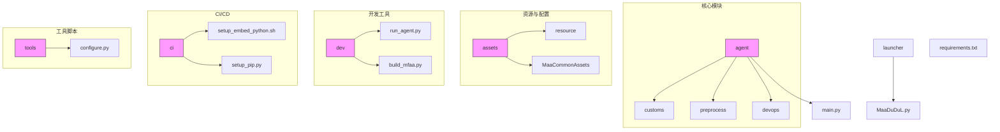
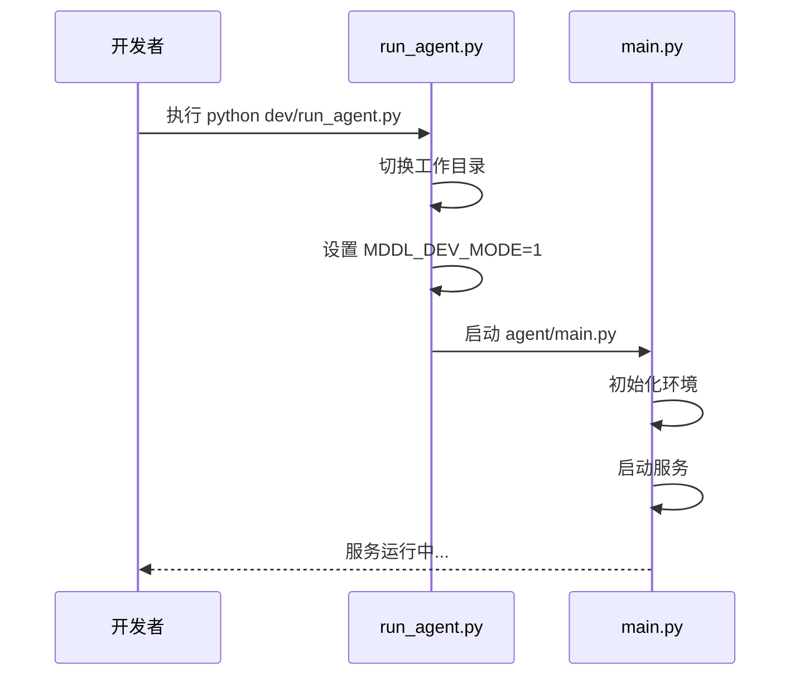
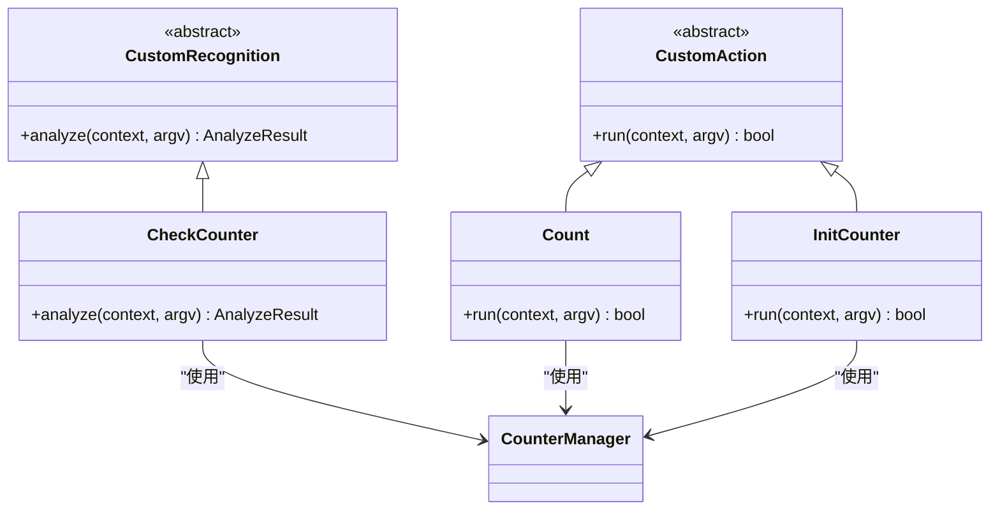
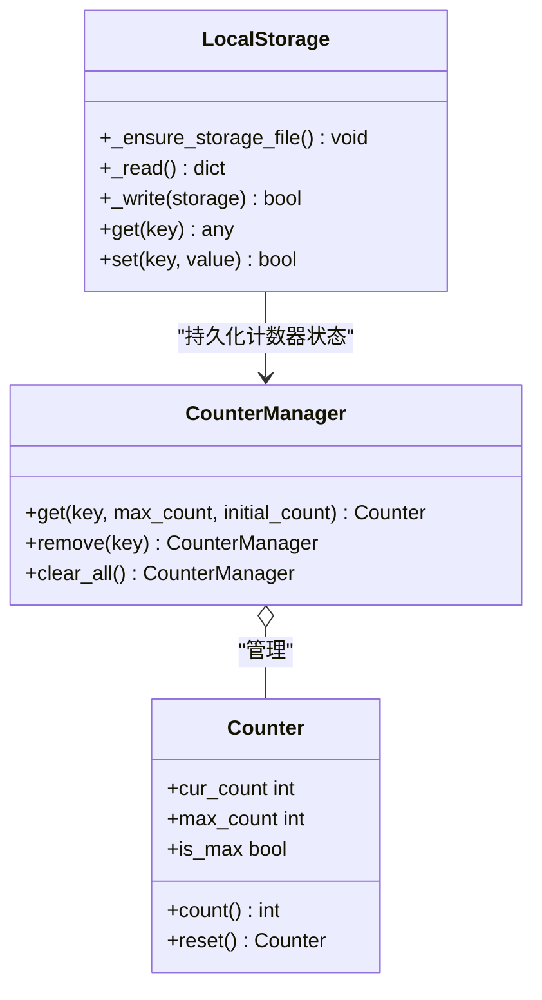
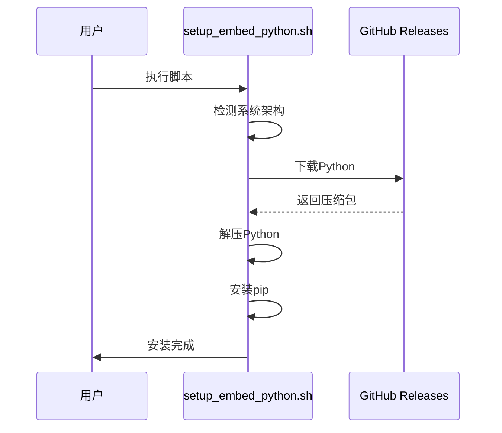

# 开发者指南

<cite>
**本文档引用的文件**
- [run_agent.py](file://dev/run_agent.py)
- [build_mfaa.py](file://dev/build_mfaa.py)
- [configure.py](file://tools/configure.py)
- [main.py](file://agent/main.py)
- [setup.py](file://agent/preprocess/setup.py)
- [clear.py](file://agent/preprocess/clear.py)
- [report.py](file://agent/devops/report.py)
- [setup_embed_python.sh](file://ci/setup_embed_python.sh)
- [setup_pip.py](file://ci/setup_pip.py)
- [interface.json](file://assets/interface.json)
- [requirements.txt](file://requirements.txt)
- [MaaDuDuL.py](file://launcher/MaaDuDuL.py)
- [counter.py](file://agent/customs/global_func/counter.py)
- [counter.py](file://agent/customs/utils/counter.py)
- [local_storage.py](file://agent/customs/utils/local_storage.py)
- [__init__.py](file://agent/customs/__init__.py)
</cite>

## 目录
1. [简介](#简介)
2. [项目结构](#项目结构)
3. [环境搭建](#环境搭建)
4. [调试与运行](#调试与运行)
5. [打包与构建](#打包与构建)
6. [自定义模块开发](#自定义模块开发)
7. [配置管理](#配置管理)
8. [CI/CD与自动化部署](#cicd与自动化部署)
9. [代码规范与最佳实践](#代码规范与最佳实践)
10. [附录](#附录)

## 简介
本指南面向二次开发者，提供MaaDuDuL项目的完整开发流程指导。涵盖从环境配置、模块开发、调试运行到打包发布的全流程，帮助开发者快速上手并进行功能扩展。

## 项目结构
MaaDuDuL项目采用模块化设计，主要目录结构如下：

**图示来源**
- [项目结构](file://README.md#L1-L118)

## 环境搭建
### 依赖管理
项目通过`requirements.txt`管理Python依赖，核心依赖包括：
- `maafw==5.3.0b5`：MaaFramework核心库
- `requests==2.32.5`：HTTP请求库

### 预处理流程
环境初始化包含以下步骤：
1. 检测并安装Python依赖
2. 配置OCR模型
3. 清理调试文件

**图示来源**
- [setup.py](file://agent/preprocess/setup.py#L1-L230)
- [configure.py](file://tools/configure.py#L1-L29)
- [clear.py](file://agent/preprocess/clear.py#L1-L41)

**本节来源**
- [requirements.txt](file://requirements.txt#L1-L3)
- [setup.py](file://agent/preprocess/setup.py#L1-L230)
- [configure.py](file://tools/configure.py#L1-L29)

## 调试与运行
### 调试模式启动
使用`run_agent.py`脚本启动调试模式，该脚本会：
1. 切换到项目根目录
2. 设置开发模式环境变量
3. 启动Agent服务

**图示来源**
- [run_agent.py](file://dev/run_agent.py#L1-L51)
- [main.py](file://agent/main.py#L1-L48)

### 运行流程
Agent主程序执行流程：
1. 清理调试文件
2. 初始化MaaFramework工具包
3. 启动Agent服务器
4. 执行打卡上报
5. 等待服务结束

**本节来源**
- [run_agent.py](file://dev/run_agent.py#L1-L51)
- [main.py](file://agent/main.py#L1-L48)

## 打包与构建
### 构建流程
`build_mfaa.py`脚本负责构建可执行文件，主要步骤：
1. 创建目标目录结构
2. 复制资源文件
3. 修改配置以使用系统Python
4. 启动打包后的应用

**图示来源**
- [build_mfaa.py](file://dev/build_mfaa.py#L1-L118)

### 打包配置
构建过程中的关键配置修改：
- 将`agent.child_exec`设置为`python`，使用系统Python环境
- 修改`main.py`跳过依赖检查，直接使用本地环境

**本节来源**
- [build_mfaa.py](file://dev/build_mfaa.py#L1-L118)
- [interface.json](file://assets/interface.json)

## 自定义模块开发
### 模块结构
自定义功能模块位于`agent/customs/`目录下，主要分为：
- `global_func`：全局功能模块
- `special_treat`：特殊处理模块
- `utils`：工具类模块
- `maahelper`：Maa框架辅助模块

### 开发规范
#### 识别器开发
自定义识别器需继承`CustomRecognition`类，并使用`@AgentServer.custom_recognition`装饰器注册。

#### 操作器开发
自定义操作器需继承`CustomAction`类，并使用`@AgentServer.custom_action`装饰器注册。

**图示来源**
- [counter.py](file://agent/customs/global_func/counter.py#L1-L118)
- [counter.py](file://agent/customs/utils/counter.py#L1-L141)

### 参数处理
使用`ParamAnalyzer`类处理运行参数，支持：
- 多别名参数（如`key`和`k`）
- 默认值设置
- 类型转换

### 注册机制
通过装饰器自动注册到AgentServer，注册名称即为流水线中引用的名称。

**本节来源**
- [counter.py](file://agent/customs/global_func/counter.py#L1-L118)
- [counter.py](file://agent/customs/utils/counter.py#L1-L141)
- [__init__.py](file://agent/customs/__init__.py#L1-L3)

## 配置管理
### 配置文件
项目使用多种配置文件：
- `pip_config.json`：pip安装配置
- `local_storage.json`：本地存储配置
- `interface.json`：项目接口配置

### 配置管理类
`LocalStorage`类提供JSON格式的键值存储，用于持久化配置和状态数据。

**图示来源**
- [local_storage.py](file://agent/customs/utils/local_storage.py#L1-L111)
- [counter.py](file://agent/customs/utils/counter.py#L1-L141)

**本节来源**
- [configure.py](file://tools/configure.py#L1-L29)
- [local_storage.py](file://agent/customs/utils/local_storage.py#L1-L111)

## CI/CD与自动化部署
### 嵌入式Python安装
`setup_embed_python.sh`脚本用于在Unix平台安装嵌入式Python，主要功能：
1. 检测操作系统和架构
2. 下载对应版本的Python
3. 解压并配置环境
4. 安装pip包管理器

**图示来源**
- [setup_embed_python.sh](file://ci/setup_embed_python.sh#L1-L132)

### 自动化流程
CI/CD流程包括：
1. 环境准备
2. 依赖安装
3. 构建打包
4. 测试验证

**本节来源**
- [setup_embed_python.sh](file://ci/setup_embed_python.sh#L1-L132)
- [setup_pip.py](file://ci/setup_pip.py)

## 代码规范与最佳实践
### 代码风格
遵循Python PEP 8规范，主要要求：
- 使用4个空格缩进
- 行长度不超过79字符
- 使用下划线命名法
- 添加适当的文档字符串

### 日志调试
使用标准输出进行日志记录，前缀规范：
- `info:`：信息性日志
- `⚠️`：警告信息
- `❌`：错误信息
- `🚀`：启动信息

### 性能优化
1. 使用类方法减少实例化开销
2. 缓存频繁访问的数据
3. 异常处理避免程序中断
4. 资源文件按需加载

### 最佳实践示例

**本节来源**
- [所有Python文件](file://*.py)

## 附录
### 常见问题
1. **环境变量未设置**：确保`MDDL_DEV_MODE`正确设置
2. **依赖安装失败**：检查网络连接或更换镜像源
3. **模块注册失败**：确认装饰器使用正确

### 调试技巧
- 使用`debug`目录查看调试截图
- 检查`logs`目录的日志文件
- 通过环境变量控制调试输出

### 参考文档
- [MaaFramework文档](https://github.com/MaaXYZ/MaaFramework)
- [Python最佳实践](https://peps.python.org/pep-0008/)