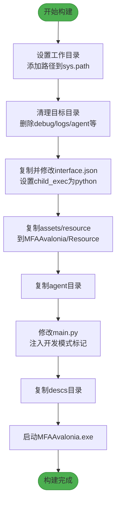
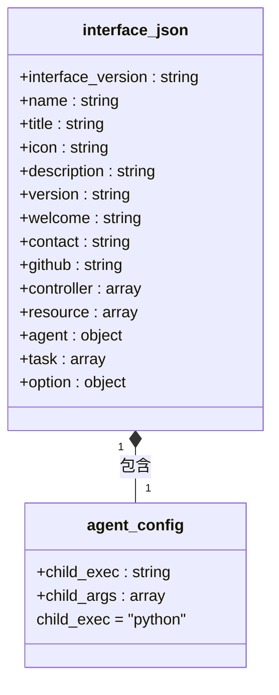
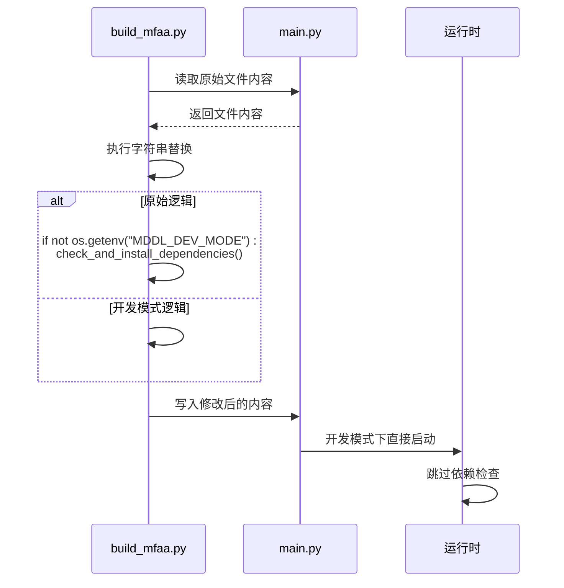
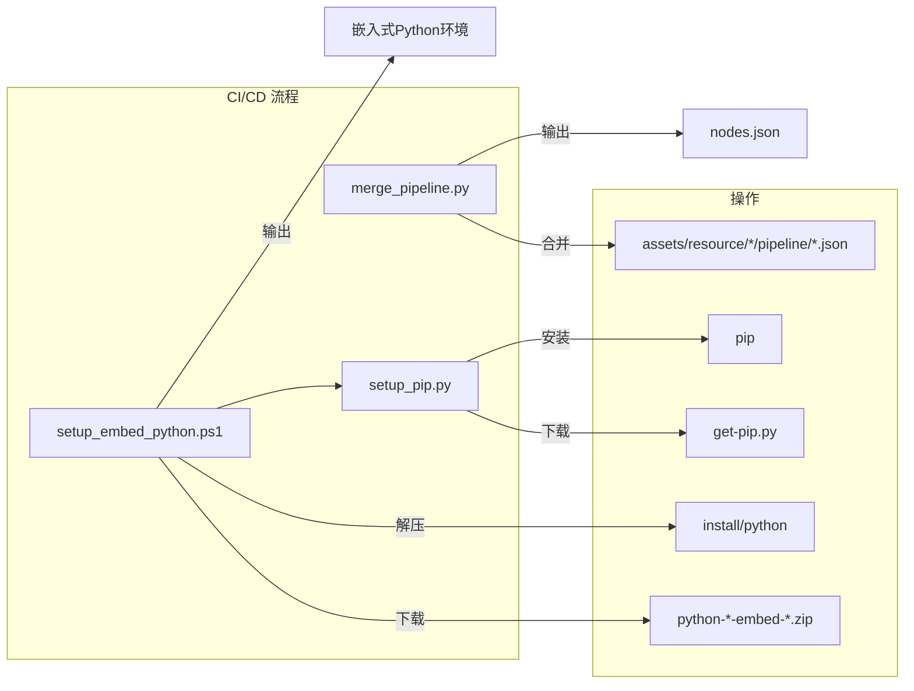

# 构建与部署

<cite>
**本文档中引用的文件**  
- [build_mfaa.py](file://dev/build_mfaa.py)
- [interface.json](file://assets/interface.json)
- [main.py](file://agent/main.py)
- [merge_pipeline.py](file://ci/merge_pipeline.py)
- [setup_embed_python.ps1](file://ci/setup_embed_python.ps1)
- [setup_pip.py](file://ci/setup_pip.py)
- [MaaDuDuL.py](file://launcher/MaaDuDuL.py)
- [MaaDuDuL.spec](file://launcher/MaaDuDuL.spec)
- [maa_option.json](file://ci/config/maa_option.json)
- [maa_pi_config.json](file://assets/config/maa_pi_config.json)
- [requirements.txt](file://requirements.txt)
</cite>

## 目录
1. [构建流程概述](#构建流程概述)
2. [build_mfaa.py 脚本解析](#build_mfaapy-脚本解析)
3. [interface.json 配置转换](#interfacejson-配置转换)
4. [main.py 开发模式注入](#mainpy-开发模式注入)
5. [MFAAvalonia 框架集成](#mfaavalonia-框架集成)
6. [资源文件打包规则](#资源文件打包规则)
7. [CI/CD 自动化脚本](#cicd-自动化脚本)
8. [程序启动与验证](#程序启动与验证)
9. [部署场景配置建议](#部署场景配置建议)

## 构建流程概述

本项目通过 `build_mfaa.py` 脚本实现从源码到可执行应用程序包的完整构建流程。构建过程主要包括：文件复制与组织、配置文件转换、资源集成、依赖处理和自动化部署。构建后的程序以 MFAAvalonia 框架为基础运行，通过 launcher 启动器实现跨平台兼容性。CI/CD 工具链提供了资源合并、嵌入式 Python 环境配置等自动化功能，确保部署的一致性和可靠性。

**Section sources**
- [build_mfaa.py](file://dev/build_mfaa.py#L1-L117)
- [MaaDuDuL.py](file://launcher/MaaDuDuL.py#L1-L21)

## build_mfaa.py 脚本解析

`build_mfaa.py` 是项目的核心构建脚本，负责将分散的源码文件组织成可执行的应用程序包。该脚本首先设置工作目录并确保开发环境路径正确，然后执行 `copy_files()` 函数完成主要构建任务。

构建过程遵循严格的文件复制策略：先清理目标目录 `MFAAvalonia` 中的现有文件和目录（包括 debug、logs、agent 等），然后从源目录复制必要文件。关键操作包括复制 `assets/interface.json` 并修改其执行配置、复制 `assets/resource` 目录下的所有资源文件、复制 `agent` 目录下的代理代码，以及复制 `descs` 目录下的说明文档。

脚本最后尝试启动生成的 `MFAAvalonia.exe` 程序，提供即时的构建反馈。整个过程通过异常处理机制确保构建的健壮性，并在发生错误时输出详细信息。



**Diagram sources**
- [build_mfaa.py](file://dev/build_mfaa.py#L16-L117)

**Section sources**
- [build_mfaa.py](file://dev/build_mfaa.py#L1-L117)

## interface.json 配置转换

`interface.json` 文件是项目与 MFAAvalonia 框架交互的关键配置文件。在构建过程中，`build_mfaa.py` 脚本会读取 `assets/interface.json` 并进行特定修改，然后将其复制到目标目录。

最重要的转换是修改 `agent.child_exec` 字段的值。在源配置中，该字段设置为 `"./python/python.exe"`，指向嵌入式 Python 环境。构建脚本将其修改为 `"python"`，指示系统使用全局 Python 解释器。这一转换是为了适应开发模式的需求，允许开发者使用本地 Python 环境和已安装的依赖包，而不是受限的嵌入式环境。

此配置还定义了应用程序的元数据（如名称、版本、描述）、控制器配置（模拟器和PlayCover）、资源路径、任务列表和选项配置。这些配置确保了应用程序在 MFAAvalonia 框架中的正确显示和功能实现。



**Diagram sources**
- [build_mfaa.py](file://dev/build_mfaa.py#L51-L61)
- [interface.json](file://assets/interface.json#L1-L1196)

**Section sources**
- [build_mfaa.py](file://dev/build_mfaa.py#L51-L61)
- [interface.json](file://assets/interface.json#L1-L1196)

## main.py 开发模式注入

`agent/main.py` 是代理服务的主入口文件，在构建过程中会被修改以适应开发模式。原始的 `main.py` 文件包含依赖检查逻辑：通过检查 `MDDL_DEV_MODE` 环境变量来决定是否调用 `check_and_install_dependencies()` 函数。

`build_mfaa.py` 脚本通过字符串替换的方式修改 `main.py`，将原有的环境变量检查和依赖安装逻辑替换为直接调用 `main()` 函数的简单语句。这一修改在文件中添加了明确的注释："开发模式：跳过依赖检查，使用本地Python环境"。

这种注入方式使得开发者可以在不重新安装依赖的情况下快速迭代和测试代码，充分利用本地 Python 环境中已安装的包（如 `maafw==5.3.0b5` 和 `requests==2.32.5`）。当程序在开发模式下运行时，它会直接启动代理服务，而不会尝试检查或安装任何依赖包。



**Diagram sources**
- [build_mfaa.py](file://dev/build_mfaa.py#L81-L94)
- [main.py](file://agent/main.py#L44-L47)

**Section sources**
- [build_mfaa.py](file://dev/build_mfaa.py#L81-L94)
- [main.py](file://agent/main.py#L1-L48)

## MFAAvalonia 框架集成

项目通过 MFAAvalonia 框架实现图形化界面和核心功能集成。构建过程将所有必要组件打包到 `MFAAvalonia` 目录中，形成一个完整的应用程序包。该框架作为宿主环境，负责加载和执行代理服务。

集成过程通过 `launcher/MaaDuDuL.py` 启动器实现跨平台兼容性。该启动器根据操作系统类型（Windows、macOS、Linux）确定正确的可执行文件路径（`MFAAvalonia.exe` 或 `MFAAvalonia`），并使用 `subprocess` 模块启动程序。`MaaDuDuL.spec` PyInstaller 配置文件定义了如何将启动器脚本打包为单个可执行文件，包括图标设置和窗口模式配置。

`maa_option.json` 配置文件定义了 MaaFramework 的运行时选项，如日志记录、错误时保存截图等。这些选项在构建过程中被正确放置，确保框架以预期配置运行。整个集成方案实现了从 Python 脚本到独立桌面应用程序的平滑转换。

```mermaid
graph TD
subgraph "应用程序包"
MFAAvalonia[MFAAvalonia/]
Resource[Resource/]
Agent[agent/]
Interface[interface.json]
end
subgraph "启动流程"
Launcher[MaaDuDuL.exe]
OS[操作系统]
MFAA[MFAAvalonia.exe]
end
Launcher --> OS : 检测系统类型
OS --> MFAA : 启动核心框架
MFAA --> Interface : 加载配置
Interface --> Agent : 启动代理服务
MFAA --> Resource : 加载资源文件
```

**Diagram sources**
- [MaaDuDuL.py](file://launcher/MaaDuDuL.py#L1-L21)
- [MaaDuDuL.spec](file://launcher/MaaDuDuL.spec#L1-L40)
- [maa_option.json](file://ci/config/maa_option.json#L1-L6)

**Section sources**
- [MaaDuDuL.py](file://launcher/MaaDuDuL.py#L1-L21)
- [MaaDuDuL.spec](file://launcher/MaaDuDuL.spec#L1-L40)
- [maa_option.json](file://ci/config/maa_option.json#L1-L6)

## 资源文件打包规则

资源文件的打包遵循清晰的目录结构和组织规则。`assets/resource` 目录下的所有内容被完整复制到 `MFAAvalonia/Resource` 目录中，保持原有的文件夹结构。这包括 `Announcement`（公告）、`base`（基础资源）和 `Changelog.md`（更新日志）等文件和目录。

`base` 目录包含核心的流水线配置文件 `default_pipeline.json` 和 OCR 模型密钥文件 `keys.txt`。`pipeline` 子目录组织了各种任务流水线，按功能分类（如日常任务、开荒功能等）。这些 JSON 文件定义了自动化任务的具体步骤和逻辑。

`descs` 目录下的 Markdown 文件作为任务说明文档，被复制到 `Resource/descs` 目录中。这些文档为用户提供详细的操作指南和功能说明。`check_resource.py` 脚本可用于验证资源文件的完整性，确保所有必要的资源都已正确打包。

```mermaid
erDiagram
RESOURCE ||--o{ ANNOUNCEMENT : 包含
RESOURCE ||--o{ CHANGELOG : 包含
RESOURCE ||--o{ BASE : 包含
RESOURCE ||--o{ DESCS : 包含
BASE ||--o{ PIPELINE : 包含
BASE ||--o{ DEFAULT_PIPELINE : 包含
BASE ||--o{ KEYS : 包含
class RESOURCE {
string path
}
class ANNOUNCEMENT {
string 01.公告.md
string 90.更新记录.md
}
class CHANGELOG {
string Changelog.md
}
class BASE {
string default_pipeline.json
string keys.txt
}
class PIPELINE {
string 启动游戏.json
string 领取邮件.json
string 圣团巡礼.json
string 巅峰对决.json
}
class DESCS {
string illustrate.md
string guide.md
string start_game.md
string claim_mail.md
}
```

**Diagram sources**
- [build_mfaa.py](file://dev/build_mfaa.py#L65-L73)
- [assets/resource](file://assets/resource)
- [descs](file://descs)

**Section sources**
- [build_mfaa.py](file://dev/build_mfaa.py#L65-L73)
- [assets/resource](file://assets/resource)
- [descs](file://descs)

## CI/CD 自动化脚本

项目包含多个 CI/CD 相关脚本，用于自动化部署和环境配置。`ci/merge_pipeline.py` 脚本负责合并分散的流水线 JSON 文件。它递归遍历 `assets/resource` 下的所有 `pipeline` 目录，将其中的 JSON 文件内容合并到一个 `nodes.json` 文件中，然后删除原始的文件夹结构。这一过程简化了资源管理，确保框架能正确加载所有任务节点。

`ci/setup_embed_python.ps1` 是 PowerShell 脚本，用于配置嵌入式 Python 环境。它根据系统架构下载对应版本的 Python 嵌入式包（如 python-3.12.7-embed-amd64.zip），解压到指定目录，并修改 `_pth` 文件以确保正确的模块搜索路径。脚本还负责安装 pip 和必要的 Python 包，为无外部依赖的独立部署提供支持。

`ci/setup_pip.py` 是辅助脚本，由 `setup_embed_python.ps1` 调用，负责下载并执行官方的 `get-pip.py` 脚本，从而在嵌入式环境中安装 pip 包管理器。这些自动化脚本共同构成了可靠的部署流水线，确保在不同环境中都能一致地配置运行环境。



**Diagram sources**
- [merge_pipeline.py](file://ci/merge_pipeline.py#L1-L72)
- [setup_embed_python.ps1](file://ci/setup_embed_python.ps1#L1-L135)
- [setup_pip.py](file://ci/setup_pip.py#L1-L39)

**Section sources**
- [merge_pipeline.py](file://ci/merge_pipeline.py#L1-L72)
- [setup_embed_python.ps1](file://ci/setup_embed_python.ps1#L1-L135)
- [setup_pip.py](file://ci/setup_pip.py#L1-L39)

## 程序启动与验证

构建完成后，程序的启动和验证遵循标准流程。`build_mfaa.py` 脚本在成功构建后会自动尝试启动 `MFAAvalonia/MFAAvalonia.exe`。用户也可以通过双击 `MaaDuDuL.exe` 启动器或在命令行中运行来手动启动程序。

验证构建成功的关键指标包括：`MFAAvalonia` 目录存在且包含必要的文件和子目录；`interface.json` 中的 `child_exec` 正确设置为 `python`；`agent/main.py` 文件已被修改为开发模式；以及程序能够正常启动且无依赖错误。`package.json` 中的 `dev` 脚本（`python dev/build_mfaa.py`）提供了一键构建的便捷方式。

在开发环境中，可以通过检查控制台输出和日志文件来验证代理服务是否正常运行。`maa_pi_config.json` 配置文件指定了默认的资源配置（如 "B服"），确保程序加载正确的资源集。

**Section sources**
- [build_mfaa.py](file://dev/build_mfaa.py#L104-L108)
- [MaaDuDuL.py](file://launcher/MaaDuDuL.py#L1-L21)
- [maa_pi_config.json](file://assets/config/maa_pi_config.json#L1-L3)
- [package.json](file://package.json#L1-L13)

## 部署场景配置建议

针对不同的部署场景，建议采取相应的配置策略。在开发环境中，使用 `build_mfaa.py` 脚本构建的应用程序应配置为使用系统 Python 环境（`child_exec: "python"`），并跳过依赖检查，以提高开发效率。

在生产或独立部署环境中，应使用 `setup_embed_python.ps1` 脚本配置嵌入式 Python 环境，将 `child_exec` 指向嵌入式 Python 可执行文件（`./python/python.exe`），并确保所有依赖包都已打包。这可以创建完全独立、无需外部依赖的应用程序包。

对于多用户分发，建议使用 PyInstaller 将 `MaaDuDuL.py` 打包为单个可执行文件，并包含所有必要资源。配置文件如 `maa_option.json` 可根据部署需求调整日志级别和调试选项。无论何种场景，都应确保 `interface.json` 中的路径和配置与实际的文件结构相匹配。

**Section sources**
- [interface.json](file://assets/interface.json#L1-L1196)
- [maa_option.json](file://ci/config/maa_option.json#L1-L6)
- [setup_embed_python.ps1](file://ci/setup_embed_python.ps1#L1-L135)
- [build_mfaa.py](file://dev/build_mfaa.py#L58-L59)