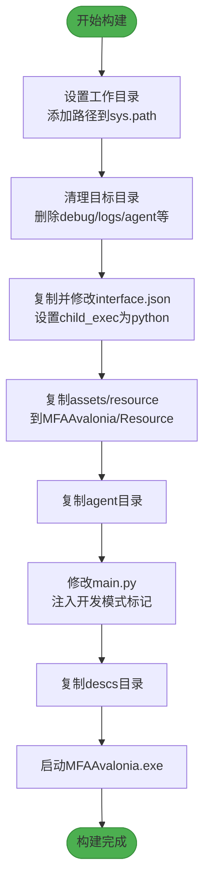
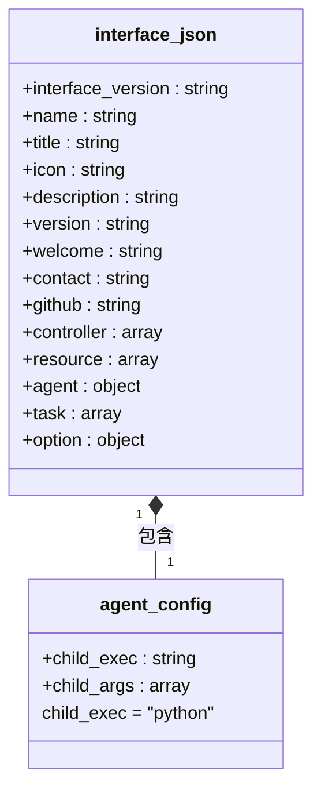
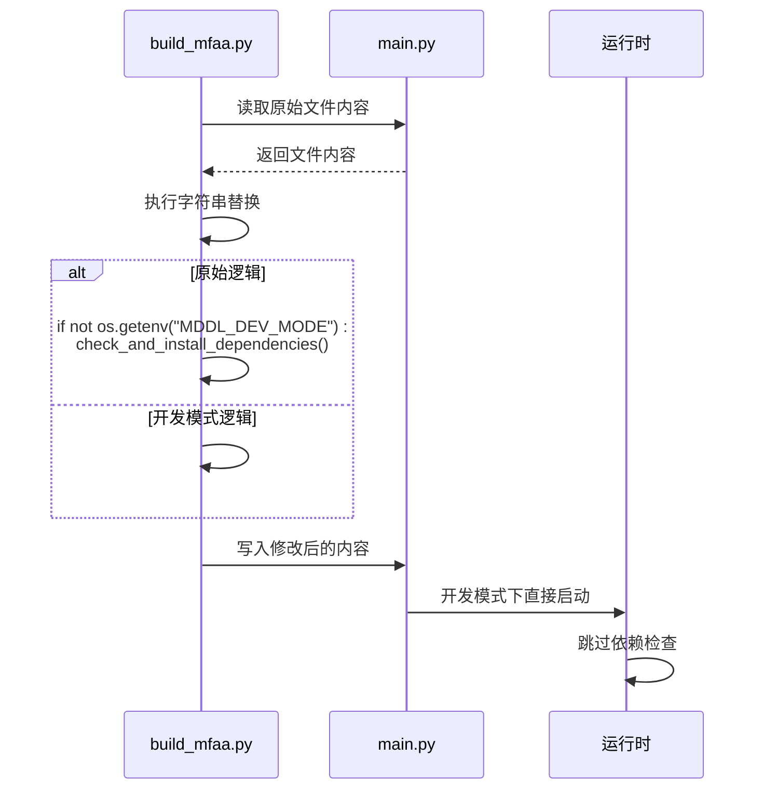
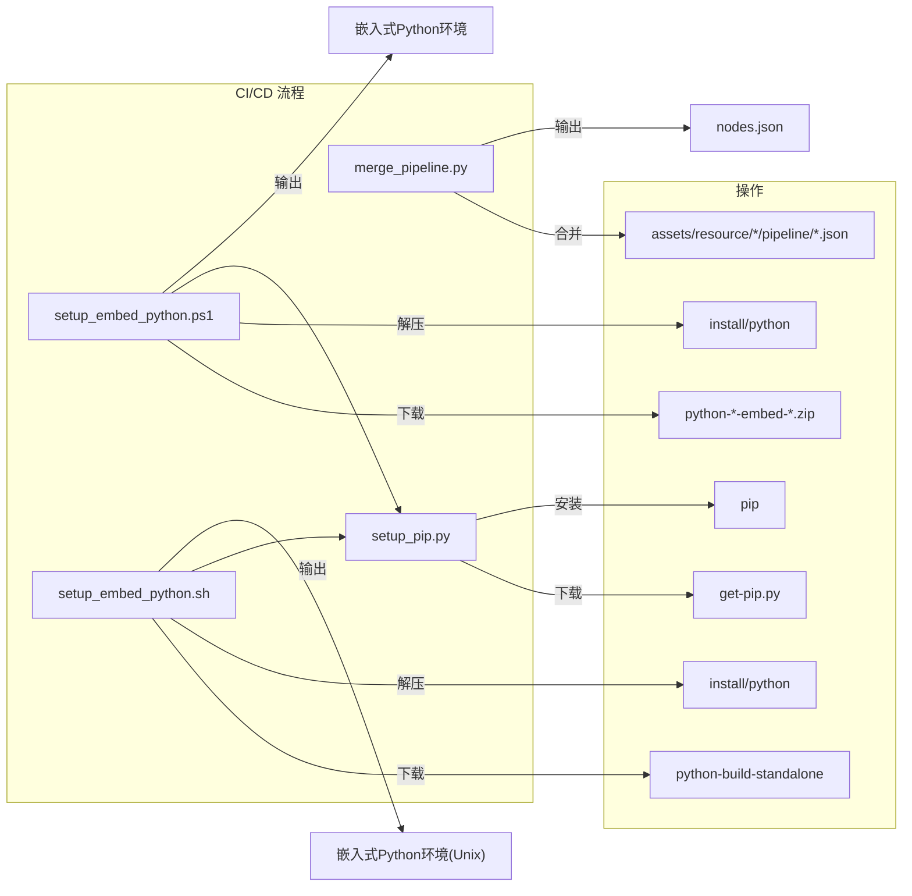

# 构建与部署

<cite>
**本文档中引用的文件**
- [build_mfaa.py](file://dev/build_mfaa.py)
- [interface.json](file://assets/interface.json)
- [main.py](file://agent/main.py)
- [merge_pipeline.py](file://ci/merge_pipeline.py)
- [setup_embed_python.ps1](file://ci/setup_embed_python.ps1)
- [setup_embed_python.sh](file://ci/setup_embed_python.sh)
- [setup_pip.py](file://ci/setup_pip.py)
- [MaaDuDuL.py](file://launcher/MaaDuDuL.py)
- [MaaDuDuL.spec](file://launcher/MaaDuDuL.spec)
- [maa_option.json](file://ci/config/maa_option.json)
- [maa_pi_config.json](file://assets/config/maa_pi_config.json)
- [requirements.txt](file://requirements.txt)
- [versions.json](file://.github/versions.json)
- [install.yml](file://.github/workflows/install.yml)
- [package.json](file://package.json)
</cite>

## 目录
1. [构建流程概述](#构建流程概述)
2. [build_mfaa.py 脚本解析](#build_mfaapy-脚本解析)
3. [interface.json 配置转换](#interfacejson-配置转换)
4. [main.py 开发模式注入](#mainpy-开发模式注入)
5. [MFAAvalonia 框架集成](#mfaavalonia-框架集成)
6. [资源文件打包规则](#资源文件打包规则)
7. [CI/CD 自动化脚本](#cicd-自动化脚本)
8. [程序启动与验证](#程序启动与验证)
9. [部署场景配置建议](#部署场景配置建议)
10. [版本发布流程](#版本发布流程)

## 构建流程概述

本项目通过 `build_mfaa.py` 脚本实现从源码到可执行应用程序包的完整构建流程。构建过程主要包括：文件复制与组织、配置文件转换、资源集成、依赖处理和自动化部署。构建后的程序以 MFAAvalonia 框架为基础运行，通过 launcher 启动器实现跨平台兼容性。CI/CD 工具链提供了资源合并、嵌入式 Python 环境配置等自动化功能，确保部署的一致性和可靠性。

**Section sources**
- [build_mfaa.py:1-118](file://dev/build_mfaa.py#L1-L118)
- [MaaDuDuL.py:1-21](file://launcher/MaaDuDuL.py#L1-L21)

## build_mfaa.py 脚本解析

`build_mfaa.py` 是项目的核心构建脚本，负责将分散的源码文件组织成可执行的应用程序包。该脚本首先设置工作目录并确保开发环境路径正确，然后执行 `copy_files()` 函数完成主要构建任务。

构建过程遵循严格的文件复制策略：先清理目标目录 `MFAAvalonia` 中的现有文件和目录（包括 debug、logs、agent 等），然后从源目录复制必要文件。关键操作包括复制 `assets/interface.json` 并修改其执行配置、复制 `assets/resource` 目录下的所有资源文件、复制 `agent` 目录下的代理代码，以及复制 `descs` 目录下的说明文档。

脚本最后尝试启动生成的 `MFAAvalonia.exe` 程序，提供即时的构建反馈。整个过程通过异常处理机制确保构建的健壮性，并在发生错误时输出详细信息。

```mermaid
flowchart TD
Start([开始构建]) --> Setup["设置工作目录<br/>添加路径到sys.path"]
Setup --> Cleanup["清理目标目录<br/>删除debug/logs/agent等"]
Cleanup --> CopyInterface["复制并修改interface.json<br/>设置child_exec为python"]
CopyInterface --> CopyResource["复制assets/resource<br/>到MFAAvalonia/Resource"]
CopyResource --> CopyAgent["复制agent目录"]
CopyAgent --> ModifyMain["修改main.py<br/>注入开发模式标记"]
ModifyMain --> CopyDescs["复制descs目录"]
CopyDescs --> Launch["启动MFAAvalonia.exe"]
Launch --> End([构建完成])
style Start fill:#4CAF50,stroke:#388E3C
style End fill:#4CAF50,stroke:#388E3C
```

**Diagram sources**
- [build_mfaa.py:16-118](file://dev/build_mfaa.py#L16-L118)

**Section sources**
- [build_mfaa.py:1-118](file://dev/build_mfaa.py#L1-L118)

## interface.json 配置转换

`interface.json` 文件是项目与 MFAAvalonia 框架交互的关键配置文件。在构建过程中，`build_mfaa.py` 脚本会读取 `assets/interface.json` 并进行特定修改，然后将其复制到目标目录。

最重要的转换是修改 `agent.child_exec` 字段的值。在源配置中，该字段设置为 `"./python/python.exe"`，指向嵌入式 Python 环境。构建脚本将其修改为 `"python"`，指示系统使用全局 Python 解释器。这一转换是为了适应开发模式的需求，允许开发者使用本地 Python 环境和已安装的依赖包，而不是受限的嵌入式环境。

此配置还定义了应用程序的元数据（如名称、版本、描述）、控制器配置（模拟器和PlayCover）、资源路径、任务列表和选项配置。这些配置确保了应用程序在 MFAAvalonia 框架中的正确显示和功能实现。

```mermaid
classDiagram
class interface_json {
+interface_version : string
+name : string
+title : string
+icon : string
+description : string
+version : string
+welcome : string
+contact : string
+github : string
+controller : array
+resource : array
+agent : object
+task : array
+option : object
}
class agent_config {
+child_exec : string
+child_args : array
}
interface_json "1" *-- "1" agent_config : 包含
agent_config : child_exec = "python"
```

**Diagram sources**
- [build_mfaa.py:51-61](file://dev/build_mfaa.py#L51-L61)
- [interface.json:1-1196](file://assets/interface.json#L1-L1196)

**Section sources**
- [build_mfaa.py:51-61](file://dev/build_mfaa.py#L51-L61)
- [interface.json:1-1196](file://assets/interface.json#L1-L1196)

## main.py 开发模式注入

`agent/main.py` 是代理服务的主入口文件，在构建过程中会被修改以适应开发模式。原始的 `main.py` 文件包含依赖检查逻辑：通过检查 `MDDL_DEV_MODE` 环境变量来决定是否调用 `check_and_install_dependencies()` 函数。

`build_mfaa.py` 脚本通过字符串替换的方式修改 `main.py`，将原有的环境变量检查和依赖安装逻辑替换为直接调用 `main()` 函数的简单语句。这一修改在文件中添加了明确的注释："开发模式：跳过依赖检查，使用本地Python环境"。

这种注入方式使得开发者可以在不重新安装依赖的情况下快速迭代和测试代码，充分利用本地 Python 环境中已安装的包（如 `maafw==5.3.0b5` 和 `requests==2.32.5`）。当程序在开发模式下运行时，它会直接启动代理服务，而不会尝试检查或安装任何依赖包。

```mermaid
sequenceDiagram
participant BuildScript as build_mfaa.py
participant MainPy as main.py
participant Runtime as 运行时
BuildScript->>MainPy : 读取原始文件内容
MainPy-->>BuildScript : 返回文件内容
BuildScript->>BuildScript : 执行字符串替换
alt 原始逻辑
BuildScript->>BuildScript : if not os.getenv("MDDL_DEV_MODE") : <br/> check_and_install_dependencies()
else 开发模式逻辑
BuildScript->>BuildScript : # 开发模式：跳过依赖检查<br/> main()
end
BuildScript->>MainPy : 写入修改后的内容
MainPy->>Runtime : 开发模式下直接启动
Runtime->>Runtime : 跳过依赖检查
```

**Diagram sources**
- [build_mfaa.py:81-94](file://dev/build_mfaa.py#L81-L94)
- [main.py:44-47](file://agent/main.py#L44-L47)

**Section sources**
- [build_mfaa.py:81-94](file://dev/build_mfaa.py#L81-L94)
- [main.py:1-48](file://agent/main.py#L1-L48)

## MFAAvalonia 框架集成

项目通过 MFAAvalonia 框架实现图形化界面和核心功能集成。构建过程将所有必要组件打包到 `MFAAvalonia` 目录中，形成一个完整的应用程序包。该框架作为宿主环境，负责加载和执行代理服务。

集成过程通过 `launcher/MaaDuDuL.py` 启动器实现跨平台兼容性。该启动器根据操作系统类型（Windows、macOS、Linux）确定正确的可执行文件路径（`MFAAvalonia.exe` 或 `MFAAvalonia`），并使用 `subprocess` 模块启动程序。`MaaDuDuL.spec` PyInstaller 配置文件定义了如何将启动器脚本打包为单个可执行文件，包括图标设置和窗口模式配置。

`maa_option.json` 配置文件定义了 MaaFramework 的运行时选项，如日志记录、错误时保存截图等。这些选项在构建过程中被正确放置，确保框架以预期配置运行。整个集成方案实现了从 Python 脚本到独立桌面应用程序的平滑转换。

```mermaid
graph TD
subgraph "应用程序包"
MFAAvalonia[MFAAvalonia/]
Resource[Resource/]
Agent[agent/]
Interface[interface.json]
end
subgraph "启动流程"
Launcher[MaaDuDuL.exe]
OS[操作系统]
MFAA[MFAAvalonia.exe]
end
Launcher --> OS : 检测系统类型
OS --> MFAA : 启动核心框架
MFAA --> Interface : 加载配置
Interface --> Agent : 启动代理服务
MFAA --> Resource : 加载资源文件
```

**Diagram sources**
- [MaaDuDuL.py:1-21](file://launcher/MaaDuDuL.py#L1-L21)
- [MaaDuDuL.spec:1-40](file://launcher/MaaDuDuL.spec#L1-L40)
- [maa_option.json:1-6](file://ci/config/maa_option.json#L1-L6)

**Section sources**
- [MaaDuDuL.py:1-21](file://launcher/MaaDuDuL.py#L1-L21)
- [MaaDuDuL.spec:1-40](file://launcher/MaaDuDuL.spec#L1-L40)
- [maa_option.json:1-6](file://ci/config/maa_option.json#L1-L6)

## 资源文件打包规则

资源文件的打包遵循清晰的目录结构和组织规则。`assets/resource` 目录下的所有内容被完整复制到 `MFAAvalonia/Resource` 目录中，保持原有的文件夹结构。这包括 `Announcement`（公告）、`base`（基础资源）和 `Changelog.md`（更新日志）等文件和目录。

`base` 目录包含核心的流水线配置文件 `default_pipeline.json` 和 OCR 模型密钥文件 `keys.txt`。`pipeline` 子目录组织了各种任务流水线，按功能分类（如日常任务、开荒功能等）。这些 JSON 文件定义了自动化任务的具体步骤和逻辑。

`descs` 目录下的 Markdown 文件作为任务说明文档，被复制到 `Resource/descs` 目录中。这些文档为用户提供详细的操作指南和功能说明。`check_resource.py` 脚本可用于验证资源文件的完整性，确保所有必要的资源都已正确打包。

```mermaid
erDiagram
RESOURCE ||--o{ ANNOUNCEMENT : 包含
RESOURCE ||--o{ CHANGELOG : 包含
RESOURCE ||--o{ BASE : 包含
RESOURCE ||--o{ DESCS : 包含
BASE ||--o{ PIPELINE : 包含
BASE ||--o{ DEFAULT_PIPELINE : 包含
BASE ||--o{ KEYS : 包含
class RESOURCE {
string path
}
class ANNOUNCEMENT {
string 01.公告.md
string 90.更新记录.md
}
class CHANGELOG {
string Changelog.md
}
class BASE {
string default_pipeline.json
string keys.txt
}
class PIPELINE {
string 启动游戏.json
string 领取邮件.json
string 圣团巡礼.json
string 巅峰对决.json
}
class DESCS {
string illustrate.md
string guide.md
string start_game.md
string claim_mail.md
}
```

**Diagram sources**
- [build_mfaa.py:65-73](file://dev/build_mfaa.py#L65-L73)
- [assets/resource](file://assets/resource)
- [descs](file://descs)

**Section sources**
- [build_mfaa.py:65-73](file://dev/build_mfaa.py#L65-L73)
- [assets/resource](file://assets/resource)
- [descs](file://descs)

## CI/CD 自动化脚本

项目包含多个 CI/CD 相关脚本，用于自动化部署和环境配置。`ci/merge_pipeline.py` 脚本负责合并分散的流水线 JSON 文件。它递归遍历 `assets/resource` 下的所有 `pipeline` 目录，将其中的 JSON 文件内容合并到一个 `nodes.json` 文件中，然后删除原始的文件夹结构。这一过程简化了资源管理，确保框架能正确加载所有任务节点。

`ci/setup_embed_python.ps1` 是 PowerShell 脚本，用于配置嵌入式 Python 环境。它根据系统架构下载对应版本的 Python 嵌入式包（如 python-3.12.7-embed-amd64.zip），解压到指定目录，并修改 `_pth` 文件以确保正确的模块搜索路径。脚本还负责安装 pip 和必要的 Python 包，为无外部依赖的独立部署提供支持。

`ci/setup_embed_python.sh` 是 Unix 平台的对应脚本，功能与 PowerShell 版本相同，但针对 macOS 和 Linux 系统进行了优化。它使用 `python-build-standalone` 项目提供的预编译包，支持 x86_64 和 aarch64 架构。

`ci/setup_pip.py` 是辅助脚本，由 `setup_embed_python.ps1` 和 `setup_embed_python.sh` 调用，负责下载并执行官方的 `get-pip.py` 脚本，从而在嵌入式环境中安装 pip 包管理器。这些自动化脚本共同构成了可靠的部署流水线，确保在不同环境中都能一致地配置运行环境。

```mermaid
flowchart LR
subgraph "CI/CD 流程"
Merge[merge_pipeline.py]
SetupPythonPS[setup_embed_python.ps1]
SetupPythonSH[setup_embed_python.sh]
SetupPip[setup_pip.py]
end
subgraph "操作"
Merge --> |合并| PipelineFiles["assets/resource/*/pipeline/*.json"]
SetupPythonPS --> |下载| PythonZip["python-*-embed-*.zip"]
SetupPythonPS --> |解压| PythonDir["install/python"]
SetupPythonPS --> SetupPip
SetupPythonSH --> |下载| PythonStandalone["python-build-standalone"]
SetupPythonSH --> |解压| PythonDir2["install/python"]
SetupPythonSH --> SetupPip
SetupPip --> |下载| GetPip["get-pip.py"]
SetupPip --> |安装| Pip["pip"]
end
Merge --> |输出| NodesJson["nodes.json"]
SetupPythonPS --> |输出| EmbeddedPython["嵌入式Python环境"]
SetupPythonSH --> |输出| EmbeddedPython2["嵌入式Python环境(Unix)"]
```

**Diagram sources**
- [merge_pipeline.py:1-72](file://ci/merge_pipeline.py#L1-L72)
- [setup_embed_python.ps1:1-135](file://ci/setup_embed_python.ps1#L1-L135)
- [setup_embed_python.sh:1-132](file://ci/setup_embed_python.sh#L1-L132)
- [setup_pip.py:1-40](file://ci/setup_pip.py#L1-L40)

**Section sources**
- [merge_pipeline.py:1-72](file://ci/merge_pipeline.py#L1-L72)
- [setup_embed_python.ps1:1-135](file://ci/setup_embed_python.ps1#L1-L135)
- [setup_embed_python.sh:1-132](file://ci/setup_embed_python.sh#L1-L132)
- [setup_pip.py:1-40](file://ci/setup_pip.py#L1-L40)

## 程序启动与验证

构建完成后，程序的启动和验证遵循标准流程。`build_mfaa.py` 脚本在成功构建后会自动尝试启动 `MFAAvalonia/MFAAvalonia.exe`。用户也可以通过双击 `MaaDuDuL.exe` 启动器或在命令行中运行来手动启动程序。

验证构建成功的关键指标包括：`MFAAvalonia` 目录存在且包含必要的文件和子目录；`interface.json` 中的 `child_exec` 正确设置为 `python`；`agent/main.py` 文件已被修改为开发模式；以及程序能够正常启动且无依赖错误。`package.json` 中的 `dev` 脚本（`python dev/build_mfaa.py`）提供了一键构建的便捷方式。

在开发环境中，可以通过检查控制台输出和日志文件来验证代理服务是否正常运行。`maa_pi_config.json` 配置文件指定了默认的资源配置（如 "B服"），确保程序加载正确的资源集。

**Section sources**
- [build_mfaa.py:104-108](file://dev/build_mfaa.py#L104-L108)
- [MaaDuDuL.py:1-21](file://launcher/MaaDuDuL.py#L1-L21)
- [maa_pi_config.json:1-3](file://assets/config/maa_pi_config.json#L1-L3)
- [package.json:1-14](file://package.json#L1-L14)

## 部署场景配置建议

针对不同的部署场景，建议采取相应的配置策略。在开发环境中，使用 `build_mfaa.py` 脚本构建的应用程序应配置为使用系统 Python 环境（`child_exec: "python"`），并跳过依赖检查，以提高开发效率。

在生产或独立部署环境中，应使用 `setup_embed_python.ps1` 或 `setup_embed_python.sh` 脚本配置嵌入式 Python 环境，将 `child_exec` 指向嵌入式 Python 可执行文件（`./python/python.exe` 或 `./python/bin/python3`），并确保所有依赖包都已打包。这可以创建完全独立、无需外部依赖的应用程序包。

对于多用户分发，建议使用 PyInstaller 将 `MaaDuDuL.py` 打包为单个可执行文件，并包含所有必要资源。配置文件如 `maa_option.json` 可根据部署需求调整日志级别和调试选项。无论何种场景，都应确保 `interface.json` 中的路径和配置与实际的文件结构相匹配。

**Section sources**
- [interface.json:1-1196](file://assets/interface.json#L1-L1196)
- [maa_option.json:1-6](file://ci/config/maa_option.json#L1-L6)
- [setup_embed_python.ps1:1-135](file://ci/setup_embed_python.ps1#L1-L135)
- [setup_embed_python.sh:1-132](file://ci/setup_embed_python.sh#L1-L132)
- [build_mfaa.py:58-59](file://dev/build_mfaa.py#L58-L59)

## 版本发布流程

项目采用 GitHub Actions 实现自动化版本发布流程。发布流程基于 Git 标签触发，支持正式版本和预发布版本的区分。

### 发布触发机制

发布流程通过 `.github/workflows/install.yml` 工作流实现，当推送以 `v` 开头的标签时自动触发（如 `v1.0.0`）。工作流包含两个主要阶段：

1. **元数据生成阶段（meta job）**：负责生成版本标签信息，包括版本号、是否为正式发布、是否为预发布版本等元数据。

2. **构建打包阶段（install job）**：负责多平台构建与打包，支持 Windows、macOS、Linux 三个平台的 x86_64 和 aarch64 架构。

### 版本标签生成逻辑

版本标签生成具有智能回退机制：
- **正式发布**：直接使用推送的 Git 标签（如 `v1.0.0`）
- **预发布版本**：包含 `alpha`、`beta`、`rc`、`dev`、`-ci` 等关键字的版本被视为预发布版本
- **CI 构建**：如果没有找到有效的 `v*` 标签，会从 GitHub API 获取最新发布版本，然后添加日期和 commit hash 组合

### 依赖版本管理

项目使用 `.github/versions.json` 文件统一管理关键依赖的版本：
- **MaaFramework**: `v5.9.2`
- **MFAAvalonia**: `v2.11.5`

这些版本信息在构建过程中被正确传递给各个组件，确保依赖关系的一致性。

### 发布自动化

发布流程包含以下自动化步骤：
1. **构建产物收集**：收集所有平台的构建产物
2. **版本标签应用**：使用生成的版本标签命名发布
3. **发布内容生成**：自动生成发布说明
4. **镜像同步**：触发镜像同步工作流

```mermaid
flowchart TD
Start([推送v*标签]) --> Meta[元数据生成]
Meta --> Install[多平台构建]
Install --> Release[创建GitHub发布]
Release --> Mirror[触发镜像同步]
Mirror --> End([发布完成])
class Meta {
version_tag : string
is_release : boolean
is_prerelease : boolean
}
class Install {
platforms : ["Windows","macOS","Linux"]
architectures : ["x86_64","aarch64"]
}
```

**Diagram sources**
- [.github/workflows/install.yml:1-395](file://.github/workflows/install.yml#L1-L395)
- [.github/versions.json:1-5](file://.github/versions.json#L1-L5)

**Section sources**
- [.github/workflows/install.yml:1-395](file://.github/workflows/install.yml#L1-L395)
- [.github/versions.json:1-5](file://.github/versions.json#L1-L5)
- [package.json:8-8](file://package.json#L8-L8)