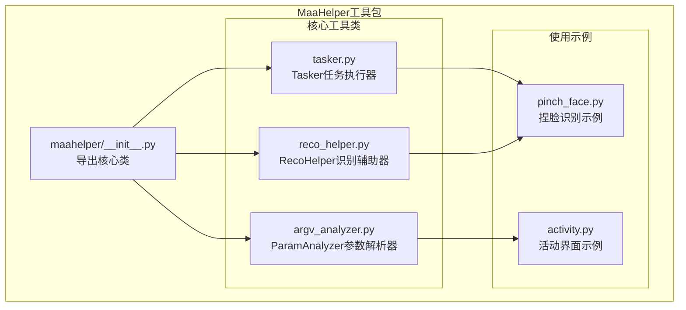
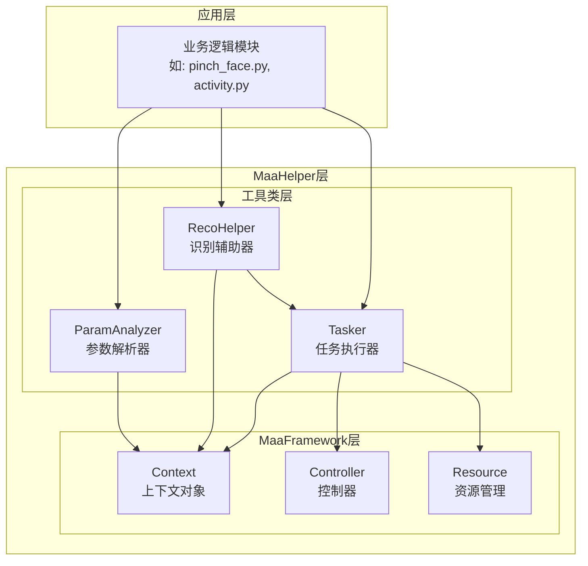
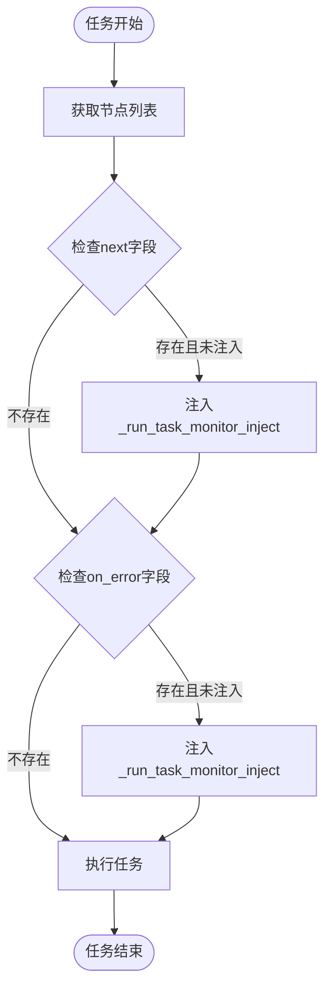
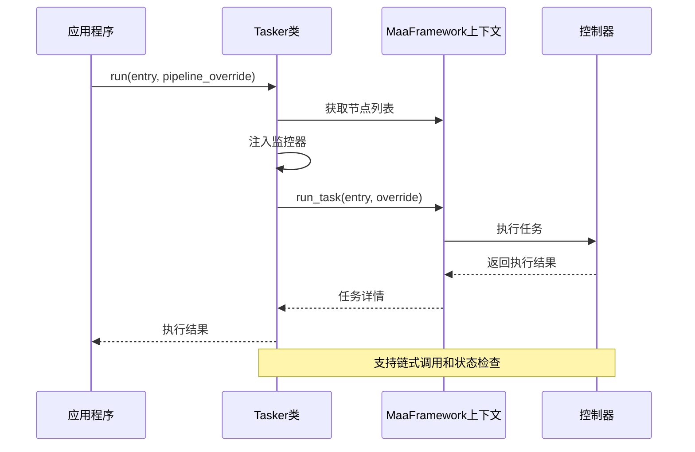
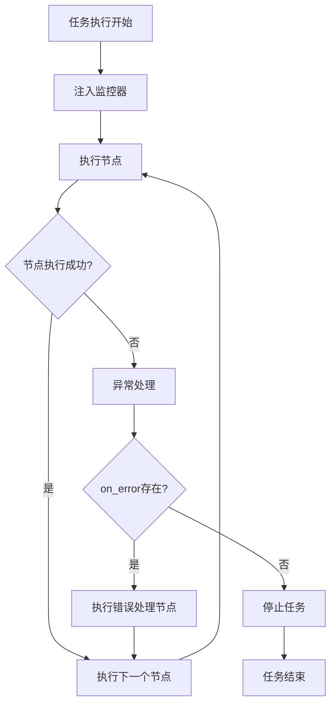
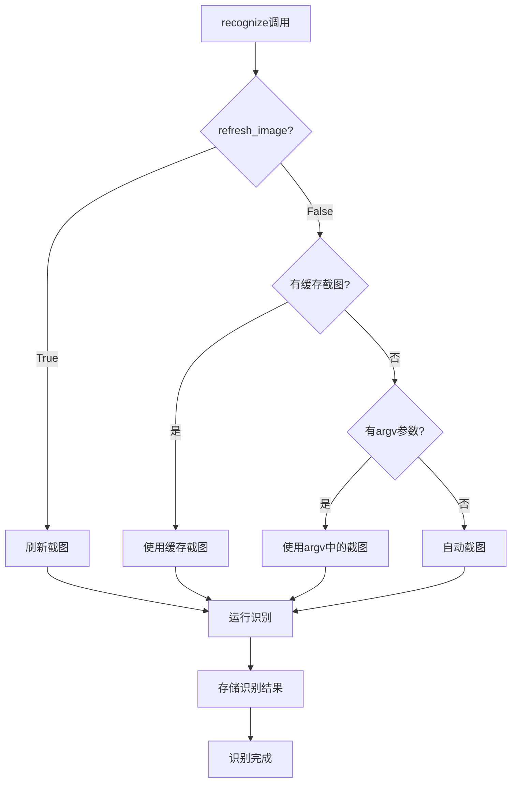
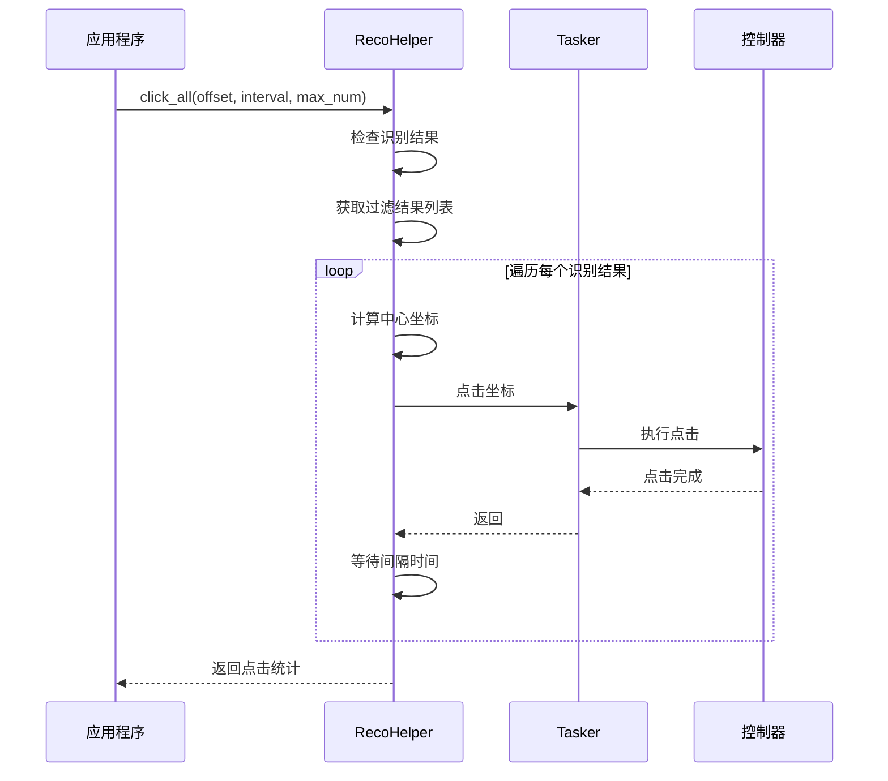
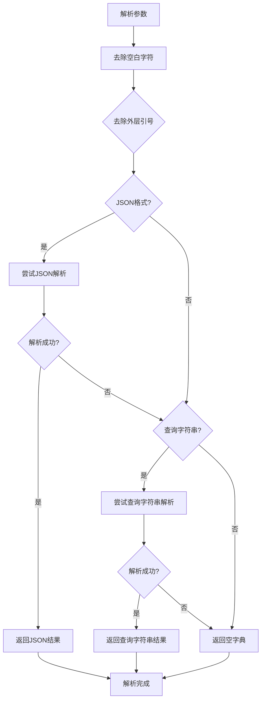
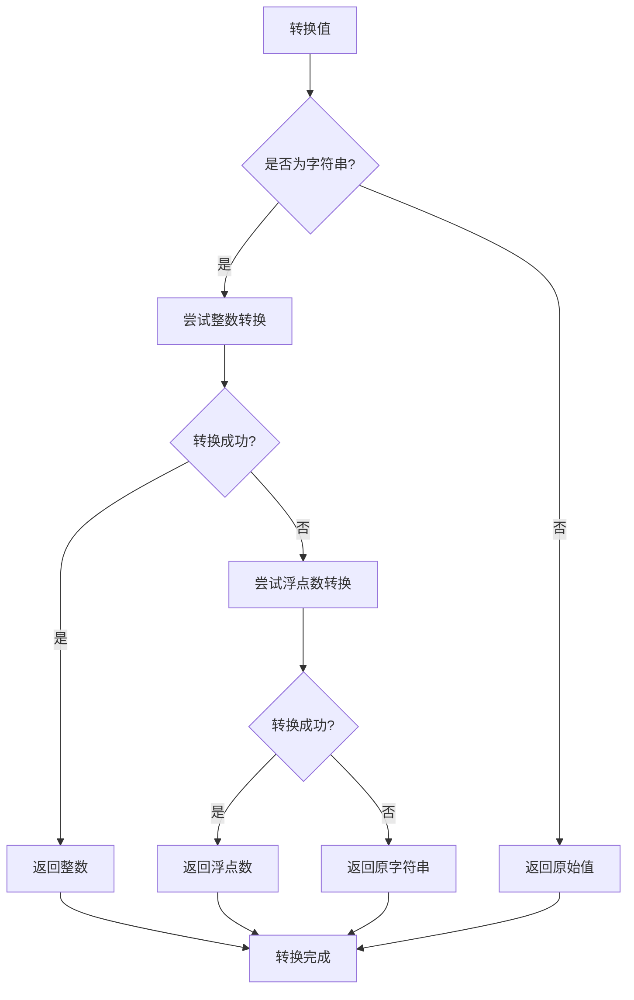
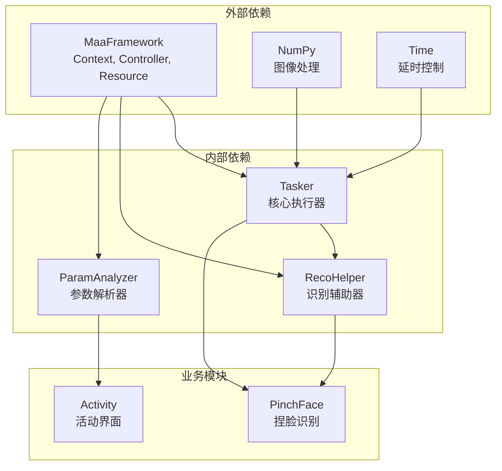

# MaaHelper工具类使用指南

<cite>
**本文档引用的文件**
- [tasker.py](file://agent/customs/maahelper/tasker.py)
- [reco_helper.py](file://agent/customs/maahelper/reco_helper.py)
- [argv_analyzer.py](file://agent/customs/maahelper/argv_analyzer.py)
- [__init__.py](file://agent/customs/maahelper/__init__.py)
- [pinch_face.py](file://agent/customs/global_func/pinch_face.py)
- [activity.py](file://agent/customs/special_treat/activity.py)
</cite>

## 目录
1. [简介](#简介)
2. [项目结构](#项目结构)
3. [核心组件](#核心组件)
4. [架构概览](#架构概览)
5. [详细组件分析](#详细组件分析)
6. [依赖关系分析](#依赖关系分析)
7. [性能考虑](#性能考虑)
8. [故障排除指南](#故障排除指南)
9. [结论](#结论)
10. [附录](#附录)

## 简介

MaaHelper是MaaFramework框架下的辅助工具包，专门为自动化任务执行提供便利的封装类。该包包含三个核心工具类：Tasker任务执行器、RecoHelper识别辅助器和ParamAnalyzer参数解析器。这些工具类通过统一的接口设计，显著提升了开发效率和代码可维护性，为复杂的自动化任务提供了可靠的技术支撑。

## 项目结构

MaaHelper工具包位于agent/customs/maahelper目录下，采用简洁明了的模块化设计：



**图表来源**
- [__init__.py](file://agent/customs/maahelper/__init__.py#L1-L4)
- [tasker.py](file://agent/customs/maahelper/tasker.py#L1-L177)
- [reco_helper.py](file://agent/customs/maahelper/reco_helper.py#L1-L256)
- [argv_analyzer.py](file://agent/customs/maahelper/argv_analyzer.py#L1-L159)

**章节来源**
- [__init__.py](file://agent/customs/maahelper/__init__.py#L1-L4)

## 核心组件

MaaHelper包提供了三个相互协作的核心组件，每个组件都有明确的职责分工：

### Tasker任务执行器
负责封装MaaFramework的任务执行逻辑，提供便捷的节点运行、截图、点击等操作接口。

### RecoHelper识别辅助器  
专门处理图像识别相关的辅助功能，包括识别结果处理、点击操作、结果过滤等。

### ParamAnalyzer参数解析器
解析MaaFramework传递的自定义参数，支持JSON和查询字符串等多种格式。

**章节来源**
- [tasker.py](file://agent/customs/maahelper/tasker.py#L16-L32)
- [reco_helper.py](file://agent/customs/maahelper/reco_helper.py#L17-L32)
- [argv_analyzer.py](file://agent/customs/maahelper/argv_analyzer.py#L17-L28)

## 架构概览

MaaHelper工具包采用分层架构设计，各组件之间通过清晰的接口进行交互：



**图表来源**
- [tasker.py](file://agent/customs/maahelper/tasker.py#L7-L13)
- [reco_helper.py](file://agent/customs/maahelper/reco_helper.py#L6-L14)
- [argv_analyzer.py](file://agent/customs/maahelper/argv_analyzer.py#L7-L11)

## 详细组件分析

### Tasker类深度解析

Tasker类是MaaHelper的核心执行器，它封装了MaaFramework的复杂操作，提供了简洁易用的接口。

#### 核心功能特性

**任务依赖管理**
Tasker通过智能的next和on_error字段注入机制，确保任务执行过程中的依赖关系得到正确处理：



**图表来源**
- [tasker.py](file://agent/customs/maahelper/tasker.py#L64-L113)

**执行状态追踪**
Tasker提供了完整的任务执行状态监控能力：



**图表来源**
- [tasker.py](file://agent/customs/maahelper/tasker.py#L51-L113)

**异常恢复机制**
Tasker通过统一的监控器注入，实现了任务执行过程中的异常捕获和恢复：



**图表来源**
- [tasker.py](file://agent/customs/maahelper/tasker.py#L84-L112)

**章节来源**
- [tasker.py](file://agent/customs/maahelper/tasker.py#L16-L177)

### RecoHelper类深度解析

RecoHelper类专注于图像识别相关的辅助功能，提供了完整的识别结果处理和操作能力。

#### 识别流程管理

**智能截图缓存机制**
RecoHelper实现了灵活的截图管理策略：



**图表来源**
- [reco_helper.py](file://agent/customs/maahelper/reco_helper.py#L62-L94)

**批量点击处理**
RecoHelper提供了强大的批量点击功能，支持精确的坐标计算和延迟控制：



**图表来源**
- [reco_helper.py](file://agent/customs/maahelper/reco_helper.py#L141-L172)

**章节来源**
- [reco_helper.py](file://agent/customs/maahelper/reco_helper.py#L17-L256)

### ParamAnalyzer类深度解析

ParamAnalyzer类专门处理MaaFramework传递的各种参数格式，提供了统一的参数访问接口。

#### 参数解析策略

**多格式支持**
ParamAnalyzer支持多种参数格式的自动识别和解析：



**图表来源**
- [argv_analyzer.py](file://agent/customs/maahelper/argv_analyzer.py#L48-L101)

**智能类型转换**
ParamAnalyzer提供了智能的参数类型转换功能：



**图表来源**
- [argv_analyzer.py](file://agent/customs/maahelper/argv_analyzer.py#L133-L158)

**章节来源**
- [argv_analyzer.py](file://agent/customs/maahelper/argv_analyzer.py#L17-L159)

## 依赖关系分析

MaaHelper工具包内部的依赖关系清晰明确，遵循了单一职责原则：



**图表来源**
- [tasker.py](file://agent/customs/maahelper/tasker.py#L7-L13)
- [reco_helper.py](file://agent/customs/maahelper/reco_helper.py#L6-L14)
- [argv_analyzer.py](file://agent/customs/maahelper/argv_analyzer.py#L7-L11)

**章节来源**
- [tasker.py](file://agent/customs/maahelper/tasker.py#L1-L177)
- [reco_helper.py](file://agent/customs/maahelper/reco_helper.py#L1-L256)
- [argv_analyzer.py](file://agent/customs/maahelper/argv_analyzer.py#L1-L159)

## 性能考虑

MaaHelper工具包在设计时充分考虑了性能优化：

### 截图缓存优化
RecoHelper实现了智能的截图缓存机制，避免重复截图造成的性能损耗。

### 批量操作优化
RecoHelper的批量点击功能支持可配置的延迟和最大点击数量，平衡了执行效率和稳定性。

### 内存管理
Tasker类通过合理的对象生命周期管理，避免了内存泄漏问题。

## 故障排除指南

### 常见问题及解决方案

**任务执行异常**
- 检查任务节点的next和on_error配置
- 确认监控器注入是否正确
- 查看任务执行日志获取详细错误信息

**识别结果不准确**
- 调整识别阈值参数
- 检查截图质量
- 验证ROI区域设置

**参数解析失败**
- 确认参数格式符合要求
- 检查特殊字符转义
- 验证参数键名正确性

**章节来源**
- [tasker.py](file://agent/customs/maahelper/tasker.py#L84-L112)
- [reco_helper.py](file://agent/customs/maahelper/reco_helper.py#L208-L218)
- [argv_analyzer.py](file://agent/customs/maahelper/argv_analyzer.py#L103-L131)

## 结论

MaaHelper工具包通过精心设计的三个核心组件，为MaaFramework提供了强大而易用的辅助功能。Tasker类的智能任务管理、RecoHelper类的完整识别处理能力和ParamAnalyzer类的灵活参数解析，共同构成了一个高效、可靠的自动化任务执行框架。

这些工具类不仅显著提升了开发效率，还增强了代码的可维护性和可扩展性。通过统一的接口设计和完善的错误处理机制，MaaHelper为复杂的自动化任务提供了坚实的技术基础。

## 附录

### 最佳实践示例

**Tasker使用示例**
```python
# 基础任务执行
tasker = Tasker(context)
result = tasker.run("任务入口")

# 链式操作
tasker.run("开始").click(100, 200).swipe(100, 200, 300, 400).wait(1.0)
```

**RecoHelper使用示例**
```python
# 识别并点击
rh = RecoHelper(context, argv)
if rh.recognize("识别节点").hit:
    rh.click((10, 10))  # 带偏移量点击

# 批量点击
rh.recognize("批量识别").click_all(interval=0.5, max_num=10)
```

**ParamAnalyzer使用示例**
```python
# 参数解析
args = ParamAnalyzer(argv)
title = args.get(["title", "t"], "默认标题")
timeout = args.get("timeout", 30)
```

### 配置建议

**性能优化配置**
- 合理设置识别阈值
- 使用截图缓存减少I/O开销
- 配置适当的点击间隔

**错误处理配置**
- 设置合理的超时时间
- 实现重试机制
- 完善日志记录