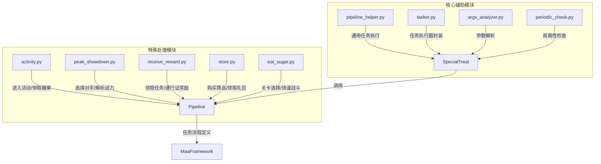
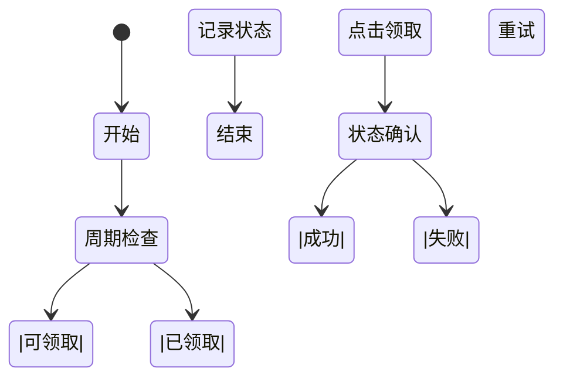
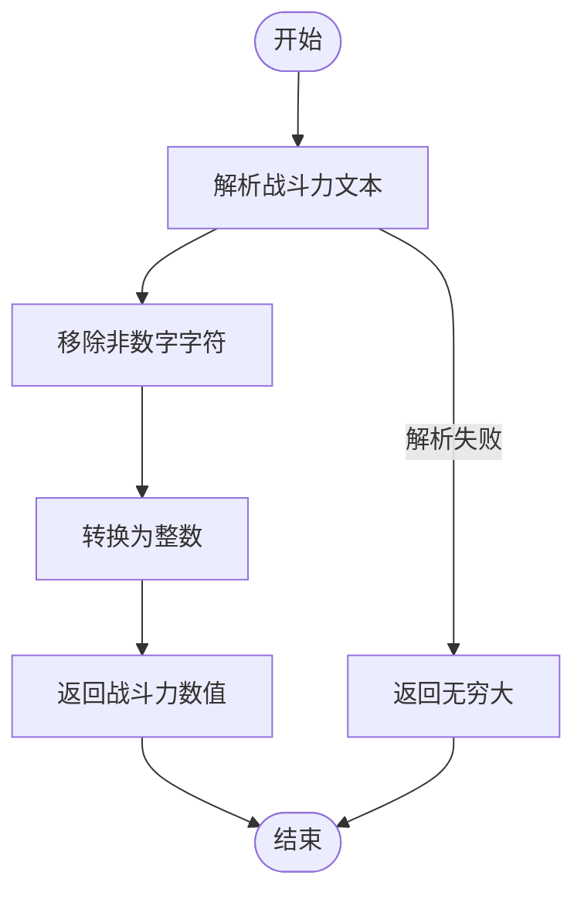
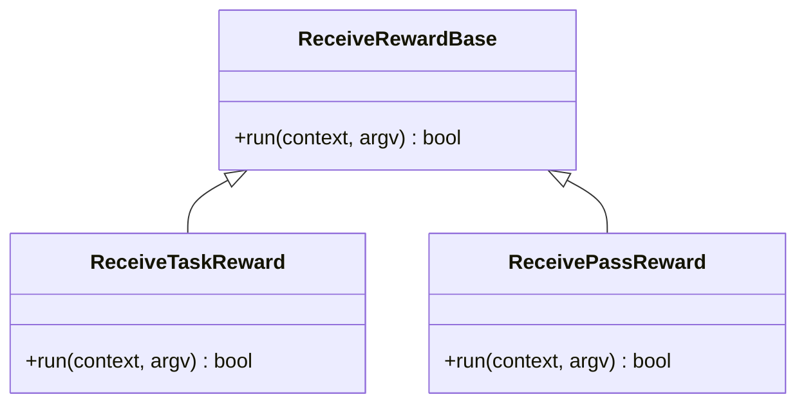
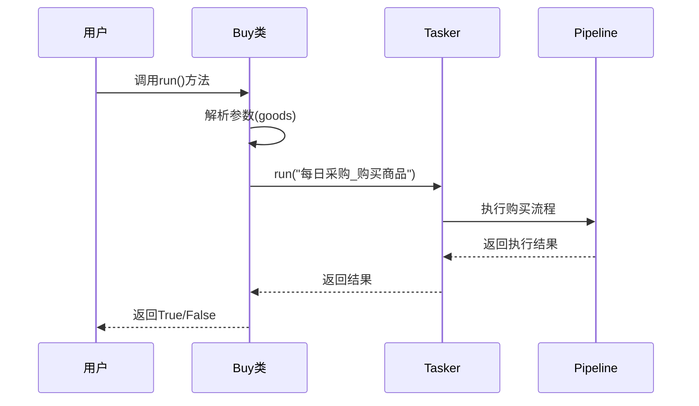
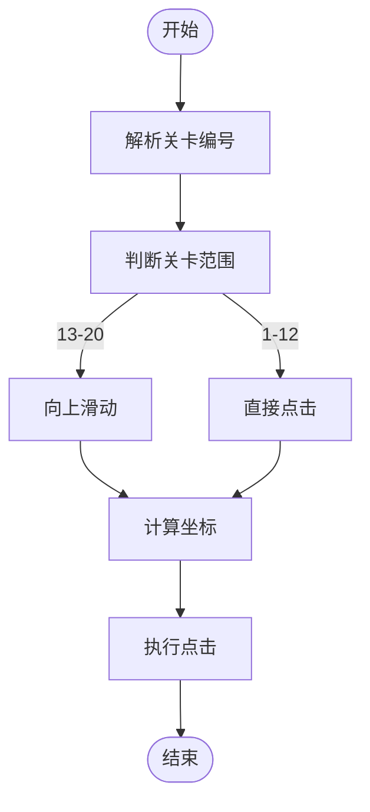
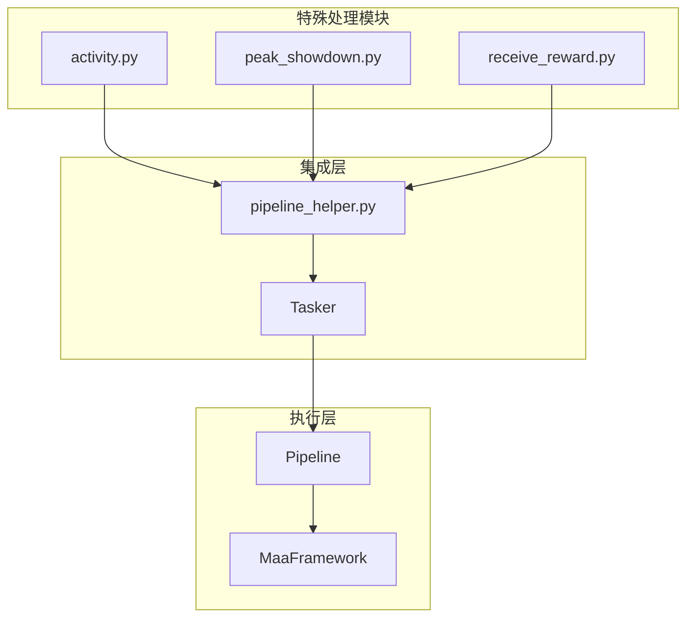

# 特殊处理模块实现分析

<cite>
**本文档引用文件**  
- [activity.py](file://agent/customs/special_treat/activity.py)
- [peak_showdown.py](file://agent/customs/special_treat/peak_showdown.py)
- [receive_reward.py](file://agent/customs/special_treat/receive_reward.py)
- [store.py](file://agent/customs/special_treat/store.py)
- [eat_sugar.py](file://agent/customs/special_treat/eat_sugar.py)
- [pipeline_helper.py](file://agent/customs/global_func/pipeline_helper.py)
- [tasker.py](file://agent/customs/maahelper/tasker.py)
- [argv_analyzer.py](file://agent/customs/maahelper/argv_analyzer.py)
- [periodic_check.py](file://agent/customs/global_func/periodic_check.py)
- [local_storage.py](file://agent/customs/utils/local_storage.py)
</cite>

## 目录
1. [项目结构](#项目结构)  
2. [核心组件分析](#核心组件分析)  
3. [活动任务触发与状态机设计](#活动任务触发与状态机设计)  
4. [巅峰对决周期检测机制](#巅峰对决周期检测机制)  
5. [奖励领取通用模式抽象](#奖励领取通用模式抽象)  
6. [商店刷新与购买策略](#商店刷新与购买策略)  
7. [轻量级业务逻辑封装](#轻量级业务逻辑封装)  
8. [主流程集成机制](#主流程集成机制)  
9. [可复用设计模式建议](#可复用设计模式建议)

## 项目结构

特殊处理模块位于 `agent/customs/special_treat/` 目录下，包含多个独立功能的 Python 文件，每个文件实现特定的游戏自动化逻辑。这些模块通过 MaaFramework 的自定义动作（CustomAction）和自定义识别（CustomRecognition）机制与主流程集成。

**图示来源**  
- [activity.py](file://agent/customs/special_treat/activity.py)
- [peak_showdown.py](file://agent/customs/special_treat/peak_showdown.py)
- [pipeline_helper.py](file://agent/customs/global_func/pipeline_helper.py)

## 核心组件分析

特殊处理模块采用模块化设计，每个功能独立封装，通过统一的接口与 MaaFramework 交互。核心组件包括：

- **自定义动作类**：继承 `CustomAction`，实现 `run` 方法，用于执行具体操作
- **自定义识别类**：继承 `CustomRecognition`，实现 `analyze` 方法，用于状态判断
- **参数解析器**：`ParamAnalyzer` 统一处理输入参数，支持多种格式解析
- **任务执行器**：`Tasker` 封装底层操作，提供链式调用接口
- **状态存储**：`LocalStorage` 提供持久化存储能力

这些组件共同构成了一个高内聚、低耦合的自动化执行体系。

**本节来源**  
- [tasker.py](file://agent/customs/maahelper/tasker.py#L1-L177)
- [argv_analyzer.py](file://agent/customs/maahelper/argv_analyzer.py#L1-L159)
- [local_storage.py](file://agent/customs/utils/local_storage.py#L1-L111)

## 活动任务触发与状态机设计

以 `activity.py` 为例，该模块实现了活动界面导航和糖果领取功能，其核心是基于状态机的任务编排。

### 活动界面导航

`EnterActivity` 类通过 `Tasker.run()` 方法启动 "进入活动界面_开始" 流程，并传入参数覆盖配置。该流程包含多个节点：
- `进入活动界面_识别活动`：识别指定活动标题
- `进入活动界面_未找到指定活动`：处理未找到活动的情况

执行完成后，通过 `Tasker.get_last_node_name()` 判断最终执行的节点，从而确定是否成功进入目标活动。

### 糖果领取状态机

`ClaimCandy` 类实现了一个多阶段的状态机流程：
1. **周期检查**：通过 `领取糖果_周期检查` 节点判断是否已领取
2. **点击领取**：执行领取操作
3. **状态确认**：检查是否已领取
4. **记录状态**：通过 `领取糖果_周期记录` 更新领取状态

该流程通过 `pipeline_override` 参数动态注入监测逻辑，确保任务执行过程可被监控。

**图示来源**  
- [activity.py](file://agent/customs/special_treat/activity.py#L59-L102)
- [periodic_check.py](file://agent/customs/global_func/periodic_check.py#L1-L268)

## 巅峰对决周期检测机制

`peak_showdown.py` 模块实现了巅峰对决功能中的对手选择逻辑，其核心是周期性检测与资源消耗控制。

### 战斗力解析

`parse_power()` 函数负责解析 OCR 识别出的战斗力文本。由于 OCR 可能将千分位分隔符识别为逗号或小数点，该函数通过移除所有非数字字符的方式统一处理，确保解析结果的准确性。

### 对手选择策略

`PickOpponent` 类实现了两种选择策略：
- **最低战力**：识别所有对手的战斗力，选择数值最小的目标
- **最高排名**：直接返回预设的最高排名位置

该类通过 `RecoHelper` 进行图像识别，获取所有对手的战斗力文本，然后使用 `min()` 函数配合 `parse_power()` 作为比较键，找到战斗力最低的对手。

### 资源消耗控制

通过 `periodic_check` 机制控制资源消耗，避免重复执行已完成的任务。该机制基于 `LocalStorage` 记录任务完成时间，并根据周期类型（日/周/月）判断是否需要再次执行。

**图示来源**  
- [peak_showdown.py](file://agent/customs/special_treat/peak_showdown.py#L17-L96)
- [periodic_check.py](file://agent/customs/global_func/periodic_check.py#L26-L253)

## 奖励领取通用模式抽象

`receive_reward.py` 模块展示了如何通过抽象实现通用的奖励领取模式。

### 任务奖励领取

`ReceiveTaskReward` 类处理日常任务奖励的领取：
- 接收 `category` 参数（如 "日"、"周"、"月"）
- 自动将 "日" 转换为 "天" 以匹配界面文本
- 启动 "领取奖励_领取任务奖励开始" 流程
- 通过 `expected` 参数指定要进入的具体任务面板

### 通行证奖励领取

`ReceivePassReward` 类处理通行证奖励的领取：
- 接收 `category` 参数（如 "等级"、"便装"、"冒险"）
- 映射到对应的模板文件（如 "grade_pass"、"clothes_path"、"adv_pass"）
- 启动 "领取奖励_领取通行证奖励开始" 流程
- 通过 `template` 参数指定要进入的通行证界面

这种设计体现了**参数驱动**的思想，通过统一的接口处理不同类型的奖励领取，提高了代码的复用性和可维护性。

**图示来源**  
- [receive_reward.py](file://agent/customs/special_treat/receive_reward.py#L9-L65)
- [activity.py](file://agent/customs/special_treat/activity.py#L60-L102)

## 商店刷新与购买策略

`store.py` 模块实现了商店相关的购买和礼包领取功能，展示了清晰的决策逻辑。

### 礼包领取策略

`Gift` 类处理礼包领取：
- 接收 `gift` 参数指定礼包名称
- 启动 "每日采购_购买礼包开始" 流程
- 通过 `expected` 参数匹配指定礼包

### 商品购买策略

`Buy` 类处理商品购买：
- 支持多种参数别名（goods/g/commodity/c）
- 启动 "每日采购_购买商品" 流程
- 通过 `expected` 参数匹配指定商品

该模块通过 `ParamAnalyzer.get()` 方法支持参数别名，提高了接口的灵活性。同时，两个类都遵循了**单一职责原则**，每个类只负责一种类型的购买操作。

**图示来源**  
- [store.py](file://agent/customs/special_treat/store.py#L15-L96)
- [tasker.py](file://agent/customs/maahelper/tasker.py#L51-L113)

## 轻量级业务逻辑封装

`eat_sugar.py` 模块展示了如何封装轻量级业务逻辑，以清紫糖关卡选择为例。

### 关卡坐标计算

通过 `MatrixOperator` 类封装坐标计算逻辑：
- 定义起始坐标和间隔
- 根据行列号计算实际屏幕坐标
- 支持不同布局（4列/5列）

### 关卡选择实现

`SelectCloneLevel` 类处理克隆工厂关卡选择：
- 关卡1-12：直接点击可见区域
- 关卡13-20：先向上滑动，再点击对应位置

`SelectCrayonLevel` 类处理到手蜡关卡选择：
- 统一的5列布局
- 自动计算行列位置

`QuickFight` 类实现快速战斗：
- 支持指定作战次数
- 动态覆盖流程配置

这种封装方式将复杂的坐标计算逻辑隐藏在工具类中，使业务逻辑更加清晰易懂。

**图示来源**  
- [eat_sugar.py](file://agent/customs/special_treat/eat_sugar.py#L65-L206)
- [tasker.py](file://agent/customs/maahelper/tasker.py#L125-L156)

## 主流程集成机制

特殊处理模块通过 `pipeline_helper.py` 与主流程集成，形成统一的执行体系。

### 统一执行接口

`pipeline_helper.Run` 类提供统一的 `run` 接口：
- 接收任务入口节点名称
- 支持指定期望的结束节点
- 自动处理异常并返回布尔结果

### 集成方式

各模块通过以下方式与主流程集成：
1. **自定义动作注册**：使用 `@AgentServer.custom_action` 装饰器注册
2. **参数传递**：通过 `argv.custom_action_param` 传递参数
3. **流程调用**：使用 `Tasker.run()` 启动预定义的 Pipeline 流程
4. **状态判断**：通过检查最后执行的节点名称判断结果

这种集成方式实现了**关注点分离**，业务逻辑与流程执行解耦，提高了系统的可维护性和扩展性。

**图示来源**  
- [pipeline_helper.py](file://agent/customs/global_func/pipeline_helper.py#L9-L25)
- [tasker.py](file://agent/customs/maahelper/tasker.py#L51-L113)

## 可复用设计模式建议

基于对特殊处理模块的分析，提出以下可复用的设计模式：

### 参数驱动模式

通过 `ParamAnalyzer` 统一解析参数，支持多种格式（JSON、查询字符串），并自动转换数据类型。建议在新模块中复用此模式，提高接口的灵活性和易用性。

### 状态机编排模式

将复杂操作分解为多个阶段，通过 Pipeline 定义状态转移逻辑。建议在涉及多步骤操作的场景中使用此模式，如任务领取、战斗流程等。

### 工具类封装模式

将通用逻辑（如坐标计算、参数解析）封装在独立的工具类中，如 `MatrixOperator`、`ParamAnalyzer`。建议在新项目中建立类似的工具库，提高代码复用率。

### 单一职责模式

每个类只负责一个特定功能，如 `Gift` 只处理礼包领取，`Buy` 只处理商品购买。建议在设计新类时遵循此原则，保持代码的清晰性和可维护性。

### 异常统一处理模式

所有 `run` 方法都包含 `try-catch` 块，捕获异常并通过 `Prompter.error` 统一处理。建议在所有对外接口中采用此模式，确保系统的稳定性。

这些设计模式共同构成了一个高效、可靠、易维护的自动化执行框架，值得在后续开发中持续推广和优化。

**本节来源**  
- [argv_analyzer.py](file://agent/customs/maahelper/argv_analyzer.py#L17-L159)
- [tasker.py](file://agent/customs/maahelper/tasker.py#L51-L113)
- [pipeline_helper.py](file://agent/customs/global_func/pipeline_helper.py#L9-L25)