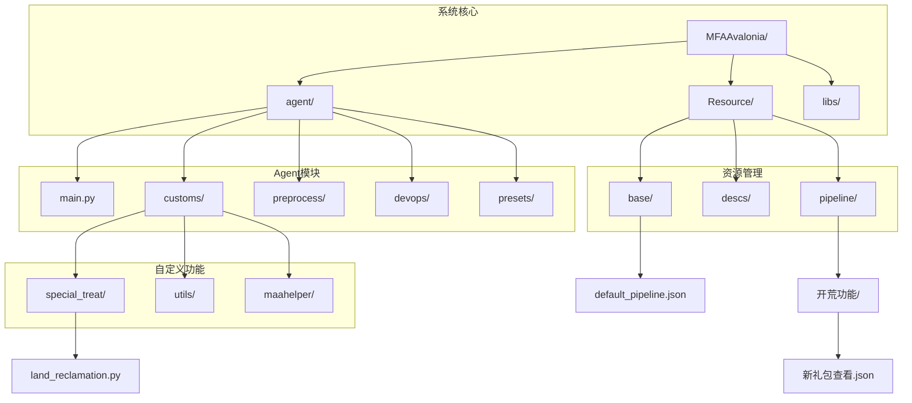
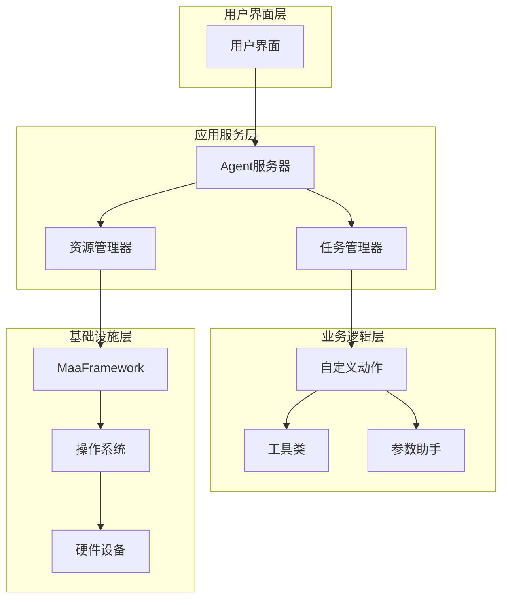
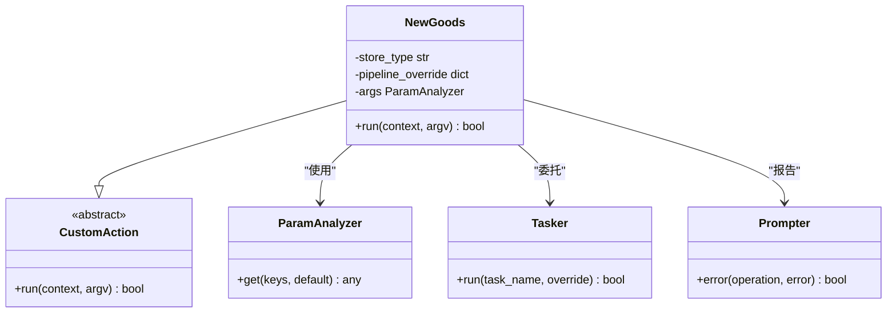
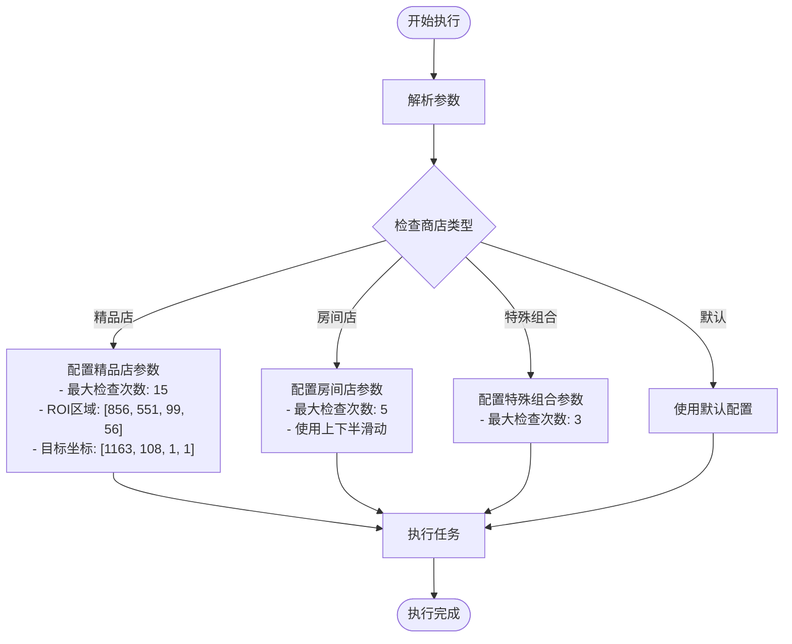
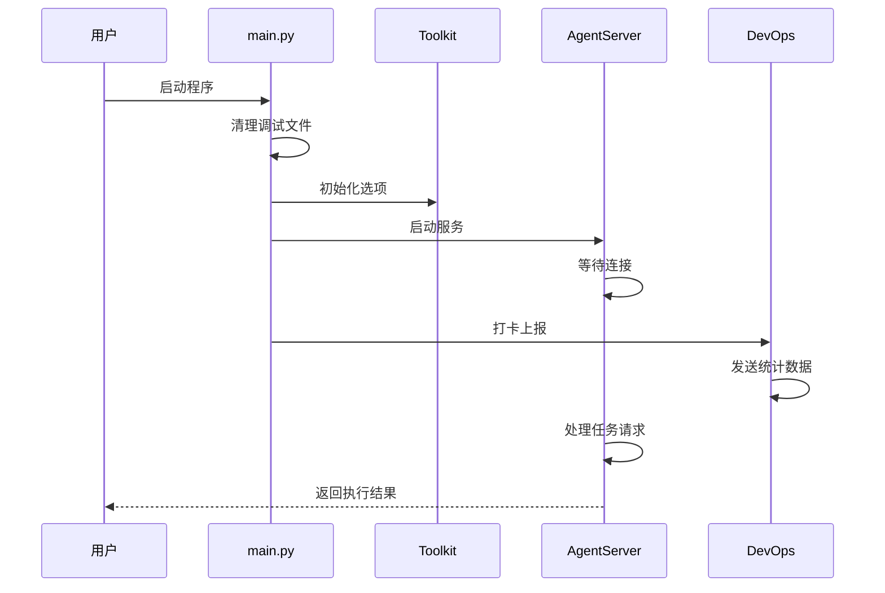
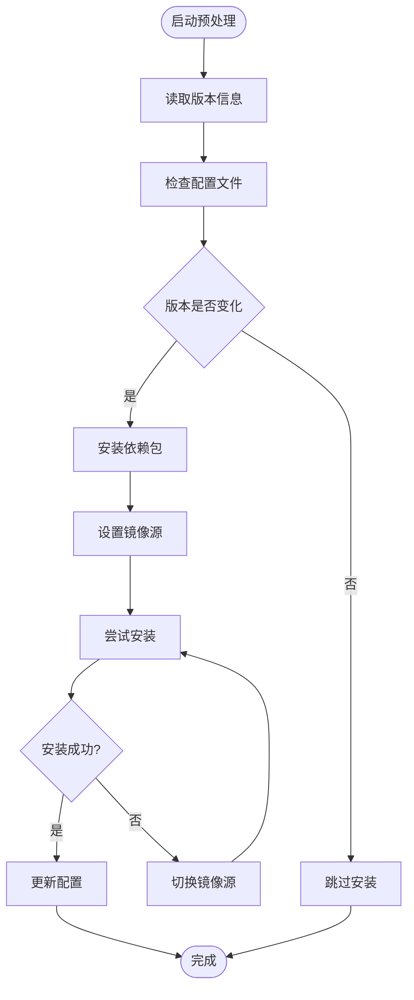
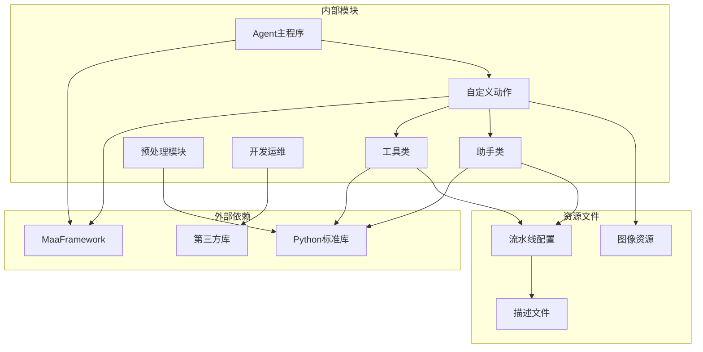

# 陆地开垦系统

<cite>
**本文档引用的文件**
- [land_reclamation.py](file://MFAAvalonia/agent/customs/special_treat/land_reclamation.py)
- [land_reclamation.md](file://MFAAvalonia/Resource/descs/daily/land_reclamation.md)
- [main.py](file://MFAAvalonia/agent/main.py)
- [setup.py](file://MFAAvalonia/agent/preprocess/setup.py)
- [clear.py](file://MFAAvalonia/agent/preprocess/clear.py)
- [report.py](file://MFAAvalonia/agent/devops/report.py)
- [新礼包查看.json](file://MFAAvalonia/Resource/base/pipeline/开荒功能/新礼包查看.json)
- [global.jsonc](file://MFAAvalonia/agent/presets/global.jsonc)
</cite>

## 目录
1. [简介](#简介)
2. [项目结构](#项目结构)
3. [核心组件](#核心组件)
4. [架构概览](#架构概览)
5. [详细组件分析](#详细组件分析)
6. [依赖关系分析](#依赖关系分析)
7. [性能考虑](#性能考虑)
8. [故障排除指南](#故障排除指南)
9. [结论](#结论)

## 简介

陆地开垦系统是一个基于MaaFramework开发的自动化游戏辅助工具，专门用于《明日方舟》游戏中的"开荒功能"。该系统通过智能识别和自动化操作，帮助玩家高效完成各种日常任务和特殊功能。

系统的核心功能包括：
- 自动领取新商品奖励
- 精品店商品查看与领取
- 房间店商品查看与领取
- 特殊组合商品检查
- 周礼包、月礼包的自动化处理

该系统采用模块化设计，通过流水线任务编排和自定义动作扩展，实现了高度可定制化的游戏自动化解决方案。

## 项目结构

项目采用清晰的层次化组织结构，主要分为以下几个核心部分：

**图表来源**
- [main.py](file://MFAAvalonia/agent/main.py#L1-L77)
- [land_reclamation.py](file://MFAAvalonia/agent/customs/special_treat/land_reclamation.py#L1-L74)

**章节来源**
- [main.py](file://MFAAvalonia/agent/main.py#L1-L77)
- [land_reclamation.py](file://MFAAvalonia/agent/customs/special_treat/land_reclamation.py#L1-L74)

## 核心组件

### 1. 陆地开垦功能模块

系统的核心功能由`NewGoods`类实现，这是一个继承自`CustomAction`的自定义动作类，专门处理新商品查看与领取操作。

**主要特性：**
- 支持多种商店类型：精品店、房间店、特殊组合
- 智能参数解析和验证
- 异常处理和错误报告机制
- 流水线配置覆盖功能

### 2. Agent服务器管理

系统通过`AgentServer`提供统一的服务接口，负责：
- Agent服务的启动和停止
- 任务调度和执行
- 资源管理和生命周期控制

### 3. 预处理模块

包含环境检查、依赖安装和清理功能：
- 自动检测和安装Python依赖
- 清理调试文件和临时数据
- 系统环境初始化

**章节来源**
- [land_reclamation.py](file://MFAAvalonia/agent/customs/special_treat/land_reclamation.py#L19-L74)
- [main.py](file://MFAAvalonia/agent/main.py#L47-L77)

## 架构概览

系统采用分层架构设计，各层职责明确，耦合度低：

**图表来源**
- [main.py](file://MFAAvalonia/agent/main.py#L49-L67)
- [land_reclamation.py](file://MFAAvalonia/agent/customs/special_treat/land_reclamation.py#L6-L13)

系统的核心工作流程遵循以下模式：
1. 用户触发任务执行
2. Agent服务器接收并验证请求
3. 参数解析和验证
4. 根据商店类型选择相应的流水线配置
5. 执行自动化操作序列
6. 错误处理和状态反馈

## 详细组件分析

### NewGoods 类详细分析

`NewGoods`类是系统的核心组件，实现了完整的自定义动作功能：

**图表来源**
- [land_reclamation.py](file://MFAAvalonia/agent/customs/special_treat/land_reclamation.py#L19-L74)

#### 参数处理机制

系统支持灵活的参数传递方式：

| 参数键 | 别名 | 类型 | 默认值 | 描述 |
|--------|------|------|--------|------|
| type | t | 字符串 | "ud" | 商店类型标识 |
| store_type | - | 字符串 | - | 店铺类型名称 |

支持的商店类型：
- `boutique`/`b`: 精品店（最大检查次数：15）
- `room`/`r`: 房间店（最大检查次数：5）
- `group`/`g`: 特殊组合（最大检查次数：3）
- `ud`: 默认类型

#### 流水线配置覆盖

根据商店类型动态调整流水线行为：

**图表来源**
- [land_reclamation.py](file://MFAAvalonia/agent/customs/special_treat/land_reclamation.py#L45-L70)

**章节来源**
- [land_reclamation.py](file://MFAAvalonia/agent/customs/special_treat/land_reclamation.py#L27-L74)

### Agent服务器启动流程

Agent服务器的启动过程包含完整的初始化序列：

**图表来源**
- [main.py](file://MFAAvalonia/agent/main.py#L47-L77)

**章节来源**
- [main.py](file://MFAAvalonia/agent/main.py#L47-L77)

### 预处理模块分析

系统包含三个关键的预处理组件：

#### 依赖环境自动安装

**图表来源**
- [setup.py](file://MFAAvalonia/agent/preprocess/setup.py#L204-L230)

#### 调试文件清理

系统定期清理调试产生的临时文件，避免磁盘空间占用：

- 错误截图清理：删除`debug/on_error`目录
- 临时文件管理：自动清理任务执行产生的中间文件
- 空间回收：释放不必要的存储空间

**章节来源**
- [setup.py](file://MFAAvalonia/agent/preprocess/setup.py#L1-L230)
- [clear.py](file://MFAAvalonia/agent/preprocess/clear.py#L1-L41)

## 依赖关系分析

系统采用松耦合的设计原则，各模块之间的依赖关系清晰明确：

**图表来源**
- [land_reclamation.py](file://MFAAvalonia/agent/customs/special_treat/land_reclamation.py#L6-L13)
- [main.py](file://MFAAvalonia/agent/main.py#L44-L53)

### 关键依赖关系

1. **AgentServer依赖**：所有自定义动作都依赖于AgentServer提供的框架支持
2. **工具类依赖**：参数解析、任务执行等功能依赖于相应的工具类
3. **资源文件依赖**：流水线配置和图像资源是功能正常运行的基础
4. **环境依赖**：Python运行环境和相关库的正确配置

**章节来源**
- [land_reclamation.py](file://MFAAvalonia/agent/customs/special_treat/land_reclamation.py#L6-L13)
- [main.py](file://MFAAvalonia/agent/main.py#L44-L53)

## 性能考虑

系统在设计时充分考虑了性能优化：

### 内存管理
- 及时清理临时文件和调试数据
- 合理使用缓存机制
- 避免内存泄漏

### 网络优化
- 数据上报使用短超时设置
- 失败时不阻塞主线程
- 支持重试机制

### 计算效率
- 智能参数解析，减少不必要的计算
- 流水线配置优化，避免重复操作
- 异常处理快速失败

## 故障排除指南

### 常见问题及解决方案

#### 1. 依赖安装失败
**症状**：启动时提示依赖缺失
**解决方法**：
- 检查网络连接和代理设置
- 手动安装requirements.txt中列出的包
- 修改镜像源配置

#### 2. 自定义动作执行失败
**症状**：NewGoods动作无法正常执行
**解决方法**：
- 检查参数格式是否正确
- 验证流水线配置文件完整性
- 查看错误日志获取详细信息

#### 3. Agent服务器启动失败
**症状**：Agent服务无法启动
**解决方法**：
- 检查端口占用情况
- 验证权限设置
- 重启系统服务

**章节来源**
- [land_reclamation.py](file://MFAAvalonia/agent/customs/special_treat/land_reclamation.py#L71-L74)
- [setup.py](file://MFAAvalonia/agent/preprocess/setup.py#L190-L197)

## 结论

陆地开垦系统是一个设计精良的自动化游戏辅助工具，具有以下特点：

### 技术优势
- **模块化设计**：清晰的层次结构和职责分离
- **可扩展性**：支持自定义动作和流水线配置
- **稳定性**：完善的异常处理和错误恢复机制
- **易维护性**：良好的代码组织和文档支持

### 功能特色
- **智能化识别**：基于模板匹配和OCR的图像识别
- **自动化操作**：完整的点击、滑动、等待等操作序列
- **灵活配置**：支持多种商店类型的差异化处理
- **监控反馈**：实时的状态监控和结果反馈

### 应用价值
该系统显著提升了游戏体验，减少了重复性劳动，为玩家提供了高效、稳定的自动化解决方案。其模块化的设计理念也为后续的功能扩展和维护奠定了坚实基础。

通过持续的优化和完善，陆地开垦系统有望成为游戏自动化领域的优秀实践案例。