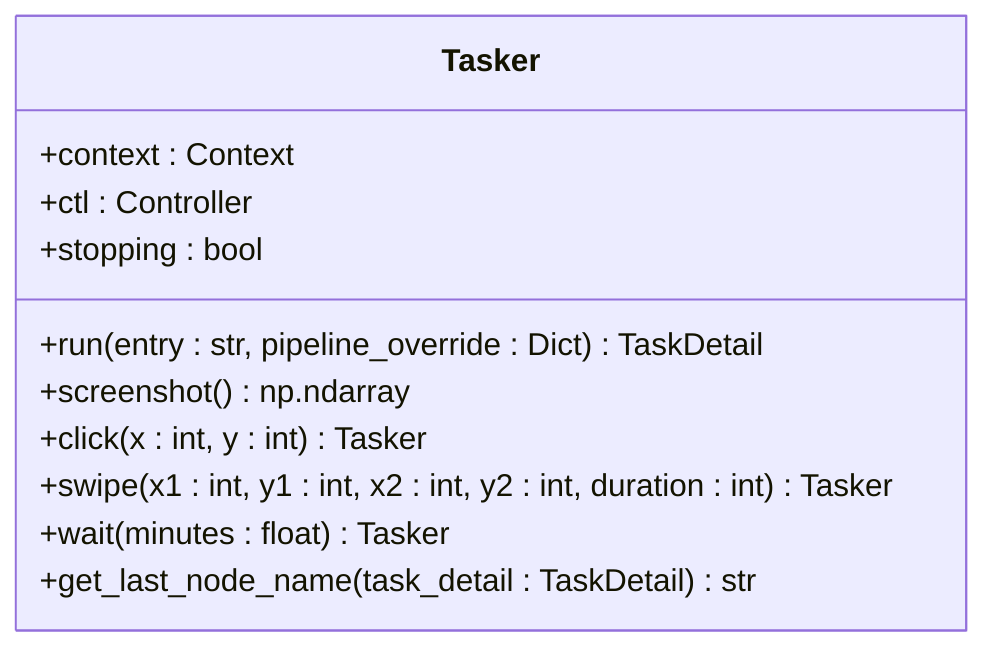

# 自定义模块开发

<cite>
**本文档引用文件**  
- [activity.py](file://agent/customs/special_treat/activity.py)
- [peak_showdown.py](file://agent/customs/special_treat/peak_showdown.py)
- [eat_sugar.py](file://agent/customs/special_treat/eat_sugar.py)
- [tasker.py](file://agent/customs/maahelper/tasker.py)
- [reco_helper.py](file://agent/customs/maahelper/reco_helper.py)
- [argv_analyzer.py](file://agent/customs/maahelper/argv_analyzer.py)
- [pipeline_helper.py](file://agent/customs/global_func/pipeline_helper.py)
- [process_guard.py](file://agent/customs/global_func/process_guard.py)
- [prompter.py](file://agent/customs/utils/prompter.py)
- [local_storage.py](file://agent/customs/utils/local_storage.py)
</cite>

## 目录
1. [引言](#引言)
2. [自定义识别器与操作器开发](#自定义识别器与操作器开发)
3. [特殊活动处理模块分析](#特殊活动处理模块分析)
4. [辅助工具类使用说明](#辅助工具类使用说明)
5. [通用功能组件设计解析](#通用功能组件设计解析)
6. [新功能模块创建示例](#新功能模块创建示例)
7. [集成机制说明](#集成机制说明)

## 引言
本项目中的自定义模块体系基于 MaaFramework 构建，通过 `agent/customs` 目录组织各类扩展功能。该体系采用模块化设计，将功能划分为识别器（CustomRecognition）和操作器（CustomAction）两大核心类型，配合参数解析、任务执行、状态监控等辅助组件，形成完整的自动化流程控制能力。

## 自定义识别器与操作器开发

### 装饰器使用规范
在 `agent/customs` 体系中，通过 `@AgentServer.custom_action` 和 `@AgentServer.custom_recognition` 装饰器注册自定义功能模块。装饰器参数为唯一标识符，用于在任务流程中调用对应功能。

- **操作器装饰器**：`@AgentServer.custom_action("action_name")`
- **识别器装饰器**：`@AgentServer.custom_recognition("reco_name")`

被装饰的类需继承 `CustomAction` 或 `CustomRecognition` 基类，并实现 `run` 或 `analyze` 方法。

### 参数传递机制
自定义模块通过 `argv` 参数接收外部输入。参数支持多种格式：
- JSON 对象：`{"key": "value"}`
- 查询字符串：`key=value&other=123`
- 简单字符串：`value`

参数解析由 `ParamAnalyzer` 类统一处理，支持别名列表和默认值设置。

### 返回值格式
- **操作器**：返回 `bool` 类型，`True` 表示成功，`False` 表示失败
- **识别器**：返回 `CustomRecognition.AnalyzeResult` 对象，包含识别区域和附加信息

**Section sources**
- [tasker.py](file://agent/customs/maahelper/tasker.py#L1-L177)
- [argv_analyzer.py](file://agent/customs/maahelper/argv_analyzer.py#L1-L159)

## 特殊活动处理模块分析

### 活动界面导航与糖果领取
`activity.py` 文件实现了活动相关的核心操作：

- **EnterActivity**：通过活动标题进入指定活动界面，利用 `Tasker` 执行预定义的 Pipeline 任务
- **ClaimCandy**：根据时间段领取糖果，支持早饭/晚饭两种模式，通过 ROI 区域识别和周期检查机制确保操作准确性

该模块展示了如何结合参数解析、任务执行和条件判断实现复杂业务逻辑。

### 战斗力解析与对手选择
`peak_showdown.py` 文件提供了巅峰对决场景的智能决策能力：

- **PickOpponent**：自定义识别器，用于选择最优对手
- **parse_power**：辅助函数，解析 OCR 识别出的战斗力文本，兼容全角/半角符号
- 支持两种策略：最低战力优先（min_power）和最高排名优先（max_rank）

该模块体现了识别结果处理、数值解析和策略选择的完整流程。

**Section sources**
- [activity.py](file://agent/customs/special_treat/activity.py#L1-L102)
- [peak_showdown.py](file://agent/customs/special_treat/peak_showdown.py#L1-L96)

## 辅助工具类使用说明

### Tasker 任务执行器
`tasker.py` 提供了封装后的任务执行接口：



**Diagram sources**
- [tasker.py](file://agent/customs/maahelper/tasker.py#L16-L177)

### RecoHelper 识别辅助类
`reco_helper.py` 封装了识别相关的常用操作：

- **recognize**：执行识别任务，支持结果过滤和缓存管理
- **click/click_all**：点击识别结果，支持偏移量和批量点击
- **concat/sort/filter**：结果文本拼接、排序和过滤
- **静态工具方法**：坐标计算、结果构造等

该类通过链式调用设计提高了代码可读性。

**Section sources**
- [reco_helper.py](file://agent/customs/maahelper/reco_helper.py#L1-L256)
- [tasker.py](file://agent/customs/maahelper/tasker.py#L1-L177)

## 通用功能组件设计解析

### Pipeline 流程控制
`pipeline_helper.py` 中的 `Run` 类提供了通用的任务执行功能：

- 支持指定入口节点和预期结束节点
- 可通过参数动态覆盖 Pipeline 配置
- 内置异常处理和日志记录

该组件实现了流程的灵活调用和结果验证。

### 进程状态监控
`process_guard.py` 提供了任务生命周期管理功能：

- **OnTaskStart**：任务启动监听器，支持钩子函数注册
- **CheckStopping**：任务停止检测器，用于流程中断判断
- **home_start**：预定义的返回主界面钩子

该模块确保了任务执行过程的可控性和稳定性。

**Section sources**
- [pipeline_helper.py](file://agent/customs/global_func/pipeline_helper.py#L1-L25)
- [process_guard.py](file://agent/customs/global_func/process_guard.py#L1-L99)

## 新功能模块创建示例

### 创建自定义操作器
```python
from maa.agent.agent_server import AgentServer
from maa.custom_action import CustomAction
from maa.context import Context

from agent.customs.utils import Prompter
from agent.customs.maahelper import ParamAnalyzer, Tasker

@AgentServer.custom_action("custom_example")
class CustomExample(CustomAction):
    """自定义功能示例"""
    
    def run(self, context: Context, argv: CustomAction.RunArg) -> bool:
        try:
            # 解析参数
            args = ParamAnalyzer(argv)
            target = args.get(["target", "t"], "default")
            
            # 执行任务
            task_detail = Tasker(context).run(
                "示例任务_开始",
                {"示例节点": {"param": target}}
            )
            
            # 验证结果
            if Tasker.get_last_node_name(task_detail) == "示例节点":
                return True
            return False
            
        except Exception as e:
            return Prompter.error("自定义示例", e)
```

### 创建自定义识别器
```python
from maa.agent.agent_server import AgentServer
from maa.custom_recognition import CustomRecognition
from maa.context import Context

from agent.customs.utils import Prompter
from agent.customs.maahelper import RecoHelper, ParamAnalyzer

@AgentServer.custom_recognition("detect_example")
class DetectExample(CustomRecognition):
    """检测示例识别器"""
    
    def analyze(
        self,
        context: Context,
        argv: CustomRecognition.AnalyzeArg,
    ) -> CustomRecognition.AnalyzeResult:
        try:
            args = ParamAnalyzer(argv)
            threshold = args.get(["threshold", "t"], 0.8)
            
            # 执行识别
            rh = RecoHelper(context, argv).recognize("示例识别")
            if rh.hit:
                # 过滤低置信度结果
                filtered = RecoHelper.filter_reco(rh.filtered_results, threshold)
                if filtered:
                    return RecoHelper.rt(filtered[0])
            
            return RecoHelper.NoResult
            
        except Exception as e:
            return Prompter.error("检测示例", e, reco_detail=True)
```

**Section sources**
- [activity.py](file://agent/customs/special_treat/activity.py#L1-L102)
- [peak_showdown.py](file://agent/customs/special_treat/peak_showdown.py#L1-L96)

## 集成机制说明

### 模块注册与发现
`agent/customs` 目录通过 `__init__.py` 文件实现模块自动注册：

- 根目录 `__init__.py` 导入各子模块
- `special_treat/__init__.py` 导入具体功能模块
- `maahelper/__init__.py` 导出核心辅助类
- `global_func/__init__.py` 导出通用功能组件

### 依赖注入与调用链
自定义模块通过以下方式构建调用链：

1. **参数解析**：`ParamAnalyzer` 统一处理输入参数
2. **任务执行**：`Tasker` 调用 Pipeline 任务
3. **结果处理**：`RecoHelper` 处理识别结果
4. **状态反馈**：`Prompter` 输出日志和错误信息

该机制实现了高内聚、低耦合的模块化设计。

**Section sources**
- [__init__.py](file://agent/customs/__init__.py#L1-L3)
- [special_treat/__init__.py](file://agent/customs/special_treat/__init__.py#L1-L7)
- [maahelper/__init__.py](file://agent/customs/maahelper/__init__.py#L1-L4)
- [global_func/__init__.py](file://agent/customs/global_func/__init__.py#L1-L7)