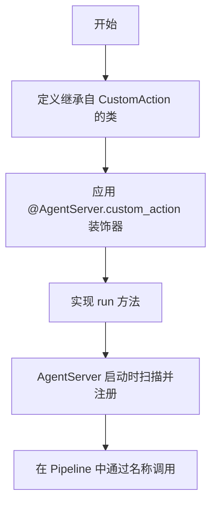
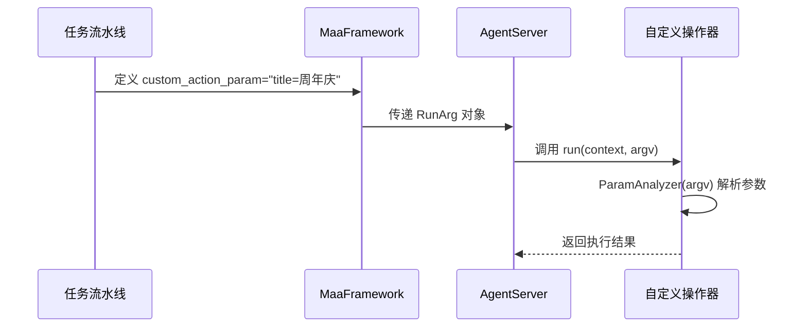
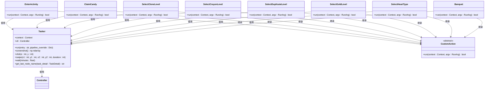
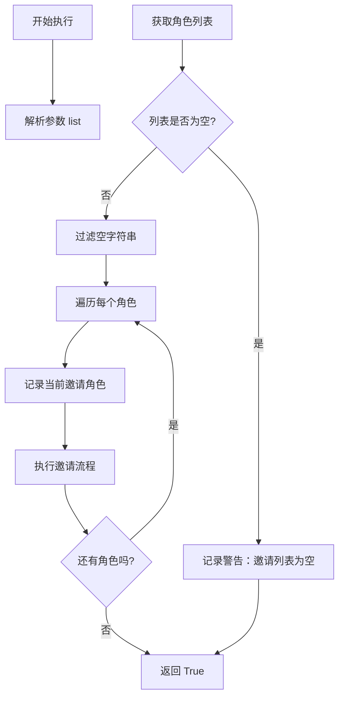

# 自定义操作器开发

<cite>
**本文档引用文件**  
- [main.py](file://agent/main.py)
- [activity.py](file://agent/customs/special_treat/activity.py)
- [store.py](file://agent/customs/special_treat/store.py)
- [eat_sugar.py](file://agent/customs/special_treat/eat_sugar.py)
- [holy.py](file://agent/customs/special_treat/holy.py)
- [tasker.py](file://agent/customs/maahelper/tasker.py)
- [argv_analyzer.py](file://agent/customs/maahelper/argv_analyzer.py)
- [prompter.py](file://agent/customs/utils/prompter.py)
- [matrix_operator.py](file://agent/customs/utils/matrix_operator.py)
</cite>

## 目录
1. [引言](#引言)
2. [AgentServer 启动与执行流程](#agentserver-启动与执行流程)
3. [自定义操作器注册机制](#自定义操作器注册机制)
4. [装饰器参数配置与上下文传递](#装饰器参数配置与上下文传递)
5. [操作回调函数详解](#操作回调函数详解)
6. [典型操作实现剖析](#典型操作实现剖析)
7. [新增：Banquet 自定义动作实现示例](#新增banquet-自定义动作实现示例)
8. [调试与异常处理](#调试与异常处理)
9. [与设备控制器的交互优化](#与设备控制器的交互优化)
10. [总结](#总结)

## 引言

本文档全面阐述如何利用 `AgentServer.register_custom_action` 装饰器开发自定义操作器。通过分析 `agent/main.py` 中的启动流程以及 `agent/customs/special_treat` 目录下的具体实现，详细解析自定义操作器的注册、触发和执行机制。文档将深入探讨装饰器的参数配置、`trans_arg` 上下文传递机制、操作回调函数的输入参数（如 `context`、`task_name`、`custom_param`）和返回值要求，并结合点击、滑动、条件等待等操作的实现方式，说明其与识别结果的联动逻辑。同时提供详尽的调试指南，包括日志分析、异常捕获、超时处理及与设备控制器的交互优化策略。

**更新** 新增了 Banquet 自定义动作的实现示例，展示了如何开发支持最多5个角色批量邀请的复杂UI交互逻辑，包括参数解析、输入验证和错误处理机制，为自动化社交功能提供了重要补充。

## AgentServer 启动与执行流程

`AgentServer` 的启动流程始于 `agent/main.py` 文件中的 `main()` 函数。该函数负责初始化环境、检查依赖并启动 `AgentServer` 服务。整个流程如下：

1. **环境初始化**：将项目根目录添加到 Python 路径，确保模块导入正确。
2. **依赖检查**：在非开发模式下，调用 `check_and_install_dependencies()` 检查并安装必要的 Python 依赖包。
3. **工具包初始化**：调用 `Toolkit.init_option("./")` 初始化 MaaFramework 工具包。
4. **服务启动**：从命令行参数获取 `socket_id`，并调用 `AgentServer.start_up(socket_id)` 启动服务。
5. **任务执行**：服务启动后，执行 `punch_in()` 等运维任务。
6. **服务等待与关闭**：调用 `AgentServer.join()` 等待服务结束，最后通过 `AgentServer.shut_down()` 安全关闭服务。

此流程确保了 `AgentServer` 在一个稳定、配置完整的环境中运行，为自定义操作器的执行提供了基础。

**Section sources**
- [main.py:47-77](file://agent/main.py#L47-L77)

## 自定义操作器注册机制

自定义操作器的注册是通过 `AgentServer.custom_action` 装饰器实现的。该装饰器将一个继承自 `CustomAction` 的类注册为一个可被 MaaFramework 调用的自定义动作。

注册过程如下：
1. **装饰器应用**：在自定义操作类定义前，使用 `@AgentServer.custom_action("action_name")` 语法。
2. **类定义**：被装饰的类必须继承自 `maa.custom_action.CustomAction` 基类。
3. **方法实现**：类中必须实现 `run` 方法，该方法定义了操作的具体逻辑。

当 `AgentServer` 启动时，它会扫描所有被 `custom_action` 装饰的类，并将其注册到内部的动作列表中。之后，这些动作就可以在任务流水线（Pipeline）中通过其注册名称（如 `"enter_activity"`）被调用。

例如，在 `activity.py` 中，`EnterActivity` 类通过 `@AgentServer.custom_action("enter_activity")` 被注册，使其可以在流水线中作为 `"enter_activity"` 动作执行。

```mermaid
graph TD
A[开始] --> B[定义继承自 CustomAction 的类]
B --> C[应用 @AgentServer.custom_action 装饰器]
C --> D[实现 run 方法]
D --> E[AgentServer 启动时扫描并注册]
E --> F[在 Pipeline 中通过名称调用]
```

**Diagram sources**
- [main.py:49-51](file://agent/main.py#L49-L51)
- [activity.py:17-18](file://agent/customs/special_treat/activity.py#L17-L18)
- [holy.py:18](file://agent/customs/special_treat/holy.py#L18)

**Section sources**
- [activity.py:17-18](file://agent/customs/special_treat/activity.py#L17-L18)
- [store.py:14-15](file://agent/customs/special_treat/store.py#L14-L15)
- [eat_sugar.py:283-284](file://agent/customs/special_treat/eat_sugar.py#L283-L284)
- [holy.py:18](file://agent/customs/special_treat/holy.py#L18)

## 装饰器参数配置与上下文传递

`AgentServer.custom_action` 装饰器接受一个字符串参数，该参数是自定义操作的唯一标识符。这个标识符用于在任务流水线中引用该操作。

### trans_arg 上下文传递机制

`trans_arg` 机制是通过 `CustomAction.RunArg` 对象实现的，它封装了从 MaaFramework 传递给自定义操作的所有参数。其核心是 `custom_action_param` 字段，这是一个字符串，包含了用户在流水线配置中指定的参数。

参数传递流程如下：
1. **参数定义**：在流水线 JSON 中，为自定义动作节点配置 `custom_action_param`，例如 `"custom_action_param": "title=周年庆活动"`。
2. **参数传递**：MaaFramework 将此字符串传递给 `AgentServer`。
3. **参数解析**：在自定义操作的 `run` 方法中，通过 `ParamAnalyzer` 类解析 `argv.custom_action_param` 字符串。

`ParamAnalyzer` 类支持多种参数格式：
- **查询字符串格式**：`key1=value1&key2=value2`
- **JSON 格式**：`{"key1": "value1", "key2": "value2"}`

这使得参数配置非常灵活，开发者可以根据需要选择最合适的格式。

```mermaid
sequenceDiagram
participant Pipeline as 任务流水线
participant MaaFW as MaaFramework
participant AgentServer as AgentServer
participant CustomAction as 自定义操作器
Pipeline->>MaaFW : 定义 custom_action_param="title=周年庆"
MaaFW->>AgentServer : 传递 RunArg 对象
AgentServer->>CustomAction : 调用 run(context, argv)
CustomAction->>CustomAction : ParamAnalyzer(argv) 解析参数
CustomAction-->>AgentServer : 返回执行结果
```

**Diagram sources**
- [argv_analyzer.py:30-46](file://agent/customs/maahelper/argv_analyzer.py#L30-L46)
- [activity.py:37-38](file://agent/customs/special_treat/activity.py#L37-L38)
- [holy.py:40-43](file://agent/customs/special_treat/holy.py#L40-L43)

**Section sources**
- [argv_analyzer.py:17-159](file://agent/customs/maahelper/argv_analyzer.py#L17-L159)
- [activity.py:37-38](file://agent/customs/special_treat/activity.py#L37-L38)
- [holy.py:40-43](file://agent/customs/special_treat/holy.py#L40-L43)

## 操作回调函数详解

自定义操作的核心是 `run` 方法，它是一个回调函数，由 MaaFramework 在执行到相应节点时调用。

### 输入参数

`run` 方法接受两个关键参数：
- **`context: Context`**：MaaFramework 的上下文对象，提供了与框架交互的所有必要接口，如执行任务、截图、点击等。
- **`argv: CustomAction.RunArg`**：包含自定义动作参数的对象，其 `custom_action_param` 字段是开发者需要解析的主要数据源。

### 返回值要求

`run` 方法必须返回一个布尔值：
- **`True`**：表示操作成功执行。
- **`False`**：表示操作失败或发生异常。

返回 `False` 通常会触发流水线中的 `on_error` 流程，允许进行错误处理或重试。

### 异常处理

在 `run` 方法中，通常使用 `try-except` 块来捕获异常。当发生异常时，应使用 `Prompter.error()` 方法记录错误日志，并返回 `False` 以通知框架操作失败。这是一种标准的错误处理模式，确保了程序的健壮性。

**Section sources**
- [activity.py:24-34](file://agent/customs/special_treat/activity.py#L24-L34)
- [store.py:21-31](file://agent/customs/special_treat/store.py#L21-L31)
- [prompter.py:34-54](file://agent/customs/utils/prompter.py#L34-L54)
- [holy.py:56-57](file://agent/customs/special_treat/holy.py#L56-L57)

## 典型操作实现剖析

本节以 `agent/customs/special_treat` 目录下的 `activity.py`、`store.py`、`eat_sugar.py` 和 `holy.py` 为例，剖析典型操作的实现方式。

### 点击操作实现

点击操作通常通过 `Tasker` 类的 `click` 方法实现。例如，在 `ClaimCandy` 类中，虽然没有直接调用 `click`，但其调用的 `Tasker(context).run(...)` 会执行一系列预定义的点击动作。

`Tasker` 类封装了 `Controller` 对象，提供了便捷的 `click(x, y)` 方法，用于在指定坐标执行点击。

### 滑动操作实现

滑动操作通过 `Tasker` 类的 `swipe` 方法实现。该方法接受起始坐标 `(x1, y1)`、目标坐标 `(x2, y2)` 和持续时间 `duration` 作为参数。

### 条件等待实现

条件等待通常通过 `Tasker` 类的 `wait` 方法实现，该方法会暂停执行指定的分钟数。更复杂的条件等待（如等待某个元素出现）则通过 `Tasker(context).run()` 执行一个包含识别节点的流水线来实现。

### 与识别结果的联动逻辑

自定义操作器与识别结果的联动主要通过 `Tasker` 类的 `run` 方法实现。该方法可以动态覆盖流水线节点的行为，例如注入运行监测器，确保任务执行过程可被监控。通过 `pipeline_override` 参数，可以修改节点的 `next` 或 `on_error` 行为，从而实现复杂的条件逻辑。

```mermaid
classDiagram
class Tasker {
+context : Context
+ctl : Controller
+run(entry : str, pipeline_override : Dict)
+screenshot() np.ndarray
+click(x : int, y : int)
+swipe(x1 : int, y1 : int, x2 : int, y2 : int, duration : int)
+wait(minutes : float)
+get_last_node_name(task_detail : TaskDetail) str
}
class CustomAction {
<<abstract>>
+run(context : Context, argv : RunArg) bool
}
class EnterActivity {
+run(context : Context, argv : RunArg) bool
}
class ClaimCandy {
+run(context : Context, argv : RunArg) bool
}
class SelectCloneLevel {
+run(context : Context, argv : RunArg) bool
}
class SelectCrayonLevel {
+run(context : Context, argv : RunArg) bool
}
class SelectDuplicateLevel {
+run(context : Context, argv : RunArg) bool
}
class SelectGoldLevel {
+run(context : Context, argv : RunArg) bool
}
class SelectHeartType {
+run(context : Context, argv : RunArg) bool
}
class Banquet {
+run(context : Context, argv : RunArg) bool
}
Tasker --> Controller : 使用
EnterActivity --> CustomAction : 继承
ClaimCandy --> CustomAction : 继承
SelectCloneLevel --> CustomAction : 继承
SelectCrayonLevel --> CustomAction : 继承
SelectDuplicateLevel --> CustomAction : 继承
SelectGoldLevel --> CustomAction : 继承
SelectHeartType --> CustomAction : 继承
Banquet --> CustomAction : 继承
EnterActivity --> Tasker : 使用
ClaimCandy --> Tasker : 使用
SelectCloneLevel --> Tasker : 使用
SelectCrayonLevel --> Tasker : 使用
SelectDuplicateLevel --> Tasker : 使用
SelectGoldLevel --> Tasker : 使用
SelectHeartType --> Tasker : 使用
Banquet --> Tasker : 使用
```

**Diagram sources**
- [tasker.py:16-190](file://agent/customs/maahelper/tasker.py#L16-L190)
- [activity.py:18-145](file://agent/customs/special_treat/activity.py#L18-L145)
- [store.py:15-96](file://agent/customs/special_treat/store.py#L15-L96)
- [eat_sugar.py:65-238](file://agent/customs/special_treat/eat_sugar.py#L65-L238)
- [holy.py:19-57](file://agent/customs/special_treat/holy.py#L19-57)

**Section sources**
- [activity.py:17-145](file://agent/customs/special_treat/activity.py#L17-L145)
- [store.py:14-96](file://agent/customs/special_treat/store.py#L14-L96)
- [tasker.py:16-190](file://agent/customs/maahelper/tasker.py#L16-L190)
- [eat_sugar.py:65-238](file://agent/customs/special_treat/eat_sugar.py#L65-L238)
- [holy.py:19-57](file://agent/customs/special_treat/holy.py#L19-57)

## 新增：Banquet 自定义动作实现示例

`Banquet` 是一个专门用于圣团巡礼活动中宴席邀请的自定义动作，展示了如何开发支持最多5个角色批量邀请的复杂UI交互逻辑。

### 功能特性

1. **批量角色邀请**：支持最多5个角色的批量邀请，每个角色独立处理
2. **参数解析**：支持通过 `list` 或 `l` 参数指定邀请角色列表
3. **输入验证**：自动过滤空字符串和空白字符，确保邀请列表的有效性
4. **逐个邀请**：按顺序逐一邀请每个角色，确保邀请流程的完整性
5. **错误处理**：提供详细的错误信息和日志记录，便于调试和问题排查

### 实现细节

```mermaid
flowchart TD
A[开始执行] --> B[解析参数 list]
C[获取角色列表] --> D{列表是否为空?}
D --> |是| E[记录警告：邀请列表为空]
D --> |否| F[过滤空字符串]
F --> G[遍历每个角色]
G --> H[记录当前邀请角色]
H --> I[执行邀请流程]
I --> J{还有角色吗?}
J --> |是| G
J --> |否| K[返回 True]
E --> K
```

**Diagram sources**
- [holy.py:27-57](file://agent/customs/special_treat/holy.py#L27-L57)

### 关键实现要点

1. **参数解析**：使用 `ParamAnalyzer(argv).get(["list", "l"])` 获取邀请角色列表参数
2. **列表过滤**：通过列表推导式 `[item for item in invite_list if item and item.strip()]` 过滤空字符串和空白字符
3. **逐个邀请**：使用 `for character in invite_list` 循环处理每个角色
4. **邀请流程**：通过 `Tasker(context).run("圣团巡礼_邀请客人开始", {"圣团巡礼_识别客人": {"expected": character}})` 执行邀请流程
5. **错误处理**：使用 `Prompter.error("宴席", e)` 记录错误并返回 `False`

### 与其他自定义动作的区别

与 `SelectGoldLevel` 等关卡选择动作不同，`Banquet` 具有以下特点：
- **批量处理**：需要处理多个角色的邀请，而不是单一目标
- **列表参数**：使用数组形式的参数，支持多值输入
- **迭代执行**：需要循环执行相同的邀请流程多次
- **输入验证**：需要对用户输入进行清理和验证
- **状态管理**：需要跟踪当前邀请的角色进度

### 与流水线的集成

`Banquet` 动作与流水线的集成体现在以下几个方面：
- **参数传递**：通过 `custom_action_param` 传递角色列表参数
- **节点覆盖**：使用 `pipeline_override` 动态覆盖识别节点的期望值
- **流程控制**：通过返回值控制后续节点的执行

**Section sources**
- [holy.py:19-57](file://agent/customs/special_treat/holy.py#L19-57)
- [holy.py:1087-1089](file://assets/resource/base/pipeline/日常任务/圣团巡礼.json#L1087-L1089)
- [saint_tour.json:174-177](file://assets/resource/tasks/daily/saint_tour.json#L174-L177)

## 调试与异常处理

有效的调试是开发自定义操作器的关键。

### 操作执行日志分析

`Prompter` 类提供了 `log` 和 `error` 方法，用于输出不同级别的日志信息。`log` 方法用于记录正常操作流程，而 `error` 方法则用于记录错误信息，并返回 `False`。通过分析这些日志，可以快速定位问题所在。

### 异常捕获

如前所述，`try-except` 块是捕获异常的标准做法。所有可能抛出异常的代码都应被包裹在 `try` 块中，并在 `except` 块中进行处理。

### 超时处理

超时处理主要由 MaaFramework 的底层机制管理。在流水线配置中，可以通过设置 `timeout` 字段来定义节点的超时时间。自定义操作器本身通常不直接处理超时，而是依赖框架的超时机制。

**Section sources**
- [prompter.py:16-54](file://agent/customs/utils/prompter.py#L16-L54)
- [activity.py:53-54](file://agent/customs/special_treat/activity.py#L53-L54)
- [store.py:48-49](file://agent/customs/special_treat/store.py#L48-L49)
- [holy.py:56-57](file://agent/customs/special_treat/holy.py#L56-L57)

## 与设备控制器的交互优化策略

`Tasker` 类通过 `ctl` 属性（`Controller` 对象）与设备控制器进行交互。为了优化交互，可以采取以下策略：
- **减少不必要的操作**：避免在循环中执行过多的截图或点击操作。
- **合理使用等待**：使用 `wait` 方法在必要时暂停执行，避免因设备响应延迟而导致的错误。
- **利用流水线覆盖**：通过 `pipeline_override` 动态修改流水线行为，实现更灵活的控制逻辑。

**Section sources**
- [tasker.py:124-190](file://agent/customs/maahelper/tasker.py#L124-L190)

## 总结

本文档详细阐述了如何利用 `AgentServer.register_custom_action` 装饰器开发自定义操作器。从 `AgentServer` 的启动流程，到装饰器的注册机制、参数传递、回调函数实现，再到具体的点击、滑动等操作的剖析，以及调试和优化策略，为开发者提供了一套完整的开发指南。

**更新** 新增的 `Banquet` 自定义动作展示了复杂批量处理逻辑的实现模式，包括参数解析、列表过滤、迭代执行和错误处理等技术要点，为开发类似的社交功能邀请系统提供了最佳实践参考。通过遵循这些原则和模式，可以高效地创建稳定、可靠的自定义操作器，以满足各种自动化需求。