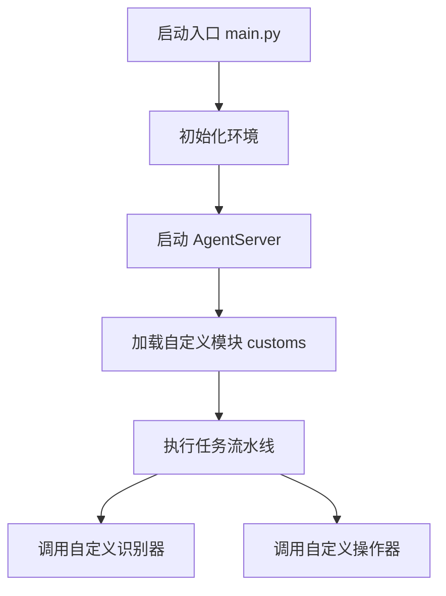
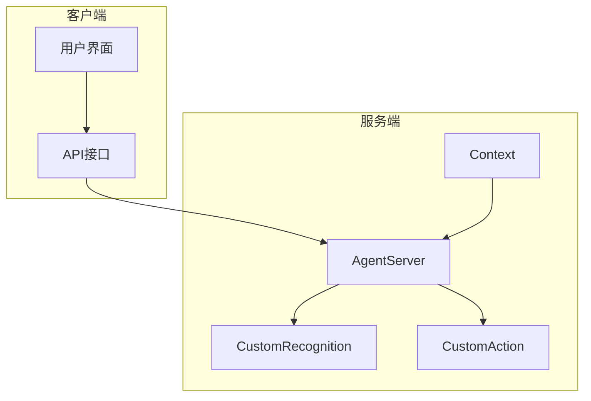
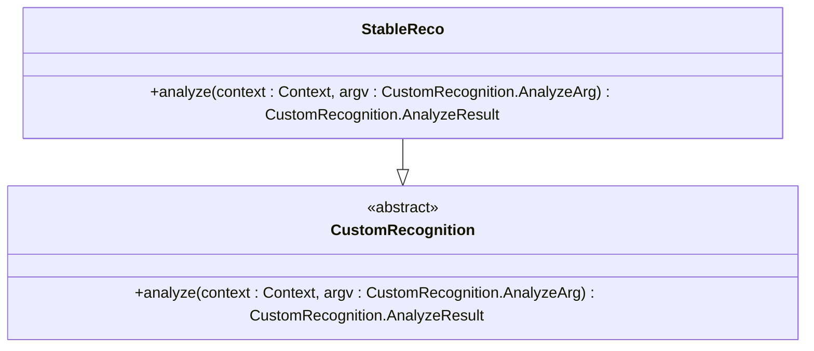
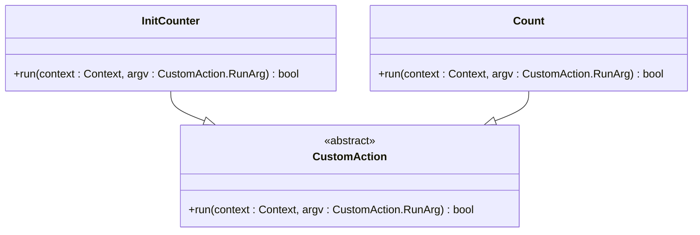
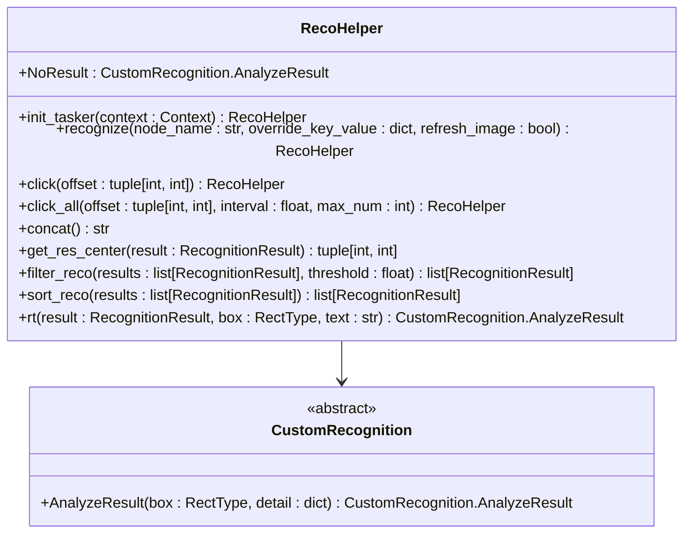
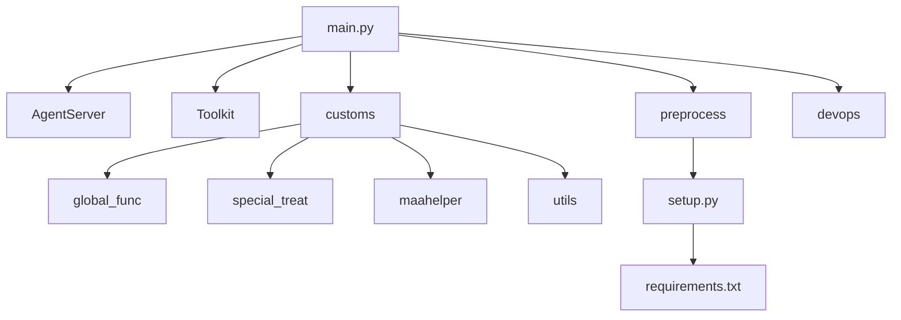

# 自定义识别与操作开发

<cite>
**本文档引用的文件**  
- [main.py](file://agent/main.py)
- [counter.py](file://agent/customs/global_func/counter.py)
- [logic_enhance.py](file://agent/customs/global_func/logic_enhance.py)
- [process_guard.py](file://agent/customs/global_func/process_guard.py)
- [reco_helper.py](file://agent/customs/maahelper/reco_helper.py)
- [tasker.py](file://agent/customs/maahelper/tasker.py)
- [prompter.py](file://agent/customs/utils/prompter.py)
- [counter.py](file://agent/customs/utils/counter.py)
- [activity.py](file://agent/customs/special_treat/activity.py)
- [setup.py](file://agent/preprocess/setup.py)
- [2.2-集成接口一览.md](file://instructions/maafw-guide/2.2-集成接口一览.md)
- [2.3-回调协议.md](file://instructions/maafw-guide/2.3-回调协议.md)
- [3.1-任务流水线协议.md](file://instructions/maafw-guide/3.1-任务流水线协议.md)
- [4.2-标准化接口设计.md](file://instructions/maafw-guide/4.2-标准化接口设计.md)
- [hooks.json](file://assets/resource/base/pipeline/其他/hooks.json)
</cite>

## 目录

1. [引言](#引言)
2. [项目结构](#项目结构)
3. [核心组件](#核心组件)
4. [架构概述](#架构概述)
5. [详细组件分析](#详细组件分析)
6. [依赖分析](#依赖分析)
7. [性能考虑](#性能考虑)
8. [故障排除指南](#故障排除指南)
9. [结论](#结论)

## 引言

本文档深入讲解如何基于 MaaFramework 的 `AgentServer.register_custom_recognition` 和 `register_custom_action` 装饰器开发自定义识别器与操作器。详细说明装饰器的使用规范、参数传递机制（trans_arg）、回调函数签名及返回值格式（如识别结果的 bbox、detail 等字段）。结合 `agent/main.py` 中 `AgentServer.start_up` 的启动流程，解析自定义模块的注册时机与执行生命周期。以实际代码为例，展示如何实现一个图像匹配识别器和点击操作器，并说明其在任务流水线中的调用关系。提供完整的错误处理模式和调试建议，包括识别失败重试、日志输出和性能优化策略。

## 项目结构

本项目采用模块化设计，核心功能集中在 `agent` 目录下，通过 `main.py` 启动服务。自定义识别与操作逻辑分布在 `agent/customs` 目录中，按功能划分为 `global_func`（全局功能）、`special_treat`（特殊处理）和 `maahelper`（辅助工具）等子模块。`assets/resource/base/pipeline` 目录存放任务流水线配置文件，定义了识别与操作的执行流程。

**图示来源**
- [main.py](file://agent/main.py#L1-L48)
- [counter.py](file://agent/customs/global_func/counter.py#L1-L118)

## 核心组件

核心组件包括 `AgentServer`、`CustomRecognition`、`CustomAction`、`Context` 等类。`AgentServer` 负责服务的启动与管理，`CustomRecognition` 和 `CustomAction` 是自定义识别与操作的基类，`Context` 提供了与 MaaFramework 交互的上下文环境。`RecoHelper` 和 `Tasker` 等辅助类封装了常用操作，简化了开发流程。

**本节来源**
- [main.py](file://agent/main.py#L1-L48)
- [reco_helper.py](file://agent/customs/maahelper/reco_helper.py#L1-L256)
- [tasker.py](file://agent/customs/maahelper/tasker.py#L1-L120)

## 架构概述

系统架构采用客户端-服务器模式，`AgentServer` 作为服务端，接收来自客户端的指令并执行任务。自定义识别器与操作器通过装饰器注册到 `AgentServer`，在任务执行过程中被调用。任务流水线由 JSON 配置文件定义，通过 `Tasker` 类执行，实现了配置与代码的分离。

**图示来源**
- [main.py](file://agent/main.py#L1-L48)
- [2.2-集成接口一览.md](file://instructions/maafw-guide/2.2-集成接口一览.md#L581-L592)

## 详细组件分析

### 自定义识别器分析

自定义识别器通过继承 `CustomRecognition` 类并实现 `analyze` 方法来定义。`analyze` 方法接收 `context` 和 `argv` 参数，返回 `CustomRecognition.AnalyzeResult` 对象。`argv` 参数包含了识别所需的配置信息，如图像数据、识别区域等。

#### 稳定识别器实现

**图示来源**
- [logic_enhance.py](file://agent/customs/global_func/logic_enhance.py#L18-L96)

### 自定义操作器分析

自定义操作器通过继承 `CustomAction` 类并实现 `run` 方法来定义。`run` 方法接收 `context` 和 `argv` 参数，返回布尔值表示操作是否成功。`argv` 参数包含了操作所需的配置信息，如点击坐标、操作类型等。

#### 计数器操作器实现

**图示来源**
- [counter.py](file://agent/customs/global_func/counter.py#L21-L80)

### 识别辅助类分析

`RecoHelper` 类封装了识别结果的处理、点击操作、结果过滤等常用功能，简化了自定义识别器的开发。它提供了 `recognize`、`click`、`click_all` 等方法，支持链式调用。

**图示来源**
- [reco_helper.py](file://agent/customs/maahelper/reco_helper.py#L1-L256)

## 依赖分析

项目依赖主要分为内部依赖和外部依赖。内部依赖包括 `agent` 目录下的各个模块，外部依赖通过 `requirements.txt` 文件管理。`setup.py` 负责检测项目版本变化，并在必要时自动安装或更新 Python 依赖包。

**图示来源**
- [main.py](file://agent/main.py#L1-L48)
- [setup.py](file://agent/preprocess/setup.py#L1-L230)

## 性能考虑

在开发自定义识别器与操作器时，应注意性能优化。避免在 `analyze` 和 `run` 方法中执行耗时操作，尽量使用缓存机制减少重复计算。合理设置识别速率限制（rate_limit），避免频繁调用导致性能下降。对于复杂的识别逻辑，可考虑使用多线程或异步处理。

## 故障排除指南

### 错误处理模式

自定义识别器与操作器应包含完善的错误处理机制。使用 `try-except` 语句捕获异常，并通过 `Prompter.error` 方法记录错误信息。对于关键操作，应提供重试机制，确保任务的稳定性。

**本节来源**
- [prompter.py](file://agent/customs/utils/prompter.py#L1-L55)
- [counter.py](file://agent/customs/global_func/counter.py#L41-L49)

### 调试建议

1. 使用 `Prompter.log` 方法输出调试信息，便于追踪执行流程。
2. 在 `analyze` 和 `run` 方法中添加日志输出，记录输入参数和返回值。
3. 利用 `RecoHelper` 的 `refresh_screencap` 方法获取当前截图，验证识别结果。
4. 通过 `Tasker` 的 `run` 方法执行任务，观察任务流水线的执行情况。

**本节来源**
- [prompter.py](file://agent/customs/utils/prompter.py#L16-L32)
- [tasker.py](file://agent/customs/maahelper/tasker.py#L51-L63)

## 结论

本文档详细介绍了基于 MaaFramework 开发自定义识别器与操作器的方法。通过分析 `AgentServer` 的启动流程、装饰器的使用规范、回调函数的签名及返回值格式，结合实际代码示例，展示了如何实现一个完整的自定义模块。同时，提供了错误处理模式和调试建议，帮助开发者快速定位和解决问题。通过合理利用 `RecoHelper` 和 `Tasker` 等辅助类，可以显著提高开发效率，确保任务的稳定性和可靠性。