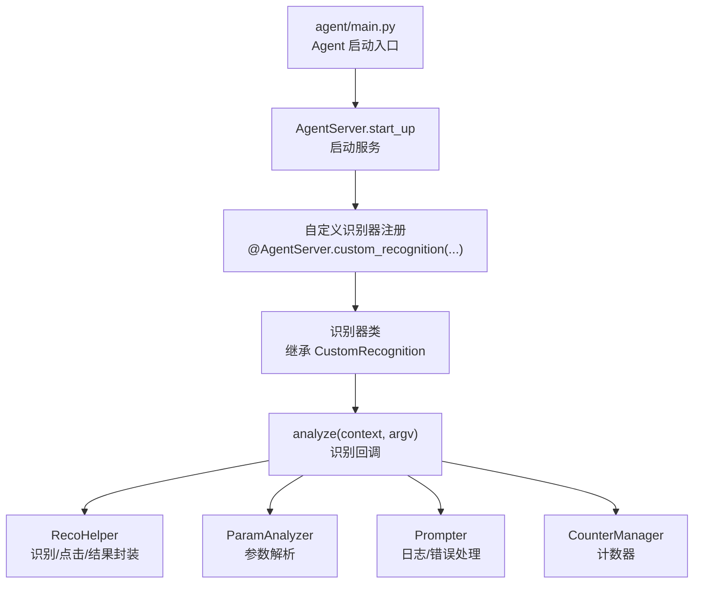
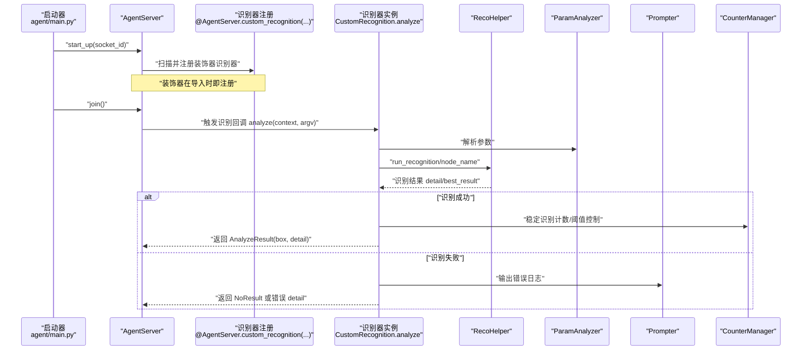
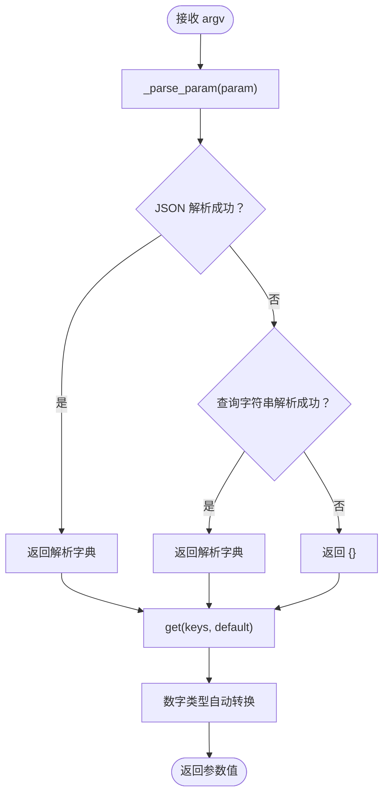
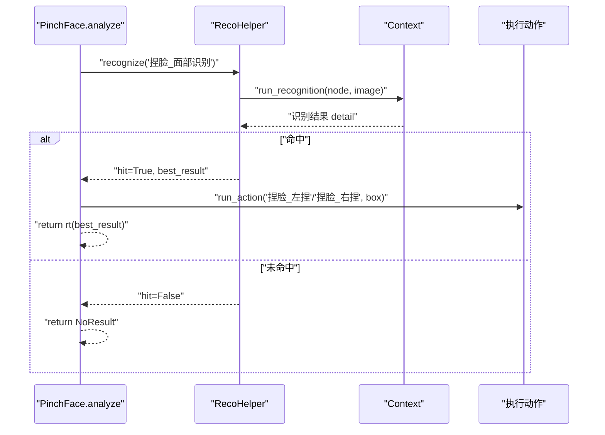
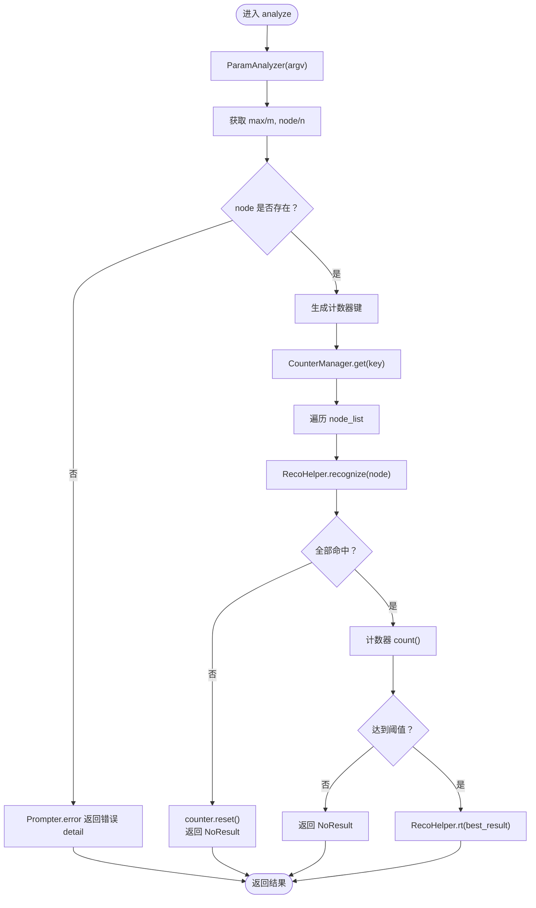
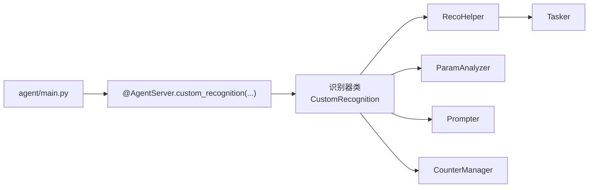

# 自定义识别器开发

<cite>
**本文引用的文件**
- [agent/main.py](file://agent/main.py)
- [agent/customs/global_func/pinch_face.py](file://agent/customs/global_func/pinch_face.py)
- [agent/customs/global_func/logic_enhance.py](file://agent/customs/global_func/logic_enhance.py)
- [agent/customs/maahelper/reco_helper.py](file://agent/customs/maahelper/reco_helper.py)
- [agent/customs/maahelper/argv_analyzer.py](file://agent/customs/maahelper/argv_analyzer.py)
- [agent/customs/maahelper/tasker.py](file://agent/customs/maahelper/tasker.py)
- [agent/customs/utils/prompter.py](file://agent/customs/utils/prompter.py)
- [agent/customs/utils/counter.py](file://agent/customs/utils/counter.py)
- [agent/customs/utils/local_storage.py](file://agent/customs/utils/local_storage.py)
</cite>

## 目录
1. [简介](#简介)
2. [项目结构](#项目结构)
3. [核心组件](#核心组件)
4. [架构总览](#架构总览)
5. [详细组件分析](#详细组件分析)
6. [依赖关系分析](#依赖关系分析)
7. [性能考虑](#性能考虑)
8. [故障排查指南](#故障排查指南)
9. [结论](#结论)
10. [附录](#附录)

## 简介
本指南围绕 MaaFramework 的 AgentServer.register_custom_recognition 装饰器，系统讲解如何开发自定义识别器。重点涵盖：
- 装饰器使用规范与注册时机
- trans_arg 参数的传递机制
- 回调函数签名与返回值格式（识别结果中的 bbox、detail 等字段）
- 结合 agent/main.py 中 AgentServer.start_up 的启动流程，解析自定义识别器的注册与执行生命周期
- 以 agent/customs 下的实际模块（如 pinch_face.py、logic_enhance.py）为例，展示图像匹配、稳定识别等识别逻辑
- 错误处理模式、重试策略、日志输出与分析方法、性能瓶颈定位与优化技巧

## 项目结构
本项目采用“功能域+层次化”组织方式：
- agent/main.py：Agent 服务启动入口，负责初始化 Toolkit、启动 AgentServer、等待服务结束
- agent/customs/global_func：全局功能识别器集合，包含图像匹配、稳定识别等
- agent/customs/maahelper：识别/动作辅助模块，封装识别结果处理、截图、点击、参数解析等
- agent/customs/utils：通用工具，包括日志打印、计数器、本地存储等

图表来源
- [agent/main.py](file://agent/main.py#L17-L42)
- [agent/customs/global_func/pinch_face.py](file://agent/customs/global_func/pinch_face.py#L15-L55)
- [agent/customs/global_func/logic_enhance.py](file://agent/customs/global_func/logic_enhance.py#L18-L96)
- [agent/customs/maahelper/reco_helper.py](file://agent/customs/maahelper/reco_helper.py#L17-L256)
- [agent/customs/maahelper/argv_analyzer.py](file://agent/customs/maahelper/argv_analyzer.py#L17-L159)
- [agent/customs/utils/prompter.py](file://agent/customs/utils/prompter.py#L16-L55)
- [agent/customs/utils/counter.py](file://agent/customs/utils/counter.py#L75-L141)

章节来源
- [agent/main.py](file://agent/main.py#L17-L42)

## 核心组件
- AgentServer.register_custom_recognition 装饰器：用于将自定义识别器类注册到 Agent 服务，使其可在任务流水线中被调用
- CustomRecognition：识别器基类，要求实现 analyze(context, argv) 回调
- RecoHelper：识别结果处理与操作封装，提供识别、点击、结果构造等能力
- ParamAnalyzer：参数解析器，支持 JSON 与查询字符串格式
- Prompter：统一的日志与错误输出工具
- CounterManager：计数器管理，用于稳定识别等场景的阈值控制
- Tasker：任务执行器，封装截图、点击、滑动、等待等底层操作

章节来源
- [agent/customs/maahelper/reco_helper.py](file://agent/customs/maahelper/reco_helper.py#L17-L256)
- [agent/customs/maahelper/argv_analyzer.py](file://agent/customs/maahelper/argv_analyzer.py#L17-L159)
- [agent/customs/utils/prompter.py](file://agent/customs/utils/prompter.py#L16-L55)
- [agent/customs/utils/counter.py](file://agent/customs/utils/counter.py#L75-L141)
- [agent/customs/maahelper/tasker.py](file://agent/customs/maahelper/tasker.py#L16-L177)

## 架构总览
Agent 启动后，通过装饰器注册的识别器类被框架发现并纳入可用识别器集合。任务流水线在执行过程中调用识别器的 analyze 回调，识别器内部使用 RecoHelper 进行识别与操作，必要时通过 Prompter 输出日志/错误，通过 CounterManager 控制稳定识别阈值，最终返回标准的识别结果对象。

图表来源
- [agent/main.py](file://agent/main.py#L25-L42)
- [agent/customs/global_func/pinch_face.py](file://agent/customs/global_func/pinch_face.py#L23-L55)
- [agent/customs/global_func/logic_enhance.py](file://agent/customs/global_func/logic_enhance.py#L38-L96)
- [agent/customs/maahelper/reco_helper.py](file://agent/customs/maahelper/reco_helper.py#L62-L94)
- [agent/customs/maahelper/argv_analyzer.py](file://agent/customs/maahelper/argv_analyzer.py#L103-L131)
- [agent/customs/utils/prompter.py](file://agent/customs/utils/prompter.py#L34-L54)
- [agent/customs/utils/counter.py](file://agent/customs/utils/counter.py#L87-L112)

## 详细组件分析

### 装饰器使用规范与注册时机
- 注册方式：在识别器类上使用 @AgentServer.custom_recognition("标识名") 装饰器进行注册
- 标识名：用于在任务流水线中引用该识别器
- 注册时机：装饰器在模块导入时即生效，因此需确保在 AgentServer.start_up 之前导入包含装饰器的模块（例如在 agent/main.py 中导入 agent.customs）

章节来源
- [agent/customs/global_func/pinch_face.py](file://agent/customs/global_func/pinch_face.py#L15-L16)
- [agent/customs/global_func/logic_enhance.py](file://agent/customs/global_func/logic_enhance.py#L18-L19)
- [agent/main.py](file://agent/main.py#L19-L24)

### trans_arg 参数的传递机制
- 参数载体：CustomRecognition.AnalyzeArg（或 CustomAction.RunArg，视上下文而定）
- 解析器：ParamAnalyzer 接收 argv，自动识别 JSON 或查询字符串格式，解析为字典
- 获取方式：通过 ParamAnalyzer.get(keys, default) 获取参数值，支持多键名别名与数字类型自动转换

图表来源
- [agent/customs/maahelper/argv_analyzer.py](file://agent/customs/maahelper/argv_analyzer.py#L48-L101)
- [agent/customs/maahelper/argv_analyzer.py](file://agent/customs/maahelper/argv_analyzer.py#L103-L131)
- [agent/customs/maahelper/argv_analyzer.py](file://agent/customs/maahelper/argv_analyzer.py#L133-L158)

章节来源
- [agent/customs/maahelper/argv_analyzer.py](file://agent/customs/maahelper/argv_analyzer.py#L30-L46)
- [agent/customs/maahelper/argv_analyzer.py](file://agent/customs/maahelper/argv_analyzer.py#L103-L131)

### 回调函数签名与返回值格式
- 签名：analyze(self, context: Context, argv: CustomRecognition.AnalyzeArg) -> CustomRecognition.AnalyzeResult
- 返回值：CustomRecognition.AnalyzeResult(box, detail)
  - box：识别框，通常为 (x, y, w, h)
  - detail：字典，包含识别细节，如 text、hit 等
- 无结果：使用 RecoHelper.NoResult 或 Prompter.error 构造错误返回

章节来源
- [agent/customs/maahelper/reco_helper.py](file://agent/customs/maahelper/reco_helper.py#L34-L34)
- [agent/customs/maahelper/reco_helper.py](file://agent/customs/maahelper/reco_helper.py#L233-L255)
- [agent/customs/utils/prompter.py](file://agent/customs/utils/prompter.py#L48-L54)

### 图像匹配识别器：PinchFace
- 功能：识别游戏内捏脸界面，根据识别结果执行左/右捏脸动作
- 流程要点：
  - 使用 RecoHelper.recognize("节点名") 执行识别
  - 判断 hit 与 best_result，决定执行左捏或右捏
  - 成功时返回 RecoHelper.rt(best_result)；失败时通过 Prompter.error 输出错误并返回错误 detail

图表来源
- [agent/customs/global_func/pinch_face.py](file://agent/customs/global_func/pinch_face.py#L23-L55)
- [agent/customs/maahelper/reco_helper.py](file://agent/customs/maahelper/reco_helper.py#L62-L94)

章节来源
- [agent/customs/global_func/pinch_face.py](file://agent/customs/global_func/pinch_face.py#L15-L55)

### 稳定识别器：StableReco
- 功能：通过多次连续识别同一目标，确保识别稳定性，仅当达到阈值时返回结果
- 参数：
  - max/m：最大连续识别次数，默认 3
  - node/n：要识别的节点名称或节点名称列表（必需）
- 流程要点：
  - 解析参数，支持单节点与多节点
  - 使用 CounterManager.get 生成计数器键，逐节点识别
  - 任一节点未命中则重置计数器并返回 NoResult
  - 全部命中且计数达到阈值时返回识别结果

图表来源
- [agent/customs/global_func/logic_enhance.py](file://agent/customs/global_func/logic_enhance.py#L38-L96)
- [agent/customs/maahelper/argv_analyzer.py](file://agent/customs/maahelper/argv_analyzer.py#L103-L131)
- [agent/customs/utils/counter.py](file://agent/customs/utils/counter.py#L87-L112)
- [agent/customs/maahelper/reco_helper.py](file://agent/customs/maahelper/reco_helper.py#L233-L255)

章节来源
- [agent/customs/global_func/logic_enhance.py](file://agent/customs/global_func/logic_enhance.py#L18-L96)
- [agent/customs/utils/counter.py](file://agent/customs/utils/counter.py#L75-L141)

### 识别辅助与工具链
- RecoHelper：识别结果处理、点击、文本拼接、结果构造等
- Tasker：截图、点击、滑动、等待、任务运行等底层操作
- Prompter：统一日志与错误输出，支持构造错误返回值
- CounterManager：计数器管理，支持阈值控制
- LocalStorage：本地 JSON 存储，便于持久化配置与状态

章节来源
- [agent/customs/maahelper/reco_helper.py](file://agent/customs/maahelper/reco_helper.py#L17-L256)
- [agent/customs/maahelper/tasker.py](file://agent/customs/maahelper/tasker.py#L16-L177)
- [agent/customs/utils/prompter.py](file://agent/customs/utils/prompter.py#L16-L55)
- [agent/customs/utils/counter.py](file://agent/customs/utils/counter.py#L75-L141)
- [agent/customs/utils/local_storage.py](file://agent/customs/utils/local_storage.py#L10-L111)

## 依赖关系分析
- 装饰器注册依赖于模块导入顺序，需在 AgentServer.start_up 之前导入包含装饰器的模块
- 识别器依赖 RecoHelper 进行识别与结果封装，依赖 Prompter 进行日志与错误输出
- 稳定识别依赖 CounterManager 进行阈值控制
- 参数解析依赖 ParamAnalyzer，支持多种输入格式

图表来源
- [agent/main.py](file://agent/main.py#L19-L24)
- [agent/customs/global_func/pinch_face.py](file://agent/customs/global_func/pinch_face.py#L15-L55)
- [agent/customs/global_func/logic_enhance.py](file://agent/customs/global_func/logic_enhance.py#L18-L96)
- [agent/customs/maahelper/reco_helper.py](file://agent/customs/maahelper/reco_helper.py#L17-L256)
- [agent/customs/maahelper/argv_analyzer.py](file://agent/customs/maahelper/argv_analyzer.py#L17-L159)
- [agent/customs/utils/prompter.py](file://agent/customs/utils/prompter.py#L16-L55)
- [agent/customs/utils/counter.py](file://agent/customs/utils/counter.py#L75-L141)
- [agent/customs/maahelper/tasker.py](file://agent/customs/maahelper/tasker.py#L16-L177)

章节来源
- [agent/main.py](file://agent/main.py#L19-L24)

## 性能考虑
- 截图与识别频率控制：避免频繁刷新截图，RecoHelper 支持复用 argv.image 或缓存 screencap
- 结果过滤与排序：使用 RecoHelper.filter_reco 与 sort_reco 提高命中率与准确性
- 稳定识别阈值：合理设置 max/m，平衡准确性和响应速度
- 批量点击与延迟：click_all 支持设置间隔与最大点击数，避免过度操作
- 任务监控：Tasker.run 自动注入监测器，确保任务可被监控与中断

章节来源
- [agent/customs/maahelper/reco_helper.py](file://agent/customs/maahelper/reco_helper.py#L62-L94)
- [agent/customs/maahelper/reco_helper.py](file://agent/customs/maahelper/reco_helper.py#L141-L172)
- [agent/customs/maahelper/reco_helper.py](file://agent/customs/maahelper/reco_helper.py#L208-L230)
- [agent/customs/maahelper/tasker.py](file://agent/customs/maahelper/tasker.py#L51-L113)

## 故障排查指南
- 启动失败：检查 agent/main.py 中 Toolkit.init_option 与 AgentServer.start_up 的调用顺序
- 识别失败：确认节点名正确、资源已绑定、图像来源有效（argv.image/screencap）
- 参数解析失败：检查传入的 argv 格式（JSON 或查询字符串），必要时使用 ParamAnalyzer.get 的默认值
- 错误输出：使用 Prompter.log 与 Prompter.error 输出统一格式日志，便于定位问题
- 重试策略：稳定识别器通过阈值控制实现重试，也可在上层任务中增加重试逻辑
- 日志分析：关注识别命中率、计数器状态、截图刷新频率，结合 Tasker.wait 调整等待时间

章节来源
- [agent/main.py](file://agent/main.py#L25-L42)
- [agent/customs/utils/prompter.py](file://agent/customs/utils/prompter.py#L18-L54)
- [agent/customs/global_func/logic_enhance.py](file://agent/customs/global_func/logic_enhance.py#L84-L93)

## 结论
通过装饰器注册与标准回调签名，MaaFramework 为自定义识别器提供了清晰的扩展点。借助 RecoHelper、ParamAnalyzer、Prompter、CounterManager 等工具，开发者可以快速实现图像匹配、稳定识别等复杂逻辑，并在任务流水线中可靠地执行。遵循本文的规范与最佳实践，可有效提升识别准确性与系统稳定性。

## 附录
- 识别结果字段说明
  - box：识别框 (x, y, w, h)
  - detail：识别详情，包含 text、hit 等
- 常见参数格式
  - JSON：{"node": "节点名", "max": 3}
  - 查询字符串：node=节点名&m=3