# 周期性检查核心逻辑

<cite>
**本文档引用的文件**
- [periodic_check.py](file://agent/customs/global_func/periodic_check.py)
- [local_storage.py](file://agent/customs/utils/local_storage.py)
- [argv_analyzer.py](file://agent/customs/maahelper/argv_analyzer.py)
- [prompter.py](file://agent/customs/utils/prompter.py)
</cite>

## 目录
1. [简介](#简介)
2. [项目结构](#项目结构)
3. [核心组件](#核心组件)
4. [架构概览](#架构概览)
5. [详细组件分析](#详细组件分析)
6. [依赖关系分析](#依赖关系分析)
7. [性能考虑](#性能考虑)
8. [故障排除指南](#故障排除指南)
9. [结论](#结论)

## 简介

本文档深入解析Inspector类提供的核心日期检查功能，这是一个专门为游戏《崩坏：星穹铁道》设计的周期性任务管理系统。该系统基于游戏凌晨4点刷新的特性，提供了精确的日期调整机制，确保周期判断符合游戏实际刷新逻辑。

系统的核心功能包括：
- **日期调整机制**：根据游戏刷新时间（凌晨4点）调整当前日期
- **本地存储管理**：提供基于JSON文件的键值存储功能
- **周期判断算法**：支持按天、按周、按月三种周期模式的精确判断
- **任务记录持久化**：将任务完成时间持久化到本地存储

## 项目结构

该功能位于项目的全局函数模块中，采用清晰的分层架构：

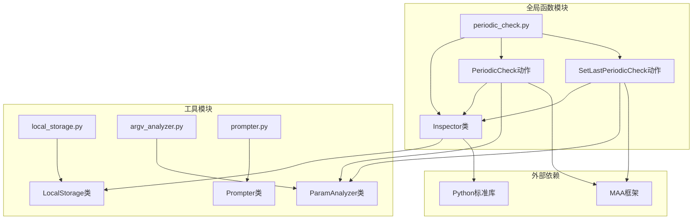

**图表来源**
- [periodic_check.py](file://agent/customs/global_func/periodic_check.py#L1-L286)
- [local_storage.py](file://agent/customs/utils/local_storage.py#L1-L111)
- [argv_analyzer.py](file://agent/customs/maahelper/argv_analyzer.py#L1-L159)

**章节来源**
- [periodic_check.py](file://agent/customs/global_func/periodic_check.py#L1-L286)

## 核心组件

### Inspector类 - 周期性任务检查器

Inspector类是整个系统的核心，提供了所有周期性检查功能。该类采用静态方法设计，所有方法都通过类名直接调用，无需实例化。

#### 主要职责
- **日期调整**：处理游戏刷新时间的特殊逻辑
- **存储管理**：生成存储键名和管理本地存储
- **周期判断**：实现同日、同周、同月的精确判断
- **任务记录**：持久化任务完成时间

#### 设计特点
- 所有方法均为静态方法，便于直接调用
- 严格遵循单一职责原则
- 提供完整的错误处理机制
- 支持灵活的参数解析

**章节来源**
- [periodic_check.py](file://agent/customs/global_func/periodic_check.py#L29-L178)

### LocalStorage类 - 本地存储管理

LocalStorage类提供了基于JSON文件的键值存储功能，是整个周期性检查系统的数据持久化基础。

#### 核心功能
- **文件管理**：自动创建和维护存储文件
- **数据读写**：提供安全的读写操作
- **错误恢复**：自动处理文件损坏和格式错误
- **路径管理**：统一管理存储文件的路径

#### 数据存储策略
- 存储文件位于项目根目录下的config/mddl/local_storage.json
- 使用JSON格式存储所有数据
- 支持任意可序列化的Python对象
- 自动处理文件权限和编码问题

**章节来源**
- [local_storage.py](file://agent/customs/utils/local_storage.py#L10-L111)

### ParamAnalyzer类 - 参数解析器

ParamAnalyzer类负责解析来自MAA框架的自定义参数，支持多种参数格式的自动识别。

#### 支持的参数格式
- **JSON格式**：支持对象和数组格式
- **查询字符串**：支持key=value&key2=value2格式
- **混合格式**：自动检测和解析不同格式

#### 解析特性
- 自动去除外层引号
- 支持布尔值解析
- 保留空白值以支持布尔参数
- 错误处理和回退机制

**章节来源**
- [argv_analyzer.py](file://agent/customs/maahelper/argv_analyzer.py#L17-L159)

## 架构概览

系统采用分层架构设计，确保了良好的模块分离和可维护性：

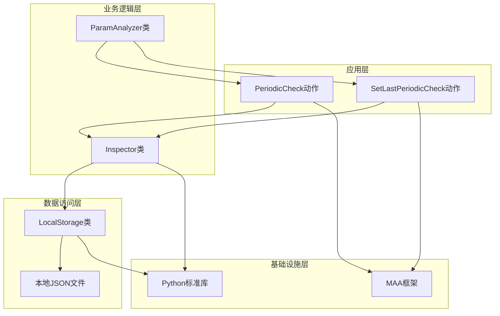

**图表来源**
- [periodic_check.py](file://agent/customs/global_func/periodic_check.py#L183-L286)
- [local_storage.py](file://agent/customs/utils/local_storage.py#L10-L111)

### 组件交互流程

系统的核心交互流程如下：

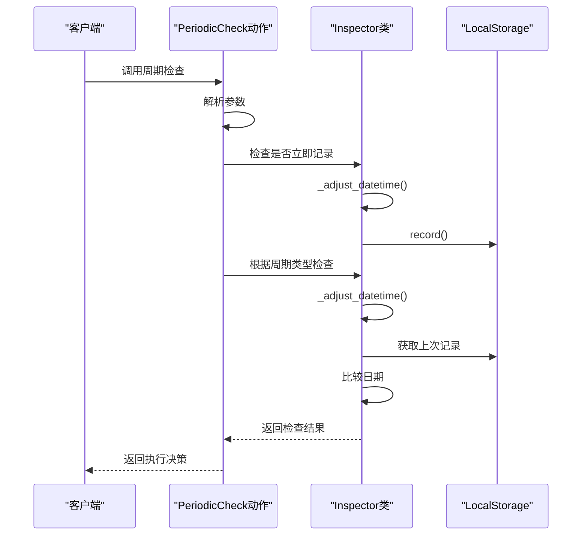

**图表来源**
- [periodic_check.py](file://agent/customs/global_func/periodic_check.py#L203-L252)

## 详细组件分析

### _adjust_datetime方法 - 日期调整机制

#### 实现原理

_adjust_datetime方法实现了游戏刷新时间的特殊处理逻辑：

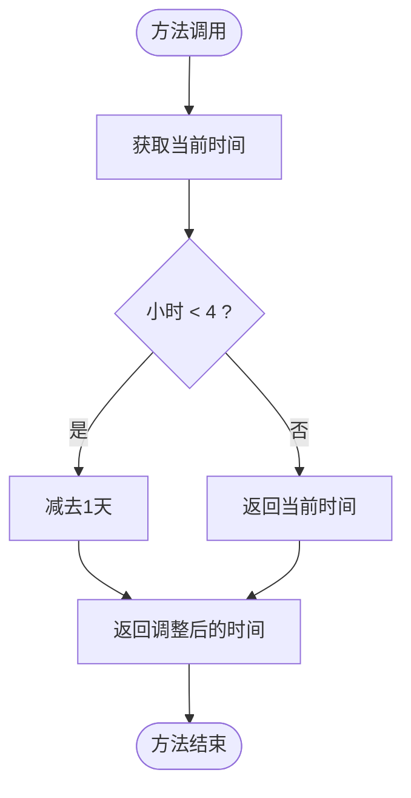

**图表来源**
- [periodic_check.py](file://agent/customs/global_func/periodic_check.py#L37-L53)

#### 核心逻辑

该方法基于游戏"凌晨4点刷新"的特性，实现了以下逻辑：
- **时间边界处理**：凌晨0点到3点之间的时间被视为前一天
- **一致性保证**：确保所有周期判断都基于相同的日期基准
- **实时性**：每次调用都获取最新的当前时间

#### 应用场景

- **日常任务检查**：确保每日任务在刷新后正确重置
- **周任务判断**：支持跨日的周计算逻辑
- **月任务管理**：处理月末和月初的边界情况

**章节来源**
- [periodic_check.py](file://agent/customs/global_func/periodic_check.py#L37-L53)

### _get_storage_key方法 - 存储键名生成

#### 生成规则

_get_storage_key方法实现了标准化的存储键名生成：

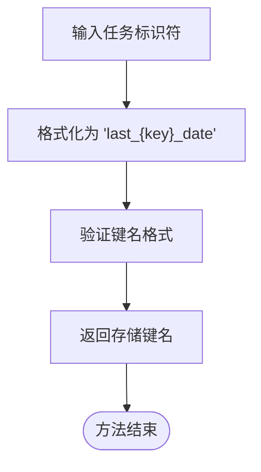

**图表来源**
- [periodic_check.py](file://agent/customs/global_func/periodic_check.py#L56-L65)

#### 设计考虑

- **命名规范**：统一的命名约定便于管理和维护
- **唯一性保证**：每个任务都有唯一的存储键
- **可读性**：键名清晰表达其用途和数据类型
- **扩展性**：支持任意长度的任务标识符

#### 存储策略

生成的键名遵循以下模式：
- **格式**：`last_{任务标识符}_date`
- **用途**：存储对应任务的最后完成日期
- **数据类型**：ISO格式的日期字符串（YYYY-MM-DD）

**章节来源**
- [periodic_check.py](file://agent/customs/global_func/periodic_check.py#L56-L65)

### same_day方法 - 同日判断机制

#### 实现逻辑

same_day方法实现了精确的同日判断：

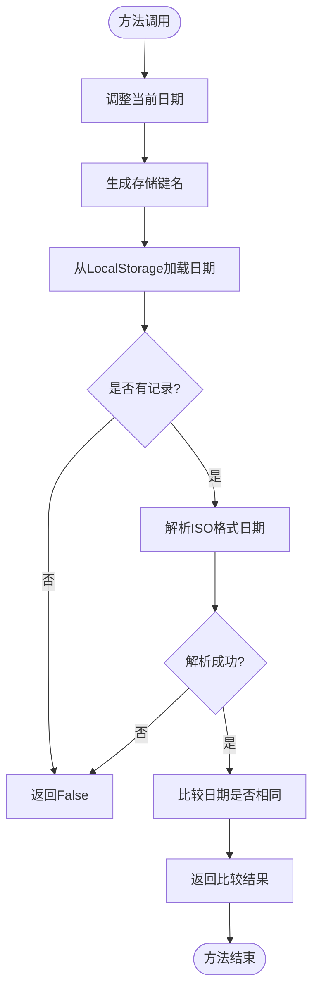

**图表来源**
- [periodic_check.py](file://agent/customs/global_func/periodic_check.py#L117-L144)

#### 核心算法

1. **日期调整**：使用_adjust_datetime确保使用正确的日期基准
2. **存储访问**：通过_get_storage_key生成键名并读取存储
3. **格式验证**：使用ISO格式解析确保数据完整性
4. **精确比较**：直接比较date对象确保准确性

#### 错误处理

- **无记录处理**：返回False表示任务未完成
- **格式错误**：捕获解析异常并返回False
- **类型错误**：处理None值和不兼容类型

**章节来源**
- [periodic_check.py](file://agent/customs/global_func/periodic_check.py#L117-L144)

### same_week方法 - 同周判断机制

#### 实现原理

same_week方法基于ISO 8601标准实现了精确的周级判断：

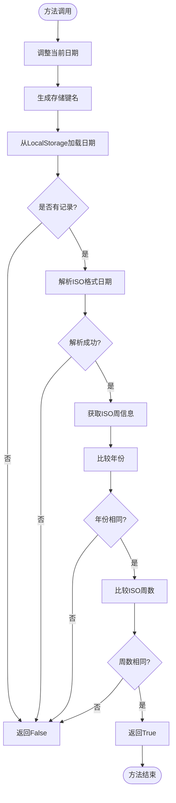

**图表来源**
- [periodic_check.py](file://agent/customs/global_func/periodic_check.py#L84-L114)

#### ISO标准支持

- **周定义**：ISO 8601标准的周一作为一周开始
- **年份计算**：跨年的周数可能属于前一年或后一年
- **边界处理**：正确处理年末和年初的周数边界

#### 应用场景

- **周任务检查**：适用于需要按周重置的游戏任务
- **周奖励领取**：支持跨日的周奖励判断
- **统计分析**：为数据分析提供准确的周级数据

**章节来源**
- [periodic_check.py](file://agent/customs/global_func/periodic_check.py#L84-L114)

### same_month方法 - 同月判断机制

#### 实现逻辑

same_month方法实现了精确的月级判断：

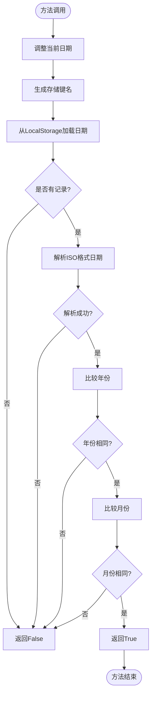

**图表来源**
- [periodic_check.py](file://agent/customs/global_func/periodic_check.py#L147-L177)

#### 核心特性

- **年份检查**：确保跨年情况下的正确判断
- **月份比较**：直接比较month属性确保准确性
- **边界处理**：正确处理12月到1月的过渡

#### 使用场景

- **月度任务**：适用于需要按月重置的游戏任务
- **月奖励系统**：支持复杂的月度奖励机制
- **长期规划**：为长期任务管理提供支持

**章节来源**
- [periodic_check.py](file://agent/customs/global_func/periodic_check.py#L147-L177)

### record方法 - 任务记录持久化

#### 工作流程

record方法实现了完整的任务记录流程：

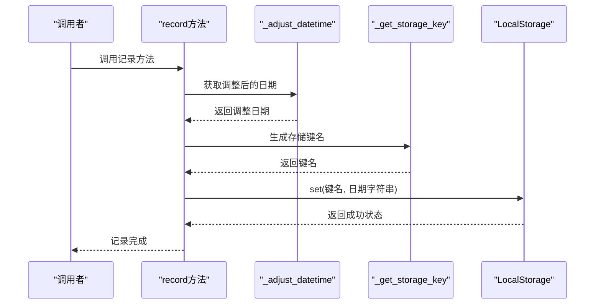

**图表来源**
- [periodic_check.py](file://agent/customs/global_func/periodic_check.py#L68-L81)

#### 数据持久化

- **日期格式**：使用str(date)确保可读性和兼容性
- **存储策略**：直接存储日期字符串，便于后续解析
- **原子操作**：通过LocalStorage确保数据一致性

#### 协同工作机制

record方法与日期调整逻辑的协同工作：
- **时机选择**：在记录前进行日期调整确保准确性
- **数据一致性**：所有判断都基于相同的日期基准
- **生命周期管理**：支持任务的完整生命周期管理

**章节来源**
- [periodic_check.py](file://agent/customs/global_func/periodic_check.py#L68-L81)

## 依赖关系分析

系统采用松耦合的设计，各组件之间的依赖关系清晰明确：

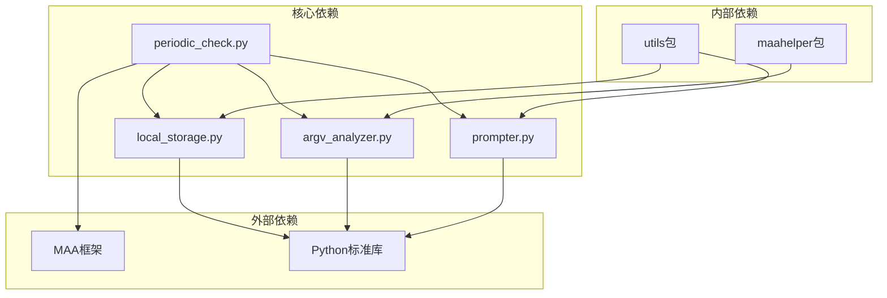

**图表来源**
- [periodic_check.py](file://agent/customs/global_func/periodic_check.py#L14-L23)

### 组件耦合度分析

#### 高内聚低耦合

- **Inspector类**：高度内聚的功能模块，职责单一明确
- **LocalStorage类**：独立的数据访问层，无业务逻辑
- **ParamAnalyzer类**：专门的参数处理工具，功能专一
- **Prompter类**：统一的错误处理和日志输出

#### 依赖方向

- **单向依赖**：所有依赖都是单向的，避免循环依赖
- **抽象依赖**：依赖于接口而非具体实现
- **稳定接口**：对外提供稳定的接口，内部实现可变

**章节来源**
- [periodic_check.py](file://agent/customs/global_func/periodic_check.py#L14-L23)

## 性能考虑

### 时间复杂度分析

- **_adjust_datetime**：O(1) - 基本的条件判断和时间运算
- **_get_storage_key**：O(1) - 字符串格式化操作
- **same_day**：O(1) - 基本的字符串解析和比较
- **same_week**：O(1) - ISO格式解析和元组比较
- **same_month**：O(1) - 年份和月份的简单比较
- **record**：O(1) - JSON文件的写入操作

### 空间复杂度分析

- **内存使用**：所有方法都是O(1)空间复杂度
- **存储开销**：LocalStorage使用JSON文件存储，开销最小
- **缓存策略**：无内存缓存，确保数据一致性

### 性能优化建议

1. **批量操作**：对于大量任务检查，考虑批量处理减少I/O操作
2. **缓存机制**：在高频调用场景下考虑添加内存缓存
3. **异步处理**：对于耗时的I/O操作，考虑异步化处理
4. **索引优化**：对于大量数据，考虑添加索引机制

## 故障排除指南

### 常见问题及解决方案

#### 1. 日期判断不准确

**问题表现**：同日/同周/同月判断结果与预期不符

**可能原因**：
- 本地存储数据格式错误
- 系统时间设置不正确
- 游戏刷新时间理解偏差

**解决步骤**：
1. 检查本地存储文件格式
2. 验证系统时间和时区设置
3. 确认游戏刷新时间逻辑

#### 2. 存储文件损坏

**问题表现**：LocalStorage读取失败或数据丢失

**解决步骤**：
1. 检查存储文件是否存在
2. 验证JSON格式正确性
3. 重新初始化存储文件

#### 3. 参数解析错误

**问题表现**：PeriodicCheck动作参数解析失败

**解决步骤**：
1. 检查参数格式是否正确
2. 验证参数名称拼写
3. 确认参数值类型匹配

**章节来源**
- [prompter.py](file://agent/customs/utils/prompter.py#L16-L54)

### 错误处理机制

系统提供了完善的错误处理机制：

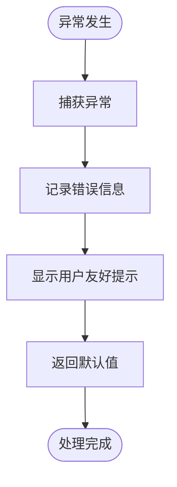

**图表来源**
- [periodic_check.py](file://agent/customs/global_func/periodic_check.py#L251-L252)

## 结论

Inspector类提供的周期性检查功能是一个设计精良、实现严谨的系统。它成功解决了游戏刷新时间这一特殊需求，提供了准确可靠的周期判断能力。

### 主要优势

1. **精确性**：基于游戏实际刷新逻辑，确保判断准确性
2. **可靠性**：完善的错误处理和数据验证机制
3. **可维护性**：清晰的代码结构和文档注释
4. **扩展性**：模块化设计支持功能扩展

### 应用价值

- **提升用户体验**：准确的任务状态判断
- **降低开发成本**：统一的API接口和错误处理
- **增强系统稳定性**：健壮的数据持久化机制
- **支持复杂业务**：灵活的周期判断模式

该系统为类似的游戏自动化项目提供了优秀的参考模板，展示了如何在实际应用中处理复杂的日期和时间逻辑。