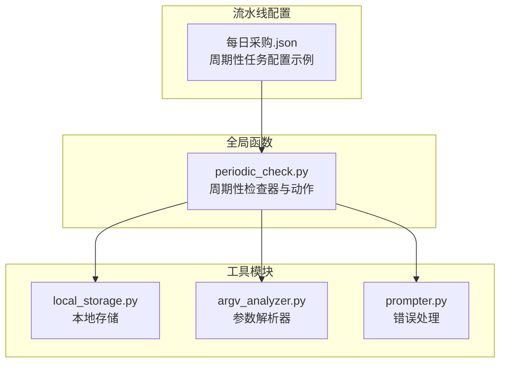
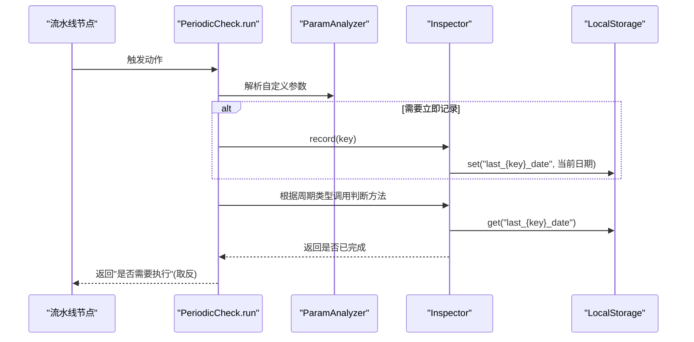
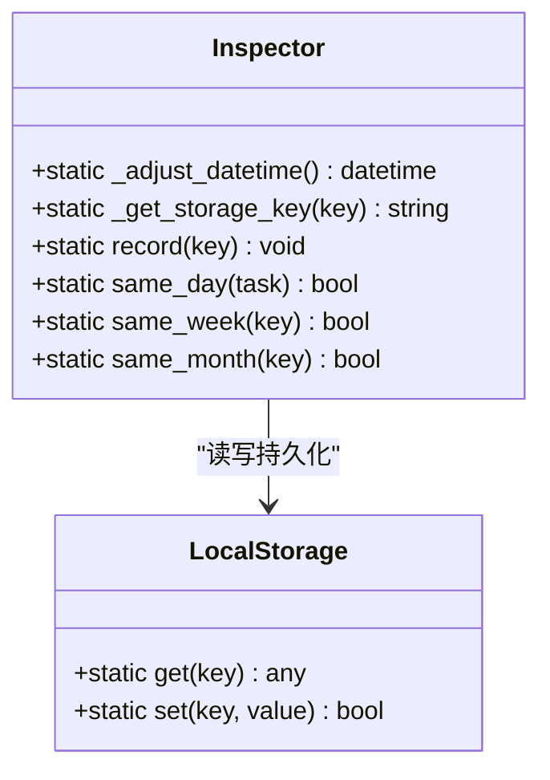
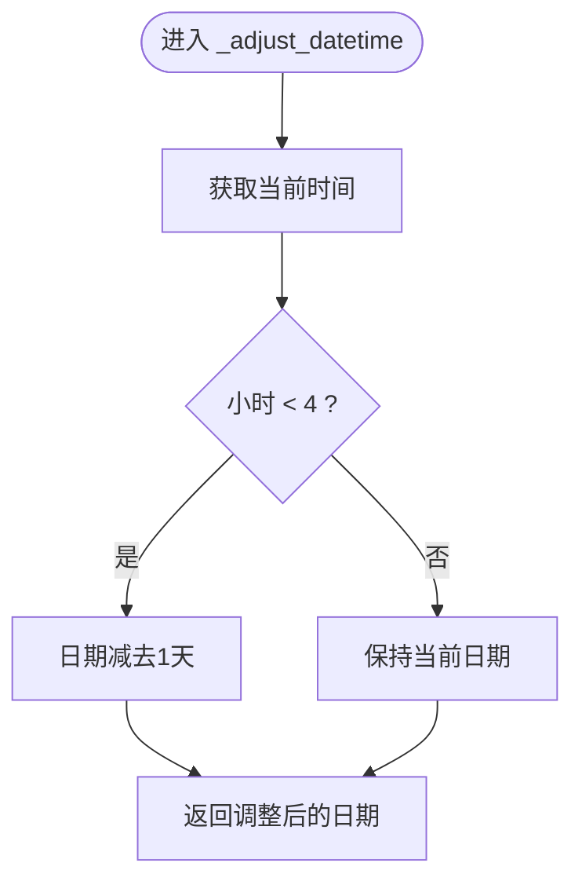
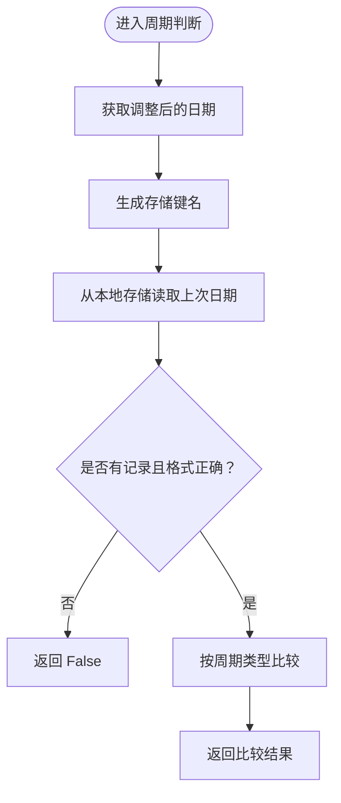
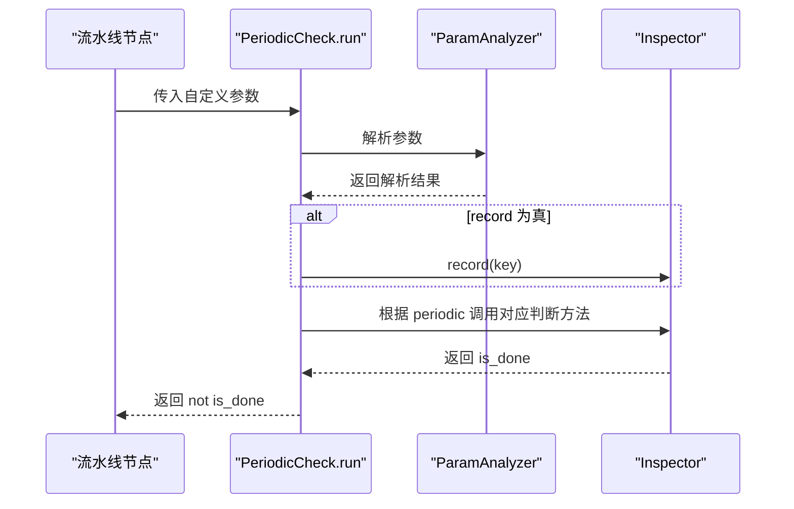
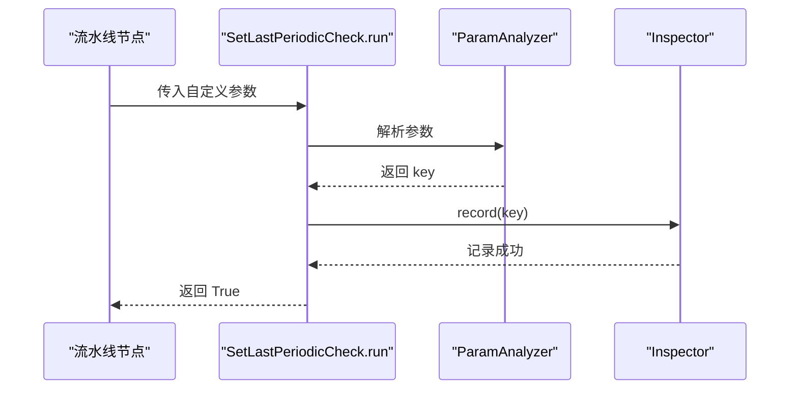
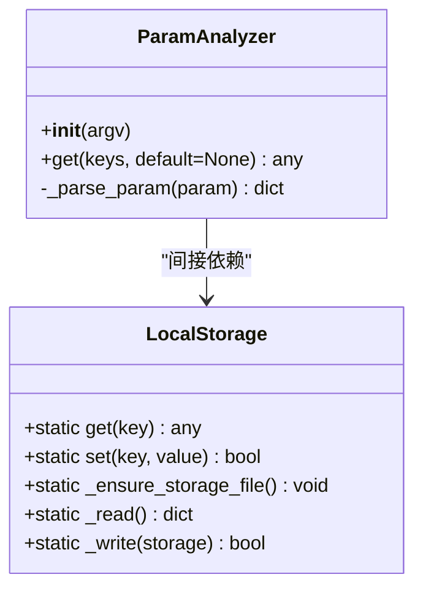
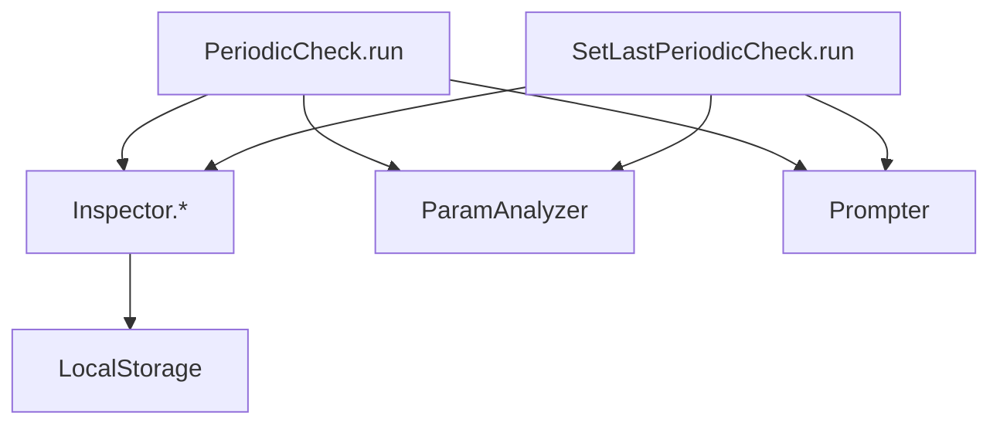

# 周期性检查组件

<cite>
**本文引用的文件**
- [periodic_check.py](file://agent/customs/global_func/periodic_check.py)
- [local_storage.py](file://agent/customs/utils/local_storage.py)
- [argv_analyzer.py](file://agent/customs/maahelper/argv_analyzer.py)
- [prompter.py](file://agent/customs/utils/prompter.py)
- [每日采购.json](file://MFAAvalonia/Resource/base/pipeline/日常任务/每日采购.json)
</cite>

## 目录
1. [简介](#简介)
2. [项目结构](#项目结构)
3. [核心组件](#核心组件)
4. [架构总览](#架构总览)
5. [详细组件分析](#详细组件分析)
6. [依赖关系分析](#依赖关系分析)
7. [性能考量](#性能考量)
8. [故障排查指南](#故障排查指南)
9. [结论](#结论)
10. [附录](#附录)

## 简介
本文件系统性阐述周期性任务管理功能，重点解析以下内容：
- Inspector 类的核心方法：_adjust_datetime 如何根据凌晨4点刷新规则调整日期；same_day/same_week/same_month 如何基于调整后日期进行周期判断；record 如何利用 LocalStorage 持久化记录完成时间。
- PeriodicCheck 自定义动作的运行逻辑：key、periodic（d/w/m）和 record 参数的解析，以及根据周期类型调用相应判断方法并返回“是否需要执行”的布尔值。
- SetLastPeriodicCheck 动作如何显式记录任务完成时间。
- 提供在日常任务中防止重复执行的完整配置案例，如使用 'k=daily_task;p=day' 进行每日任务检查。

## 项目结构
周期性检查功能位于全局函数模块中，配合参数解析器、本地存储和提示器共同工作。关键文件如下：
- agent/customs/global_func/periodic_check.py：周期性检查器与两个自定义动作的实现
- agent/customs/utils/local_storage.py：本地持久化存储
- agent/customs/maahelper/argv_analyzer.py：参数解析器
- agent/customs/utils/prompter.py：错误处理与日志输出
- MFAAvalonia/Resource/base/pipeline/日常任务/每日采购.json：周期性任务在流水线中的实际使用示例

图表来源
- [periodic_check.py](file://agent/customs/global_func/periodic_check.py#L1-L286)
- [local_storage.py](file://agent/customs/utils/local_storage.py#L1-L111)
- [argv_analyzer.py](file://agent/customs/maahelper/argv_analyzer.py#L1-L84)
- [prompter.py](file://agent/customs/utils/prompter.py#L1-L54)
- [每日采购.json](file://MFAAvalonia/Resource/base/pipeline/日常任务/每日采购.json#L70-L134)

章节来源
- [periodic_check.py](file://agent/customs/global_func/periodic_check.py#L1-L286)
- [local_storage.py](file://agent/customs/utils/local_storage.py#L1-L111)
- [argv_analyzer.py](file://agent/customs/maahelper/argv_analyzer.py#L1-L84)
- [prompter.py](file://agent/customs/utils/prompter.py#L1-L54)
- [每日采购.json](file://MFAAvalonia/Resource/base/pipeline/日常任务/每日采购.json#L70-L134)

## 核心组件
- Inspector：提供日期调整、周期判断与记录持久化的静态方法集合
- PeriodicCheck：自定义动作，用于在流水线中判断任务是否需要执行
- SetLastPeriodicCheck：自定义动作，用于显式记录任务完成时间
- LocalStorage：基于 JSON 的本地键值存储，持久化周期记录
- ParamAnalyzer：解析自定义参数字符串，支持 JSON 与查询字符串格式
- Prompter：统一的日志与错误输出工具

章节来源
- [periodic_check.py](file://agent/customs/global_func/periodic_check.py#L29-L178)
- [periodic_check.py](file://agent/customs/global_func/periodic_check.py#L183-L285)
- [local_storage.py](file://agent/customs/utils/local_storage.py#L10-L111)
- [argv_analyzer.py](file://agent/customs/maahelper/argv_analyzer.py#L17-L84)
- [prompter.py](file://agent/customs/utils/prompter.py#L16-L54)

## 架构总览
周期性检查的整体流程如下：
- 流水线节点触发 PeriodicCheck 动作，解析参数并决定是否立即记录
- 根据周期类型调用相应的判断方法（同日/同周/同月）
- 判断结果取反作为“是否需要执行”的布尔值返回
- 若任务成功执行，调用 SetLastPeriodicCheck 记录完成时间

图表来源
- [periodic_check.py](file://agent/customs/global_func/periodic_check.py#L203-L252)
- [argv_analyzer.py](file://agent/customs/maahelper/argv_analyzer.py#L30-L46)
- [local_storage.py](file://agent/customs/utils/local_storage.py#L80-L111)

## 详细组件分析

### Inspector 类详解
Inspector 提供三个核心能力：
- 日期调整：_adjust_datetime 考虑凌晨4点刷新，将凌晨4点前的时间视为“前一天”
- 周期判断：same_day/same_week/same_month 基于调整后的日期进行判断
- 记录持久化：record 将当前日期写入本地存储，键名为 last_{key}_date

图表来源
- [periodic_check.py](file://agent/customs/global_func/periodic_check.py#L29-L178)
- [local_storage.py](file://agent/customs/utils/local_storage.py#L80-L111)

章节来源
- [periodic_check.py](file://agent/customs/global_func/periodic_check.py#L36-L53)
- [periodic_check.py](file://agent/customs/global_func/periodic_check.py#L68-L82)
- [periodic_check.py](file://agent/customs/global_func/periodic_check.py#L84-L114)
- [periodic_check.py](file://agent/customs/global_func/periodic_check.py#L117-L144)
- [periodic_check.py](file://agent/customs/global_func/periodic_check.py#L147-L177)

#### 日期调整算法
- 若当前小时小于4点，则将日期回退一天
- 否则保持当前日期不变
- 该策略确保周期判断与游戏刷新时间一致

图表来源
- [periodic_check.py](file://agent/customs/global_func/periodic_check.py#L36-L53)

章节来源
- [periodic_check.py](file://agent/customs/global_func/periodic_check.py#L36-L53)

#### 周期判断逻辑
- 同日判断：比较调整后的日期与上次记录日期是否为同一天
- 同周判断：比较调整后的日期与上次记录日期的年份与ISO周数
- 同月判断：比较调整后的日期与上次记录日期的年份与月份

图表来源
- [periodic_check.py](file://agent/customs/global_func/periodic_check.py#L84-L114)
- [periodic_check.py](file://agent/customs/global_func/periodic_check.py#L117-L144)
- [periodic_check.py](file://agent/customs/global_func/periodic_check.py#L147-L177)

章节来源
- [periodic_check.py](file://agent/customs/global_func/periodic_check.py#L84-L114)
- [periodic_check.py](file://agent/customs/global_func/periodic_check.py#L117-L144)
- [periodic_check.py](file://agent/customs/global_func/periodic_check.py#L147-L177)

### PeriodicCheck 动作详解
- 参数解析：通过 ParamAnalyzer 解析自定义参数，支持 key/k、periodic/p、record/r
- 周期类型：day/d、week/w、month/m，默认 day
- 记录策略：record 参数为 true/false 控制是否立即记录
- 返回值：取“已完成”判断的反值，即 True 表示需要执行，False 表示无需执行

图表来源
- [periodic_check.py](file://agent/customs/global_func/periodic_check.py#L203-L252)
- [argv_analyzer.py](file://agent/customs/maahelper/argv_analyzer.py#L30-L46)

章节来源
- [periodic_check.py](file://agent/customs/global_func/periodic_check.py#L183-L252)

### SetLastPeriodicCheck 动作详解
- 作用：显式记录任务完成时间，通常在任务成功完成后调用
- 参数：仅需 key/k
- 实现：调用 Inspector.record(key) 完成记录

图表来源
- [periodic_check.py](file://agent/customs/global_func/periodic_check.py#L255-L285)
- [argv_analyzer.py](file://agent/customs/maahelper/argv_analyzer.py#L30-L46)

章节来源
- [periodic_check.py](file://agent/customs/global_func/periodic_check.py#L255-L285)

### 参数解析器与本地存储
- ParamAnalyzer：支持 JSON 与查询字符串两种格式，自动处理布尔值与数组
- LocalStorage：提供 get/set 操作，数据持久化至本地 JSON 文件

图表来源
- [argv_analyzer.py](file://agent/customs/maahelper/argv_analyzer.py#L17-L84)
- [local_storage.py](file://agent/customs/utils/local_storage.py#L10-L111)

章节来源
- [argv_analyzer.py](file://agent/customs/maahelper/argv_analyzer.py#L17-L84)
- [local_storage.py](file://agent/customs/utils/local_storage.py#L10-L111)

## 依赖关系分析
- PeriodicCheck 与 SetLastPeriodicCheck 依赖 Inspector 的静态方法
- Inspector 依赖 LocalStorage 进行持久化
- PeriodicCheck 与 SetLastPeriodicCheck 依赖 ParamAnalyzer 解析参数
- 错误处理由 Prompter 统一输出

图表来源
- [periodic_check.py](file://agent/customs/global_func/periodic_check.py#L203-L285)
- [local_storage.py](file://agent/customs/utils/local_storage.py#L80-L111)
- [argv_analyzer.py](file://agent/customs/maahelper/argv_analyzer.py#L30-L46)
- [prompter.py](file://agent/customs/utils/prompter.py#L34-L54)

章节来源
- [periodic_check.py](file://agent/customs/global_func/periodic_check.py#L203-L285)
- [local_storage.py](file://agent/customs/utils/local_storage.py#L80-L111)
- [argv_analyzer.py](file://agent/customs/maahelper/argv_analyzer.py#L30-L46)
- [prompter.py](file://agent/customs/utils/prompter.py#L34-L54)

## 性能考量
- 日期调整与存储访问均为 O(1) 操作，整体开销极低
- 同周判断使用 ISO 周数，避免跨年边界问题
- 本地存储采用 JSON 文件，读写均在内存中完成，I/O 次数极少
- 建议：同一流水线中尽量复用相同的 key，减少存储键数量

## 故障排查指南
- 参数解析失败：检查自定义参数格式是否为 JSON 或查询字符串
- 日期格式错误：确认本地存储中的日期字符串为 ISO 格式
- 记录失败：检查配置目录是否存在，JSON 文件权限是否正确
- 动作返回异常：查看 Prompter 输出的错误详情

章节来源
- [prompter.py](file://agent/customs/utils/prompter.py#L34-L54)
- [local_storage.py](file://agent/customs/utils/local_storage.py#L24-L58)

## 结论
周期性检查组件通过 Inspector 的日期调整与周期判断，结合 LocalStorage 的持久化能力，实现了可靠的“防止重复执行”机制。PeriodicCheck 与 SetLastPeriodicCheck 两个动作分别负责“判断是否需要执行”和“显式记录完成时间”，配合 ParamAnalyzer 的灵活参数解析，能够满足各类日常任务的周期性需求。

## 附录

### 完整配置案例：每日任务检查
- 动作名称：periodic_check
- 参数示例：k=daily_task&p=day&r=true
- 说明：
  - k/daily_task：任务标识符
  - p/day：按天周期
  - r/true：立即记录当前时间为最近完成时间
- 返回值：True 表示需要执行，False 表示无需执行

章节来源
- [periodic_check.py](file://agent/customs/global_func/periodic_check.py#L190-L196)
- [periodic_check.py](file://agent/customs/global_func/periodic_check.py#L217-L250)

### 流水线配置示例（来自每日采购.json）
- 周期检查节点：periodic_check，参数为 k=每日礼包&p=d
- 成功执行后记录节点：record_period，参数为 k=每日礼包

章节来源
- [每日采购.json](file://MFAAvalonia/Resource/base/pipeline/日常任务/每日采购.json#L75-L100)
- [每日采购.json](file://MFAAvalonia/Resource/base/pipeline/日常任务/每日采购.json#L323-L327)