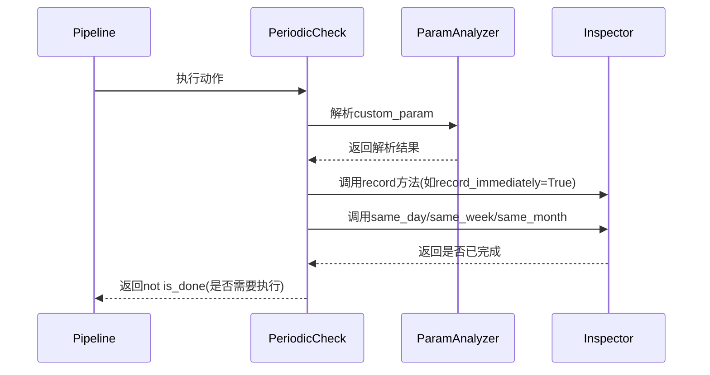
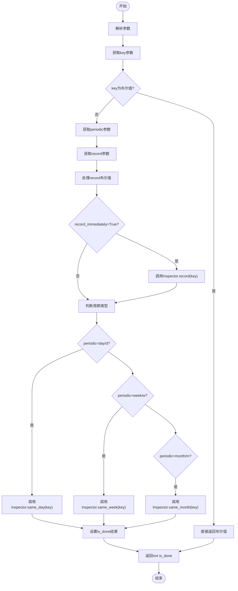
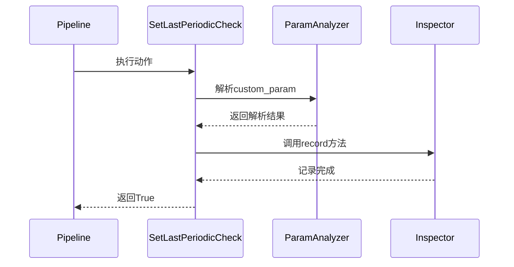
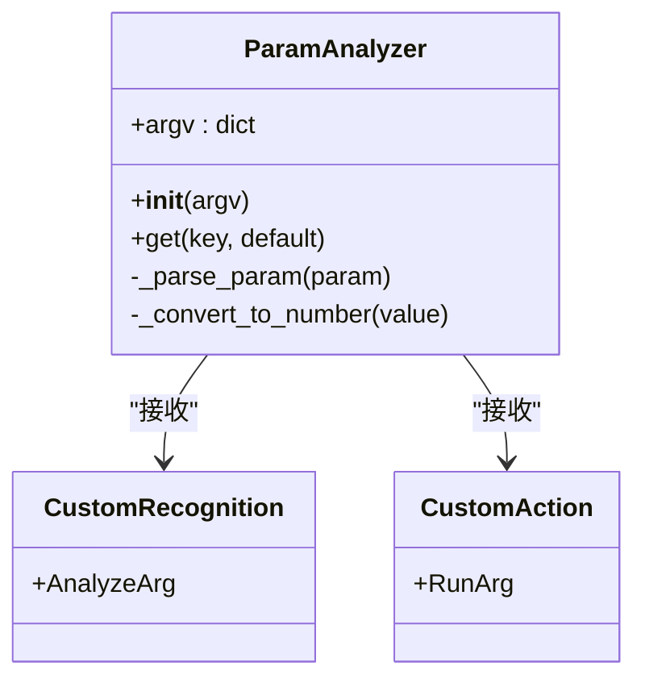
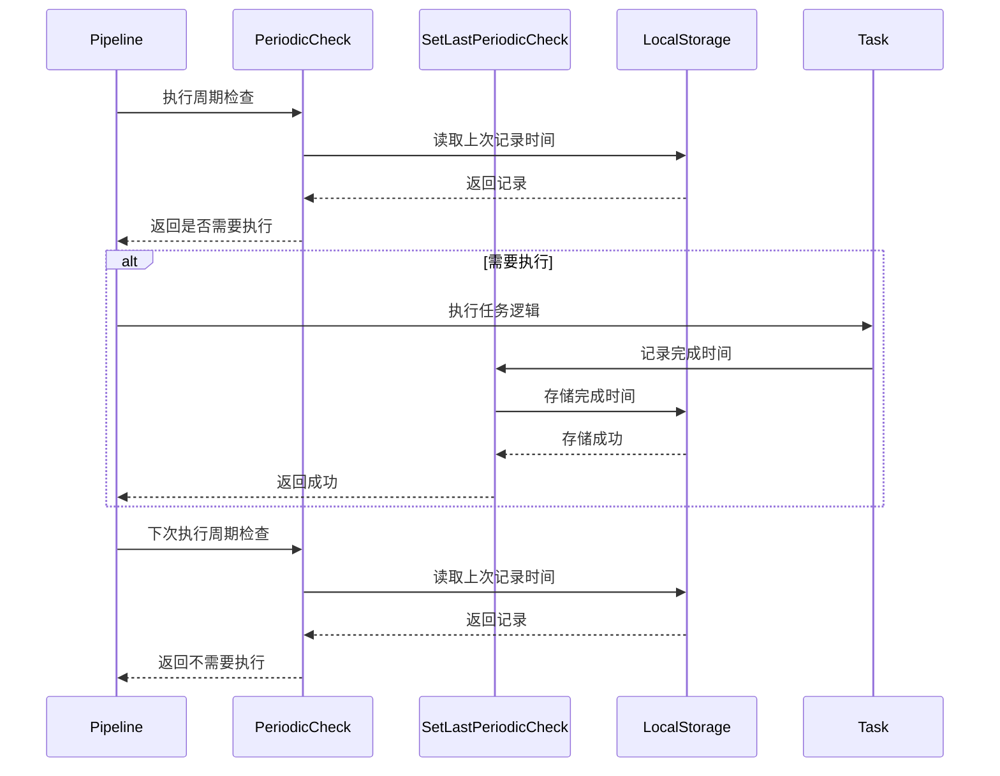

# 周期性检查自定义动作

<cite>
**本文档引用文件**  
- [periodic_check.py](file://agent/customs/global_func/periodic_check.py)
- [argv_analyzer.py](file://agent/customs/maahelper/argv_analyzer.py)
- [local_storage.py](file://agent/customs/utils/local_storage.py)
- [圣团巡礼.json](file://assets/resource/base/pipeline/日常任务/圣团巡礼.json)
- [每日采购.json](file://assets/resource/base/pipeline/日常任务/每日采购.json)
</cite>

## 目录
1. [简介](#简介)
2. [核心组件](#核心组件)
3. [PeriodicCheck动作实现](#periodiccheck动作实现)
4. [SetLastPeriodicCheck动作实现](#setlastperiodiccheck动作实现)
5. [参数解析机制](#参数解析机制)
6. [实际使用示例](#实际使用示例)
7. [协同工作模式](#协同工作模式)
8. [数据存储机制](#数据存储机制)

## 简介
周期性检查自定义动作是MaaDuDuL自动化框架中的关键组件，用于防止重复执行周期性任务。该系统由两个核心自定义动作组成：`PeriodicCheck`用于判断任务是否需要执行，`SetLastPeriodicCheck`用于记录任务完成时间。这两个动作协同工作，确保每日、每周或每月任务仅执行一次，有效避免了重复操作。

## 核心组件

**核心组件**
- [periodic_check.py](file://agent/customs/global_func/periodic_check.py#L1-L286)
- [argv_analyzer.py](file://agent/customs/maahelper/argv_analyzer.py#L1-L159)
- [local_storage.py](file://agent/customs/utils/local_storage.py#L1-L111)

## PeriodicCheck动作实现

`PeriodicCheck`动作是周期性任务检查的核心，通过解析参数、判断周期状态来决定任务是否需要执行。



**动作流程**
1. 通过`ParamAnalyzer`解析传入的`custom_param`参数
2. 获取`key`、`periodic`和`record`参数值
3. 根据`record_immediately`参数决定是否立即记录完成时间
4. 根据`periodic`参数调用相应的周期判断方法
5. 返回任务是否需要执行的布尔值

**参数处理逻辑**
- `key/k`: 任务标识符，必需参数
- `periodic/p`: 周期类型，可选参数，默认为'day'
- `record/r`: 是否立即记录，可选参数，默认为False



**周期判断方法**
- `same_day`: 比较当前日期与上次记录日期是否为同一天
- `same_week`: 比较当前周数与上次记录周数是否相同
- `same_month`: 比较当前年月与上次记录年月是否相同

所有日期比较都基于`_adjust_datetime`方法调整后的日期，该方法考虑了游戏凌晨4点刷新的特性，如果当前时间在凌晨4点之前，则认为仍处于前一天。

**Section sources**
- [periodic_check.py](file://agent/customs/global_func/periodic_check.py#L183-L253)

## SetLastPeriodicCheck动作实现

`SetLastPeriodicCheck`动作作为独立动作，用于显式记录任务的完成时间。



该动作仅需`key`参数，调用`Inspector.record(key)`方法将当前日期（经过刷新时间调整）存储到本地，用于后续的周期判断。

**Section sources**
- [periodic_check.py](file://agent/customs/global_func/periodic_check.py#L255-L285)

## 参数解析机制

参数解析由`ParamAnalyzer`类完成，支持多种参数格式的自动解析。



**解析流程**
1. 接收`CustomRecognition.AnalyzeArg`或`CustomAction.RunArg`对象
2. 提取`custom_recognition_param`或`custom_action_param`字符串
3. 依次尝试JSON格式和查询字符串格式解析
4. 返回解析后的参数字典

**支持的参数格式**
- JSON格式：`{"key": "value"}`
- 查询字符串格式：`key=value&key2=value2`

**Section sources**
- [argv_analyzer.py](file://agent/customs/maahelper/argv_analyzer.py#L17-L159)

## 实际使用示例

在Pipeline配置中，`PeriodicCheck`和`SetLastPeriodicCheck`动作通过`custom_action`和`custom_action_param`字段进行配置。

### 圣团巡礼任务示例

```json
{
    "圣团巡礼_冒险周期检查": {
        "action": {
            "param": {
                "custom_action": "periodic_check",
                "custom_action_param": "k=冒险"
            },
            "type": "Custom"
        },
        "next": ["圣团巡礼_进入冒险协会"],
        "on_error": ["圣团巡礼_冒险周期提醒"]
    },
    "圣团巡礼_冒险周期记录": {
        "action": {
            "param": {
                "custom_action": "record_period",
                "custom_action_param": "k=冒险"
            },
            "type": "Custom"
        },
        "next": ["圣团巡礼_冒险结束"]
    }
}
```

### 每日采购任务示例

```json
{
    "每日采购_周期组合检查-每日礼包": {
        "action": {
            "param": {
                "custom_action": "periodic_check",
                "custom_action_param": "k=每日礼包&p=d"
            },
            "type": "Custom"
        },
        "next": ["每日采购_进入尊享商店"],
        "on_error": ["每日采购_周期组合检查-每周礼包"]
    },
    "每日采购_每周礼包周期记录": {
        "action": {
            "param": {
                "custom_action": "record_period",
                "custom_action_param": "k=每周礼包"
            },
            "type": "Custom"
        },
        "next": ["每日采购_每周免费礼包结束"]
    }
}
```

**常见参数组合**
- `k=daily_task;p=day;r=true`: 每日任务，立即记录
- `k=weekly_task;p=week;r=false`: 每周任务，不立即记录
- `k=monthly_task;p=month`: 每月任务，使用默认记录行为

**Section sources**
- [圣团巡礼.json](file://assets/resource/base/pipeline/日常任务/圣团巡礼.json#L230-L270)
- [每日采购.json](file://assets/resource/base/pipeline/日常任务/每日采购.json#L70-L269)

## 协同工作模式

`PeriodicCheck`和`SetLastPeriodicCheck`两个动作在防止任务重复执行场景下协同工作，形成完整的周期性任务管理机制。



**工作流程**
1. 在任务开始前，使用`PeriodicCheck`动作检查任务是否需要执行
2. 如果任务需要执行，则执行任务逻辑
3. 任务成功完成后，使用`SetLastPeriodicCheck`动作记录完成时间
4. 下次执行时，`PeriodicCheck`会根据记录的时间判断任务是否已完成

这种模式确保了任务在指定周期内仅执行一次，有效防止了重复执行。

**Section sources**
- [periodic_check.py](file://agent/customs/global_func/periodic_check.py#L183-L285)
- [圣团巡礼.json](file://assets/resource/base/pipeline/日常任务/圣团巡礼.json#L230-L270)

## 数据存储机制

周期性任务的状态通过`LocalStorage`类持久化存储，确保重启后仍能正确判断任务状态。

```mermaid
classDiagram
class LocalStorage {
+customs_dir : str
+agent_dir : str
+project_root : str
+config_dir : str
+storage_path : str
+_ensure_storage_file()
+_read() dict
+_write(storage) bool
+get(key) any
+set(key, value) bool
}
LocalStorage --> "JSON文件" : "存储到"
"JSON文件" --> LocalStorage : "读取自"
```

**存储路径**
- 存储文件路径：`config/mddl/local_storage.json`
- 存储键名格式：`last_{key}_date`

**存储流程**
1. 确保存储目录和文件存在
2. 读取现有存储数据
3. 更新指定键的值
4. 写回文件

**Section sources**
- [local_storage.py](file://agent/customs/utils/local_storage.py#L1-L111)
- [periodic_check.py](file://agent/customs/global_func/periodic_check.py#L67-L82)