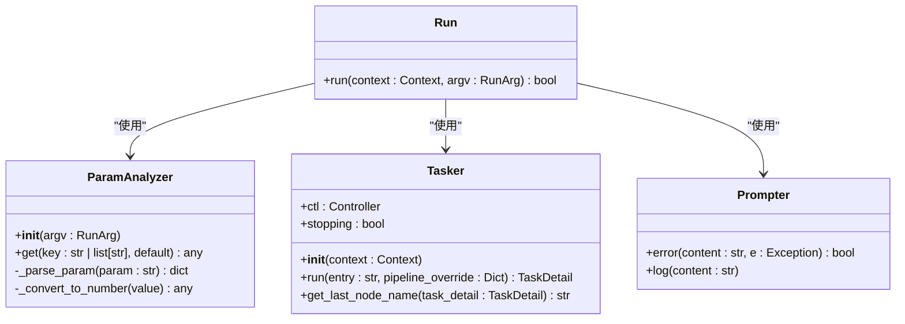
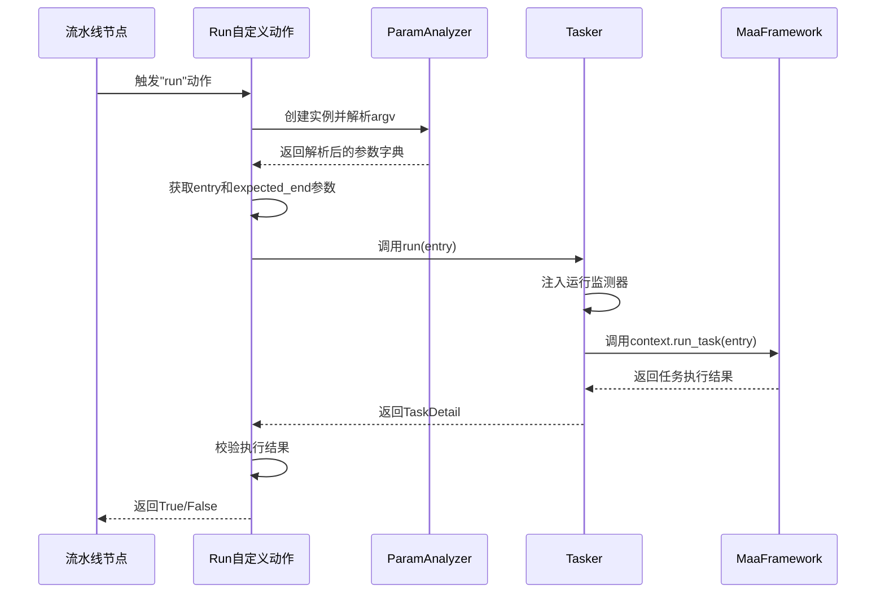
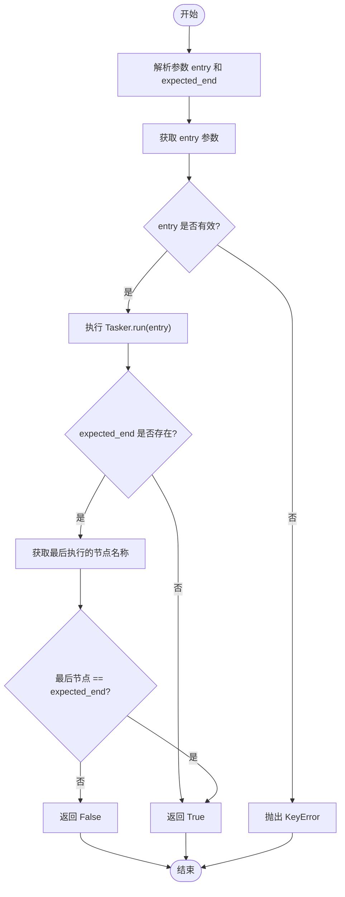
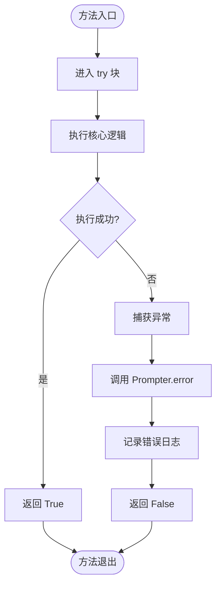
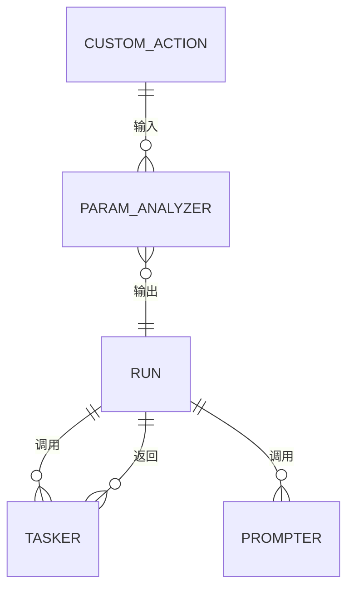

# 流水线辅助组件

<cite>
**本文档中引用的文件**  
- [pipeline_helper.py](file://agent/customs/global_func/pipeline_helper.py)
- [tasker.py](file://agent/customs/maahelper/tasker.py)
- [argv_analyzer.py](file://agent/customs/maahelper/argv_analyzer.py)
- [prompter.py](file://agent/customs/utils/prompter.py)
- [领取奖励.json](file://MFAAvalonia/Resource/base/pipeline/日常任务/领取奖励.json)
- [连续作战.json](file://MFAAvalonia/Resource/base/pipeline/开荒功能/连续作战.json)
- [说明.json](file://MFAAvalonia/Resource/base/pipeline/其他/说明.json)
- [分隔符.json](file://MFAAvalonia/Resource/base/pipeline/其他/分隔符.json)
</cite>

## 目录
1. [引言](#引言)
2. [核心实现机制](#核心实现机制)
3. [参数解析与任务执行](#参数解析与任务执行)
4. [入口与结束节点校验逻辑](#入口与结束节点校验逻辑)
5. [异常处理与错误返回策略](#异常处理与错误返回策略)
6. [MaaFramework接口集成与调用时机](#maaframework接口集成与调用时机)
7. [实际配置示例分析](#实际配置示例分析)
8. [复杂场景应用：连续作战](#复杂场景应用连续作战)
9. [模块依赖与数据传递](#模块依赖与数据传递)
10. [结论](#结论)

## 引言

`pipeline_helper.py` 中的 `Run` 自定义动作是 MaaDuDuL 自动化框架中的关键流程控制组件，用于在任务流水线中动态跳转和执行指定节点。该组件通过 `ParamAnalyzer` 解析任务参数，并调用 `Tasker` 执行具体任务，实现了灵活的流程控制能力。本文将深入解析其内部实现机制，重点分析参数解析、任务执行、节点校验、异常处理等核心逻辑，并结合实际配置示例说明其在复杂场景中的应用。

**本文档中引用的文件**  
- [pipeline_helper.py](file://agent/customs/global_func/pipeline_helper.py)

## 核心实现机制

`Run` 类作为 MaaFramework 的自定义动作，通过 `@AgentServer.custom_action("run")` 装饰器注册为名为 "run" 的自定义动作。其核心功能在 `run` 方法中实现，接收 MaaFramework 上下文（Context）和运行参数（RunArg），并返回布尔值表示执行成功与否。

该组件的主要职责是作为流程跳转的桥梁，允许在流水线配置中通过自定义动作节点调用其他任务节点，从而实现复杂的流程控制逻辑。其设计遵循了模块化和解耦原则，将参数解析、任务执行、结果校验等职责分别委托给 `ParamAnalyzer` 和 `Tasker` 等辅助类。



**图示来源**  
- [pipeline_helper.py](file://agent/customs/global_func/pipeline_helper.py#L9-L25)
- [argv_analyzer.py](file://agent/customs/maahelper/argv_analyzer.py#L17-L159)
- [tasker.py](file://agent/customs/maahelper/tasker.py#L16-L177)
- [prompter.py](file://agent/customs/utils/prompter.py#L16-L55)

**本节来源**  
- [pipeline_helper.py](file://agent/customs/global_func/pipeline_helper.py#L9-L25)

## 参数解析与任务执行

`Run` 动作的参数解析由 `ParamAnalyzer` 类完成。该类能够解析多种格式的参数字符串，包括 JSON 对象、JSON 数组和查询字符串（key=value&key2=value2），并自动将数字字符串转换为对应的 int 或 float 类型。

在 `run` 方法中，首先创建 `ParamAnalyzer` 实例来解析传入的 `argv` 参数。通过 `get` 方法支持多别名查询，例如 `entry` 参数可以通过 `["task", "t", "node", "n", "entry"]` 中的任意一个键名获取，这提高了配置的灵活性。

任务执行则通过 `Tasker` 类完成。`Tasker` 封装了 MaaFramework 的 `Context` 对象，提供了便捷的 `run` 方法来执行指定入口节点的任务。`Tasker` 在执行任务时会自动为所有节点注入运行监测器 `_run_task_monitor_inject`，确保任务执行过程可被监控。



**图示来源**  
- [pipeline_helper.py](file://agent/customs/global_func/pipeline_helper.py#L13-L17)
- [argv_analyzer.py](file://agent/customs/maahelper/argv_analyzer.py#L30-L159)
- [tasker.py](file://agent/customs/maahelper/tasker.py#L51-L113)

**本节来源**  
- [pipeline_helper.py](file://agent/customs/global_func/pipeline_helper.py#L13-L17)
- [argv_analyzer.py](file://agent/customs/maahelper/argv_analyzer.py#L17-L159)
- [tasker.py](file://agent/customs/maahelper/tasker.py#L16-L177)

## 入口与结束节点校验逻辑

`Run` 动作的 `run` 方法实现了严格的节点校验逻辑。首先，通过 `ParamAnalyzer.get` 方法获取 `entry` 参数，该参数指定了要执行的任务入口节点。如果未提供 `entry` 参数且无默认值，`get` 方法会抛出 `KeyError` 异常。

其次，通过 `get(["expected_end", "ee", "e"], "")` 获取预期的结束节点名称，支持多别名查询，并设置空字符串为默认值。如果提供了 `expected_end` 参数，则在任务执行完成后进行结果校验。

校验逻辑通过 `Tasker.get_last_node_name(task_detail)` 获取任务执行的最后一个节点名称，并与 `expected_end` 进行比较。如果两者不匹配，则返回 `False`，表示任务执行未达到预期状态。这种机制确保了流程控制的可靠性，防止因任务中断或异常导致的流程错乱。



**图示来源**  
- [pipeline_helper.py](file://agent/customs/global_func/pipeline_helper.py#L14-L22)
- [tasker.py](file://agent/customs/maahelper/tasker.py#L173-L177)

**本节来源**  
- [pipeline_helper.py](file://agent/customs/global_func/pipeline_helper.py#L14-L22)

## 异常处理与错误返回策略

`Run` 动作采用了全面的异常处理机制。整个 `run` 方法体被 `try-except` 块包裹，捕获所有可能发生的异常。当发生异常时，不会直接返回 `False`，而是通过 `Prompter.error` 方法进行错误处理。

`Prompter.error` 方法不仅会打印详细的错误信息，包括错误内容和异常堆栈，还会返回 `False` 作为最终结果。这种设计确保了错误信息能够被清晰地记录和展示，便于调试和问题排查。同时，通过统一的错误处理接口，保持了代码的整洁性和一致性。



**图示来源**  
- [pipeline_helper.py](file://agent/customs/global_func/pipeline_helper.py#L12-L24)
- [prompter.py](file://agent/customs/utils/prompter.py#L34-L55)

**本节来源**  
- [pipeline_helper.py](file://agent/customs/global_func/pipeline_helper.py#L12-L24)

## MaaFramework接口集成与调用时机

`Run` 类通过继承 `CustomAction` 并使用 `@AgentServer.custom_action("run")` 装饰器，实现了与 MaaFramework 的深度集成。这种设计模式符合 MaaFramework 的自定义扩展机制，允许在流水线配置中通过 `"type": "Custom"` 节点调用该动作。

在流水线配置中，当执行到类型为 "Custom" 且 `custom_action` 参数为 "run" 的节点时，MaaFramework 会调用 `Run` 类的 `run` 方法。此时，`argv` 参数包含了节点配置中的 `custom_action_param`，`Run` 动作会解析该参数并执行相应的任务跳转。

这种集成方式使得 `Run` 动作可以无缝嵌入到任何流水线中，作为流程控制的枢纽，实现复杂的任务调度和条件跳转逻辑。

**本节来源**  
- [pipeline_helper.py](file://agent/customs/global_func/pipeline_helper.py#L9-L11)

## 实际配置示例分析

在实际的流水线配置中，`run` 动作被广泛用于任务跳转和流程控制。以下是一个从“领取奖励”任务跳转到“返回主界面”任务的配置示例：

```json
"领取奖励_从任务奖励返回主界面": {
    "action": {
        "param": {
            "custom_action": "run",
            "custom_action_param": "t=返回主界面"
        },
        "type": "Custom"
    },
    "next": ["领取奖励_任务结束"],
    "recognition": {
        "param": {},
        "type": "DirectHit"
    }
}
```

在该配置中，`custom_action_param` 使用了简写形式 `t=返回主界面`，其中 `t` 是 `task` 的别名。`ParamAnalyzer` 会将其解析为 `{ "task": "返回主界面" }`，然后 `Run` 动作会执行名为“返回主界面”的任务节点。

**图示来源**  
- [领取奖励.json](file://MFAAvalonia/Resource/base/pipeline/日常任务/领取奖励.json#L24-L45)

**本节来源**  
- [领取奖励.json](file://MFAAvalonia/Resource/base/pipeline/日常任务/领取奖励.json#L24-L45)

## 复杂场景应用：连续作战

在“连续作战”等复杂场景中，`run` 动作发挥着关键作用。通过在流水线中嵌入 `run` 动作，可以实现循环执行、条件分支等高级控制逻辑。

例如，在“连续作战”流水线中，可以通过 `run` 动作动态决定是继续下一关还是结束作战，从而实现智能的流程控制。结合 `expected_end` 参数，还可以验证作战结果是否符合预期，如是否成功进入下一关或是否挑战失败。

此外，`run` 动作还可以与其他自定义动作（如 `receive_task_reward`）配合使用，构建复杂的任务序列，实现全自动化的日常任务处理。

**图示来源**  
- [连续作战.json](file://MFAAvalonia/Resource/base/pipeline/开荒功能/连续作战.json#L16-L120)
- [领取奖励.json](file://MFAAvalonia/Resource/base/pipeline/日常任务/领取奖励.json#L475-L584)

**本节来源**  
- [连续作战.json](file://MFAAvalonia/Resource/base/pipeline/开荒功能/连续作战.json#L16-L120)

## 模块依赖与数据传递

`Run` 动作与其他模块之间存在明确的依赖关系。其主要依赖 `ParamAnalyzer` 进行参数解析，依赖 `Tasker` 进行任务执行，依赖 `Prompter` 进行错误处理。

数据传递主要通过方法参数和返回值进行。`ParamAnalyzer` 将字符串参数解析为字典对象，`Tasker` 将任务执行结果封装为 `TaskDetail` 对象，`Run` 动作则根据这些对象进行逻辑判断和结果返回。这种基于对象的数据传递方式保证了类型安全和代码的可维护性。



**图示来源**  
- [pipeline_helper.py](file://agent/customs/global_func/pipeline_helper.py#L6-L7)
- [argv_analyzer.py](file://agent/customs/maahelper/argv_analyzer.py#L17-L159)
- [tasker.py](file://agent/customs/maahelper/tasker.py#L16-L177)
- [prompter.py](file://agent/customs/utils/prompter.py#L16-L55)

**本节来源**  
- [pipeline_helper.py](file://agent/customs/global_func/pipeline_helper.py#L5-L6)

## 结论

`pipeline_helper.py` 中的 `Run` 自定义动作是 MaaDuDuL 框架中实现灵活流程控制的核心组件。它通过 `ParamAnalyzer` 实现了强大的参数解析能力，通过 `Tasker` 实现了可靠的任务执行，通过严格的节点校验和异常处理机制保证了流程的稳定性。该组件与 MaaFramework 的深度集成使其能够无缝嵌入到任何流水线中，为复杂的自动化任务提供了坚实的基础。在实际应用中，`run` 动作被广泛用于任务跳转、流程控制和复杂场景的实现，展现了其强大的功能和灵活性。