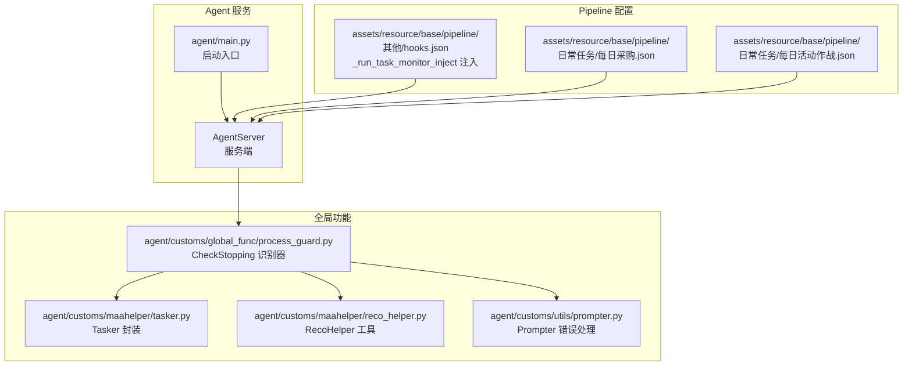
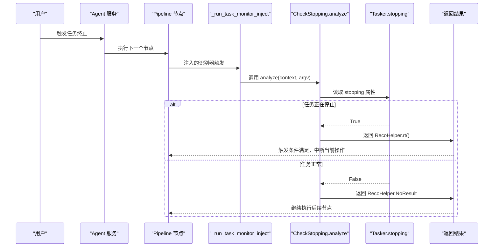
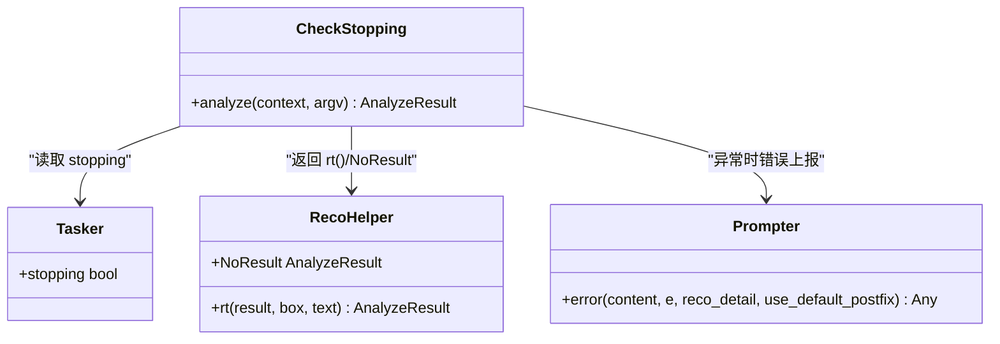
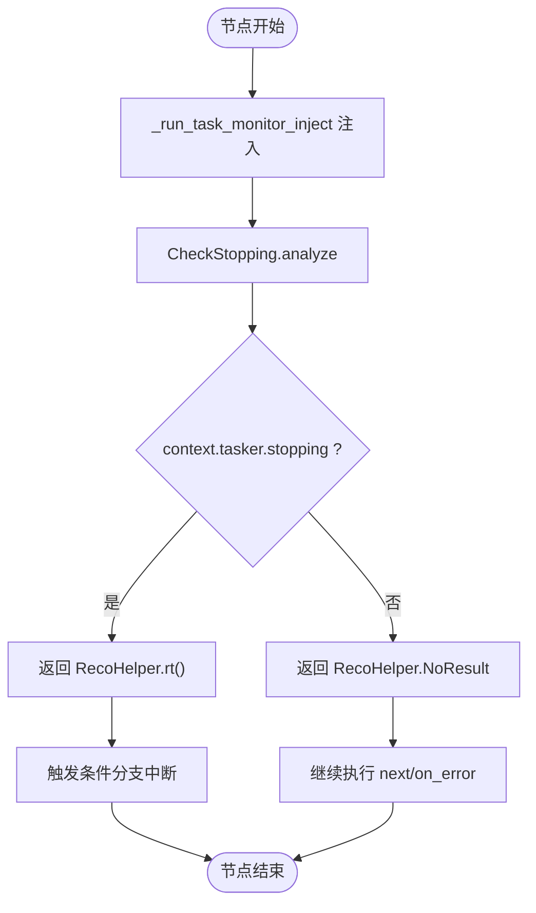
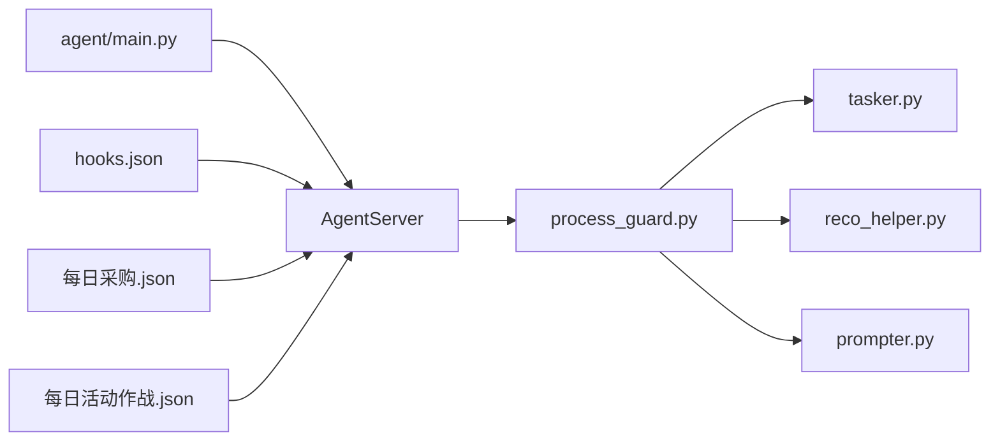

# 任务停止检测

<cite>
**本文引用的文件**
- [process_guard.py](file://agent/customs/global_func/process_guard.py)
- [tasker.py](file://agent/customs/maahelper/tasker.py)
- [reco_helper.py](file://agent/customs/maahelper/reco_helper.py)
- [prompter.py](file://agent/customs/utils/prompter.py)
- [hooks.json](file://assets/resource/base/pipeline/其他/hooks.json)
- [每日采购.json](file://assets/resource/base/pipeline/日常任务/每日采购.json)
- [每日活动作战.json](file://assets/resource/base/pipeline/日常任务/每日活动作战.json)
- [main.py](file://agent/main.py)
</cite>

## 目录
1. [简介](#简介)
2. [项目结构](#项目结构)
3. [核心组件](#核心组件)
4. [架构总览](#架构总览)
5. [组件详解](#组件详解)
6. [依赖关系分析](#依赖关系分析)
7. [性能考量](#性能考量)
8. [故障排查指南](#故障排查指南)
9. [结论](#结论)
10. [附录](#附录)

## 简介
本文围绕 CheckStopping 自定义识别器的“实时停止检测”机制展开，系统性解析其如何通过 @AgentServer.custom_recognition("check_stopping") 注册为状态检测组件，如何在 analyze 方法中监听 context.tasker.stopping 属性，以及该状态如何反映任务终止信号。进一步阐明返回 RecoHelper.rt() 与 RecoHelper.NoResult 的条件判断逻辑及其在流程控制中的作用，并结合 MaaFramework 的任务调度机制，说明该识别器如何嵌入到 Pipeline 的条件分支中实现优雅退出。最后给出在关键任务节点（如资源采购、活动作战）前配置 check_stopping 识别器的实践示例，并覆盖异常处理路径，描述当 context 访问失败时如何通过 Prompter.error 进行错误上报并返回安全默认值。

## 项目结构
本项目采用“功能域+层次化”的组织方式：
- agent/customs/global_func：全局功能模块，包含进程守卫、逻辑增强等
- agent/customs/maahelper：MAA 辅助库，封装识别、任务执行、参数解析等
- agent/customs/utils：通用工具，如提示器、计数器等
- assets/resource/base/pipeline：任务流水线配置，包含 hooks 注入点
- agent/main.py：Agent 服务启动入口

图表来源
- [main.py](file://agent/main.py#L17-L37)
- [process_guard.py](file://agent/customs/global_func/process_guard.py#L72-L98)
- [tasker.py](file://agent/customs/maahelper/tasker.py#L42-L49)
- [reco_helper.py](file://agent/customs/maahelper/reco_helper.py#L34-L35)
- [prompter.py](file://agent/customs/utils/prompter.py#L34-L54)
- [hooks.json](file://assets/resource/base/pipeline/其他/hooks.json#L1-L8)
- [每日采购.json](file://assets/resource/base/pipeline/日常任务/每日采购.json#L173-L194)
- [每日活动作战.json](file://assets/resource/base/pipeline/日常任务/每日活动作战.json#L90-L111)

章节来源
- [main.py](file://agent/main.py#L17-L37)
- [process_guard.py](file://agent/customs/global_func/process_guard.py#L72-L98)
- [tasker.py](file://agent/customs/maahelper/tasker.py#L42-L49)
- [reco_helper.py](file://agent/customs/maahelper/reco_helper.py#L34-L35)
- [prompter.py](file://agent/customs/utils/prompter.py#L34-L54)
- [hooks.json](file://assets/resource/base/pipeline/其他/hooks.json#L1-L8)
- [每日采购.json](file://assets/resource/base/pipeline/日常任务/每日采购.json#L173-L194)
- [每日活动作战.json](file://assets/resource/base/pipeline/日常任务/每日活动作战.json#L90-L111)

## 核心组件
- CheckStopping：自定义识别器，负责实时检测任务是否处于“即将停止”状态
- Tasker：封装 MaaFramework 的任务执行器，提供 stopping 属性
- RecoHelper：识别辅助工具，提供 NoResult、rt 等静态结果构造方法
- Prompter：统一错误上报与返回策略
- Pipeline hooks：通过 _run_task_monitor_inject 注入，使每个节点运行前都会触发停止检测

章节来源
- [process_guard.py](file://agent/customs/global_func/process_guard.py#L72-L98)
- [tasker.py](file://agent/customs/maahelper/tasker.py#L42-L49)
- [reco_helper.py](file://agent/customs/maahelper/reco_helper.py#L34-L35)
- [prompter.py](file://agent/customs/utils/prompter.py#L34-L54)
- [hooks.json](file://assets/resource/base/pipeline/其他/hooks.json#L1-L8)

## 架构总览
CheckStopping 识别器通过装饰器注册为自定义识别器，配合 Tasker.stopping 属性实现“实时停止检测”。在 MaaFramework 的任务执行过程中，每个节点在进入 next 或 on_error 分支之前，都会先执行 _run_task_monitor_inject 注入的识别器，从而在关键节点处快速响应用户主动终止请求，避免长时间无效操作。

图表来源
- [process_guard.py](file://agent/customs/global_func/process_guard.py#L79-L98)
- [tasker.py](file://agent/customs/maahelper/tasker.py#L42-L49)
- [reco_helper.py](file://agent/customs/maahelper/reco_helper.py#L34-L35)
- [hooks.json](file://assets/resource/base/pipeline/其他/hooks.json#L1-L8)

## 组件详解

### CheckStopping：实时停止检测识别器
- 注册方式：通过 @AgentServer.custom_recognition("check_stopping") 将其注册为自定义识别器
- 核心逻辑：在 analyze 方法中读取 context.tasker.stopping，若为真则返回 RecoHelper.rt() 表示“检测到停止”，否则返回 RecoHelper.NoResult 表示“无结果”
- 异常处理：若访问 context 或 tasker 属性失败，捕获异常并通过 Prompter.error 进行错误上报，并返回安全默认值（False 或 AnalyzeResult）

图表来源
- [process_guard.py](file://agent/customs/global_func/process_guard.py#L72-L98)
- [tasker.py](file://agent/customs/maahelper/tasker.py#L42-L49)
- [reco_helper.py](file://agent/customs/maahelper/reco_helper.py#L34-L35)
- [prompter.py](file://agent/customs/utils/prompter.py#L34-L54)

章节来源
- [process_guard.py](file://agent/customs/global_func/process_guard.py#L72-L98)

### Tasker.stopping：任务停止状态属性
- 作用：提供当前任务是否处于“停止中”的布尔状态
- 使用：CheckStopping.analyze 直接读取 context.tasker.stopping，作为流程控制依据
- 设计：通过代理 context.tasker.stopping，保证识别器无需关心底层实现细节

章节来源
- [tasker.py](file://agent/customs/maahelper/tasker.py#L42-L49)

### RecoHelper：识别结果构造与默认值
- NoResult：无结果的默认 AnalyzeResult，用于“继续执行”的语义
- rt：构造识别成功的 AnalyzeResult，用于“检测到停止”的语义
- 作用：在 CheckStopping 中以统一的方式表达“检测到停止”和“无结果”

章节来源
- [reco_helper.py](file://agent/customs/maahelper/reco_helper.py#L34-L35)
- [reco_helper.py](file://agent/customs/maahelper/reco_helper.py#L232-L256)

### Prompter.error：异常处理与安全返回
- 作用：在识别器内部发生异常时，统一输出错误信息并返回安全默认值
- 返回策略：当 reco_detail 为 None 时返回 False；否则返回 AnalyzeResult，便于上层流程继续推进

章节来源
- [prompter.py](file://agent/customs/utils/prompter.py#L34-L54)

### Pipeline hooks 注入：优雅退出的关键
- 注入点：_run_task_monitor_inject
- 配置：在 hooks.json 中声明 custom_recognition 为 "check_stopping"
- 效果：在每个节点的 next 或 on_error 分支前，都会先执行该识别器，从而在关键节点快速响应停止信号

图表来源
- [hooks.json](file://assets/resource/base/pipeline/其他/hooks.json#L1-L8)
- [process_guard.py](file://agent/customs/global_func/process_guard.py#L79-L98)
- [reco_helper.py](file://agent/customs/maahelper/reco_helper.py#L34-L35)

章节来源
- [hooks.json](file://assets/resource/base/pipeline/其他/hooks.json#L1-L8)

### 在关键任务节点配置 check_stopping 的实践示例
- 资源采购（每日采购）：在“开始”节点后，通过 next 指向“尊享商店开始”，并在每个关键节点前注入 _run_task_monitor_inject，确保在用户主动终止时能及时退出
- 活动作战（每日活动作战）：在“开始”节点后，通过 next 指向“周期检查”，同样在关键节点前注入 _run_task_monitor_inject，保障在战斗、领取奖励等环节也能优雅退出

章节来源
- [每日采购.json](file://assets/resource/base/pipeline/日常任务/每日采购.json#L173-L194)
- [每日活动作战.json](file://assets/resource/base/pipeline/日常任务/每日活动作战.json#L90-L111)

## 依赖关系分析
- CheckStopping 依赖 Tasker.stopping 提供状态；依赖 RecoHelper.rt/NoResult 提供结果表达；依赖 Prompter.error 提供异常处理
- Pipeline hooks 通过 _run_task_monitor_inject 与 AgentServer 协作，将 CheckStopping 注入到每个节点的执行路径中
- Agent 服务启动入口 main.py 负责初始化 Toolkit、启动 AgentServer，并加载自定义模块

图表来源
- [main.py](file://agent/main.py#L17-L37)
- [process_guard.py](file://agent/customs/global_func/process_guard.py#L72-L98)
- [tasker.py](file://agent/customs/maahelper/tasker.py#L42-L49)
- [reco_helper.py](file://agent/customs/maahelper/reco_helper.py#L34-L35)
- [prompter.py](file://agent/customs/utils/prompter.py#L34-L54)
- [hooks.json](file://assets/resource/base/pipeline/其他/hooks.json#L1-L8)
- [每日采购.json](file://assets/resource/base/pipeline/日常任务/每日采购.json#L173-L194)
- [每日活动作战.json](file://assets/resource/base/pipeline/日常任务/每日活动作战.json#L90-L111)

章节来源
- [main.py](file://agent/main.py#L17-L37)
- [process_guard.py](file://agent/customs/global_func/process_guard.py#L72-L98)
- [tasker.py](file://agent/customs/maahelper/tasker.py#L42-L49)
- [reco_helper.py](file://agent/customs/maahelper/reco_helper.py#L34-L35)
- [prompter.py](file://agent/customs/utils/prompter.py#L34-L54)
- [hooks.json](file://assets/resource/base/pipeline/其他/hooks.json#L1-L8)
- [每日采购.json](file://assets/resource/base/pipeline/日常任务/每日采购.json#L173-L194)
- [每日活动作战.json](file://assets/resource/base/pipeline/日常任务/每日活动作战.json#L90-L111)

## 性能考量
- CheckStopping.analyze 仅读取 context.tasker.stopping，属于轻量级操作，对整体性能影响极小
- 通过 _run_task_monitor_inject 注入，避免在每个节点重复编写停止检测逻辑，降低维护成本
- RecoHelper.NoResult 与 RecoHelper.rt() 的构造均为轻量级，不会引入额外的图像处理开销

## 故障排查指南
- 现象：识别器在 analyze 中抛出异常
- 排查步骤：
  - 检查 context.tasker.stopping 的访问是否受权限或生命周期限制
  - 查看 Pipeline hooks 注入是否正确生效（确认 _run_task_monitor_inject 的 custom_recognition 名称与注册名一致）
  - 检查 Prompter.error 的返回值是否被上层流程正确消费
- 处理建议：
  - 若异常频繁出现，考虑在上层增加重试或降级策略
  - 确保 Agent 服务端已正确启动并加载自定义模块

章节来源
- [process_guard.py](file://agent/customs/global_func/process_guard.py#L95-L98)
- [prompter.py](file://agent/customs/utils/prompter.py#L34-L54)

## 结论
CheckStopping 通过简洁而高效的实现，将“实时停止检测”无缝嵌入到 MaaFramework 的 Pipeline 执行流中。它以 context.tasker.stopping 为核心状态源，结合 RecoHelper 的结果表达与 Prompter 的异常处理，实现了在关键节点的优雅退出。借助 hooks 注入机制，开发者只需在 Pipeline 中声明 _run_task_monitor_inject，即可在所有节点前自动执行停止检测，显著提升了系统的可控性与用户体验。

## 附录
- Agent 服务启动流程参考：agent/main.py
- 自定义识别器注册与使用参考：agent/customs/global_func/process_guard.py
- 任务执行器封装参考：agent/customs/maahelper/tasker.py
- 识别结果工具参考：agent/customs/maahelper/reco_helper.py
- 错误处理工具参考：agent/customs/utils/prompter.py
- Pipeline hooks 注入参考：assets/resource/base/pipeline/其他/hooks.json
- 关键任务节点配置示例：
  - 资源采购：assets/resource/base/pipeline/日常任务/每日采购.json
  - 活动作战：assets/resource/base/pipeline/日常任务/每日活动作战.json