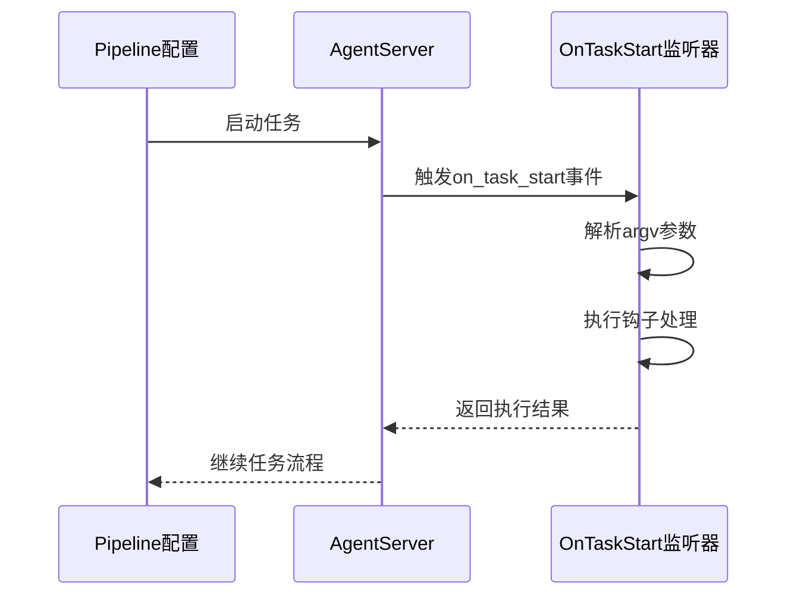
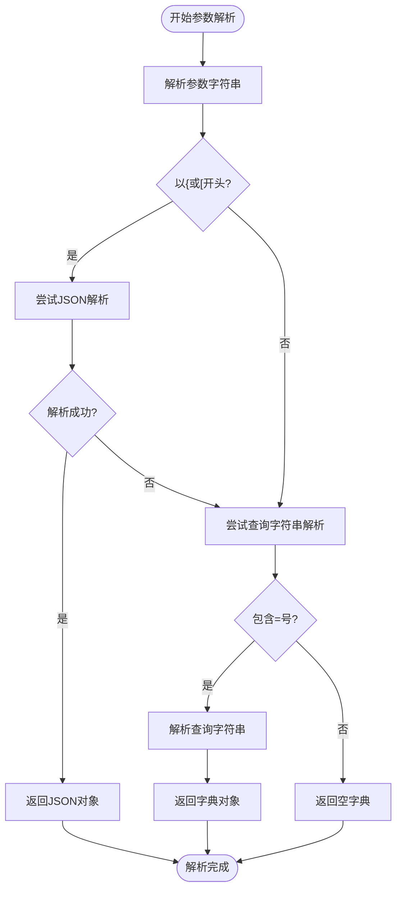
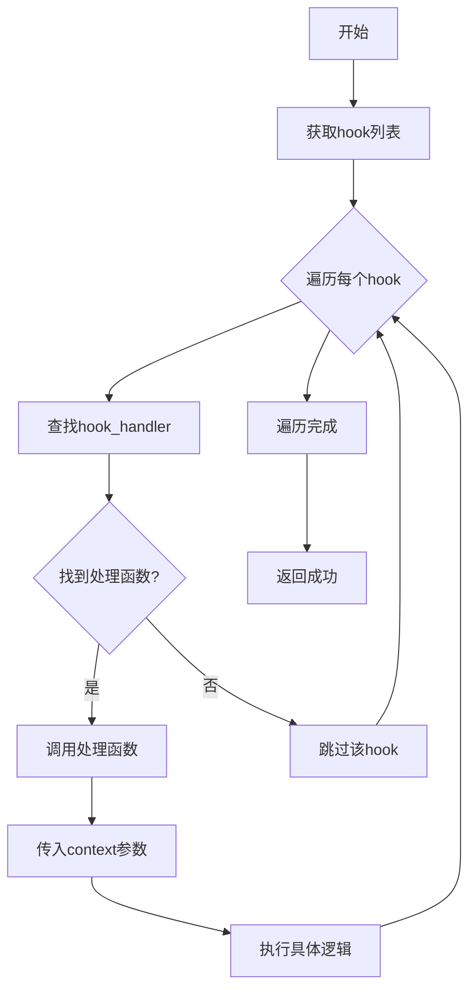
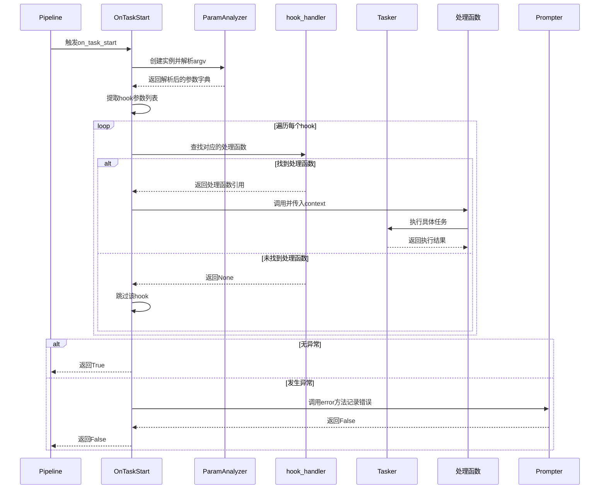

# 任务启动监听

<cite>
**本文档引用的文件**   
- [process_guard.py](file://agent/customs/global_func/process_guard.py)
- [argv_analyzer.py](file://agent/customs/maahelper/argv_analyzer.py)
- [prompter.py](file://agent/customs/utils/prompter.py)
- [tasker.py](file://agent/customs/maahelper/tasker.py)
- [启动游戏.json](file://assets/resource/base/pipeline/日常任务/启动游戏.json)
- [关闭游戏.json](file://assets/resource/base/pipeline/日常任务/关闭游戏.json)
- [懒加载返回主界面.json](file://assets/resource/base/pipeline/通用/懒加载返回主界面.json)
</cite>

## 目录
1. [OnTaskStart自定义动作概述](#ontaskstart自定义动作概述)
2. [注册机制与全局监听](#注册机制与全局监听)
3. [参数解析逻辑分析](#参数解析逻辑分析)
4. [钩子处理机制](#钩子处理机制)
5. [异常处理流程](#异常处理流程)
6. [实际配置用例](#实际配置用例)
7. [执行流程图解](#执行流程图解)

## OnTaskStart自定义动作概述

OnTaskStart是MaaDuDuL自动化框架中的一个核心自定义动作，作为任务生命周期的全局监听器，在每个任务启动时自动触发。该动作通过`@AgentServer.custom_action('on_task_start')`装饰器注册，实现了任务初始化阶段的通用逻辑处理能力。其主要功能是解析传入的钩子参数，并根据配置执行相应的初始化操作，如环境准备、状态检查等。这种设计模式实现了任务启动逻辑的集中管理和复用，避免了在每个具体任务中重复编写相同的初始化代码。

**Section sources**
- [process_guard.py](file://agent/customs/global_func/process_guard.py#L33-L67)

## 注册机制与全局监听

OnTaskStart通过MaaFramework提供的`@AgentServer.custom_action`装饰器注册为全局监听器。当使用`@AgentServer.custom_action("on_task_start")`时，框架会将OnTaskStart类注册为一个名为"on_task_start"的自定义动作。这个注册过程在AgentServer启动时完成，使得该动作在整个应用生命周期内都可用。任何Pipeline配置都可以通过在任务流中添加一个类型为"Custom"的动作，并指定`custom_action`参数为"on_task_start"来触发此监听器。这种机制实现了事件驱动的架构模式，使得任务启动事件可以被统一捕获和处理。



**Diagram sources**
- [process_guard.py](file://agent/customs/global_func/process_guard.py#L33-L34)

## 参数解析逻辑分析

OnTaskStart的核心功能依赖于ParamAnalyzer类对参数的解析。在`run`方法中，首先创建ParamAnalyzer实例，传入`argv`参数对象。ParamAnalyzer支持多种参数格式的自动解析，包括JSON对象、JSON数组和查询字符串格式。解析过程首先尝试JSON格式，如果失败则尝试查询字符串格式（key=value&key2=value2），最后返回一个字典对象。对于钩子参数的提取，使用`args.get(["hook", "h", "type", "t", "class", "cls", "c"], [])`方法，这表示支持多种别名形式的hook参数。如果解析结果不是列表类型，则会将其转换为单元素列表，确保后续处理的一致性。



**Diagram sources**
- [argv_analyzer.py](file://agent/customs/maahelper/argv_analyzer.py#L48-L101)
- [process_guard.py](file://agent/customs/global_func/process_guard.py#L54-L57)

## 钩子处理机制

OnTaskStart通过hook_handler字典实现钩子的动态分发机制。该字典存储了钩子名称与处理函数的映射关系，如`{"hs": home_start}`表示"hs"钩子对应home_start函数。当OnTaskStart被触发时，它会遍历解析出的hook列表，逐个查找对应的处理函数。如果找到匹配的处理函数，则使用当前Context对象作为参数调用该函数。以"hs"钩子为例，会触发home_start函数，该函数内部调用`Tasker(context).run("懒加载返回主界面_开始")`来执行"懒加载返回主界面_开始"任务。这种设计实现了开闭原则，新的钩子处理逻辑可以通过简单地向hook_handler字典添加新的键值对来扩展，而无需修改OnTaskStart的核心代码。



**Diagram sources**
- [process_guard.py](file://agent/customs/global_func/process_guard.py#L27-L28)
- [process_guard.py](file://agent/customs/global_func/process_guard.py#L59-L62)

## 异常处理流程

OnTaskStart实现了完善的异常处理机制以确保系统的稳定性。整个`run`方法被包裹在try-catch块中，任何未预期的异常都会被捕获。当异常发生时，系统会调用`Prompter.error("任务启动监听", e)`方法进行错误记录和报告。Prompter.error方法会输出详细的错误信息，包括错误消息和异常堆栈，并返回False以指示操作失败。这种设计确保了即使初始化逻辑出现错误，也不会导致整个任务流程崩溃，而是优雅地失败并提供调试信息。返回False的语义表示该自定义动作执行失败，框架会根据任务配置决定是否继续执行后续步骤。

**Section sources**
- [process_guard.py](file://agent/customs/global_func/process_guard.py#L65-L66)
- [prompter.py](file://agent/customs/utils/prompter.py#L34-L54)

## 实际配置用例

在实际的Pipeline配置中，OnTaskStart被广泛应用于任务的初始化阶段。以"启动游戏.json"为例，在任务流的开始节点"启动游戏_开始"中，通过配置`"custom_action": "on_task_start"`来触发监听器，并传入hook参数。典型的配置片段如下：

```json
"启动游戏_开始": {
    "action": {
        "type": "Custom",
        "param": {
            "custom_action": "on_task_start",
            "hook": "hs"
        }
    },
    "next": ["启动游戏_启动游戏"],
    "recognition": {
        "type": "DirectHit"
    }
}
```

此配置表示在启动游戏任务开始时，触发on_task_start监听器，并传入"hs"钩子。监听器会解析参数，找到对应的home_start处理函数，并执行"懒加载返回主界面_开始"任务，从而确保游戏启动前界面处于正确的状态。类似的配置也出现在"关闭游戏.json"等其他任务中，体现了该机制的通用性和复用性。

**Section sources**
- [启动游戏.json](file://assets/resource/base/pipeline/日常任务/启动游戏.json#L108-L128)
- [关闭游戏.json](file://assets/resource/base/pipeline/日常任务/关闭游戏.json#L37-L58)
- [懒加载返回主界面.json](file://assets/resource/base/pipeline/通用/懒加载返回主界面.json)

## 执行流程图解

以下序列图展示了OnTaskStart从被触发到完成执行的完整流程：



**Diagram sources**
- [process_guard.py](file://agent/customs/global_func/process_guard.py)
- [argv_analyzer.py](file://agent/customs/maahelper/argv_analyzer.py)
- [tasker.py](file://agent/customs/maahelper/tasker.py)