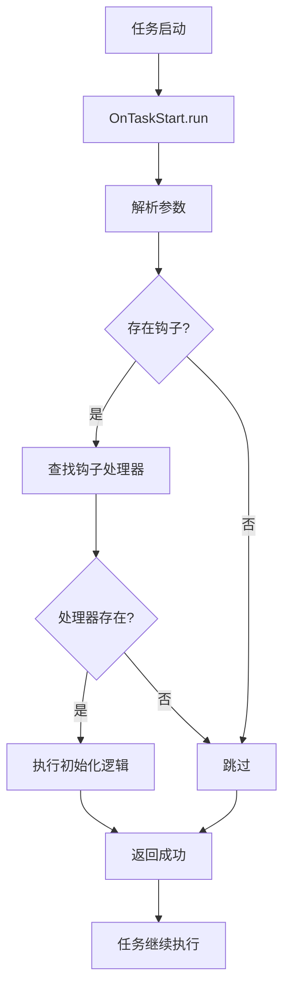
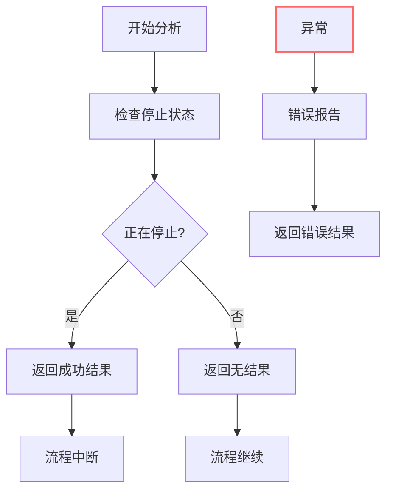
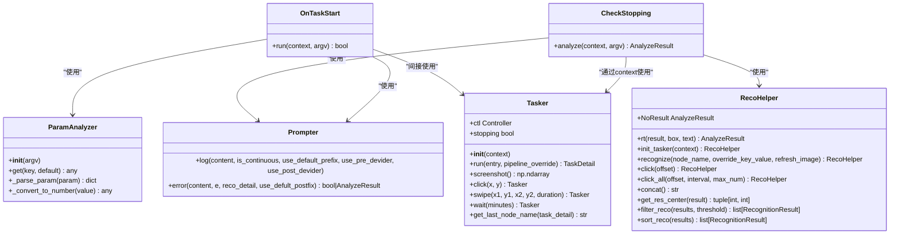

# 进程守护组件

<cite>
**本文档引用文件**   
- [process_guard.py](file://agent/customs/global_func/process_guard.py)
- [reco_helper.py](file://agent/customs/maahelper/reco_helper.py)
- [tasker.py](file://agent/customs/maahelper/tasker.py)
- [prompter.py](file://agent/customs/utils/prompter.py)
- [argv_analyzer.py](file://agent/customs/maahelper/argv_analyzer.py)
- [懒加载返回主界面.json](file://assets/resource/base/pipeline/通用/懒加载返回主界面.json)
- [回到主界面.json](file://assets/resource/base/pipeline/通用/回到主界面.json)
</cite>

## 目录
1. [引言](#引言)
2. [任务启动监听机制](#任务启动监听机制)
3. [任务停止检测机制](#任务停止检测机制)
4. [组件协同与稳定性保障](#组件协同与稳定性保障)
5. [实际应用示例](#实际应用示例)
6. [结论](#结论)

## 引言
进程守护组件是自动化流程中的关键模块，负责监控任务生命周期并确保流程的稳定性。该组件通过双重守护机制实现对任务启动和停止状态的实时监控。启动监听机制在任务开始时触发初始化逻辑，而停止检测机制则持续监控任务终止信号，确保在异常情况下能够及时响应。这种设计不仅提高了自动化流程的可靠性，还为复杂任务的协调执行提供了基础支持。

## 任务启动监听机制

进程守护组件通过`OnTaskStart`自定义动作实现任务启动监听功能。该机制的核心是钩子处理器（hook_handler），它将特定的钩子类型映射到相应的初始化函数。当任务启动时，系统会解析参数中的钩子类型，并执行对应的初始化逻辑。

`OnTaskStart`类通过`@AgentServer.custom_action("on_task_start")`装饰器注册为自定义动作，使其能够在任务开始时被调用。其`run`方法接收上下文对象和运行参数，首先使用`ParamAnalyzer`解析参数，获取钩子类型列表。参数解析支持多种格式，包括JSON对象和查询字符串，确保了配置的灵活性。

特别值得注意的是`'hs'`钩子与`'懒加载返回主界面_开始'`任务的关联。在钩子处理器中，`'hs'`被映射到`home_start`函数，该函数通过`Tasker`执行`'懒加载返回主界面_开始'`任务。这种设计实现了任务启动时的自动初始化，确保系统始终处于预期的初始状态。

**图示来源**
- [process_guard.py](file://agent/customs/global_func/process_guard.py#L33-L67)
- [argv_analyzer.py](file://agent/customs/maahelper/argv_analyzer.py#L16-L157)

**本节来源**
- [process_guard.py](file://agent/customs/global_func/process_guard.py#L18-L27)
- [argv_analyzer.py](file://agent/customs/maahelper/argv_analyzer.py#L16-L157)

## 任务停止检测机制

`CheckStopping`自定义识别器实现了实时停止检测机制，这是保障自动化流程稳定性的关键组件。该识别器通过检查`context.tasker.stopping`状态来判断任务是否收到终止信号，从而决定是否中断当前流程。

`CheckStopping`类通过`@AgentServer.custom_recognition("check_stopping")`装饰器注册为自定义识别器。其`analyze`方法是核心逻辑所在，它首先尝试获取任务执行器的停止状态。如果`context.tasker.stopping`为真，表示任务正在被停止，则返回`RecoHelper.rt()`表示识别成功；否则返回`RecoHelper.NoResult`表示无结果。

这种设计采用了简洁而高效的布尔状态检查机制，避免了复杂的轮询或事件监听。识别结果的返回遵循MAA框架的规范，使用`CustomRecognition.AnalyzeResult`对象封装结果。`RecoHelper.rt()`方法创建一个包含识别框和详细信息的成功结果，而`NoResult`是一个预定义的无结果对象。

异常处理机制确保了检测过程的健壮性。任何在状态检查过程中发生的异常都会被捕获，并通过`Prompter.error`方法进行错误报告。这不仅防止了异常中断整个自动化流程，还提供了详细的错误信息用于调试和监控。

**图示来源**
- [process_guard.py](file://agent/customs/global_func/process_guard.py#L72-L98)
- [reco_helper.py](file://agent/customs/maahelper/reco_helper.py#L34-L255)
- [tasker.py](file://agent/customs/maahelper/tasker.py#L42-L49)

**本节来源**
- [process_guard.py](file://agent/customs/global_func/process_guard.py#L72-L98)
- [reco_helper.py](file://agent/customs/maahelper/reco_helper.py#L34-L255)

## 组件协同与稳定性保障

进程守护组件的各个部分通过精心设计的接口和协议协同工作，共同保障自动化流程的稳定性。`ParamAnalyzer`、`RecoHelper`、`Tasker`和`Prompter`等辅助组件为守护机制提供了必要的支持功能。

`ParamAnalyzer`作为参数解析器，统一处理各种格式的输入参数，支持JSON和查询字符串等多种格式。它不仅能解析复杂的数据结构，还能自动将数字字符串转换为相应的数值类型，提高了参数处理的智能化水平。这种设计使得配置更加灵活，用户可以通过多种方式传递参数。

`RecoHelper`提供了识别结果处理的封装，包括结果获取、点击操作和文本拼接等功能。其静态方法`rt()`用于构造识别结果对象，支持从现有结果或手动指定参数创建结果。`NoResult`常量定义了无识别结果的标准返回值，确保了接口的一致性。

`Tasker`类封装了任务执行的核心操作，包括任务运行、截图、点击和滑动等。其`stopping`属性直接暴露了任务执行器的停止状态，为停止检测提供了基础支持。`run`方法在执行任务时会自动注入运行监测器，确保任务执行过程可被监控。

`Prompter`组件负责错误报告和日志记录，提供了统一的错误处理接口。`error`方法不仅输出错误信息，还能根据上下文返回适当的错误结果，避免了异常中断整个流程。这种设计实现了错误的优雅处理，提高了系统的容错能力。

**图示来源**
- [process_guard.py](file://agent/customs/global_func/process_guard.py)
- [reco_helper.py](file://agent/customs/maahelper/reco_helper.py)
- [tasker.py](file://agent/customs/maahelper/tasker.py)
- [prompter.py](file://agent/customs/utils/prompter.py)
- [argv_analyzer.py](file://agent/customs/maahelper/argv_analyzer.py)

**本节来源**
- [reco_helper.py](file://agent/customs/maahelper/reco_helper.py)
- [tasker.py](file://agent/customs/maahelper/tasker.py)
- [prompter.py](file://agent/customs/utils/prompter.py)

## 实际应用示例

在实际应用中，进程守护组件通过管道配置文件与其他模块协同工作。以`回到主界面.json`配置为例，`返回主界面_开始`节点使用`on_task_start`自定义动作，并通过参数指定钩子类型。当该节点执行时，会触发`OnTaskStart`的`run`方法，解析参数并执行相应的初始化逻辑。

`懒加载返回主界面.json`配置展示了`懒加载返回主界面_开始`任务的具体实现。该任务作为`'hs'`钩子的目标，负责将系统状态重置到主界面。它通过一系列识别节点（如`懒加载返回主界面_活动弹窗`、`懒加载返回主界面_使徒`等）来确认系统状态，并采取相应的操作。

在Pipeline中配置任务启动监听时，只需在需要监听的任务节点中添加`on_task_start`自定义动作，并在参数中指定钩子类型。例如，可以配置`hook=hs`来触发主界面返回逻辑，或使用`type=init`来执行其他初始化任务。这种配置方式灵活且易于维护。

停止检测机制通常作为条件识别器集成到关键流程中。例如，在长时间运行的任务中，可以周期性地调用`check_stopping`识别器来检查停止信号。如果检测到停止状态，流程将提前终止，释放系统资源。这种设计避免了在终止信号发出后继续执行不必要的操作，提高了系统的响应速度和资源利用率。

**本节来源**
- [回到主界面.json](file://assets/resource/base/pipeline/通用/回到主界面.json)
- [懒加载返回主界面.json](file://assets/resource/base/pipeline/通用/懒加载返回主界面.json)
- [process_guard.py](file://agent/customs/global_func/process_guard.py)

## 结论
进程守护组件通过双重守护机制有效保障了自动化流程的稳定性和可靠性。任务启动监听机制确保了每次任务执行都从预期的初始状态开始，而停止检测机制则提供了及时响应终止信号的能力。组件间的协同设计和完善的错误处理机制进一步增强了系统的健壮性。通过灵活的配置方式，该组件能够适应各种复杂的自动化场景，为构建可靠的自动化系统提供了坚实的基础。